# MVC

> 本笔记是 ASP.NET Core（.NET 6+）`Microsoft.AspNetCore.Mvc.Core` 的学习整理（控制器路由、ActionDescriptor、过滤器管线），配套源码解读位于仓库根目录 `MVC.md`。
>
> 风格延续前九章：以 Mermaid UML 图、设计原理、示例为主；源码片段只保留「不看代码无法说清」的几行。

## 0. 阅读指南

### 0.1 本笔记的定位

| 文件 | 视角 | 主体内容 |
|------|------|---------|
| `MVC.md`(源码笔记) | **源码视角** | 逐类型贴源码 + 在源码中注释解读 |
| `Notes/MVC.md`(本笔记) | **学习视角** | UML 图、多层模型树、过滤器管线流入流出、陷阱清单 |

### 0.2 推荐阅读顺序

- **首次学习**：§1 → §2 → §3 → §4 → §5 → §6 → §7 → §8 → §9 → §10。
- **想理清「从 Controller 类型到 Endpoint 的完整链路」**：§2 → §3 → §4 → §5 串读。
- **想理清「过滤器管线为何这么复杂」**：§7 完整一节，重点看 §7.2 流入流出顺序图。
- **找某个具体类型**：用 §10.5 「**原笔记类型 → 本笔记小节**映射表」反查。

### 0.3 与前九章的关系

MVC 是 ASP.NET Core 的「**最大终结点提供者**」 —— 它把控制器类型挂接到路由系统：

- **路由**(`Notes/路由.md`)：MVC 通过 `ControllerActionEndpointDataSource` 为路由系统提供 `RouteEndpoint`；
- **管道中间件**(`Notes/管道中间件.md`)：MVC 的入口是一个标准的 `RequestDelegate`，由 `EndpointMiddleware` 调用；
- **依赖注入 / 选项 / 配置 / 日志**：MVC 大量使用 `IOptions<MvcOptions>` / `IOptions<ApiBehaviorOptions>` 等选项；过滤器、模型绑定器、值提供器都通过 DI 解析。

---

## 1. 全景：MVC 在 ASP.NET Core 中的位置

### 1.1 MVC 与路由/中间件/终结点的关系

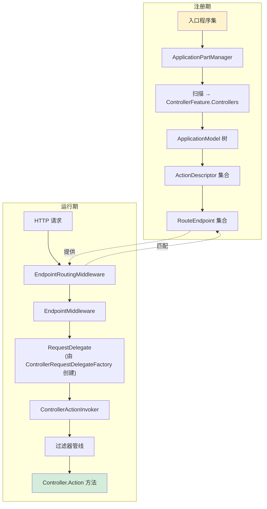

**关键认知**：

- **「**类型扫描 → Model 树 → Descriptor → Endpoint → RequestDelegate**」是 MVC 的核心数据流**；
- **MVC 与路由的接口是 `EndpointDataSource`**（参考 `Notes/路由.md` §4），不是直接绑到中间件上；
- **业务代码的 `Controller.Action` 方法在过滤器管线最内层执行**。

### 1.2 从启动到处理请求的完整数据流

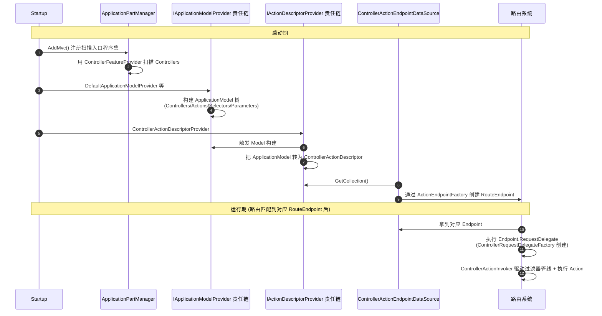

### 1.3 核心类型一览

| 分类 | 类型 | 角色 |
|------|------|------|
| 应用部分 | `ApplicationPart` / `AssemblyPart` / `IApplicationPartTypeProvider` / `IApplicationFeatureProvider<>` / `ControllerFeature` / `ControllerFeatureProvider` / `ApplicationPartManager` / `ApplicationPartFactory` / `DefaultApplicationPartFactory` | 程序集扫描与类型筛选 |
| 应用模型 | `ApplicationModel` / `ControllerModel` / `ActionModel` / `SelectorModel` | 内部 Model 树（介于 Type 与 Descriptor 之间） |
| Model 提供器 | `ApplicationModelProviderContext` / `IApplicationModelProvider` / `DefaultApplicationModelProvider` / `ApiBehaviorApplicationModelProvider` / `IApplicationModelConvention` / `ApplicationModelFactory` | 构建 Model 树的责任链 |
| 描述符 | `ActionDescriptor` / `ControllerActionDescriptor` / `IActionDescriptorProvider` / `ControllerActionDescriptorProvider` / `ActionDescriptorProviderContext` | Action 的元数据描述 |
| 描述符集合 | `IActionDescriptorCollectionProvider` / `ActionDescriptorCollectionProvider` / `DefaultActionDescriptorCollectionProvider` / `IActionDescriptorChangeProvider` / `ActionDescriptorChangeProvider` | 聚合 + 变更通知 |
| 终结点 | `ControllerActionEndpointDataSource` / `ActionEndpointDataSourceBase` / `ControllerActionEndpointConventionBuilder` / `ActionEndpointFactory` / `ControllerActionEndpointDataSourceFactory` / `ControllerEndpointRouteBuilderExtensions` | 桥接到路由系统 |
| 上下文 | `ActionContext` / `ControllerContext` | Action 执行上下文 |
| 调用器 | `IRequestDelegateFactory` / `ControllerRequestDelegateFactory` / `IActionInvoker` / `ResourceInvoker` / `ControllerActionInvoker` | 把 Endpoint 调用转为 Action 调用 |
| 过滤器 | `IFilterMetadata` / `IOrderedFilter` / `IFilterFactory` / `TypeFilterAttribute` | 过滤器抽象 |
| API 行为 | `ProblemDetails` / `ProblemDetailsClientErrorFactory` / `DefaultProblemDetailsFactory` / `ClientErrorResultFilter` / `ClientErrorResultFilterFactory` / `ModelStateInvalidFilter` / `ModelStateInvalidFilterFactory` | `[ApiController]` 行为 |

---

## 2. 应用程序组成部分：ApplicationPart

### 2.1 ApplicationPart / AssemblyPart / IApplicationPartTypeProvider

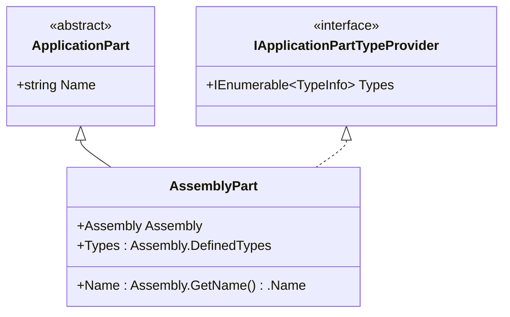

**`ApplicationPart` 是 MVC 对「**程序集 / 类型来源**」的抽象**：

- 默认每个程序集对应一个 `AssemblyPart`；
- 同时实现 `IApplicationPartTypeProvider` 暴露类型集合 → 让 `ControllerFeatureProvider` 等扫描器能拿到类型；
- 自定义 `ApplicationPart` 可以提供「**非程序集**」的类型来源（如运行时编译的 Razor 类）。

### 2.2 ApplicationPartManager 与 PopulateFeature

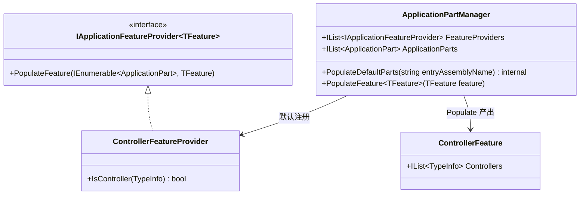

**`ApplicationPartManager.PopulateFeature<TFeature>` 是「**双重循环匹配**」**：

```C#
public void PopulateFeature<TFeature>(TFeature feature)
{
    foreach (var provider in FeatureProviders.OfType<IApplicationFeatureProvider<TFeature>>())
        provider.PopulateFeature(ApplicationParts, feature);   // 提供者 × 部件集合 → 特性
}
```

**用 `OfType<IApplicationFeatureProvider<TFeature>>` 筛选**：让一个 `ApplicationPartManager` 能管理多种特性提供者（控制器 / Razor 视图 / TagHelper 等），各取所需。

### 2.3 ApplicationPartFactory 的特性扩展点

```mermaid
flowchart TD
    Asm[一个程序集] --> Check{有 [ProvideApplicationPartFactory] 特性?}
    Check -->|无| Default[DefaultApplicationPartFactory.Instance]
    Check -->|有| Refl[反射创建特性指定的 Factory]

    Default --> Yield["yield return new AssemblyPart(assembly)"]
    Refl --> Custom["yield return 自定义 ApplicationPart"]
```

**`[ProvideApplicationPartFactory(typeof(MyFactory))]`** 是程序集级特性，允许第三方组件提供自己的「**应用部分构造逻辑**」。

**典型场景**：Razor 类库（RCL）使用自己的 `ApplicationPartFactory` 把视图程序集 + 静态资源程序集成对返回。

### 2.4 ControllerFeature 与 ControllerFeatureProvider 类型筛选

```mermaid
flowchart TD
    Type[每个候选 TypeInfo] --> C1{IsClass?}
    C1 -->|否| No[不是控制器]
    C1 -->|是| C2{!IsAbstract?}
    C2 -->|否| No
    C2 -->|是| C3{IsPublic?}
    C3 -->|否| No
    C3 -->|是| C4{!ContainsGenericParameters?}
    C4 -->|否| No
    C4 -->|是| C5{没有 [NonController]?}
    C5 -->|否| No
    C5 -->|是| C6{以 'Controller' 结尾 或<br/>有 [Controller] 特性?}
    C6 -->|否| No
    C6 -->|是| Yes[判定为控制器 → 加入 Controllers]
```

**六条必备条件**（任一不满足都被剔除）：

| 条件 | 用意 |
|------|------|
| `IsClass` | 排除接口和值类型 |
| `!IsAbstract` | 排除抽象基类 |
| `IsPublic` | 内部类不暴露为终结点 |
| `!ContainsGenericParameters` | 排除开放泛型类 |
| 无 `[NonController]` | 显式排除机制 |
| 名字以 `Controller` 结尾 **或** 有 `[Controller]` 特性 | 命名约定 + 显式标注两条路 |

---

## 3. ApplicationModel：从 Type 到 Model 树

### 3.1 三层模型树：ApplicationModel / ControllerModel / ActionModel

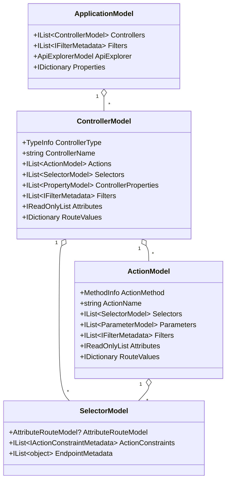

**为什么 `Selectors` 是列表？** —— 一个 Controller 或 Action 可能有**多个**特性路由：

```C#
[Route("api/v1/[controller]")]
[Route("api/v2/[controller]")]   // 两个 Selector
public class ProductsController : ControllerBase
{
    [HttpGet]
    [HttpGet("list")]             // 两个 Selector
    public IActionResult List() { ... }
}
```

→ 最终生成 4 个 `ControllerActionDescriptor`（2 × 2 笛卡尔积）。

### 3.2 SelectorModel 与特性路由

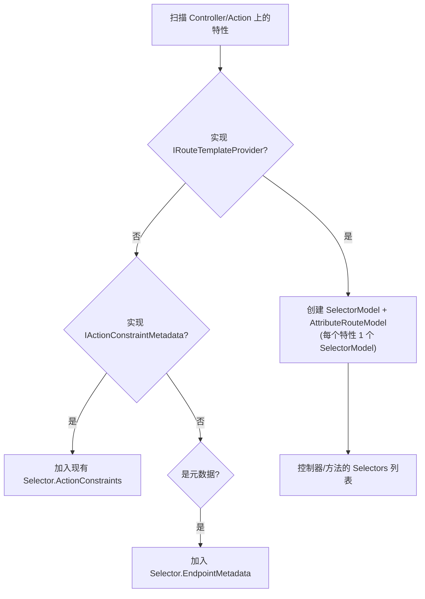

**`AttributeRouteModel`** 持有 `Template`、`Order`、`Name`、`SuppressLinkGeneration` 等路由模板属性。

**Selector 决定终结点数量** —— 一个 Controller + Action 组合若都有多个 selector，会产生「**控制器 selector × 方法 selector**」个终结点。

### 3.3 IApplicationModelProvider 责任链

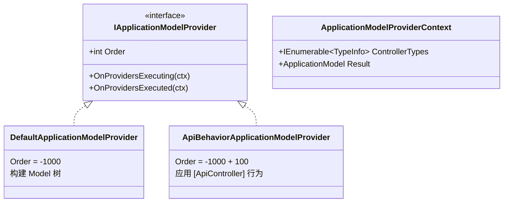

**执行顺序**：

| 阶段 | 顺序 |
|------|------|
| `OnProvidersExecuting` | 按 `Order` **升序** |
| `OnProvidersExecuted` | 按 `Order` **降序** |

**类比的洋葱模型**：每个 Provider 包裹下一层，前序方法是「**入栈**」，后序方法是「**出栈**」。

### 3.4 DefaultApplicationModelProvider 的三阶段

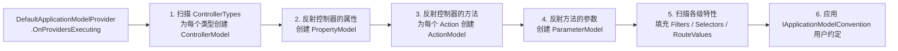

**`IApplicationModelConvention` 是用户最常用的扩展点**：

```C#
public class GlobalRoutePrefixConvention : IApplicationModelConvention
{
    public void Apply(ApplicationModel application)
    {
        foreach (var controller in application.Controllers)
            foreach (var selector in controller.Selectors)
                selector.AttributeRouteModel = new AttributeRouteModel(
                    new AttributeRouteModel(new RouteAttribute("api/")) +
                    selector.AttributeRouteModel);
    }
}

services.AddControllers(opt => opt.Conventions.Add(new GlobalRoutePrefixConvention()));
```

### 3.5 ApiBehaviorApplicationModelProvider 与 [ApiController]

```mermaid
flowchart TD
    Start["ApiBehaviorApplicationModelProvider.OnProvidersExecuting"]
    Start --> Loop[遍历 ControllerModel]
    Loop --> Check{有 [ApiController]<br/>或基类有?}
    Check -->|否| Skip
    Check -->|是| Apply[应用 API 行为]

    Apply --> A1["1. 推断参数绑定源<br/>(InferParameterBindingInfoConvention)"]
    Apply --> A2["2. 注入 ClientErrorResultFilterFactory<br/>(把 4xx/5xx 自动转 ProblemDetails)"]
    Apply --> A3["3. 注入 ModelStateInvalidFilterFactory<br/>(无效 ModelState 自动返回 400)"]
    Apply --> A4["4. 注入 ApiVisibilityConvention<br/>(自动暴露给 ApiExplorer)"]
    Apply --> A5["5. 注入 ConsumesConstraintForFormFileParameterConvention<br/>(自动设置 multipart/form-data)"]
```

**`[ApiController]` 的「**魔法**」其实都来自这个 Provider** —— 它在 Model 构建阶段批量注入约定、过滤器和绑定推断器。

### 3.6 IApplicationModelConvention 用户扩展点

| 接口 | 应用对象 | 触发时机 |
|------|---------|---------|
| `IApplicationModelConvention` | `ApplicationModel` 整体 | `DefaultApplicationModelProvider` 末尾 |
| `IControllerModelConvention` | 单个 `ControllerModel` | 同上 |
| `IActionModelConvention` | 单个 `ActionModel` | 同上 |
| `IParameterModelConvention` | 单个 `ParameterModel` | 同上 |

**Convention 是「**修改 Model 树**」的标准方式** —— 不应该在 Provider 阶段做侵入式修改，而是注册 Convention 让框架按顺序应用。

---

## 4. ActionDescriptor：从 Model 到 Descriptor

### 4.1 ActionDescriptor / ControllerActionDescriptor

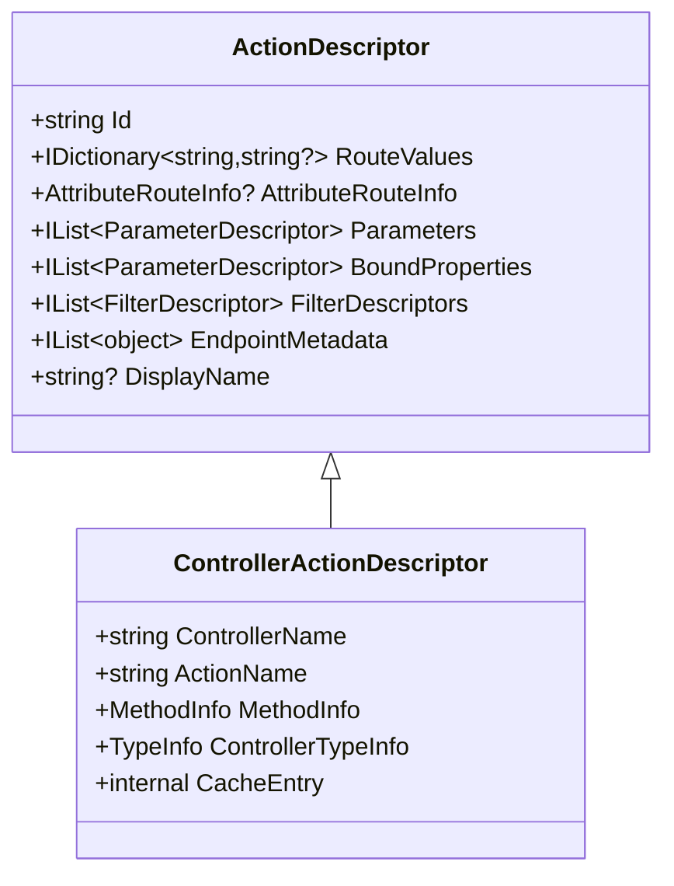

**`ActionDescriptor` 是「**只读元数据**」**：

- 一旦构建完成就**不可变**（缓存复用）；
- 包含运行时需要的所有元数据：路由值、参数、过滤器、终结点元数据；
- `Id` 是 GUID，用于跨调用追踪同一个 Action。

**`ControllerActionDescriptor`** 增加控制器特有的字段（类型、方法、缓存条目）。

### 4.2 IActionDescriptorProvider 责任链

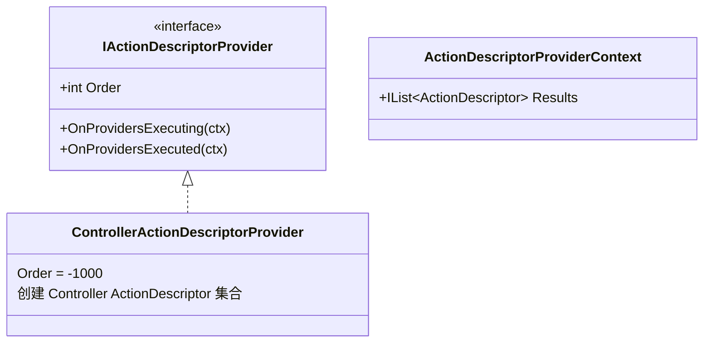

**与 `IApplicationModelProvider` 同模式** —— 升序 `Executing` + 降序 `Executed` 的责任链。

### 4.3 ControllerActionDescriptorProvider 流程

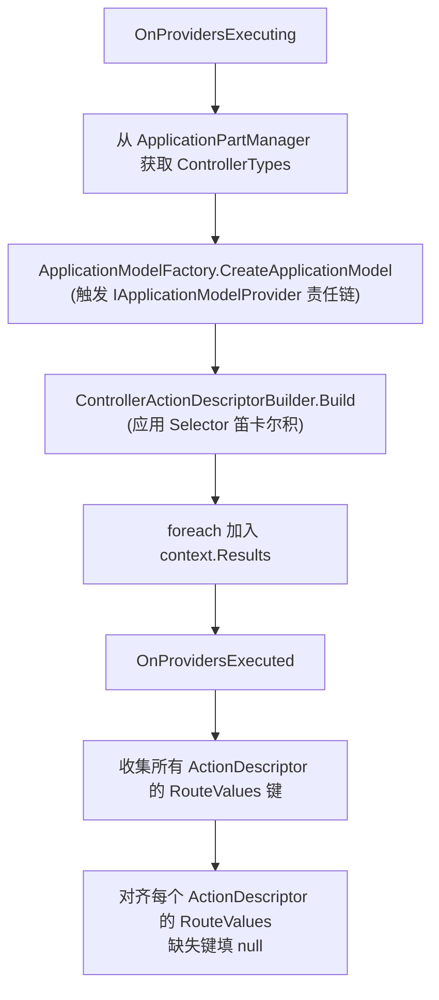

### 4.4 RouteValues 对齐机制

```
原始 RouteValues 字典分布
─────────────────────────
A.B.C controller=Home action=Index
A.D   controller=Home action=Edit  area=admin
A.E   controller=User action=List

收集所有键 = { controller, action, area }

对齐后
─────────────────────────
A.B.C controller=Home action=Index area=null
A.D   controller=Home action=Edit  area=admin
A.E   controller=User action=List  area=null
```

**为什么要对齐？**

- 路由匹配时按 `RoutePattern.RequiredValues` 判断 endpoint 是否符合（`Notes/路由.md` §2.5）；
- 如果有些 endpoint 的 `area=null`，必须显式存在这个键 —— 否则匹配器分不清「**没有这个键**」和「**这个键是 null**」；
- **「**对齐**」让所有 ActionDescriptor 的路由值字典具有相同的键集合**，简化路由匹配逻辑。

### 4.5 IActionDescriptorChangeProvider 变更通知

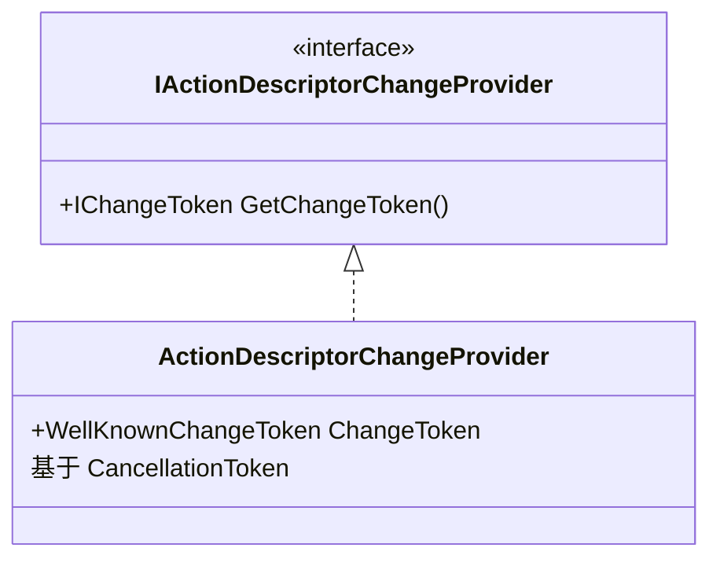

**用途**：当 ActionDescriptor 集合需要动态变化时（如运行时编译的 Razor 页面新增），通过触发 `IChangeToken` 通知 `DefaultActionDescriptorCollectionProvider` 重建集合。

### 4.6 DefaultActionDescriptorCollectionProvider 缓存与刷新

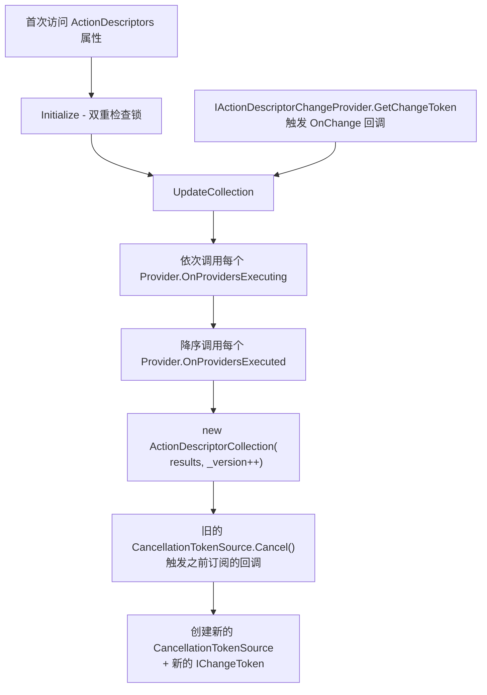

**关键设计**：

- **`_version` 自增**：每次重建集合时递增，调用方可以发现集合是否变化；
- **新旧 token 切换**：先 `Cancel()` 旧 token（通知订阅者），再创建新 token 给后续订阅；
- **`ChangeToken.OnChange` 监听变更**：构造函数中订阅一次，永久监听到对象释放。

---

## 5. 终结点构建：连接路由系统

### 5.1 ControllerActionEndpointDataSource 与 ActionEndpointFactory

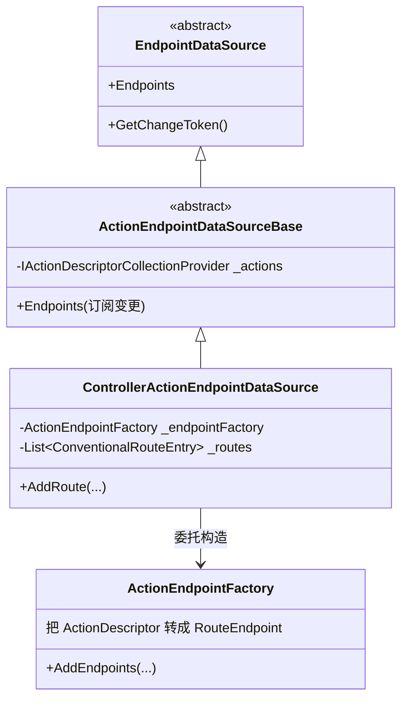

**`ControllerActionEndpointDataSource` 是 MVC 接入路由系统的「**唯一桥梁**」**：

- 通过 `IActionDescriptorCollectionProvider.GetChangeToken()` **订阅 Descriptor 变更**；
- Descriptor 变化时自动重新创建 `Endpoints`；
- 通过 `ActionEndpointFactory` 把每个 `ActionDescriptor` 转成 `RouteEndpoint`。

### 5.2 ControllerActionEndpointConventionBuilder

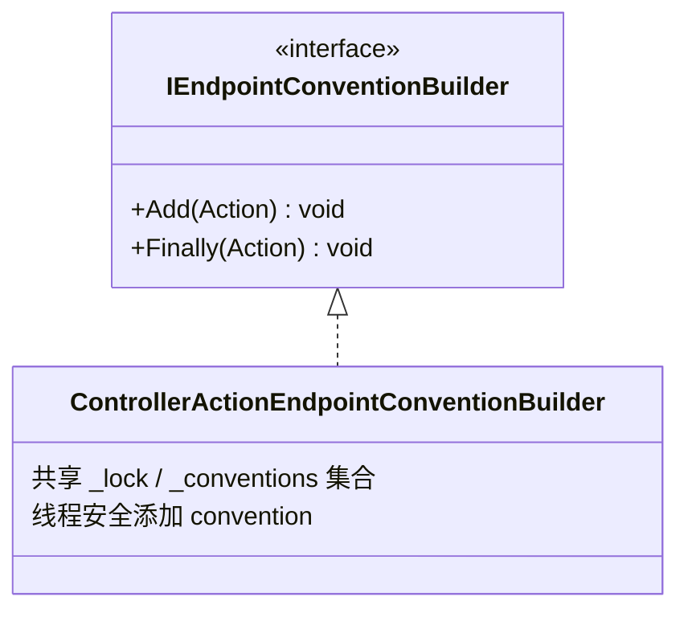

**为什么需要锁？** 因为 `ControllerActionEndpointDataSource` 可能在订阅 Descriptor 变更后**异步重建 Endpoints**；同时用户可能继续链式调用 `MapControllers().RequireAuthorization()` 添加 convention —— 必须保证 `_conventions` 集合在并发下安全。

### 5.3 MapControllers / MapControllerRoute 注册扩展

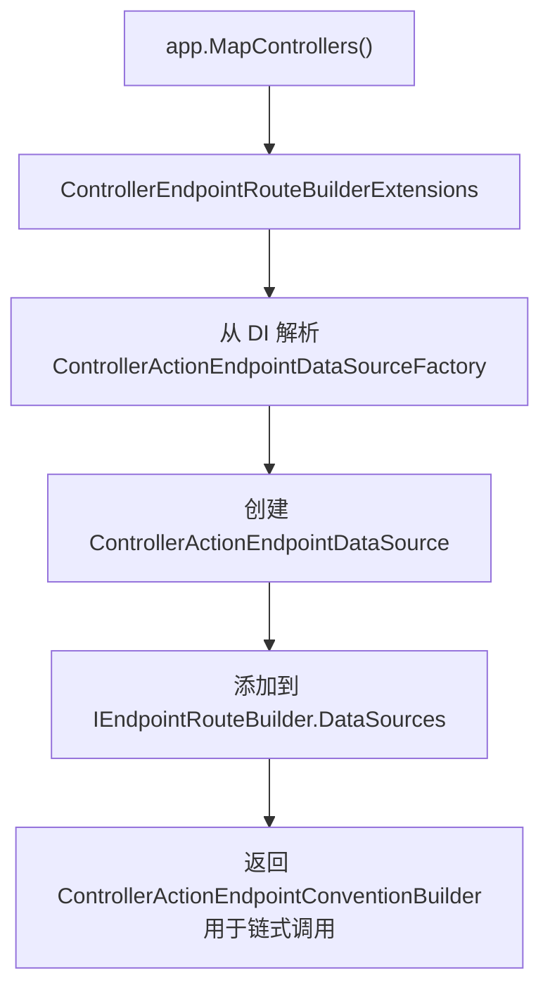

**注册 API 全家福**：

| API | 行为 |
|-----|------|
| `MapControllers()` | 仅注册基于特性路由的终结点 |
| `MapControllerRoute("name", "pattern", defaults)` | 添加约定路由 |
| `MapDefaultControllerRoute()` | 等价于 `MapControllerRoute("default", "{controller=Home}/{action=Index}/{id?}")` |
| `MapAreaControllerRoute(...)` | 带 Area 约束的约定路由 |

### 5.4 终结点订阅 ActionDescriptor 变更

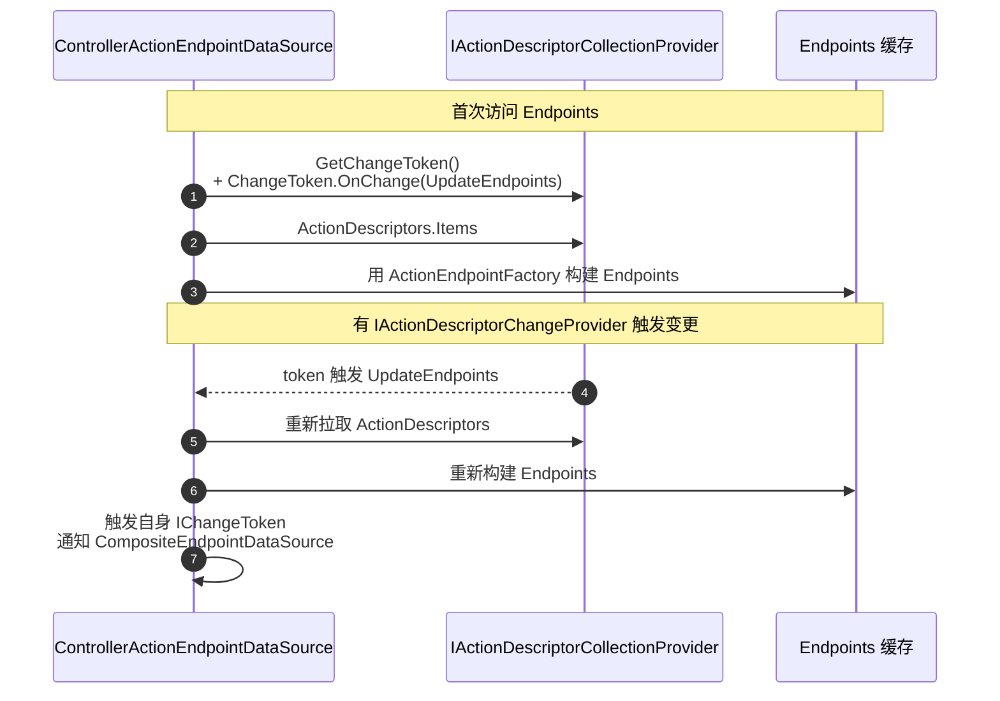

**「**变更级联**」**：`IActionDescriptorChangeProvider` → `ActionDescriptorCollectionProvider` → `ControllerActionEndpointDataSource` → `CompositeEndpointDataSource`（路由系统） → `Matcher` 重建。任何一层触发都会向上传播。

---

## 6. Action 管线构建：从 RequestDelegate 到 Controller

### 6.1 ActionContext / ControllerContext

```mermaid
classDiagram
    class ActionContext {
        +HttpContext HttpContext
        +RouteData RouteData
        +ActionDescriptor ActionDescriptor
        +ModelStateDictionary ModelState
    }
    class ControllerContext {
        +ControllerActionDescriptor ActionDescriptor (协变)
        +IList&lt;IValueProviderFactory&gt; ValueProviderFactories
    }

    ActionContext <|-- ControllerContext
```

**「**四元组**」抽象**：`HttpContext` + `RouteData` + `ActionDescriptor` + `ModelState` —— 这四个对象贯穿整个 Action 执行管线。

### 6.2 IRequestDelegateFactory 与 ControllerRequestDelegateFactory

```mermaid
flowchart TD
    Endpoint[RouteEndpoint 构建期]
    Endpoint --> Factory[ActionEndpointFactory.AddEndpoints]
    Factory --> Probe["DI 解析所有 IRequestDelegateFactory"]
    Probe --> Loop[遍历每个 Factory]
    Loop --> Try["factory.CreateRequestDelegate(actionDescriptor)"]
    Try --> Check{返回非 null?}
    Check -->|是| Use[使用该 RequestDelegate]
    Check -->|否| Loop
```

**关键设计**：`IRequestDelegateFactory` 是「**职责链**」 —— 每个 factory 检查是否能处理这个 ActionDescriptor，能则返回 `RequestDelegate`，不能返回 `null`。

**两种 Factory**：

| Factory | 处理 |
|---------|------|
| `ControllerRequestDelegateFactory` | `ControllerActionDescriptor` |
| 其他自定义 Factory | 自定义 ActionDescriptor 类型 |

### 6.3 IActionInvoker 抽象与 ResourceInvoker 基类

```mermaid
classDiagram
    class IActionInvoker {
        <<interface>>
        +InvokeAsync() Task
    }
    class ResourceInvoker {
        <<abstract>>
        过滤器游标 + 状态机
        +InvokeAsync()
        +InvokeFilterPipelineAsync()
    }
    class ControllerActionInvoker {
        实际调用 Controller.Action
        实现 Action 阶段
    }

    IActionInvoker <|.. ResourceInvoker
    ResourceInvoker <|-- ControllerActionInvoker
```

**`ResourceInvoker` 是过滤器管线的核心** —— 用**状态机 + 游标**实现五种过滤器的复杂流入流出（详见 §7）。

### 6.4 ControllerActionInvoker

```mermaid
sequenceDiagram
    autonumber
    participant Pipeline as 过滤器管线
    participant Invoker as ControllerActionInvoker
    participant Cache as ControllerActionInvokerCacheEntry
    participant Bind as ModelBinder
    participant Action as Controller.Action

    Pipeline->>Invoker: 调到 ActionExecuting 阶段
    Invoker->>Cache: 拿到 ParameterBinder / Activator 等
    Invoker->>Bind: 绑定 Action 参数<br/>(模型绑定 + 验证)
    Invoker->>Action: 反射调用 Action 方法
    Action-->>Invoker: 返回 IActionResult / 任意对象
    Invoker->>Invoker: 映射为 IActionResult
    Invoker->>Pipeline: 进入 ActionExecuted → ResultExecuting → 结果执行
```

**`ControllerActionInvokerCacheEntry` 缓存**：每个 `ControllerActionDescriptor` 对应一个 cache entry，包含已编译的参数绑定委托、Activator、Filter Pipeline —— 避免每次请求都反射。

---

## 7. 过滤器管线：完整流入流出

### 7.1 五种过滤器

```mermaid
classDiagram
    class IFilterMetadata {
        <<interface, marker>>
    }
    class IOrderedFilter {
        +int Order
    }
    class IFilterFactory {
        +bool IsReusable
        +CreateInstance(sp) IFilterMetadata
    }

    IFilterMetadata <|-- IOrderedFilter
    IFilterMetadata <|-- IFilterFactory

    class IAuthorizationFilter
    class IResourceFilter
    class IActionFilter
    class IExceptionFilter
    class IResultFilter
    class IAlwaysRunResultFilter

    IFilterMetadata <|-- IAuthorizationFilter
    IFilterMetadata <|-- IResourceFilter
    IFilterMetadata <|-- IActionFilter
    IFilterMetadata <|-- IExceptionFilter
    IFilterMetadata <|-- IResultFilter
    IResultFilter <|-- IAlwaysRunResultFilter
```

**五种过滤器的职责**：

| 过滤器 | 职责 | 异步版本 |
|--------|------|---------|
| `IAuthorizationFilter` | 鉴权（管线最外层） | `IAsyncAuthorizationFilter` |
| `IResourceFilter` | 资源加载/缓存（在模型绑定之前/之后） | `IAsyncResourceFilter` |
| `IActionFilter` | Action 调用前后（参数绑定之后） | `IAsyncActionFilter` |
| `IExceptionFilter` | 捕获 Action / Action Filter 异常 | `IAsyncExceptionFilter` |
| `IResultFilter` | IActionResult 执行前后 | `IAsyncResultFilter` |

### 7.2 流入流出顺序图

```mermaid
flowchart TD
    Start[请求进入]
    Start --> Auth[Authorization Filter]
    Auth --> Resource1[Resource Filter 流入]
    Resource1 --> Exc1["异常过滤器作用域开始"]

    Exc1 --> Bind[参数绑定 + ModelState 验证]
    Bind --> Action1[Action Filter 流入]
    Action1 --> Method[Controller.Action 方法]

    Method --> Action2[Action Filter 流出]
    Action2 --> Exc2["异常过滤器作用域结束<br/>(如有异常→ ExceptionFilter)"]
    Exc2 --> Result1[Result Filter 流入]
    Result1 --> Exec[执行 IActionResult.ExecuteResultAsync]
    Exec --> Result2[Result Filter 流出]
    Result2 --> Resource2[Resource Filter 流出]
    Resource2 --> End[返回]
```

**记忆口诀**：

- **「**洋葱**」**：Authorization → Resource → Action → Method → Action → Exception → Result → Result → Resource；
- **「**异常作用域**」**：覆盖参数绑定 + Action 方法（不包括 Result 执行）；
- **「**Result 过滤器**」**：跨过异常作用域，即使 Action 抛错经 Exception Filter 处理后仍会执行。

### 7.3 短路点

| 过滤器 | 短路方式 | 短路后管线 |
|--------|---------|-----------|
| `IAuthorizationFilter` | 设置 `AuthorizationFilterContext.Result` | 跳过所有 → IAlwaysRunResultFilter → 结果执行 |
| `IResourceFilter` | 设置 `ResourceExecutingContext.Result`（同步） / 不调 `await next()` 但设 `Result`（异步） | 跳过 Action 阶段 → IAlwaysRunResultFilter → 结果执行 |
| `IActionFilter` | 设置 `ActionExecutingContext.Result`（同步） / 不调 `await next()` 但设 `Result`（异步） | 跳过 Action → Exception Filter → Result Filter → 结果执行 |
| `IExceptionFilter` | 设置 `ExceptionContext.IsHandled = true` 或 `Exception = null` | 视为异常已处理，继续流出 |
| `IResultFilter` | 设置 `ResultExecutingContext.Cancel = true` | 跳过结果执行 |

**`IAlwaysRunResultFilter` 的特殊性**：即使 Authorization / Resource Filter 短路，**仍然会执行**。用于全局日志、ETag 等横切关注点。

### 7.4 IFilterFactory 与延迟实例化

```mermaid
classDiagram
    class IFilterFactory {
        <<interface>>
        +bool IsReusable
        +CreateInstance(IServiceProvider) IFilterMetadata
    }
    class TypeFilterAttribute {
        +Type ImplementationType
        +object[]? Arguments
        +int Order
        +bool IsReusable
    }
    class ServiceFilterAttribute {
        +Type ServiceType
        +int Order
        +bool IsReusable
    }

    IFilterFactory <|.. TypeFilterAttribute
    IFilterFactory <|.. ServiceFilterAttribute
```

**`IFilterFactory.IsReusable`** 决定实例缓存策略：

| `IsReusable` | 行为 |
|-------------|------|
| `true` | 第一次创建后**复用**，所有请求共用同一实例 |
| `false` | **每次请求新建实例**，可以注入 Scoped 服务 |

**`[TypeFilter(typeof(LoggingFilter))]`** vs **`[ServiceFilter(typeof(LoggingFilter))]`**：

| 特性 | 实例来源 | 适用 |
|------|---------|------|
| `[TypeFilter]` | `ActivatorUtilities.CreateInstance`（不需要 DI 注册） | 一次性 / 临时 |
| `[ServiceFilter]` | `IServiceProvider.GetRequiredService`（必须 DI 注册） | 长期共享 / 复杂依赖 |

**特性形式的过滤器一定缓存复用** —— 因为特性运行时反序列化为单一实例（每个标注点一份）。

### 7.5 [TypeFilter] / IFilterFactory.IsReusable

```C#
// TypeFilterAttribute.CreateInstance 精简
public IFilterMetadata CreateInstance(IServiceProvider serviceProvider)
{
    if (_factory == null)
    {
        var argumentTypes = Arguments?.Select(a => a.GetType()).ToArray();
        _factory = ActivatorUtilities.CreateFactory(ImplementationType, argumentTypes ?? Type.EmptyTypes);
    }
    var filter = (IFilterMetadata)_factory(serviceProvider, Arguments);
    if (filter is IFilterFactory filterFactory)
        filter = filterFactory.CreateInstance(serviceProvider);   // 递归：filter 还能是工厂
    return filter;
}
```

**两点设计**：

- **`ActivatorUtilities.CreateFactory` 缓存编译委托**：避免每次 `CreateInstance` 都反射；
- **递归检查 IFilterFactory**：允许工厂返回的对象仍是工厂（嵌套构造）。

### 7.6 IAlwaysRunResultFilter 的特殊性

```mermaid
flowchart LR
    Short[Authorization 或 Resource Filter 短路]
    Short --> Skip[跳过 Action / 普通 Result Filter]
    Skip --> Always[只执行 IAlwaysRunResultFilter]
    Always --> Exec[执行 IActionResult.ExecuteResultAsync]
    Exec --> AlwaysOut[IAlwaysRunResultFilter 流出]
```

**用途**：

- **`ClientErrorResultFilter`** 实现 `IAlwaysRunResultFilter`，即使 Authorization Filter 短路返回 401，也会把它转换成 ProblemDetails 格式；
- **全局日志**、**ETag 处理**等 —— 需要无条件执行的结果加工。

---

## 8. API 行为：[ApiController] 的魔法

### 8.1 ProblemDetails 与 RFC 7807

```mermaid
classDiagram
    class ProblemDetails {
        +string? Type
        +string? Title
        +int? Status
        +string? Detail
        +string? Instance
        +IDictionary&lt;string, object?&gt; Extensions
    }
    class ValidationProblemDetails {
        +IDictionary&lt;string, string[]&gt; Errors
    }

    ProblemDetails <|-- ValidationProblemDetails
```

**RFC 7807** 是 Web API 的标准错误格式：

```json
{
  "type": "https://tools.ietf.org/html/rfc9110#section-15.5.5",
  "title": "Not Found",
  "status": 404,
  "detail": "Product with ID 999 not found",
  "instance": "/products/999",
  "traceId": "00-1234567890abcdef-..."
}
```

**`ValidationProblemDetails`** 是 400 错误的扩展，额外包含 `Errors` 字典（字段名 → 错误消息数组）。

### 8.2 ProblemDetailsClientErrorFactory / DefaultProblemDetailsFactory

```mermaid
flowchart LR
    BadResult["返回 NotFound() / BadRequest()<br/>等 IClientErrorActionResult"]
    BadResult --> Filter[ClientErrorResultFilter 拦截]
    Filter --> Factory[ProblemDetailsClientErrorFactory.GetClientError]
    Factory --> Build["DefaultProblemDetailsFactory.CreateProblemDetails<br/>(填充 Type/Title/traceId)"]
    Build --> Wrap["ObjectResult { Value=ProblemDetails,<br/>ContentTypes=application/problem+json }"]
    Wrap --> Replace[替换 context.Result]
```

**关键设计**：用户调 `return NotFound()` 时返回的是 `NotFoundResult` —— 一个轻量级 404 标记。`ClientErrorResultFilter` 把它「**升级**」为完整 `ProblemDetails`。

**`DefaultProblemDetailsFactory.ApplyProblemDetailsDefaults`** 的填充逻辑：

| 字段 | 来源 |
|------|------|
| `Status` | 调用方传入 / 默认 500 |
| `Title` / `Type` | `ApiBehaviorOptions.ClientErrorMapping`（按状态码查表） |
| `traceId` | `Activity.Current?.Id ?? HttpContext.TraceIdentifier` |
| 其他 | `ProblemDetailsOptions.CustomizeProblemDetails` 自定义委托 |

### 8.3 ClientErrorResultFilter：自动转换为 ProblemDetails

`ClientErrorResultFilter` 实现 `IAlwaysRunResultFilter` —— 即使其他过滤器短路也会执行：

```C#
// 精简
public void OnResultExecuting(ResultExecutingContext context)
{
    if (!(context.Result is IClientErrorActionResult clientError)) return;
    if (clientError.StatusCode < 400) return;                          // 仅处理 4xx/5xx

    var result = _clientErrorFactory.GetClientError(context, clientError);
    if (result != null)
        context.Result = result;                                       // 替换为 ProblemDetails
}
```

### 8.4 ModelStateInvalidFilter：400 自动响应

```mermaid
flowchart TD
    Action[Action Filter 流入]
    Action --> Check{ModelState.IsValid?}
    Check -->|否| Return[设置 context.Result = BadRequestObjectResult<br/>(短路)]
    Check -->|是| Continue[继续 Action 执行]

    Return --> Result[Result Filter 接管<br/>+ ClientErrorResultFilter 把 400 转 ProblemDetails]
```

**`[ApiController]` 的关键便利**：

- 用户无需在每个 Action 写 `if (!ModelState.IsValid) return BadRequest(ModelState);`；
- `ModelStateInvalidFilter` 在 Action Filter 阶段自动检查并短路；
- 配合 `ClientErrorResultFilter` 自动转 `ValidationProblemDetails`。

**用户开关**：`ApiBehaviorOptions.SuppressModelStateInvalidFilter = true` 可禁用。

---

## 9. 设计思想速览

### 9.1 多层 Model 树：Type → Model → Descriptor → Endpoint

```mermaid
flowchart LR
    L1[TypeInfo<br/>原始反射类型] --> L2[ApplicationModel 树<br/>可被 Convention 修改]
    L2 --> L3[ActionDescriptor<br/>不可变只读元数据]
    L3 --> L4[RouteEndpoint<br/>路由系统的标准产物]

    note["每一层职责明确<br/>下一层不依赖上一层的细节<br/>用户可在 Model 层注入 Convention"]
    L2 -.- note
```

**多层抽象的收益**：

- **`ApplicationModel`** 提供可修改的中间表示，让 Convention 可以批量改造；
- **`ActionDescriptor`** 是只读快照，缓存友好；
- **`RouteEndpoint`** 是统一的路由产物 —— 让 MVC 和其他终结点系统（Minimal API）共享路由匹配机制。

### 9.2 Provider 责任链 + Order

```mermaid
flowchart LR
    P1[Provider 1<br/>Order=-1000] --> P2[Provider 2<br/>Order=-900] --> P3[Provider 3<br/>Order=100]
    P3 --> ExeMethod[OnProvidersExecuting<br/>(升序)]
    ExeMethod --> P3R[OnProvidersExecuted<br/>(降序)]
    P3R --> P2R[Provider 2 Executed]
    P2R --> P1R[Provider 1 Executed]
```

**「**升序 Executing / 降序 Executed**」是 MVC 内部的「**洋葱模型**」** —— 与中间件管道完全相同的设计。`IApplicationModelProvider`、`IActionDescriptorProvider` 都遵循此模式。

### 9.3 双重缓存：ActionDescriptor 缓存 + Endpoint 缓存

```mermaid
flowchart TB
    Source[ApplicationPart 程序集]
    Source -->|扫描| Model[ApplicationModel]
    Model -->|构建| Descriptors[ActionDescriptor 集合<br/>第一层缓存]
    Descriptors -->|订阅 IActionDescriptorChangeProvider 变更| Refresh1[自动重建]

    Descriptors -->|构建 Endpoint| Endpoints[RouteEndpoint 集合<br/>第二层缓存]
    Endpoints -->|订阅 ActionDescriptor token| Refresh2[自动重建]

    Endpoints --> Routing[路由系统]
```

**双层缓存 + 变更级联**：保证既高性能（启动后只反射一次），又支持动态变化（Razor 编译、热加载）。

### 9.4 过滤器游标 + 状态机

```C#
// ResourceInvoker 中的 FilterCursor（精简）
protected FilterCursor _cursor;
protected IActionResult? _result;

protected enum State {
    AuthorizationBegin,
    AuthorizationNext,
    AuthorizationEnd,
    ResourceBegin,
    ResourceNext,
    // ... 数十个状态
    InvokeEnd,
}
```

**为什么用游标 + 状态机？**

- **避免深度递归**：传统的 `await filter1(() => filter2(...))` 在过滤器多时栈深；
- **支持同步/异步混合**：每个状态可独立判断是同步还是异步过滤器；
- **可以在中间打断**：短路时直接跳到对应状态退出。

### 9.5 IFilterFactory 模式

```mermaid
flowchart LR
    Filter[IFilterMetadata 抽象基类] --> Direct[直接是过滤器实例]
    Filter --> Factory["还可以是 IFilterFactory<br/>(延迟实例化)"]

    Factory --> Reuse{IsReusable?}
    Reuse -->|是| Cache[首次创建后缓存]
    Reuse -->|否| Always[每次新建]
```

**这种模式让「**过滤器特性**」可以注入 Scoped 服务**：

```C#
[TypeFilter(typeof(MyFilter), IsReusable = false)]   // 每次新建，可注入 DbContext
public IActionResult MyAction() { ... }
```

特性本身是 Singleton（CLR 反序列化的特性实例缓存），但其创建的过滤器实例可以是 Scoped。

### 9.6 RouteValues 对齐机制

之前 §4.4 详细讲过 —— **「**对齐**」让所有 ActionDescriptor 具有相同的路由值键集合**，简化路由匹配器的逻辑。这是 MVC 与路由系统协作的关键约定。

---

## 10. 速查卡 & 陷阱清单

### 10.1 多层模型对照速查

| 层级 | 类型 | 时机 | 可修改? |
|------|------|------|---------|
| 原始 | `TypeInfo` | 编译期 | 否 |
| 应用模型 | `ApplicationModel` / `ControllerModel` / `ActionModel` / `SelectorModel` | 启动期，Provider 责任链构建 | ✅ Convention 可修改 |
| 描述符 | `ActionDescriptor` / `ControllerActionDescriptor` | Model 阶段之后，缓存 | ❌ 只读 |
| 终结点 | `RouteEndpoint` | Descriptor 阶段之后，订阅变更重建 | ❌ 只读 |

### 10.2 五种过滤器执行顺序

```
请求方向:
Authorization → Resource(入) → 模型绑定 → Action(入) → Action 方法
                                                          ↓
响应方向:                              异常作用域
Resource(出) ← Result(出) ← Result(入) ← Exception ← Action(出)
        ↓                                              ↑
   IAlwaysRunResultFilter 短路时唯一执行的 Result Filter
```

### 10.3 [ApiController] 自动行为

| 行为 | 来源 |
|------|------|
| 参数绑定源推断（FromQuery / FromBody / FromRoute） | `InferParameterBindingInfoConvention` |
| 4xx/5xx 响应转 ProblemDetails | `ClientErrorResultFilter` |
| 无效 ModelState 自动 400 | `ModelStateInvalidFilter` |
| 自动 `multipart/form-data`（含 IFormFile） | `ConsumesConstraintForFormFileParameterConvention` |
| 自动暴露给 ApiExplorer | `ApiVisibilityConvention` |

### 10.4 10 大常见陷阱

1. **控制器名不以 `Controller` 结尾且无 `[Controller]` 特性**：被 `ControllerFeatureProvider` 过滤掉，不生成终结点。**对策**：遵循命名约定或加 `[Controller]`。
2. **`internal` 控制器类**：不满足 `IsPublic` 条件，被过滤。**对策**：改为 `public`。
3. **泛型控制器**：不满足 `!ContainsGenericParameters`，被过滤。**对策**：用具体类型继承。
4. **`[TypeFilter(IsReusable = true)]` 但注入 Scoped 服务**：实例被复用 → captive dependency。**对策**：`IsReusable = false` 或注入工厂。
5. **过滤器顺序意外**：`Order` 默认是 0，多个过滤器同序时按特性 / 控制器 / Action 三层级顺序。**对策**：显式设置 `Order`。
6. **依赖 `ModelState.IsValid` 但用了 `[ApiController]`**：`ModelStateInvalidFilter` 已经短路返回 400，Action 根本不会执行。**对策**：理解此行为或 `SuppressModelStateInvalidFilter = true`。
7. **`[NonController]` 失效**：放在抽象基类上不影响派生类的扫描。**对策**：放在具体控制器类上。
8. **`MapControllers` 但 Action 没 `[HttpGet]` / `[Route]`**：只注册了**特性路由**，约定路由需 `MapControllerRoute` 或 `MapDefaultControllerRoute`。**对策**：根据 API 风格选对应注册方法。
9. **`IActionResult` 子类未实现 `IClientErrorActionResult`**：不会被 `ClientErrorResultFilter` 转换。**对策**：继承 `ObjectResult` 并实现接口，或手动转换。
10. **`IApplicationModelConvention.Apply` 中修改 Filters 集合**：可能因 Convention 执行顺序导致后续 Provider 看到的状态不一致。**对策**：用 `IControllerModelConvention` / `IActionModelConvention` 限定影响范围。

### 10.5 原笔记类型 → 本笔记小节 映射表

| 原笔记类型 | 本笔记小节 |
|-----------|-----------|
| `ApplicationPart` / `IApplicationPartTypeProvider` / `AssemblyPart` | §2.1 |
| `IApplicationFeatureProvider<>` / `ControllerFeature` / `ControllerFeatureProvider` | §2.4 |
| `ApplicationPartManager` | §2.2 |
| `ApplicationPartFactory` / `DefaultApplicationPartFactory` | §2.3 |
| `ActionDescriptor` / `ControllerActionDescriptor` | §4.1 |
| `ActionDescriptorProviderContext` / `IActionDescriptorProvider` / `ControllerActionDescriptorProvider` | §4.2 / §4.3 |
| `ApplicationModel` / `ControllerModel` / `ActionModel` / `SelectorModel` | §3.1 / §3.2 |
| `IApplicationModelConvention` | §3.6 |
| `ApplicationModelProviderContext` / `IApplicationModelProvider` / `DefaultApplicationModelProvider` | §3.3 / §3.4 |
| `ApiBehaviorApplicationModelProvider` | §3.5 |
| `ApplicationModelFactory` | §3.3 / §4.3 |
| `IActionDescriptorChangeProvider` / `ActionDescriptorChangeProvider` | §4.5 |
| `IActionDescriptorCollectionProvider` / `ActionDescriptorCollectionProvider` / `DefaultActionDescriptorCollectionProvider` | §4.6 |
| `ControllerActionEndpointConventionBuilder` | §5.2 |
| `ActionEndpointDataSourceBase` / `ControllerActionEndpointDataSource` | §5.1 |
| `ActionEndpointFactory` | §5.1 |
| `ControllerEndpointRouteBuilderExtensions` | §5.3 |
| `ControllerActionEndpointDataSourceFactory` | §5.3 |
| `ActionContext` / `ControllerContext` | §6.1 |
| `IRequestDelegateFactory` / `ControllerRequestDelegateFactory` | §6.2 |
| `IActionInvoker` / `ResourceInvoker` / `ControllerActionInvoker` | §6.3 / §6.4 / §9.4 |
| `ProblemDetails` | §8.1 |
| `ProblemDetailsClientErrorFactory` / `DefaultProblemDetailsFactory` | §8.2 |
| `IFilterMetadata` / `IOrderedFilter` / `IFilterFactory` / `TypeFilterAttribute` | §7.1 / §7.4 / §7.5 |
| `ClientErrorResultFilterFactory` / `ClientErrorResultFilter` | §8.3 |
| `ModelStateInvalidFilterFactory` / `ModelStateInvalidFilter` | §8.4 |
