# Minimal API

> 本笔记是 ASP.NET Core（.NET 6）`Microsoft.AspNetCore.Builder` 中 Minimal API 编程模型的学习整理，配套源码解读位于仓库根目录 `MinimalAPI.md`。
>
> 风格延续前六章：以 Mermaid UML 图、设计原理、示例为主；源码片段只保留「不看代码无法说清」的几行。

## 0. 阅读指南

### 0.1 本笔记的定位

| 文件 | 视角 | 主体内容 |
|------|------|---------|
| `MinimalAPI.md`(源码笔记) | **源码视角** | 逐类型贴源码 + 在源码中注释解读 |
| `Notes/MinimalAPI.md`(本笔记) | **学习视角** | UML 图、构建流水线、一身三角设计、陷阱清单 |

### 0.2 推荐阅读顺序

- **首次学习**：§1 → §2 → §4 → §5 → §6 → §3 → §7 → §8 → §9。
- **想理清「`WebApplication` / `WebApplicationBuilder` / `HostApplicationBuilder` 三者关系」**：§2 + §4 + §5 串读。
- **想理清「引导阶段为什么需要 `BootstrapHostBuilder`」**：先看 §6 再回到 §5.2。
- **找某个具体类型**：用 §9.5 「**原笔记类型 → 本笔记小节**映射表」反查。

### 0.3 与前六章的关系

Minimal API **不是新的运行时栈**，而是「**对前六章成果的重新打包**」：

- 底层仍然是 `IHost` / `IHostBuilder`(`Notes/服务承载.md`)；
- Web 部分仍然是 `GenericWebHostService` + `IWebHostBuilder`(`Notes/管道中间件.md`)；
- DI / 配置 / 选项 / 日志 全部沿用前几章。

Minimal API 的创新在于「**编程模型的折叠**」——把多个独立的 Builder 折叠成一个 `WebApplication`，让用户用最少的代码启动 Web 应用。

---

## 1. 全景：Minimal API 与经典编程模型对比

### 1.1 三种编程模型对照

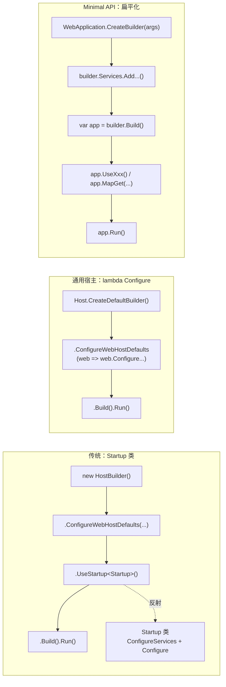

**关键认知**：

- **传统 / 通用宿主**：「**构建者构建 host**」 → host 内部封装服务、管道、终结点 —— 用户不直接接触；
- **Minimal API**：「**构建者构建 WebApplication**」 → `WebApplication` 同时是 host、是 `IApplicationBuilder`、是 `IEndpointRouteBuilder` —— 用户**直接操作**它注册服务/中间件/路由。

这种「**扁平化**」让 Web 应用启动代码从 `Program.cs` + `Startup.cs` 两文件压缩到一个文件十几行。

### 1.2 WebApplication 一身三角的核心创新

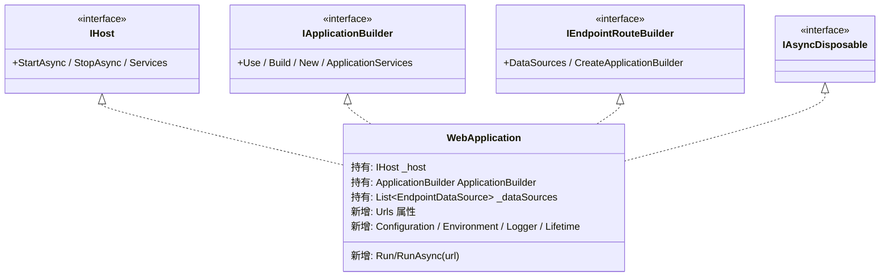

`WebApplication` 同时实现**四个接口**，让一个对象在不同上下文里扮演不同角色：

| 角色 | 用法 | 调用方式 |
|------|------|---------|
| `IHost` | 启动/停止应用 | `app.Run()` / `await app.StartAsync()` |
| `IApplicationBuilder` | 注册中间件 | `app.UseStaticFiles()` / `app.Use(...)` |
| `IEndpointRouteBuilder` | 注册终结点 | `app.MapGet(...)` / `app.MapControllers()` |

### 1.3 一行启动的展开

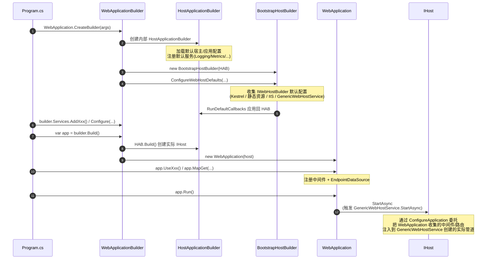

### 1.4 核心类型一览

| 分类 | 类型 | 角色 |
|------|------|------|
| 入口 | `WebApplication` | 一身三角的核心类 |
| 选项 | `WebApplicationOptions` | 创建 Builder 时的初始选项 |
| 通用建造者 | `HostApplicationBuilder` / `HostApplicationBuilderSettings` / `IHostApplicationBuilder` | 即时模式的宿主建造者 |
| Web 建造者 | `WebApplicationBuilder` | 委托模式包装 HostApplicationBuilder |
| 引导建造者 | `BootstrapHostBuilder` | 在引导阶段模拟 `IHostBuilder` |
| 历史 API | `ConfigureHostBuilder` / `ConfigureWebHostBuilder` | 兼容旧版 `IHostBuilder` / `IWebHostBuilder` API，但限制可变范围 |

---

## 2. WebApplication：一身三角

### 2.1 多角色协作

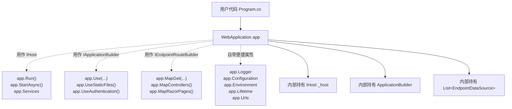

### 2.2 显式接口实现：禁止外部调用某些方法

`WebApplication` 对 `IApplicationBuilder` 与 `IEndpointRouteBuilder` 的成员采用**显式接口实现**(`IApplicationBuilder.Build()` 而非 `public RequestDelegate Build()`)：

| 成员 | 实现方式 | 用意 |
|------|---------|------|
| `IApplicationBuilder.Use` | **公开实现** | 唯一允许用户直接调的 `IApplicationBuilder` 方法 |
| `IApplicationBuilder.Build` | 显式实现 | 用户不应调它 —— 构建由框架内部完成 |
| `IApplicationBuilder.New` | 显式实现 | 用户不应调它 —— 分支管道由 `Map` 等扩展方法负责 |
| `IApplicationBuilder.ApplicationServices` / `ServerFeatures` / `Properties` | 显式实现 | 用户应通过 `app.Services` 等便捷属性访问 |
| `IEndpointRouteBuilder.*` | 全部显式实现 | 用户通过 `MapGet` / `MapControllers` 等扩展方法访问 |

**显式接口实现的语法效果**：

```C#
WebApplication app = ...;
app.Use(middleware);            // ✓ 公开方法，直接调用
app.Build();                    // ✗ 编译错误！必须 (app as IApplicationBuilder).Build()
((IApplicationBuilder)app).Build();   // ✓ 显式 cast 后可调用，但用户不应这么写
```

**设计意图**：让 IDE 智能感知**只暴露用户该用的 API**，把内部细节藏起来。

### 2.3 GlobalEndpointRouteBuilderKey：自己作为全局路由构建器

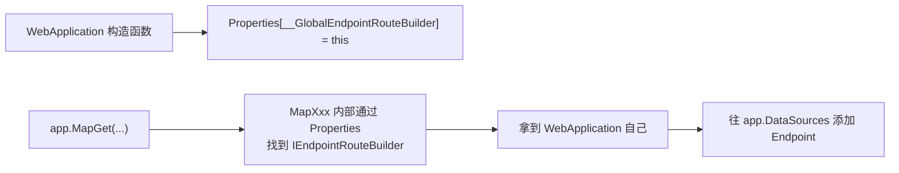

**关键设计**：`WebApplication` 在构造时把**自己**写进 `ApplicationBuilder.Properties["__GlobalEndpointRouteBuilder"]`。这样任何 `MapXxx` 扩展方法都能通过 `Properties` 找到「**全局路由构建器**」，向其注册 `EndpointDataSource`。

### 2.4 Run / RunAsync 与 Listen：直接设置监听地址

```C#
// WebApplication.Run（精简）
public void Run(string? url = null)
{
    Listen(url);                                          // 设置监听地址
    HostingAbstractionsHostExtensions.Run(this);          // 调用 IHost 扩展启动并阻塞
}
```

**`Listen` 的语义**：

- 通过 `IServerAddressesFeature.Addresses` 修改服务器监听地址；
- **每次调用都先 `Clear()` 再 `Add(url)`** —— 只支持一个地址；
- 多个地址请用 `app.Urls.Add(...)`(`Urls` 直接暴露 `Addresses` 集合)。

**常见三种启动写法**：

```C#
app.Run();                          // 使用配置的地址
app.Run("http://localhost:5000");   // 覆盖为单一地址
app.Urls.Add("http://*:5001");      // 追加地址再调 Run()
app.Urls.Add("https://*:5002");
app.Run();
```

### 2.5 New() 的特殊处理：避免分支管道复用全局路由

```C#
// WebApplication 显式实现 IApplicationBuilder.New
IApplicationBuilder IApplicationBuilder.New()
{
    var newBuilder = ApplicationBuilder.New();
    newBuilder.Properties.Remove(GlobalEndpointRouteBuilderKey);   // ← 关键
    return newBuilder;
}
```

**为什么要 Remove 全局路由构建器 Key？**

- `ApplicationBuilder.New()` 通过 `CopyOnWriteDictionary` **共享 Properties**；
- 默认情况下子分支也能看到 `__GlobalEndpointRouteBuilder = this`；
- 但**分支管道里的 `MapXxx` 应该注册到分支自己的路由构建器，而不是全局** —— 所以从分支 Properties 中显式移除该 Key。

**实际用例**：

```C#
app.Map("/admin", branch =>
{
    branch.UseRouting();
    branch.UseEndpoints(endpoints => endpoints.MapGet("/", () => "admin home"));
    // ↑ 这里的 endpoints 是分支独立的路由构建器，不是 app 本身
});
```

> 详见原笔记 第 17–202 行 `WebApplication`。

---

## 3. WebApplicationOptions / HostApplicationBuilderSettings

### 3.1 两组选项的关系

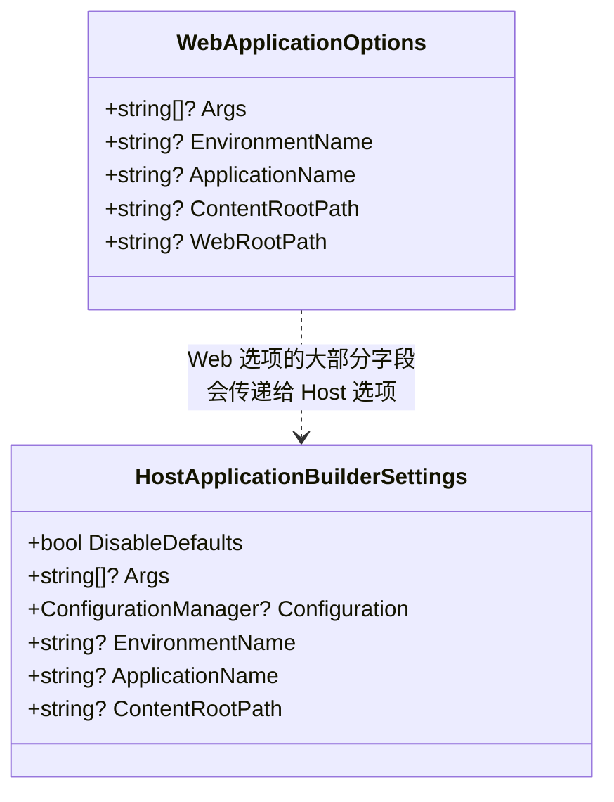

**关键差异**：

| 字段 | `WebApplicationOptions` | `HostApplicationBuilderSettings` |
|------|------------------------|--------------------------------|
| `Args` | ✓ | ✓ |
| `EnvironmentName` | ✓ | ✓ |
| `ApplicationName` | ✓ | ✓ |
| `ContentRootPath` | ✓ | ✓ |
| `WebRootPath` | ✓(Web 专属) | — |
| `Configuration` | — | ✓(允许外部传入 `ConfigurationManager`) |
| `DisableDefaults` | — | ✓(跳过 DOTNET_ 环境变量 + 默认服务注册) |

### 3.2 通过 Options 配置环境

```C#
var builder = WebApplication.CreateBuilder(new WebApplicationOptions
{
    Args = args,
    EnvironmentName = "Staging",
    ContentRootPath = "/var/www/myapp",
    WebRootPath = "/var/www/myapp/static",
});
```

**优先级**：`WebApplicationOptions` > 命令行 > 环境变量 > `appsettings.json`。即使命令行传了 `--environment Development`，构造时 `WebApplicationOptions.EnvironmentName = "Staging"` 也会覆盖。

### 3.3 命令行参数处理

`Args` 在内部会被 `AddCommandLineConfig` 添加为配置源 —— **同时支持** `--key value` 和 `--key=value` 两种语法。配置优先级见 `Notes/管道中间件.md` §3.2。

---

## 4. IHostApplicationBuilder：新版宿主建造者

### 4.1 IHostApplicationBuilder vs IHostBuilder

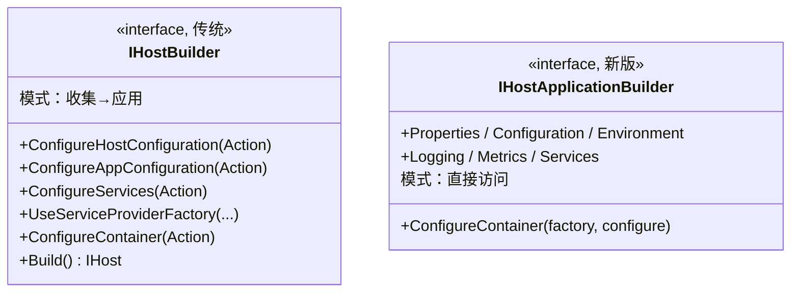

**最关键的差异 —— 收集模式 vs 即时模式**：

- **`IHostBuilder`**：所有 `Configure*` 方法**只收集委托**，直到 `Build()` 才统一应用；
- **`IHostApplicationBuilder`**：直接暴露 `Configuration`、`Services`、`Logging` 等属性，**用户每次访问都是最新的状态**。

```C#
// IHostBuilder 写法（收集模式）
hostBuilder.ConfigureServices((ctx, services) =>
{
    services.AddSingleton<IFoo, Foo>();
});

// IHostApplicationBuilder 写法（即时模式）
builder.Services.AddSingleton<IFoo, Foo>();    // 直接调，立即生效
```

**收益**：

- 配置/服务能在构建早期就被读取(避免环境/工作目录在多次 `Configure*` 之间被覆盖)；
- 用户认知负担降低 —— 直接操作 `Services` / `Configuration` 比组合一堆 `Configure*` 委托更直观；
- **不再需要 `HostBuilderContext` 这种「跨阶段共享上下文」**(`IHostApplicationBuilder` 自身就是上下文)。

### 4.2 HostApplicationBuilder 的初始化流程

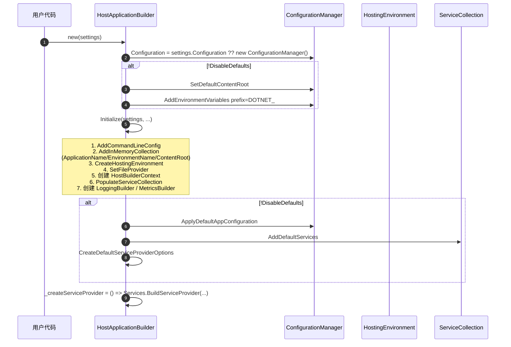

**与 `HostBuilder.Build` 流水线对比**(参考 `Notes/服务承载.md` §4.3)：

| 阶段 | `HostBuilder` | `HostApplicationBuilder` |
|------|--------------|-------------------------|
| 收集配置 | `_configureHostConfigActions` 委托列表 | 直接调用 `Configuration.Add...` |
| 创建环境 | `InitializeHostingEnvironment` | 在构造函数中完成 |
| 应用配置 | `_configureAppConfigActions` | 直接操作同一个 `ConfigurationManager` |
| 注册服务 | `_configureServicesActions` | 直接 `Services.Add...` |
| 创建 ServiceProvider | `_serviceProviderFactory.CreateBuilder + CreateServiceProvider` | `_createServiceProvider` 闭包延迟执行 |
| 触发时机 | `Build()` 内部一次性 | 直接执行 → `Build()` 仅构建 `IServiceProvider` 与 `IHost` |

### 4.3 ConfigurationManager：边收集边构建

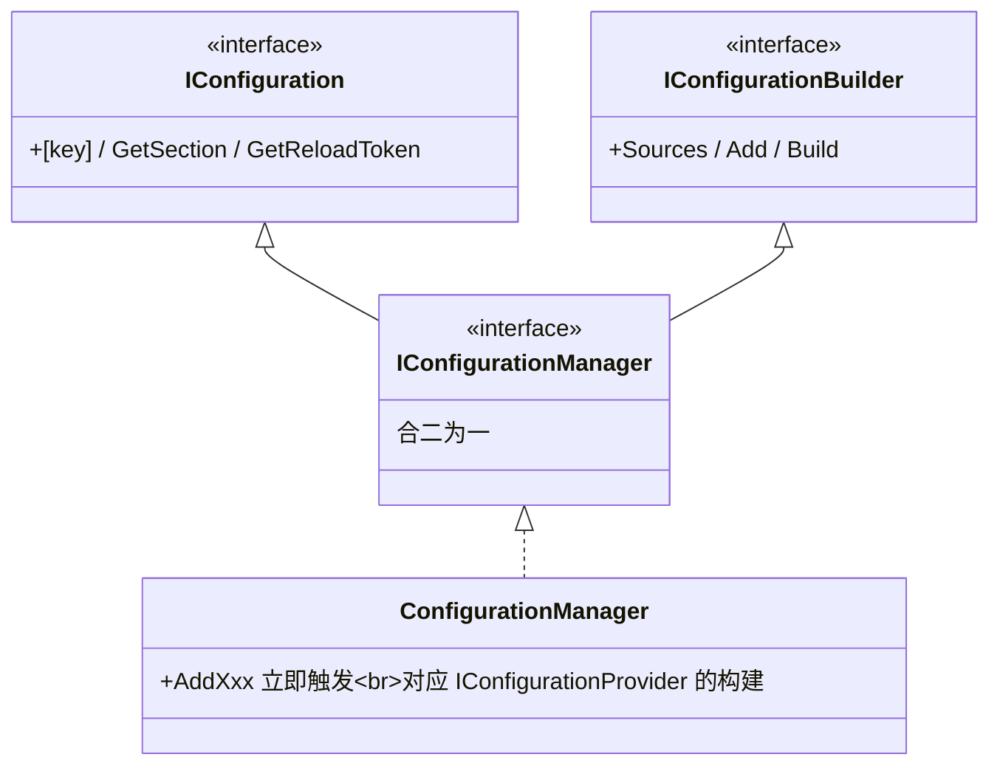

**核心创新**：传统 `ConfigurationBuilder.Build()` 显式调一次产生最终 `IConfigurationRoot`；`ConfigurationManager` **每次 `AddXxx` 都立即构建对应的 `IConfigurationProvider`**，访问 `[key]` 总是看到最新数据。

**带来的能力**：

```C#
var builder = WebApplication.CreateBuilder(args);

builder.Configuration.AddJsonFile("appsettings.json");
// ↑ 立刻生效

var connStr = builder.Configuration["ConnectionStrings:Default"];
// ↑ 可以立即读

builder.Services.AddDbContext<MyDb>(opt => opt.UseSqlServer(connStr));
// ↑ 接着用读出来的值注册服务
```

这种「**读写交错**」在传统 `IHostBuilder` 模型里需要复杂的 `ConfigureServices((ctx, services) => ...)` 闭包才能实现，现在变成线性的几行。

### 4.4 ConfigureContainer：第三方 IServiceProvider 工厂

```C#
// HostApplicationBuilder.ConfigureContainer（精简）
public void ConfigureContainer<TContainerBuilder>(
    IServiceProviderFactory<TContainerBuilder> factory,
    Action<TContainerBuilder>? configure = null) where TContainerBuilder : notnull
{
    _createServiceProvider = () =>
    {
        TContainerBuilder containerBuilder = factory.CreateBuilder(Services);
        _configureContainer(containerBuilder);                       // 适配器内部强转
        return factory.CreateServiceProvider(containerBuilder);
    };
    _configureContainer = b => configure?.Invoke((TContainerBuilder)b);   // 模拟适配器模式
}
```

**与 `IHostBuilder.UseServiceProviderFactory + ConfigureContainer` 的对比**：

- `IHostBuilder` 支持**多次** `ConfigureContainer`(累加委托)；
- `IHostApplicationBuilder.ConfigureContainer` **只支持一次**(每次调用都重置 `_createServiceProvider` 与 `_configureContainer`)；
- 但通过适配器模式仍然兼容 Autofac、Lamar 等第三方容器。

### 4.5 ServiceCollection.MakeReadOnly：构建后的安全保护

```C#
public IHost Build()
{
    if (_hostBuilt) throw new InvalidOperationException(SR.BuildCalled);
    _hostBuilt = true;

    _appServices = _createServiceProvider();
    _serviceCollection.MakeReadOnly();   // ← 关键
    return HostBuilder.ResolveHost(_appServices, diagnosticListener);
}
```

**为什么 Build 之后要把 `ServiceCollection` 标记为只读？**

- `Build()` 之后再 `Services.Add(...)` 不会被任何容器看到 —— 那是无意义的修改；
- 把 collection 标记为只读 → 后续任何修改尝试都立即抛 `InvalidOperationException`，**把无声 bug 变成显式异常**；
- 参考 `Notes/依赖注入.md` §2.2 `MakeReadOnly` 的设计意图。

> 详见原笔记 第 280–490 行 `HostApplicationBuilder`。

---

## 5. WebApplicationBuilder：Web 专属建造者

### 5.1 类图与组成

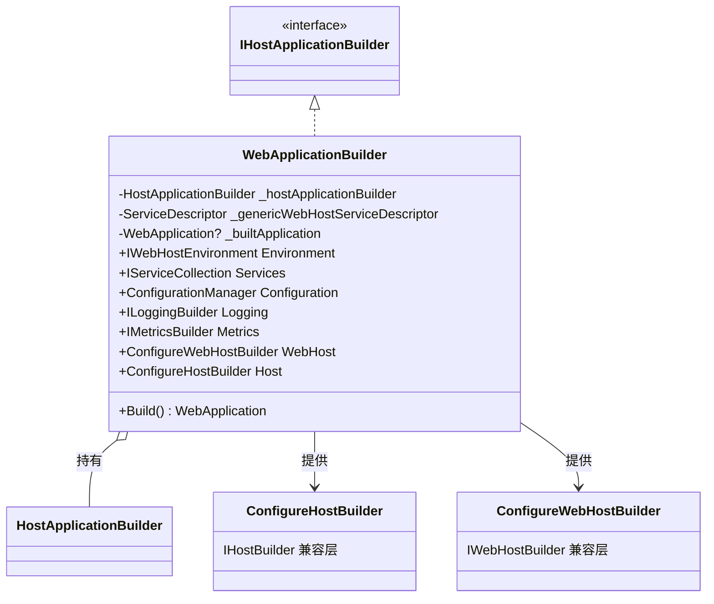

**职责切分**：

- **`WebApplicationBuilder`** 自己不处理通用宿主细节(那是 `HostApplicationBuilder` 的事)；
- 它在外层负责「**Web 专属的事**」：
  - 优先加载 `ASPNETCORE_` 前缀的环境变量；
  - 调 `BootstrapHostBuilder.ConfigureWebHostDefaults` 收集 Web 默认配置；
  - 抽出 `GenericWebHostService` 注册描述符；
  - 创建 `ConfigureHostBuilder` / `ConfigureWebHostBuilder` 兼容层；
  - 在 `Build()` 时把抽出的 `GenericWebHostService` 注册回来。

### 5.2 构造流程

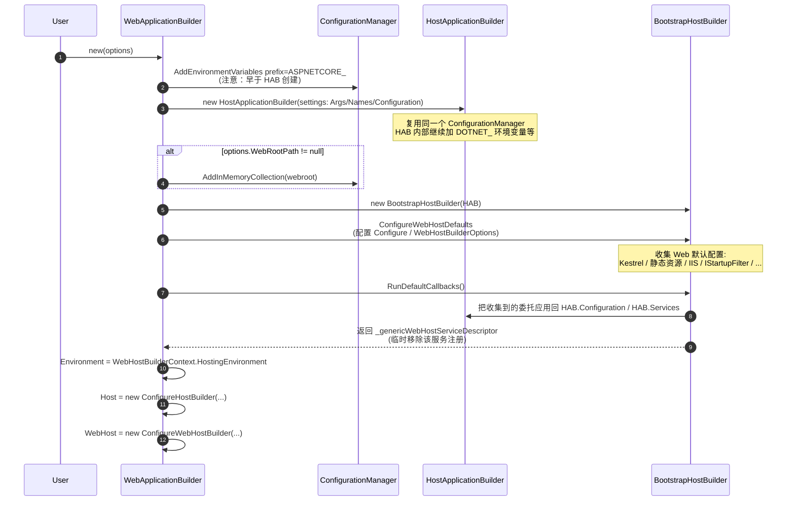

**关键设计点**：

- **`ASPNETCORE_` 前缀环境变量在 `DOTNET_` 之前注册** —— 优先级更高；
- **`GenericWebHostService` 描述符被临时移除**：因为 `BootstrapHostBuilder.ConfigureWebHostDefaults` 注册了它，但用户 `Build()` 之前可能还想修改服务，临时移除避免被冻结；`Build()` 时重新添加。

### 5.3 ConfigureApplication：自动中间件注入

`WebApplicationBuilder` 在构造时把自己的 `ConfigureApplication` 方法**注入到 `IWebHostBuilder.Configure(...)`** —— 这是 `GenericWebHostService.StartAsync` 构建管道时的中间件配置入口(参考 `Notes/管道中间件.md` §8.4)。

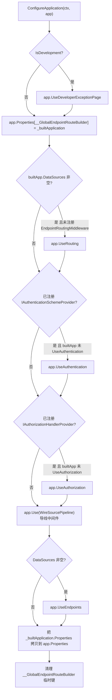

**「按需自动注入」的判断逻辑**：

| 中间件 | 自动注入条件 |
|--------|------------|
| `UseDeveloperExceptionPage` | 开发环境 |
| `UseRouting` | 注册过 `EndpointDataSource` 且用户没手动 `UseRouting` |
| `UseAuthentication` | 注册过 `IAuthenticationSchemeProvider` 且用户没手动 `UseAuthentication` |
| `UseAuthorization` | 注册过 `IAuthorizationHandlerProvider` 且用户没手动 `UseAuthorization` |
| `UseEndpoints` | 注册过 `EndpointDataSource` |

**用 `IServiceProviderIsService` 探测服务注册**：

```C#
var sps = _builtApplication.Services.GetService<IServiceProviderIsService>();
if (sps?.IsService(typeof(IAuthenticationSchemeProvider)) is true)
{
    // 自动注入 UseAuthentication
}
```

`IServiceProviderIsService` 是默认 DI 容器(`CallSiteFactory`)实现的接口，用来查询「**某个类型是否已经注册过服务**」 —— 让框架可以**按需启用**中间件。

### 5.4 WireSourcePipeline 导线：连接两条管道

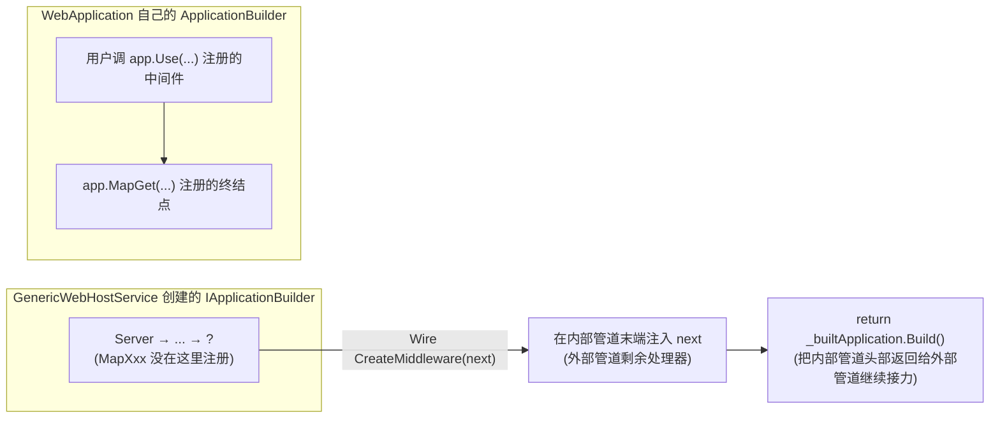

**核心问题**：用户用 `app.Use(...)` / `app.MapGet(...)` 操作的是 **`WebApplication` 自己的 `ApplicationBuilder`**(内部管道)。但实际处理请求的是 **`GenericWebHostService` 通过 `IApplicationBuilderFactory.CreateBuilder` 创建的另一个 `IApplicationBuilder`**(外部管道)。两条独立管道必须**连起来**才能让用户注册的内容生效。

**`WireSourcePipeline.CreateMiddleware` 的实现**：

```C#
public RequestDelegate CreateMiddleware(RequestDelegate next)
{
    _builtApplication.Run(next);             // 把外部管道的 next 作为内部管道的末端处理器
    return _builtApplication.Build();        // 返回内部管道的头部
}
```

**关键巧思**：

- **`_builtApplication.Run(next)`** —— 把外部的 `next` 作为「**短路末端**」(参考 `Notes/管道中间件.md` §6.1 `Run` 的实现)；
- **`_builtApplication.Build()`** —— 触发内部管道的构建，把所有用户 `Use` / `Map` 注册的中间件串成一个 `RequestDelegate`；
- 返回的 `RequestDelegate` 就是「内部管道头部」，外部管道把它作为自己的某一个中间件来调用。

**两条管道的接力点**：

```
外部管道：A → B → [Wire 中间件] → ...
                       ↓ next 闭包
                       ↓
                  内部管道：U1 → U2 → ... → MapGet 终结点 → next (= 外部的剩余)
```

### 5.5 与 HostApplicationBuilder 的委托关系

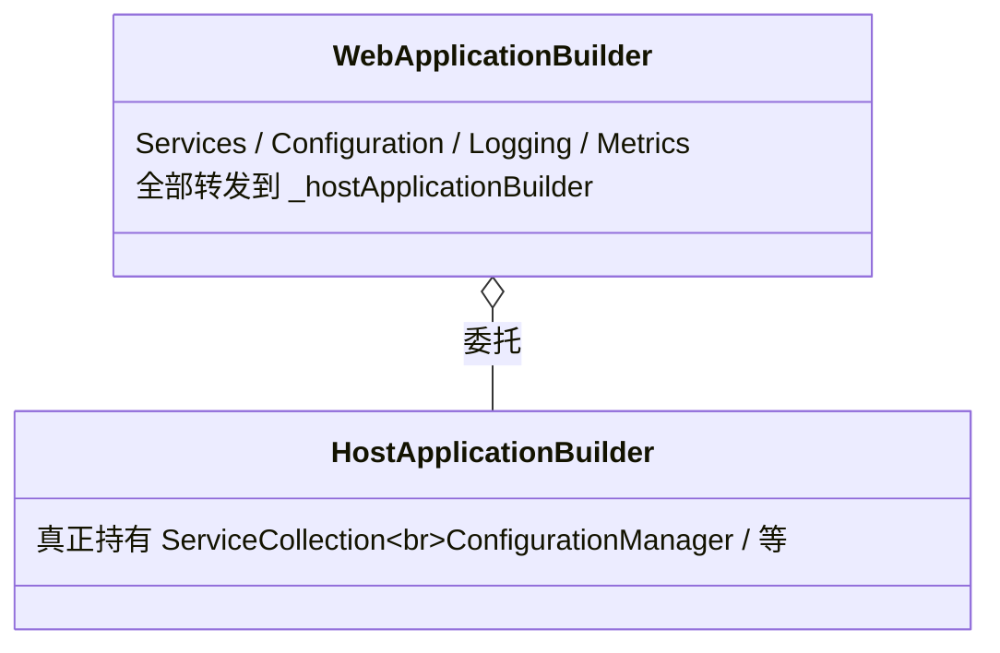

`WebApplicationBuilder` 几乎所有属性都是**代理**：

```C#
public IServiceCollection Services => _hostApplicationBuilder.Services;
public ConfigurationManager Configuration => _hostApplicationBuilder.Configuration;
public ILoggingBuilder Logging => _hostApplicationBuilder.Logging;
public IMetricsBuilder Metrics => _hostApplicationBuilder.Metrics;
```

只有 `Environment`(替换为 `IWebHostEnvironment`)、`WebHost` / `Host`(兼容层)是它自己的属性。这种「**包装而非继承**」让 Web 专属逻辑和通用宿主逻辑彻底解耦。

> 详见原笔记 第 498–753 行 `WebApplicationBuilder`。

---

## 6. BootstrapHostBuilder：引导阶段的 IHostBuilder 模拟器

### 6.1 为什么需要它

`WebApplicationBuilder` 想复用 `IHostBuilder.ConfigureWebHostDefaults` 这一**已存在的扩展方法**(`Notes/管道中间件.md` §2.1) —— 这个扩展方法只接受 `IHostBuilder`。

但 `WebApplicationBuilder` 内部的 `HostApplicationBuilder` 不是 `IHostBuilder`！没法直接调用。

**解决方案**：用 `BootstrapHostBuilder` 假装实现 `IHostBuilder`，让 `ConfigureWebHostDefaults` 写入数据到它，再把这些数据「**搬运**」回 `HostApplicationBuilder`。

### 6.2 三种收集职责

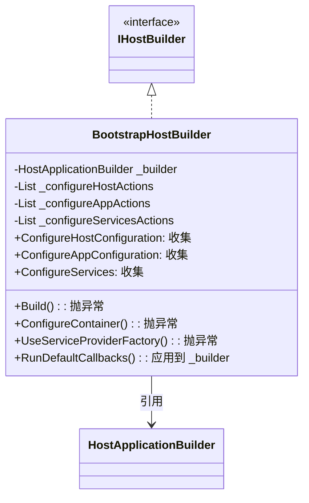

**`BootstrapHostBuilder` 只支持三件事**：

- `ConfigureHostConfiguration`(收集委托)；
- `ConfigureAppConfiguration`(收集委托)；
- `ConfigureServices`(收集委托)。

**其他方法都抛异常**：

- `Build()` —— 不该被调；
- `ConfigureContainer<TBuilder>` —— 容器配置应通过 `HostApplicationBuilder.ConfigureContainer` 走；
- `UseServiceProviderFactory<TBuilder>` —— 同上。

这种「**只支持必需子集**」的伪建造者，是处理「**继承遗留 API**」的优雅技巧。

### 6.3 RunDefaultCallbacks：把收集到的委托应用回去

```C#
// 精简版
public ServiceDescriptor RunDefaultCallbacks()
{
    foreach (var configureHostAction in _configureHostActions)
        configureHostAction(_builder.Configuration);              // 应用到 HAB.Configuration

    foreach (var configureAppAction in _configureAppActions)
        configureAppAction(Context, _builder.Configuration);      // 应用到 HAB.Configuration

    foreach (var configureServicesAction in _configureServicesActions)
        configureServicesAction(Context, _builder.Services);      // 应用到 HAB.Services

    // 找到并临时移除 GenericWebHostService 的注册
    for (int i = _builder.Services.Count - 1; i >= 0; i--)
    {
        var d = _builder.Services[i];
        if (d.ServiceType == typeof(IHostedService) && d.ImplementationType?.Name == "GenericWebHostService")
        {
            _builder.Services.RemoveAt(i);
            return d;
        }
    }
    throw new InvalidOperationException("...");
}
```

**关键观察**：

- 这个方法**做了三层应用** —— 把三种收集委托分别应用到 `HostApplicationBuilder` 上；
- **抽取并返回 `GenericWebHostService` 描述符** —— 因为它会在 `WebApplicationBuilder.Build()` 时被重新添加(详见 §5.1)；
- **临时移除原因**：用户在 `Build()` 之前还能继续修改 `Services`(如 `services.AddXxx()`)，避免 `GenericWebHostService` 过早被「冻结」。

### 6.4 与 HostBuilderContext 的关系

`BootstrapHostBuilder` 构造时从 `HostApplicationBuilder.Services` 中**搜出 `HostBuilderContext` 实例**：

```C#
foreach (var descriptor in _builder.Services)
{
    if (descriptor.ServiceType == typeof(HostBuilderContext))
    {
        Context = (HostBuilderContext)descriptor.ImplementationInstance!;
        break;
    }
}
```

**为什么这么麻烦？** 因为 `BootstrapHostBuilder` 是「**外挂在 `HostApplicationBuilder` 上的**」 —— 自己不创建 `HostBuilderContext`，必须从已经初始化的 `HostApplicationBuilder` 中借用。

> 详见原笔记 第 765–883 行 `BootstrapHostBuilder`。

---

## 7. ConfigureHostBuilder / ConfigureWebHostBuilder：历史 API 兼容层

### 7.1 两个 Configure 建造者的角色

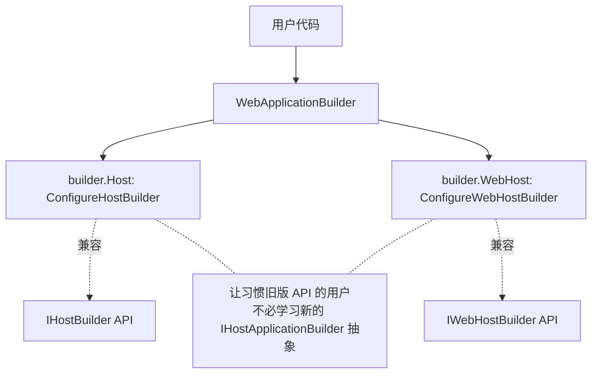

**典型迁移场景**：

```C#
var builder = WebApplication.CreateBuilder(args);

// 习惯 IHostBuilder 的用户
builder.Host.UseSerilog(...);
builder.Host.UseServiceProviderFactory(new AutofacServiceProviderFactory());

// 习惯 IWebHostBuilder 的用户
builder.WebHost.UseKestrel(opt => opt.ListenAnyIP(5000));
builder.WebHost.ConfigureKestrel(opt => ...);
```

### 7.2 「即时模式」对配置收集的影响

`ConfigureHostBuilder.ConfigureAppConfiguration` 与 `IHostBuilder` 同名方法的差异：

| 维度 | `IHostBuilder.ConfigureAppConfiguration` | `ConfigureHostBuilder.ConfigureAppConfiguration` |
|------|-------------------------------------------|-------------------------------------------------|
| 执行时机 | 收集到列表，`Build()` 时统一执行 | **立即执行** —— 直接对 `ConfigurationManager` 操作 |
| 多次调用 | 委托累加，按顺序应用 | 委托立刻执行，效果立即可见 |
| 副作用 | 全部延迟 | 直接修改 `WebApplicationBuilder.Configuration` |

```C#
// ConfigureHostBuilder.ConfigureAppConfiguration（精简）
public IHostBuilder ConfigureAppConfiguration(Action<HostBuilderContext, IConfigurationBuilder> configureDelegate)
{
    configureDelegate(_context, _configuration);     // ← 立即执行
    return this;
}
```

### 7.3 不可变属性的保护

`WebApplicationBuilder` **严格禁止**通过 `Host` / `WebHost` 修改以下值：

| 受保护的字段 | 原因 |
|------------|------|
| `applicationName` | `WebApplicationBuilder` 构造时已经定型，且影响 DI 注册中的实例 |
| `contentRoot` | 同上，且影响 `IFileProvider` |
| `environment` | 同上，且 `IsDevelopment` 等判断已基于此 |
| `webroot` (仅 `ConfigureWebHostBuilder`) | 同上 |
| `hostingStartupAssemblies` / `hostingStartupExcludeAssemblies` | `BootstrapHostBuilder` 阶段已经决定 |

**保护实现**：每次 `ConfigureHostConfiguration` / `UseSetting` 都**前后对比**这些键的值，发现改动就抛清晰的 `NotSupportedException`：

```C#
if (!string.Equals(previousApplicationName, _configuration[HostDefaults.ApplicationKey], OrdinalIgnoreCase))
{
    throw new NotSupportedException(
        $"The application name changed from \"{previousApplicationName}\" to ... " +
        "Use WebApplication.CreateBuilder(WebApplicationOptions) instead.");
}
```

**异常信息直接告诉用户「**该用 `WebApplicationOptions` 在创建 Builder 时设置**」** —— 这是优秀错误提示的范例。

### 7.4 不再支持的方法清单

| 接口 | 不支持的方法 | 替代方式 |
|------|-------------|---------|
| `ConfigureHostBuilder.IHostBuilder.Build` | 抛 `NotSupportedException` | 用 `WebApplicationBuilder.Build()` |
| `ConfigureHostBuilder.ISupportsConfigureWebHost.ConfigureWebHost` | 抛异常 | 用 `builder.WebHost.*` 或在 `Program.cs` 顶层操作 |
| `ConfigureWebHostBuilder.IWebHostBuilder.Build` | 抛异常 | 同上 |
| `ConfigureWebHostBuilder.ISupportsStartup.*`(Configure / UseStartup) | 全部抛异常 | Minimal API **完全废弃 `Startup` 类** —— 直接用 `app.Use(...)` |

> 详见原笔记 第 890–1039 行 `ConfigureHostBuilder` 与 第 1046–1213 行 `ConfigureWebHostBuilder`。

---

## 8. 设计思想速览

### 8.1 一身三角与显式接口实现

`WebApplication` 实现 `IHost` + `IApplicationBuilder` + `IEndpointRouteBuilder` 是「**门面模式**」的极致 —— 用一个对象代替三个建造者。

代价是「**接口成员冲突**」：

- `IApplicationBuilder` 有 `ApplicationServices` 属性；
- `IEndpointRouteBuilder` 有 `ServiceProvider` 属性；
- `IHost` 有 `Services` 属性。

**用显式接口实现把这些「内部成员」隐藏起来，只暴露 `WebApplication.Services` 一个公开属性** —— 用户看到的是简洁 API，框架内部仍然能按接口契约工作。

### 8.2 即时配置 vs 延迟配置

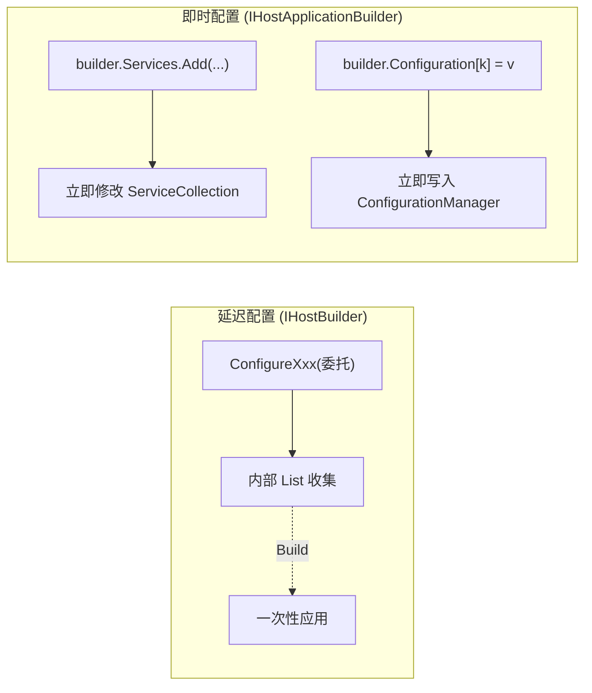

**两种模式各有优劣**：

| 模式 | 优势 | 劣势 |
|------|------|------|
| 延迟 | 配置顺序灵活；多个委托可累加 | 用户需要理解「**收集→应用**」两阶段；调试困难 |
| 即时 | 直观易学；可在配置过程中读已写入的值 | 顺序敏感(后写的可能覆盖先写的)；ConfigurationManager 复杂度更高 |

Minimal API 选择即时模式 —— 这是**面向新手友好**的选择。老用户仍可通过 `builder.Host` / `builder.WebHost` 使用延迟 API。

### 8.3 引导阶段的伪建造者模式

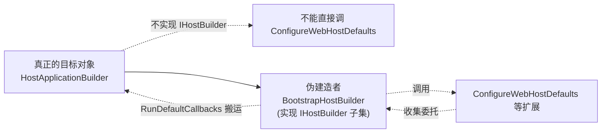

**这一模式可推广**：当 A 类型无法实现接口 I，但又想复用「依赖 I 的扩展方法」时，可以：

1. 创建只实现 I 必要子集的伪建造者 B；
2. B 内部持有 A 的引用；
3. 通过 B 调用扩展方法，把扩展方法操作记录下来；
4. 最后把记录的操作「**搬运**」到 A 上。

这是「**让旧 API 在新世界继续工作**」的通用思路。

### 8.4 自动中间件注入的「按需触发」策略

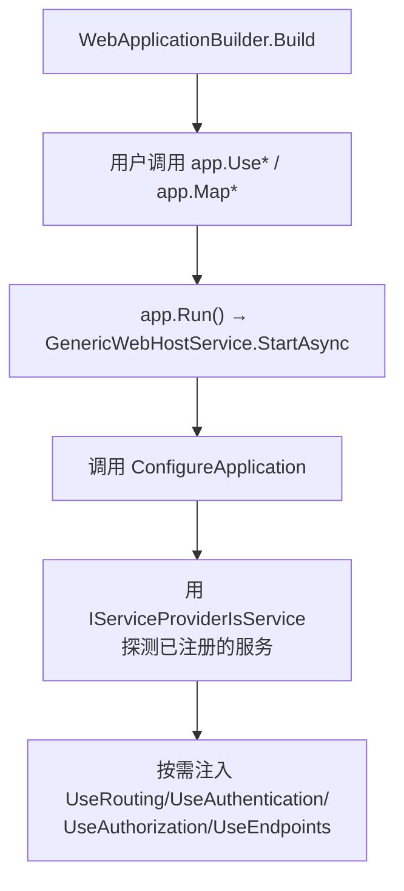

**核心 idea**：用户**只调用 `services.AddAuthentication()`** 就够了，不需要再手动 `app.UseAuthentication()` —— 框架检测到「**已经注册了 `IAuthenticationSchemeProvider`**」就自动注入中间件。

**优点**：

- 新手不容易漏中间件注册；
- 中间件顺序由框架决定，符合官方推荐；
- 用户**仍可手动注入**(`app.UseAuthentication()`) → 自动检测发现「**用户已经调过**」就不再重复注入。

**实现关键**：用 `Properties[key] = true` 这样的标记位让「**用户调用**」与「**自动注入**」之间能通信(`AuthenticationMiddlewareSetKey` / `AuthorizationMiddlewareSetKey` / `UseRoutingKey`)。

### 8.5 导线模式连接独立管道

`WireSourcePipeline` 是「**把内部对象当成一个中间件嵌入外部管道**」的优雅设计。

**通用价值**：当你有一个**已构建的处理链 A** 和**外部管道 B**，想让 B 的某一步「**整段调用 A**」时，把 A 的入口包装成符合 B 中间件签名(`Func<RequestDelegate, RequestDelegate>`)的函数 —— 这就是「**导线**」。

类似的模式在子应用、插件框架、Microservice Sidecar 等场景都有应用价值。

---

## 9. 速查卡 & 陷阱清单

### 9.1 三种建造者对照

| 维度 | `HostApplicationBuilder` | `WebApplicationBuilder` | `BootstrapHostBuilder` |
|------|-------------------------|------------------------|----------------------|
| 角色 | 通用宿主建造者 | Web 宿主建造者 | 引导阶段伪 IHostBuilder |
| 可见性 | 公开 | 公开 | internal |
| 实现接口 | `IHostApplicationBuilder` | `IHostApplicationBuilder` | `IHostBuilder` |
| 模式 | 即时 | 即时(委托给 HAB) | 收集 |
| 创建方式 | `new HostApplicationBuilder(...)` | `WebApplication.CreateBuilder(args)` | `WebApplicationBuilder` 内部创建 |
| Build 产出 | `IHost` | `WebApplication` | 不支持 Build，调用抛异常 |

### 9.2 自动中间件触发条件

| 中间件 | 触发条件 |
|--------|---------|
| `UseDeveloperExceptionPage` | `IsDevelopment()` |
| `UseRouting` | `app.DataSources` 非空 且 `app.Properties[__EndpointRouteBuilder]` 未设置 |
| `UseAuthentication` | DI 注册过 `IAuthenticationSchemeProvider` 且 `app.Properties[__AuthenticationMiddlewareSet]` 未设置 |
| `UseAuthorization` | DI 注册过 `IAuthorizationHandlerProvider` 且 `app.Properties[__AuthorizationMiddlewareSet]` 未设置 |
| `UseEndpoints` | `app.DataSources` 非空 |

**「未设置」的判断方式**：用户调 `app.UseAuthentication()` 时该方法会在 `app.Properties` 写入对应 Key —— 框架据此知道「**用户已经手动调过了**」就不再重复注入。

### 9.3 WebApplication 的 IApplicationBuilder 成员访问规则

| 成员 | 直接调用 | 必须显式 cast |
|------|---------|--------------|
| `app.Use(middleware)` | ✓ | — |
| `app.Properties` | ✗(internal) | `((IApplicationBuilder)app).Properties` |
| `app.Build()` | ✗ | `((IApplicationBuilder)app).Build()` |
| `app.New()` | ✗ | `((IApplicationBuilder)app).New()` |
| `app.ApplicationServices` | ✗(用 `app.Services`) | — |
| `app.ServerFeatures` | ✗(internal) | — |

### 9.4 10 大常见陷阱

1. **试图通过 `builder.Host.ConfigureHostConfiguration` 修改环境/工作目录**：会抛 `NotSupportedException`。**对策**：用 `WebApplication.CreateBuilder(new WebApplicationOptions { EnvironmentName = ... })`。
2. **在 `WebApplicationBuilder.Build()` 之后调 `builder.Services.AddXxx()`**：会抛异常(`ServiceCollection` 已 `MakeReadOnly`)。**对策**：所有 `AddXxx` 必须在 `Build()` 之前。
3. **同时手动 `app.UseAuthentication()` 又依赖自动注入**：实际上自动注入会检测到 `Properties` 标记，不会重复注入 —— **但顺序可能与预期不符**(手动调的位置决定了中间件在管道中的位置)。
4. **以为 `app.Run(url)` 支持多 URL**：源码是先 `Clear` 再 `Add` —— 只能设一个。**对策**：用 `app.Urls.Add(...)` 添加多个。
5. **在分支管道(`app.Map(...)`)里调 `MapGet`**：分支的 `Properties` 缺少 `__GlobalEndpointRouteBuilder` —— `MapGet` 找不到全局路由构建器。**对策**：在分支里用 `UseRouting + UseEndpoints` 注册。
6. **混用 `Startup` 类**：Minimal API 完全废弃 `Startup`，`ConfigureWebHostBuilder.UseStartup` 抛异常。**对策**：把 `Startup.ConfigureServices` 内容移到 `builder.Services.*`、`Startup.Configure` 内容移到 `app.Use*`。
7. **以为 `app.Configuration` 与 `builder.Configuration` 是不同实例**：实际上是**同一 `ConfigurationManager`**(通过 `_host.Services.GetRequiredService<IConfiguration>()`)。
8. **跨 `Build()` 重用 builder 实例**：`HostApplicationBuilder` 用 `_hostBuilt` 防止重复 `Build()`。**对策**：每个应用一个 builder。
9. **`Map("/path", branch => ...)` 内 `branch` 是新的 `IApplicationBuilder`**：与外层 `app` 是两个对象。**对策**：分支里的中间件只对该路径生效，全局中间件要放在 `Map` 之前。
10. **以为 `WebApplication` 是 `WebHostBuilder` 时代的 `IWebHost`**：完全不同 —— 新版 Web 宿主借助 `IHostedService` 接入通用宿主(参考 `Notes/管道中间件.md` §2.2)，`WebApplication` 是「**`IHost` 的便利门面**」而非 Web 专属宿主。

### 9.5 原笔记类型 → 本笔记小节 映射表

| 原笔记类型 | 本笔记小节 |
|-----------|-----------|
| `WebApplication` | §1.2 / §2 |
| `WebApplicationOptions` | §3.1 / §3.2 |
| `HostApplicationBuilderSettings` | §3.1 |
| `IHostApplicationBuilder` | §4.1 |
| `HostApplicationBuilder` | §4.2 / §4.3 / §4.4 / §4.5 |
| `WebApplicationBuilder` | §5.1 / §5.2 / §5.3 / §5.5 |
| `BootstrapHostBuilder` | §6 |
| `ConfigureHostBuilder` | §7.1 / §7.2 / §7.3 / §7.4 |
| `ConfigureWebHostBuilder` | §7.1 / §7.3 / §7.4 |
