# 依赖注入

## 0. 阅读指南

### 0.1 本笔记的定位

本笔记与仓库根目录 `依赖注入.md`（源码解读笔记）配套使用，两者分工如下：

| 文件 | 视角 | 主体内容 |
|------|------|---------|
| `依赖注入.md`（源码笔记） | **源码视角** | 逐类型贴源码 + 在源码中注释解读 |
| `Notes/依赖注入.md`（本笔记） | **学习视角** | UML 图、设计原理、关键算法讲解、示例、陷阱清单；代码仅保留「不看代码无法说清」的精简片段 |

本笔记假设你已粗读过一遍源码笔记。当本笔记说「**详见原笔记 §X 行 N–M**」时，请回到源码笔记对应位置查阅完整源码。

### 0.2 推荐阅读顺序

- **首次学习**：§1 → §2 → §3 → §4 → §5 → §6 → §7 → §8 → §9 → §10 → §11 → §12。
- **复习速查**：直接看 §1、§11、§12 三节。
- **某个具体问题**：用 §12.5 的「**原笔记类型 → 本笔记小节**映射表」反查。

### 0.3 Mermaid 图渲染

本笔记大量使用 Mermaid 图：

- VS Code：装 `Markdown Preview Mermaid Support` 插件即可在预览中查看；
- GitHub / Gitea：原生支持，直接在网页中渲染；
- Obsidian：原生支持；
- 若你的渲染环境不支持，可把 Mermaid 代码贴到 <https://mermaid.live> 在线查看。

---

## 1. 全景：DI 的三大角色与一次 GetService

### 1.1 三大角色

DI 子系统的全部公共 API 可以归纳为三个角色：

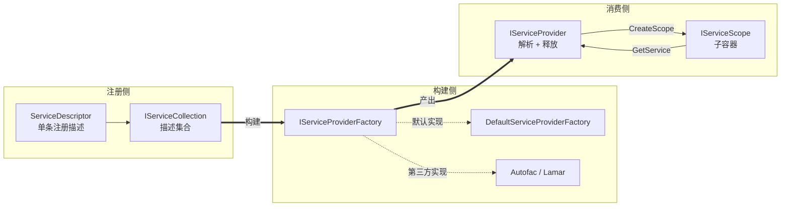

**关键认知**：

- **注册侧**只负责「描述要注册什么」，没有任何解析/构造逻辑；
- **构建侧**是扩展点 —— 把同样的 `IServiceCollection` 编译成不同容器实现的入口；
- **消费侧**才包含真正的服务解析、生命周期管理与资源释放。

### 1.2 一次 GetService 的全景时序

下面这张图把「容器构建后第一次解析某个服务」的完整链路画出来，覆盖了后续 §4–§7 的所有核心组件。**理解了这张图，再回过头看具体源码就有了主线**：

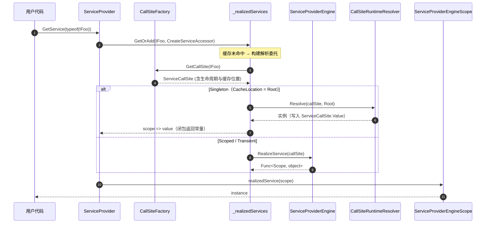

### 1.3 三种生命周期 vs 三种缓存位置

| ServiceLifetime | CacheLocation | 实例物理位置 | 是否跨 scope 共享 | IDisposable 跟踪位置 |
|-----------------|---------------|--------------|-------------------|---------------------|
| `Singleton` | `Root` | **`ServiceCallSite.Value`**（不是字典） | 是 | 根 scope 的 `_disposables` |
| `Scoped` | `Scope` | 当前 scope 的 `ResolvedServices` 字典 | 否 | 当前 scope 的 `_disposables` |
| `Transient` | `Dispose` | **不缓存** | 否 | 当前 scope 的 `_disposables`（仅 IDisposable 时） |
| 常量值 / `IServiceProvider` 自身 | `None` | CallSite 自身或运行时返回 | — | 不跟踪 |

> 第 6 章会详细说明「为什么 Singleton 实例不存在字典里而是挂在 `ServiceCallSite.Value` 上」—— 这是整套框架最容易被误解的设计点。

---

## 2. 服务注册

### 2.1 ServiceDescriptor 的四种描述方式

注册的最小单元是 `ServiceDescriptor`。它支持四种描述方式，由三个互斥字段（`ImplementationType` / `ImplementationFactory` / `ImplementationInstance`）的组合决定：

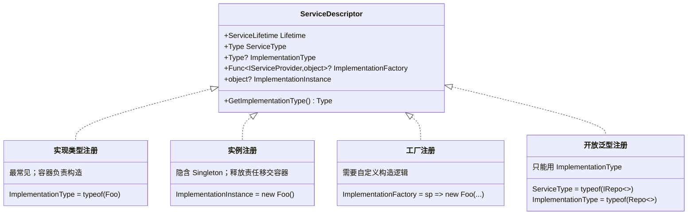

> 详见原笔记 §服务注册 第 36–108 行（`ServiceDescriptor`）。

**为什么开放泛型只能用 `ImplementationType`？**

- `ImplementationInstance` 已经定型，承载不了未填入实参的泛型；
- `ImplementationFactory` 签名是 `Func<IServiceProvider, object>`，无法把泛型实参传给工厂；
- 只有 `ImplementationType` 能在解析时通过 `MakeGenericType(serviceType.GenericTypeArguments)` 动态构造。

### 2.2 多次注册的语义：「最后覆盖 + IEnumerable 倒序」

同一服务类型可以多次注册。框架对此有两条互补的规则，由 `ServiceDescriptorCacheItem` 内部的「**槽位（slot）**」机制实现：

```mermaid
flowchart LR
    subgraph 注册顺序
        A1[Add IFoo, FooA]
        A2[Add IFoo, FooB]
        A3[Add IFoo, FooC]
        A1 --> A2 --> A3
    end

    subgraph 槽位编号（倒序）
        S2["FooA: slot=2"]
        S1["FooB: slot=1"]
        S0["FooC: slot=0  ← 默认槽位"]
    end

    A1 -.-> S2
    A2 -.-> S1
    A3 -.-> S0

    subgraph 消费侧
        G1["GetService&lt;IFoo&gt;()<br/>→ FooC（slot=0）"]
        G2["GetServices&lt;IFoo&gt;()<br/>→ [FooA, FooB, FooC]<br/>注册顺序"]
    end

    S0 ==> G1
    S2 & S1 & S0 ==> G2
```

**记忆口诀**：

- **`GetService<T>` 取默认槽位（slot = 0），命中最后注册的 → 后注册者覆盖；**
- **`GetServices<T>` 按注册顺序返回所有 → 早注册者在前。**

倒序编号的好处：默认查找永远查 slot=0，不需要在运行时计算「最后一个是谁」。

> 详见原笔记 §CallSiteFactory 第 1380–1479 行（`ServiceDescriptorCacheItem`）。

### 2.3 五种注册扩展方法语义矩阵

| 扩展方法 | 同 ServiceType 已存在 | 同 (ServiceType, ImplType) 已存在 | 典型用途 |
|---------|----------------------|----------------------------------|---------|
| `Add` / `AddSingleton`/`AddScoped`/`AddTransient` | 追加 | 追加 | 普通注册 |
| `TryAdd` / `TryAddSingleton`… | **跳过** | 跳过 | 提供「默认」实现，允许调用方覆盖 |
| `TryAddEnumerable` | 追加 | **跳过** | 多实现场景的去重添加（如多个 `IConfigureOptions<T>`） |
| `Replace` | **删第一个 + 末尾追加** | 同 | 显式替换默认实现 |
| `RemoveAll` | **删除所有** | 删除所有 | 清空某服务类型的所有注册 |

> 详见原笔记 §服务注册 第 227–322 行（`ServiceCollectionDescriptorExtensions`）、第 324–359 行（`ServiceCollectionServiceExtensions`）。

### 2.4 协变委托技巧：TryAddEnumerable 的实现类型反推

这是源码里最隐晦的一处设计，必须看代码才能讲清。`GetImplementationType` 在「工厂注册」分支中需要拿到工厂的真实返回类型，依赖了**泛型委托协变**（`Func<TIn, out TResult>`）：

```C#
// ServiceDescriptor.GetImplementationType 工厂分支（精简）
Type[]? typeArguments = ImplementationFactory.GetType().GenericTypeArguments;
Debug.Assert(typeArguments.Length == 2);
return typeArguments[1];   // 返回值类型（即真实实现类型）
```

为何要费这番周折？因为 `TryAddEnumerable` 必须按 `(ServiceType, ImplementationType)` 去重：

```C#
// 反例：编译器生成 Func<IServiceProvider, IFoo>，实现类型 == 服务类型
services.TryAddEnumerable(ServiceDescriptor.Singleton<IFoo>(_ => new FooA()));
// → 抛 ArgumentException（无法识别实现类型，去重会失效）

// 正例：显式声明返回类型 Func<IServiceProvider, FooA>，再借协变赋给 Func<..., IFoo>
Func<IServiceProvider, FooA> factory = _ => new FooA();
services.TryAddEnumerable(ServiceDescriptor.Singleton<IFoo>(factory));
// → 实现类型为 FooA，能正确去重
```

> 详见原笔记 §服务注册 第 59–83 行（`GetImplementationType`）、第 253–285 行（`TryAddEnumerable`）。

### 2.5 常见陷阱清单

1. **lambda 注册重载混淆**：`AddSingleton<IFoo>(new Foo())`（实例）与 `AddSingleton<IFoo>(_ => new Foo())`（工厂）走不同重载，释放责任与初始化时机均不同。
2. **同一服务反复 `AddSingleton` 不会替换**：要替换请用 `Replace`；要避免重复请用 `TryAdd`。
3. **`TryAddEnumerable` + 隐式 lambda** = 异常。务必显式声明工厂返回类型。
4. **开放泛型只能用 `ImplementationType` 注册**（见 §2.1）。

---

## 3. 容器构建

### 3.1 BuildServiceProvider 的 6 步初始化

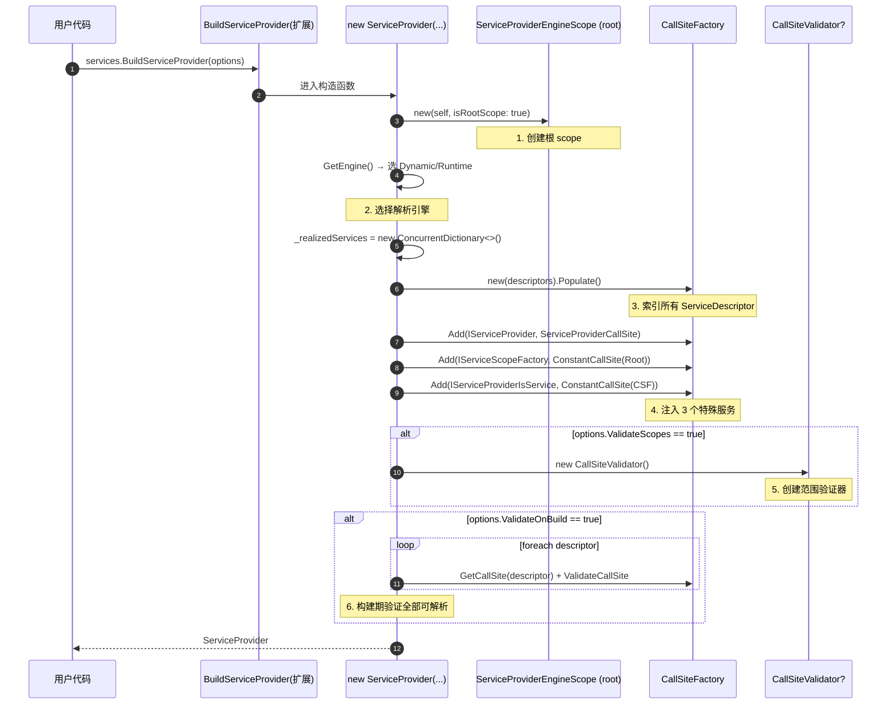

> 详见原笔记 §服务消费 第 459–512 行（`ServiceProvider` 构造函数）。

### 3.2 两种验证选项的适用矩阵

| 选项 | 检查时机 | 能发现的问题 | 不能发现的问题 |
|------|---------|-------------|---------------|
| `ValidateScopes` | 每次 `GetService` | 根容器解析 Scoped；Singleton 依赖 Scoped（captive dependency） | 构造函数无法解析参数；循环依赖（这两类直接抛异常，不需要它检测） |
| `ValidateOnBuild` | `BuildServiceProvider` 时一次性 | 构造函数缺参数；歧义构造函数；循环依赖；抽象/接口实现类型 | 开放泛型注册（无具体实参无法构造 CallSite）；`Func<>` 返回值是否真的实现服务类型（`FactoryCallSite` 不做继承校验） |

**建议**：

- 开发环境：两者全开（ASP.NET Core 默认 Development 下已开启 `ValidateScopes`）；
- 生产环境：`ValidateOnBuild` 启动慢，按需取舍。

### 3.3 IServiceProviderFactory 扩展点：默认 vs 第三方

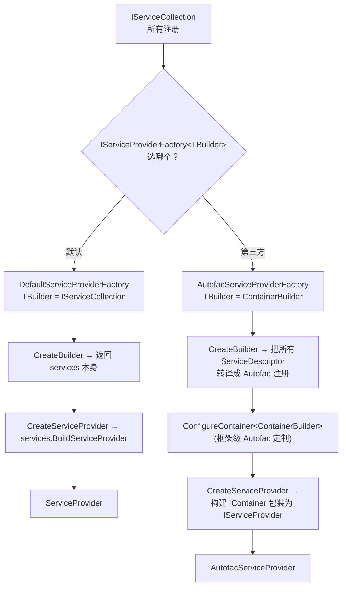

**关键认知**：第三方容器接入的入口不是「替换 `ServiceProvider`」，而是「在构建阶段接管 `CreateBuilder` / `CreateServiceProvider`」。这样既复用了 ASP.NET Core 全部既有注册（如 `AddControllers`、`AddLogging`），又能让第三方容器叠加自家特性（Autofac 的模块、装饰器、属性注入等）。

> 详见原笔记 §服务消费 第 2034–2080 行（`IServiceProviderFactory<>` / `DefaultServiceProviderFactory`）。

---

## 4. ServiceProvider 与 Scope 的关系

### 4.1 「平铺式」服务范围 —— 一个反直觉的设计

**直觉中的 scope 嵌套是一棵树**：

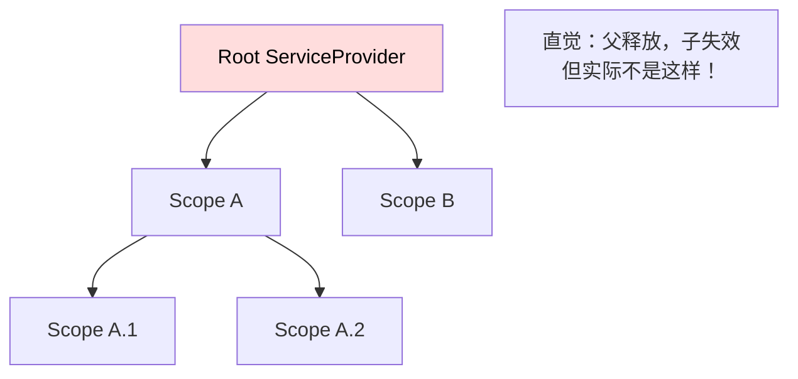

**实际实现 —— 平铺式（每个 scope 都直接引用根容器）**：

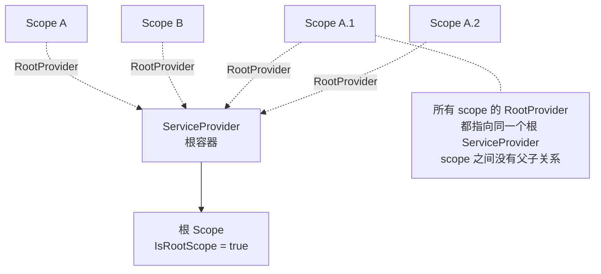

**为什么这么设计？**

| 平铺式的好处 | 树状的代价（被避免） |
|------|------|
| 子 scope 不会因父 scope 释放而失效 | 树状下要追踪父子关系、级联释放 |
| 解析路径统一：`GetService` 一律走 `RootProvider.GetService(t, currentScope)` | 树状下要逐级查找 Singleton 缓存 |
| Singleton 实例只需在根容器存一份 | 树状下要决定 Singleton 存哪一级 |

**代价**：scope 嵌套实际上**没有「层级」语义** —— 子 scope 创建出的孙 scope，与父 scope 创建出的兄弟 scope 行为完全一致。

> 详见原笔记 §服务范围 第 704–822 行（`ServiceProviderEngineScope`）。

### 4.2 ServiceProviderEngineScope 的一身三角

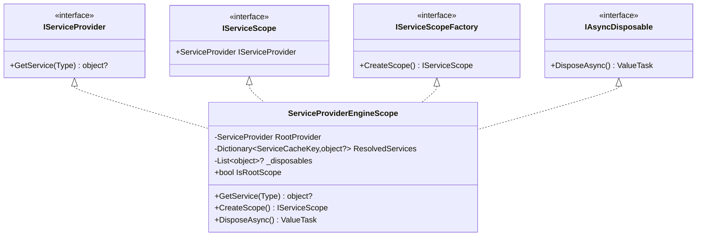

**一个类型同时承担四种角色**，这种设计避免了「scope vs scope-factory vs provider」之间繁琐的相互转换：

- 想用它作 `IServiceProvider`：`scope.ServiceProvider` 直接返回 `this`；
- 想用它作 `IServiceScopeFactory`：根容器解析 `IServiceScopeFactory` 时直接返回根 scope；
- 想用它作 `IServiceScope`：从 `CreateScope` 拿到的就是新建的 `ServiceProviderEngineScope`。

### 4.3 三个特殊服务的注入路径

`ServiceProvider` 构造时会向 `CallSiteFactory` 注入 3 个特殊服务，它们不来自任何 `ServiceDescriptor`：

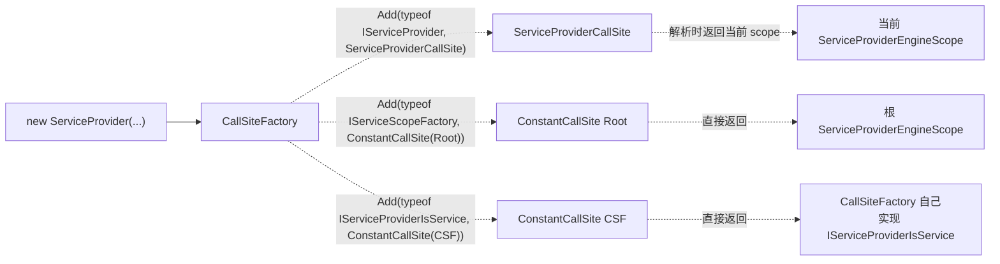

**反直觉点**：解析 `IServiceProvider` 拿到的**永远是当前 scope**，而不是根 `ServiceProvider`。这是为什么子 scope 中的组件能拿到「自己所在 scope」的 `IServiceProvider`。

### 4.4 GetService 入口分发

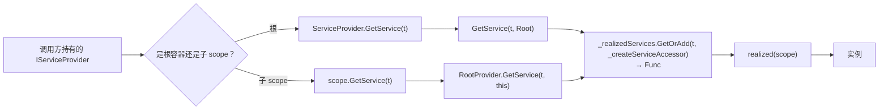

**关键**：不论调用方是根容器还是子 scope，最终都汇聚到同一个内部方法 `ServiceProvider.GetService(Type, ServiceProviderEngineScope)`，只是传入的 `scope` 不同 —— 这一传一区，决定了 Scoped/Transient 实例最终存到哪个 scope。

---

## 5. 调用站点：ServiceCallSite 与 CallSiteFactory

`ServiceCallSite` 是整个 DI 子系统的**中间表示（IR）**：把零散的 `ServiceDescriptor` 编译成统一的访问者目标，便于解析引擎（反射 / 表达式树 / IL Emit）统一处理。这一节是源码最复杂的部分。

### 5.1 ServiceCallSite 的五种实现

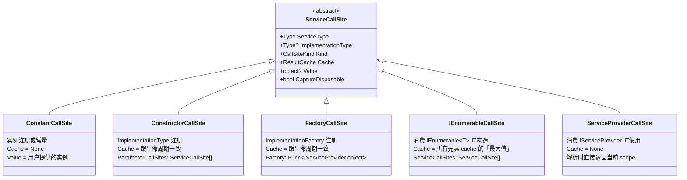

**继承检查约定**：

| CallSite | 构造时是否检查「实现类型继承 / 实现服务类型」 |
|---------|--------------------------------------------|
| `ConstantCallSite` | ✅ 检查 |
| `ConstructorCallSite` | ✅ 检查 |
| `FactoryCallSite` | ❌ **不检查** —— 信任调用方 |
| `IEnumerableCallSite` / `ServiceProviderCallSite` | — 框架内部生成 |

> 工厂注册不检查的代价：工厂返回错误类型时，要等到调用方使用时才会以「强制类型转换异常」暴露。

> 详见原笔记 §服务消费 第 1585–1629 行（`ServiceCallSite`）。

### 5.2 CallSiteFactory 三条创建路径

`CallSiteFactory.CreateCallSite` 按以下顺序尝试三条路径，先到先得：

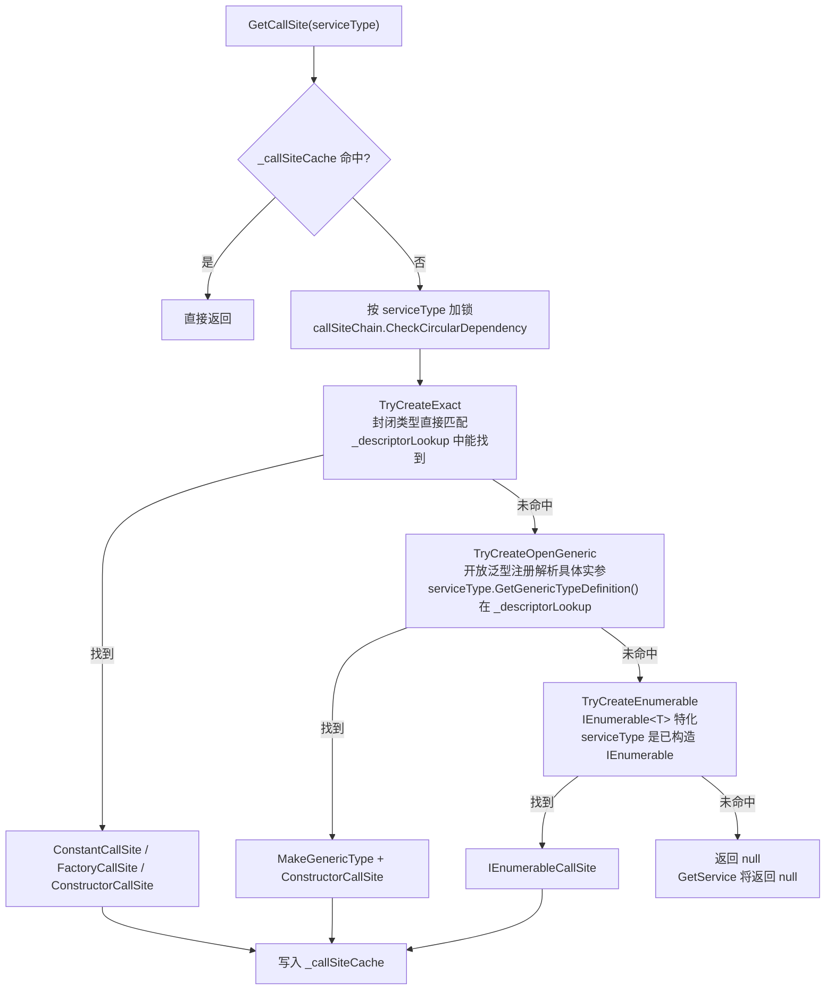

> 详见原笔记 §CallSiteFactory 第 939–969 行（`CreateCallSite`）、第 972–1031 行（`TryCreateExact`）、第 1209–1263 行（`TryCreateOpenGeneric`）、第 1266–1370 行（`TryCreateEnumerable`）。

### 5.3 ServiceDescriptorCacheItem 链式结构与槽位

同一服务类型的多个 `ServiceDescriptor` 不存成一个 `List<ServiceDescriptor>`，而是巧妙地拆成「**首项 + 列表**」的不可变结构：

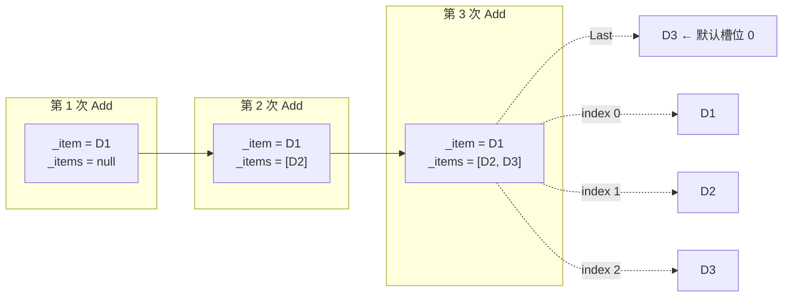

**槽位（slot）规则一表说清**：

| ServiceDescriptor | index | slot |
|-------------------|-------|------|
| 最早注册的 D1（即 `_item`） | 0 | `Count - 1` |
| 中间的 D2 | 1 | `_items.Count - 1` |
| 最后注册的 D3 | 2 | 0 |

**为什么 slot 倒序编号？**

- 「单实例解析」要的是「最后注册者」→ 永远查 slot=0，**O(1) 命中**；
- 「集合解析」（`IEnumerable<T>`）按 index 顺序遍历 → 自然得到「早注册者在前」的数组。

> 详见原笔记 §CallSiteFactory 第 1380–1479 行（`ServiceDescriptorCacheItem`）。

### 5.4 构造函数选择算法

当注册方式是 `ImplementationType` 时，框架必须在多个公共实例构造函数中挑选「**最优**」的一个。算法有三条原则：

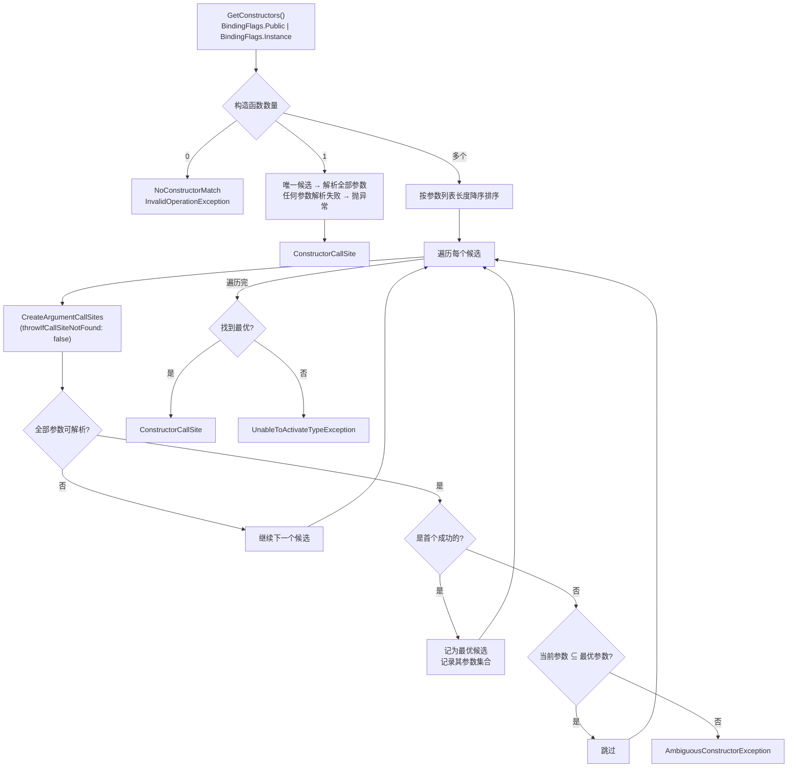

**三条原则**：

1. **参数列表最长者优先**（先排序）；
2. **首个所有参数都能解析的就是最优**；
3. **后续候选的参数集合必须是最优的子集**，否则视为歧义。

**子集判断**是算法的核心，只看这几行就够：

```C#
foreach (ParameterInfo p in parameters)
{
    if (!bestConstructorParameterTypes.Contains(p.ParameterType))
    {
        throw new InvalidOperationException(string.Join(
            Environment.NewLine,
            SR.Format(SR.AmbiguousConstructorException, implementationType),
            bestConstructor,
            constructors[i]));
    }
}
```

**歧义示例**：

```C#
public class Foo {
    public Foo(IA a, IB b) {}    // 候选 1
    public Foo(IA a, IC c) {}    // 候选 2，长度相同
}
// 若 IA/IB/IC 均已注册：候选 1 先被选中，
// 遍历到候选 2 时 IC ∉ {IA, IB} → AmbiguousConstructorException
```

**参数解析的兜底**：构造参数解析失败时，仅对值类型尝试 `ParameterDefaultValue.TryGetDefaultValue`（不含可空值类型）；引用类型若无注册则报错。

> 详见原笔记 §CallSiteFactory 第 1034–1163 行（`CreateConstructorCallSite`）、第 1166–1206 行（`CreateArgumentCallSites`）。

### 5.5 循环依赖检测：CallSiteChain

`CallSiteChain` 是一个「进入时 Add，退出时 Remove」的栈式结构。每次 `CreateCallSite` 在进入前先 `Add(serviceType)`，再调用 `CheckCircularDependency` 检测当前链路是否已存在同名服务：

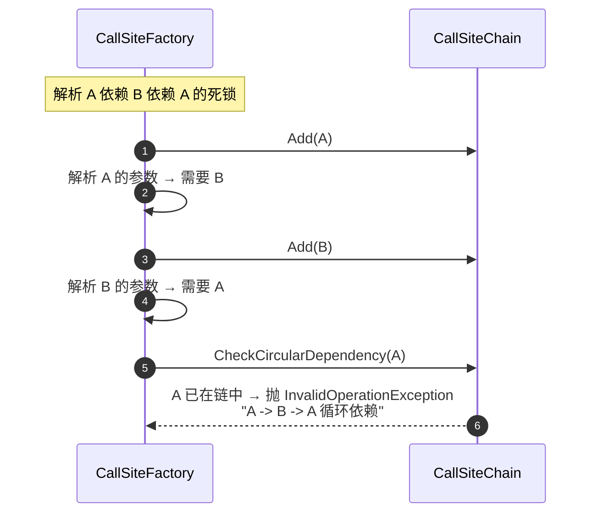

### 5.6 IEnumerable<T> 解析的特殊性

`TryCreateEnumerable` 是 `CallSiteFactory` 唯一一处对「服务类型本身」做特化的地方。它对 `IEnumerable<T>` 中的元素类型 `T` 分两条分支处理：

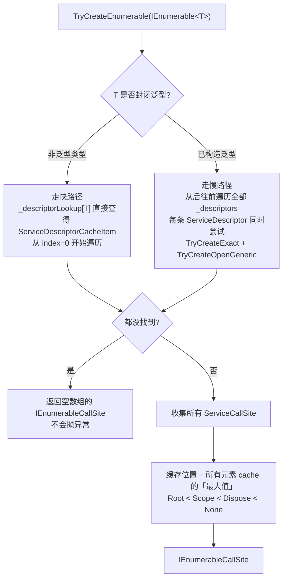

**两个反直觉点**：

1. **即使没有任何注册**，`IEnumerable<T>` 解析也会返回**空数组**，不会抛异常。这是为什么 `GetServices<T>()` 永远非 null —— 与 `GetService<T>()` 的语义关键区别。
2. **解析顺序**：对非泛型从前往后、对封闭泛型从后往前后再反转，最终都保证「**早注册者在数组前面**」。

> 详见原笔记 §CallSiteFactory 第 1266–1370 行（`TryCreateEnumerable`）。

---

## 6. 生命周期 & 结果缓存：实例到底存在哪里

### 6.1 三种生命周期的物理存储位置

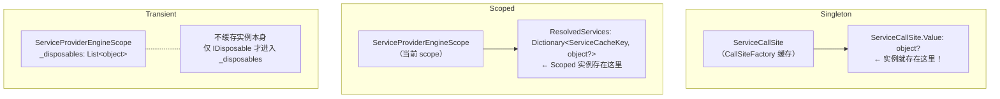

| 维度 | Singleton | Scoped | Transient |
|------|-----------|--------|-----------|
| 解析后是否复用 | ✅ 进程级 | ✅ scope 内 | ❌ 每次新 |
| 实例物理位置 | `ServiceCallSite.Value` | `scope.ResolvedServices` | 无 |
| IDisposable 跟踪 | 根 scope `_disposables` | 当前 scope `_disposables` | 当前 scope `_disposables` |

### 6.2 关键澄清：Singleton 不在字典里

这是整个框架最易被误解的设计。许多人会假设：

> 「Singleton 一定存在某个『全局字典』里，根容器有一份字典专门放 Singleton 实例。」

**实际并非如此**。Singleton 实例直接挂在 `ServiceCallSite.Value` 上。`ServiceCallSite` 由 `CallSiteFactory._callSiteCache` 按 `ServiceCacheKey` 唯一化，所以同一服务类型的所有调用方拿到的是同一个 `ServiceCallSite` 实例，自然命中同一个 `Value`。

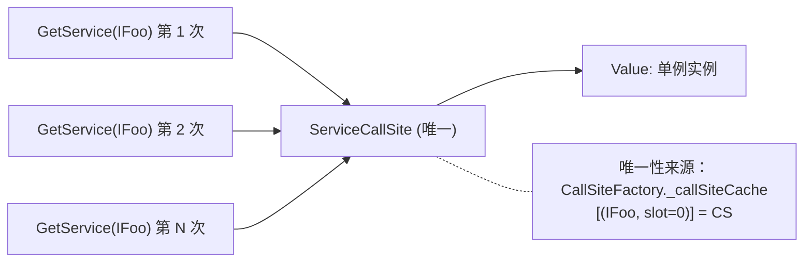

**这种设计的好处**：

- **`CreateServiceAccessor` 阶段一次性解析、闭包返回常量**（`scope => value`），后续永远不必再进入访问者模式；
- 即使引擎从反射切换到 IL Emit，Singleton 也不必重新构建委托。

具体落地见 §4.2 的 `ServiceProvider.CreateServiceAccessor`：

```C#
// 缓存位置在 Root（即 Singleton），直接用反射解析一次得到值
if (callSite.Cache.Location == CallSiteResultCacheLocation.Root)
{
    object? value = CallSiteRuntimeResolver.Instance.Resolve(callSite, Root);
    return scope => value;   // 永远返回这个值
}
```

> 详见原笔记 §服务消费 第 560–584 行（`CreateServiceAccessor`）。

### 6.3 captive dependency 的产生机制

「Singleton 直接或间接依赖 Scoped」是 DI 最经典的设计陷阱：

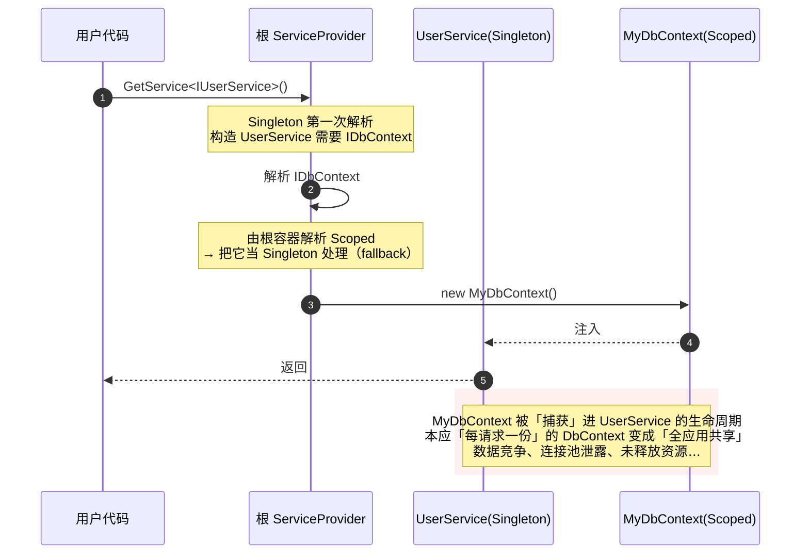

**`ValidateScopes` 如何拦截**：在 `CallSiteValidator.ValidateCallSite` 阶段递归走完 `ServiceCallSite` 树，发现「Singleton 引用了一个 Scoped CallSite」就标记；之后任意 `GetService` 该 Singleton 都会抛 `InvalidOperationException`，把问题在开发期暴露。

### 6.4 ConstantCallSite 为何走 None 缓存

`ConstantCallSite` 的 `Cache = ResultCache.None`。原因很直接：实例**已经**作为 `Value` 字段挂在 CallSite 上（构造时塞入），不需要再走「先查字典 → 找不到再构造」的流程。`VisitConstant` 直接返回 `DefaultValue`，零开销。

---

## 7. 服务解析引擎

`CallSiteFactory` 解决了「**怎么把 ServiceDescriptor 转成 ServiceCallSite**」，解析引擎解决「**怎么把 ServiceCallSite 转成实际的服务实例**」。

### 7.1 引擎家族

```mermaid
classDiagram
    class ServiceProviderEngine {
        <<abstract>>
        +RealizeService(ServiceCallSite) Func~Scope,object?~
    }

    class RuntimeServiceProviderEngine {
        AOT 友好<br/>纯反射
        +RealizeService → 委托 CallSiteRuntimeResolver
    }

    class CompiledServiceProviderEngine {
        <<abstract>>
        +ResolverBuilder
        +RealizeService → ResolverBuilder.Build
    }

    class ExpressionsServiceProviderEngine {
        非 IL_EMIT 目标
        ExpressionResolverBuilder
    }

    class ILEmitServiceProviderEngine {
        IL_EMIT 目标（性能最优）
        ILEmitResolverBuilder
    }

    class DynamicServiceProviderEngine {
        默认；启动反射、运行时升级
        +RealizeService → CallSiteRuntimeResolver.Resolve<br/>第 2 次解析时异步替换为 base.RealizeService
    }

    ServiceProviderEngine <|-- RuntimeServiceProviderEngine
    ServiceProviderEngine <|-- CompiledServiceProviderEngine
    CompiledServiceProviderEngine <|-- ExpressionsServiceProviderEngine
    CompiledServiceProviderEngine <|-- ILEmitServiceProviderEngine
    CompiledServiceProviderEngine <|-- DynamicServiceProviderEngine
```

### 7.2 引擎选择决策

```mermaid
flowchart TD
    Build["new ServiceProvider(...)"] --> GE["GetEngine()"]

    GE --> Target{编译目标?}
    Target -->|".NET Framework / netstandard2.0"| Dyn1[DynamicServiceProviderEngine]
    Target -->|".NET 6+"| Cap{RuntimeFeature.IsDynamicCodeCompiled?}
    Cap -->|true（JIT）| Dyn2[DynamicServiceProviderEngine]
    Cap -->|false（Native AOT）| Rt[RuntimeServiceProviderEngine.Instance]

    note["AOT 下禁止运行时生成代码<br/>必须走纯反射路径"]
    Rt -.- note
```

> 详见原笔记 §服务消费 第 586–605 行（`GetEngine`）。

### 7.3 DynamicServiceProviderEngine 的「热升级」

这是性能与启动延迟之间的折中。状态机如下：

```mermaid
stateDiagram-v2
    [*] --> Reflective: 首次创建 RealizeService 委托

    Reflective: 反射解析<br/>callCount = 1
    Reflective --> Compiling: 第 2 次解析触发<br/>Interlocked.Increment(ref callCount) == 2
    Compiling: 后台线程异步编译<br/>(ILEmit / Expression)
    Compiling --> Compiled: 编译成功<br/>ReplaceServiceAccessor

    Reflective --> Reflective: 仍按反射方式服务后续调用
    Compiled: 之后所有调用走编译版本
    Compiled --> [*]

    Compiling --> Reflective: 编译失败（极少见）<br/>记录 EventSource
```

**设计意图**：

- **避免冷启动惩罚**：编译路径有可观开销（生成 `DynamicMethod`、JIT 编译），如果服务只解析一次（典型 Singleton 启动期），编译成本永远赚不回来；
- **避免一次浪费**：阈值定为 **2** 是因为「能被解析 2 次的服务大概率是高频使用的」，这是典型的 JIT 启发式思路；
- **后台线程升级**：不阻塞调用线程；`ReplaceServiceAccessor` 把编译版本写入 `_realizedServices` 缓存，下一次解析自动用上。

> 详见原笔记 §服务消费 第 635–682 行（`DynamicServiceProviderEngine`）。

### 7.4 CallSiteVisitor 两层分发

无论是反射 (`CallSiteRuntimeResolver`)、ILEmit (`ILEmitResolverBuilder`)、表达式树 (`ExpressionResolverBuilder`) 还是范围验证 (`CallSiteValidator`)，都继承自 `CallSiteVisitor<TArgument, TResult>`，共享一套两层分发框架：

```mermaid
flowchart TD
    Enter["VisitCallSite(callSite, arg)"]

    Enter --> L1{第一层分发<br/>callSite.Cache.Location}
    L1 -->|Root| R[VisitRootCache]
    L1 -->|Scope| S[VisitScopeCache]
    L1 -->|Dispose| D[VisitDisposeCache]
    L1 -->|None| N[VisitNoCache]

    R --> L2["第二层分发<br/>VisitCallSiteMain(callSite, arg)"]
    S --> L2
    D --> L2
    N --> L2

    L2 --> K{callSite.Kind}
    K -->|Factory| VF[VisitFactory]
    K -->|Constructor| VC[VisitConstructor]
    K -->|Constant| VK[VisitConstant]
    K -->|IEnumerable| VE[VisitIEnumerable]
    K -->|ServiceProvider| VS[VisitServiceProvider]

    style L1 fill:#e0f0ff
    style L2 fill:#fff0e0
```

**层次划分的好处**：

- **第一层（缓存位置）**：决定加锁策略、是否落字典、是否捕获 disposable —— 这些是「容器策略」；
- **第二层（CallSiteKind）**：决定实例如何**构造** —— 这些是「构造方式」；
- 子类只需重写两层中感兴趣的方法（如 `CallSiteValidator` 只关心第一层，因为它不构造实例）。

> 详见原笔记 §服务消费 第 1631–1723 行（`CallSiteVisitor<,>`）。

### 7.5 反射解析器的关键设计：CallSiteRuntimeResolver

#### 7.5.1 时序图：Singleton 解析路径

```mermaid
sequenceDiagram
    autonumber
    participant T1 as 线程 T1
    participant T2 as 线程 T2
    participant CS as ServiceCallSite
    participant Root as 根 scope

    T1->>CS: VisitRootCache(callSite, ctx)
    Note over T1: 第一次解析

    T1->>CS: Value 还是 null
    T1->>CS: lock(callSite)
    Note over T2: 同时 T2 也想解析

    T2->>CS: 等锁

    T1->>CS: 二次检查 Value 仍 null
    T1->>T1: VisitCallSiteMain<br/>(实际构造)
    T1->>Root: CaptureDisposable(实例)
    T1->>CS: Value = 实例
    T1->>CS: 释放锁

    T2->>CS: 拿到锁
    T2->>CS: 二次检查 Value 已有值
    T2-->>CS: 直接返回（避免重复构造）
```

#### 7.5.2 必须看代码：双重检查锁

```C#
// VisitRootCache 核心（精简）
if (callSite.Value is object value) return value;            // 第一次检查（无锁）

lock (callSite)
{
    if (callSite.Value is object callSiteValue)              // 第二次检查（有锁）
        return callSiteValue;

    object? resolved = VisitCallSiteMain(callSite, ctxWithLock);
    serviceProviderEngine.CaptureDisposable(resolved);
    callSite.Value = resolved;                               // 写入后退出锁
    return resolved;
}
```

#### 7.5.3 必须看代码：AcquiredLocks 位运算去重入锁

并发场景下，一次复杂解析（如 Scoped 服务的构造函数参数还是 Scoped 服务）会嵌套多次 `Visit*Cache`。同线程嵌套不应重复加锁，框架用位运算枚举实现：

```C#
[Flags] enum RuntimeResolverLock { Scope = 1, Root = 2 }

// VisitCache 核心（精简）
if ((context.AcquiredLocks & lockType) == 0)        // 本线程尚未持有此锁
    Monitor.Enter(sync, ref lockTaken);

// 递归时把锁标记传给子调用
resolved = VisitCallSiteMain(callSite, new RuntimeResolverContext {
    Scope = serviceProviderEngine,
    AcquiredLocks = context.AcquiredLocks | lockType,        // 按位或叠加
});
```

**好处**：跨调用层级追踪「哪些锁已被本线程持有」无需用 `ReentrantLock` 或 `ThreadLocal`，全靠值类型 + 位运算，零分配。

> 详见原笔记 §服务消费 第 1755–1851 行（`VisitRootCache` / `VisitScopeCache` / `VisitCache`）。

---

## 8. 服务验证

### 8.1 两种验证选项的对照

| 维度 | `ValidateOnBuild` | `ValidateScopes` |
|------|-------------------|------------------|
| 触发时机 | `BuildServiceProvider` 时 1 次 | 每次 `GetService` |
| 检查内容 | 全部 ServiceDescriptor 能否解析为 CallSite | Singleton→Scoped 违例；根容器解析 Scoped |
| 对开放泛型 | ⚠ 无法验证 | ✅ 可验证（已是封闭类型） |
| 对 FactoryCallSite 返回类型 | ⚠ 无法验证 | ⚠ 无法验证 |
| 性能成本 | 启动期一次性 | 每次解析一次额外查表 |
| 推荐场景 | 启动期 / CI 烟囱测试 | 开发期常驻 |

### 8.2 CallSiteValidator 如何识别 Singleton→Scoped 违例

`CallSiteValidator` 继承自 `CallSiteVisitor<,>`，但与运行时解析器走的逻辑完全不同：它**只遍历不解析**，记录每个 Singleton CallSite 是否在依赖树中触达了 Scoped CallSite。

```mermaid
sequenceDiagram
    autonumber
    participant Build as ServiceProvider 构造期
    participant V as CallSiteValidator
    participant Run as GetService 运行时

    Build->>V: ValidateCallSite(每个服务的 CallSite)
    V->>V: 遍历 CallSite 树
    Note over V: 发现 Singleton CallSite<br/>其后代含 Scoped CallSite
    V->>V: 标记该 ServiceType 为「违例 Singleton」

    Run->>V: ValidateResolution(serviceType, currentScope, root)
    alt scope == root AND serviceType 是 Scoped 或被标记
        V-->>Run: 抛 InvalidOperationException<br/>「不能从根容器解析 Scoped 服务」
    end
```

**关键：标记发生在 `BuildServiceProvider`（启用 `ValidateScopes` 时也会创建 validator），违例抛错发生在 `GetService`**。

> 详见原笔记 §服务消费 第 514–541 行（`ValidateService`）、第 548–558 行（`GetService` 中的 `ValidateResolution` 调用）。

---

## 9. 资源释放

DI 容器同时承担「服务工厂」和「资源管理」两个职责。本节讲解后者。

### 9.1 谁会被加入 _disposables？

```mermaid
flowchart TD
    Resolved["VisitX 解析得到的实例"] --> Cap{ServiceCallSite.<br/>CaptureDisposable?}

    Cap -->|否| Done[不进入 _disposables]
    Cap -->|是| ByType{实例的 IDisposable / IAsyncDisposable?}

    ByType -->|否| Done
    ByType -->|是| WhichScope{解析时 callSite.Cache.Location?}

    WhichScope -->|Root| Root[根 scope._disposables]
    WhichScope -->|Scope| Cur[当前 scope._disposables]
    WhichScope -->|Dispose| Cur
    WhichScope -->|None| ConstantBranch{是 ConstantCallSite?}

    ConstantBranch -->|是| Cur2[加入当前 scope._disposables]
    ConstantBranch -->|否，如 ServiceProviderCallSite| Done2[不加入]
```

**`CaptureDisposable` 的判定**：

```C#
// ServiceCallSite.CaptureDisposable
public bool CaptureDisposable =>
    ImplementationType == null ||                                  // FactoryCallSite 实现类型未知 → 视为可能需释放
    typeof(IDisposable).IsAssignableFrom(ImplementationType) ||
    typeof(IAsyncDisposable).IsAssignableFrom(ImplementationType);
```

> 详见原笔记 §服务消费 第 1622–1628 行（`ServiceCallSite.CaptureDisposable`）。

### 9.2 倒序释放的依赖学解释

释放从 `_disposables.Count - 1` 倒序遍历到 0。原因：

```mermaid
flowchart LR
    A1["A 构造时<br/>先依赖 B<br/>先构造 B → A 进 _disposables 较晚"]
    A2["A 释放时<br/>仍可能引用 B<br/>所以 A 先释放更安全"]

    A1 --> A2

    style A1 fill:#e0f7e0
    style A2 fill:#f7e0e0
```

构造顺序保证「先构造被依赖者」（B 在前，A 在后入列）；释放时倒序遍历 → 先释放 A 再释放 B → 「先释放依赖方再释放被依赖方」，避免「A 还活着却引用着已 Dispose 的 B」。

### 9.3 DisposeAsync 同步/异步切换

`DisposeAsync` 的实现刻意避免「**所有同步释放都被卷进异步状态机**」的开销：

```mermaid
stateDiagram-v2
    [*] --> SyncLoop: 同步循环释放<br/>i = Count-1 ... 0

    SyncLoop --> Check: 当前对象是 IAsyncDisposable?

    Check --> SyncDispose: 否<br/>调用 IDisposable.Dispose()
    SyncDispose --> SyncLoop

    Check --> SyncAsync: 是<br/>调用 DisposeAsync()
    SyncAsync --> CompletedFast: vt.IsCompletedSuccessfully?

    CompletedFast --> GetResult: 是<br/>vt.GetAwaiter().GetResult()
    GetResult --> SyncLoop

    CompletedFast --> SwitchToAsync: 否<br/>剩余项目改走 async Await(i, vt, ...)

    SwitchToAsync --> [*]: 异步状态机 + await

    SyncLoop --> [*]: 全部释放完成
```

**关键判断**：

```C#
ValueTask vt = asyncDisposable.DisposeAsync();
if (!vt.IsCompletedSuccessfully)
    return Await(i, vt, toDispose);   // ← 一旦发现未同步完成，整体切换到 async 路径
```

**好处**：常见场景（所有 `DisposeAsync` 同步完成，如简单清空字段）不分配异步状态机；只有真异步才付出代价。

> 详见原笔记 §服务范围 第 766–820 行（`ServiceProviderEngineScope.DisposeAsync`）。

### 9.4 Transient + IDisposable 内存陷阱

```C#
services.AddTransient<DisposableTransient>();   // ⚠ Transient 但实现了 IDisposable

using var scope = sp.CreateScope();
for (int i = 0; i < 10_000; i++)
{
    var t = scope.ServiceProvider.GetRequiredService<DisposableTransient>();
    // 没有 t.Dispose() —— 「容器管释放」
}
// 直到 scope 释放前，这 10_000 个实例都活在 _disposables 里
// → 内存暴涨 → 实际像「scope 级 Singleton」
```

**对策**：

- 高频解析的 Transient 不要持有大资源；
- 改为 Scoped（每个 scope 只一份）；
- 主动短暂创建子 scope 包住高频解析区域，让生命周期更细粒度。

### 9.5 释放归属权对照表

| 实例来源 | 释放责任归属 |
|---------|------------|
| `AddXxx<TService, TImpl>()` 且 `TImpl: IDisposable` | 容器（所在 scope） |
| `AddXxx<TService>(sp => new ...)` 且返回实例 `IDisposable` | 容器（所在 scope） |
| `AddSingleton<IFoo>(new Foo())`（实例注册）且 `Foo: IDisposable` | 容器（根 scope） |
| 用户自己 `new` 且未交给容器 | 用户 |

**反模式提醒**：不要对容器解析得到的实例调用 `Dispose()` —— scope 释放时会重复 Dispose，部分实现会抛 `ObjectDisposedException`。

---

## 10. 消费 API

### 10.1 GetService / GetRequiredService / GetServices 行为矩阵

| 方法 | 未注册时返回 | 注册了但解析失败 | 适用场景 |
|------|------------|----------------|---------|
| `GetService<T>()` | `null` / `default(T)` | 抛异常 | 可选依赖（可选日志、可选诊断） |
| `GetRequiredService<T>()` | 抛 `InvalidOperationException` | 抛异常 | 必需依赖（大多数场景） |
| `GetServices<T>()` | **空数组**（永不为 null） | 抛异常 | 多实现集合（如多个 `IHostedService`） |
| `IEnumerable<T>` 直接注入 | 空集合（同上） | 抛异常 | 构造函数注入多实现集合 |

> 注：默认 `ServiceProvider` 不实现 `ISupportRequiredService`，`GetRequiredService` 走「先 `GetService` 再判 null」的回退分支。`ISupportRequiredService` 是给第三方容器的高性能扩展点。

### 10.2 CreateScope 的语法糖揭秘

```mermaid
flowchart LR
    A["sp.CreateScope()"] --> B["sp.GetRequiredService&lt;IServiceScopeFactory&gt;()<br/>→ 根 ServiceProviderEngineScope（自身实现工厂接口）"]
    B --> C["scopeFactory.CreateScope()"]
    C --> D["RootProvider.CreateScope()<br/>→ new ServiceProviderEngineScope(this, isRootScope: false)"]
```

记忆点：`CreateScope` 不是 `IServiceProvider` 的方法，而是位于 `ServiceProviderServiceExtensions` 的扩展方法。它实际上做了「向容器要一个 `IServiceScopeFactory`，再问它创建 scope」。

> 详见原笔记 §服务消费 第 2023–2028 行（`CreateScope` 扩展方法）。

### 10.3 ActivatorUtilities 与 DI 的边界

`ActivatorUtilities` 是「DI 之外」的辅助类型，常被框架自己用（如中间件、Filter 的实例化）：

```mermaid
flowchart LR
    subgraph 容器内
        Reg["注册到 IServiceCollection 的类型<br/>由 IServiceProvider.GetService 解析"]
    end

    subgraph 容器外
        NReg["未注册的具体类型<br/>由 ActivatorUtilities.CreateInstance 实例化"]
        NReg --> Mix["构造参数：<br/>能在容器解析的 → 从 IServiceProvider 拿<br/>不能解析的 → 从 extraArgs 提供"]
    end

    Reg -. 互补 .- NReg
```

**典型 API**：

| API | 用途 |
|-----|------|
| `CreateInstance(provider, type, params)` | 实例化未注册类型，混合 DI + 显式参数 |
| `CreateFactory(type, argTypes)` | 编译构造委托，高性能重复创建 |
| `GetServiceOrCreateInstance<T>(provider)` | 优先容器解析，否则即时创建 |
| `[ActivatorUtilitiesConstructor]` | 显式指定构造函数（绕过「最优构造函数」算法） |

**与 DI 默认算法的区别**：

- DI 默认的「最优构造函数」算法不读特性，参数只能从容器解析；
- `ActivatorUtilities` 支持参数从两个来源混合（容器 + 显式数组），且支持用特性显式选择构造函数。

> 注：`ActivatorUtilities` 的源码不在原笔记内，本节为补充内容。读者可直接搜索 `ActivatorUtilities.CreateInstance` 源码加深理解。

---

## 11. 设计思想速览（设计模式视角）

### 11.1 中间表示（IR）模式：ServiceCallSite

> 「**用统一的中间表示分离前端（注册描述）与后端（解析执行）**」

`ServiceDescriptor`（前端）和「实际构造实例的代码」（后端）之间，框架插入了 `ServiceCallSite` 作为 IR。这一层带来的收益：

- **前端解耦后端**：5 种 `ServiceCallSite` 实现覆盖了所有注册方式；3 种解析引擎（反射 / 表达式 / IL Emit）共用同一套 IR；
- **可缓存与可分析**：`ServiceCallSite` 作为静态结构可以被遍历（如 `CallSiteValidator` 做 captive dependency 检查）；
- **可热升级**：`DynamicServiceProviderEngine` 在运行时把同一 `ServiceCallSite` 从反射后端切到 IL 后端，**调用方无感**。

类似的思想在编译器、ORM、查询优化器中比比皆是 —— **IR 是「策略可替换」的载体**。

### 11.2 访问者模式：CallSiteVisitor 一对多策略

> 「**对象结构稳定（5 种 CallSite），操作多变（反射/表达式/IL/验证）**」

`CallSiteVisitor<TArgument, TResult>` 是经典访问者：

- **结构方**：`ServiceCallSite` 提供 `Kind` 字段允许 visitor 双分派；
- **行为方**：`CallSiteRuntimeResolver`（构造实例）、`CallSiteValidator`（仅遍历做检查）、`ILEmitResolverBuilder`（生成 IL）等都是同一接口下的不同 visitor。

**框架还在访问者基础上加了一层「按缓存位置分发」（§7.4）**，把「容器策略」与「构造方式」彻底解耦。

### 11.3 双层缓存：CallSite 缓存 + 实例缓存

```mermaid
flowchart LR
    Type["serviceType"] --> L1["第一层：_callSiteCache<br/>Type → ServiceCallSite"]
    L1 --> CS[ServiceCallSite]
    CS --> L2{第二层：实例缓存}
    L2 -->|Singleton| Val[ServiceCallSite.Value]
    L2 -->|Scoped| RS[scope.ResolvedServices]
    L2 -->|Transient| NoCache[无]
```

- **第一层缓存**保证「同一服务类型只生成一个 `ServiceCallSite`」—— 是「**结构层**」的去重；
- **第二层缓存**按生命周期决定实例存哪里 —— 是「**实例层**」的复用。

两层分离的好处：构造结构（`ServiceCallSite`）是昂贵的（涉及反射、构造函数选择），所以重度缓存；实例缓存策略灵活（不同生命周期不同位置），与结构无关。

### 11.4 JIT 启发式：DynamicServiceProviderEngine 的渐进编译

`DynamicServiceProviderEngine` 用 **「第二次解析才升级」** 的策略避免冷启动惩罚。这是典型的 JIT 启发式：

- **预设假设**：大多数服务只解析少数几次；
- **观察行为**：用计数器追踪解析次数；
- **达到阈值才优化**：第 2 次解析触发后台编译；
- **异步替换不阻塞**：编译完成后无感切换。

把同样的思路应用到任何「**构建昂贵 + 执行频繁**」的场景，都能拿到类似收益（如 Regex 编译、SQL 计划缓存）。

### 11.5 平铺式 scope：用平坦换简单

「scope 嵌套不形成树」（§4.1）是设计上的大胆选择。**用平坦换来的简化**：

- 解析路径只有一条（`RootProvider.GetService(t, currentScope)`），无需递归向上查找；
- Singleton 只在根容器存一份；
- 子 scope 不会因父 scope 释放级联失效。

**代价**：放弃了「父子 scope 可以有不同 Singleton」之类的高级特性 —— 但 ASP.NET Core 场景下用不上。

---

## 12. 速查卡 & 陷阱清单

### 12.1 三种生命周期 vs 缓存位置 对照表

| Lifetime | CacheLocation | 实例存放位置 | 跨 scope 共享 | IDisposable 跟踪在哪个 scope |
|----------|---------------|--------------|----------------|------------------------------|
| Singleton | Root | `ServiceCallSite.Value` | 是 | 根 scope `_disposables` |
| Scoped | Scope | `scope.ResolvedServices` | 否 | 当前 scope `_disposables` |
| Transient | Dispose | 不缓存 | 否（每次新） | 当前 scope `_disposables`（仅 IDisposable） |
| 常量 / IServiceProvider | None | CallSite 自身 / scope 自身 | — | 不跟踪 |

### 12.2 五种 ServiceCallSite 对照表

| Kind | 何时创建 | 缓存位置 | 继承检查 | 是否捕获 Disposable |
|------|---------|---------|---------|---------------------|
| `Constant` | 实例注册；常量值；参数默认值 | None | ✅ | 实例注册的会被捕获 |
| `Constructor` | `ImplementationType` 注册 | 跟生命周期 | ✅ | 视实现类型 |
| `Factory` | `ImplementationFactory` 注册 | 跟生命周期 | ❌ | **总是**捕获 |
| `IEnumerable` | 解析 `IEnumerable<T>` 时构造 | 元素 cache 的「最大值」 | — | 由元素决定 |
| `ServiceProvider` | 解析 `IServiceProvider` 时使用 | None | — | 不捕获 |

### 12.3 注册扩展方法语义矩阵

| 方法 | 同 ServiceType 已存在 | 同 (ServiceType, ImplType) 已存在 | 用途 |
|------|----------------------|----------------------------------|------|
| `Add` | 追加 | 追加 | 普通注册 |
| `TryAdd` | 跳过 | 跳过 | 默认实现保护 |
| `TryAddEnumerable` | 追加 | 跳过 | 多实现去重添加 |
| `Replace` | 删第一个 + 末尾追加 | 同上 | 替换默认实现 |
| `RemoveAll` | 删除所有 | 删除所有 | 清空某服务的所有注册 |

### 12.4 10 大常见陷阱

1. **captive dependency**：Singleton 直接 / 间接依赖 Scoped → Scoped 被「捕获」进 Singleton 生命周期。启用 `ValidateScopes` 才能在开发期暴露。
2. **手动 Dispose 容器解析的实例**：scope 释放时会重复 Dispose；正确做法是只 Dispose `scope`。
3. **大量 Transient + IDisposable**：在长寿命 scope 中累积，可能造成内存暴涨。
4. **lambda 注册类型推断**：`AddSingleton<IFoo>(_ => new Foo())` 推断为 `Func<IServiceProvider, IFoo>`，让 `TryAddEnumerable` 因实现类型等于服务类型而抛异常。
5. **多次注册 Singleton 不会替换**：`GetService<IFoo>` 返回最后注册的；`GetServices<IFoo>` 按注册顺序返回所有；想替换请用 `Replace`。
6. **开放泛型只能用 `ImplementationType` 注册**：`ImplementationFactory`/`ImplementationInstance` 都承载不了未填实参的泛型。
7. **`ValidateOnBuild` 验不出开放泛型**：必须等具体泛型实参出现时才能解析。
8. **`IEnumerable<T>` 不会因无注册而抛异常**：永远返回非 null 集合（可能为空）。
9. **`ImplementationFactory` 不做继承检查**：工厂返回错误类型时要等使用时才暴露。
10. **`IServiceProvider` 解析得到的是当前 scope**，不是根容器 —— 子 scope 中注入的 `IServiceProvider` 永远是「自己所在 scope」。

### 12.5 原笔记类型 → 本笔记小节 映射表

| 原笔记类型 | 本笔记小节 |
|-----------|-----------|
| `ServiceDescriptor` | §2.1 / §2.4 |
| `IServiceCollection` / `ServiceCollection` | §1.1 / §2 引言 |
| `ServiceCollectionDescriptorExtensions` | §2.3 / §2.4 |
| `ServiceCollectionServiceExtensions` | §2.3 |
| `ServiceCollectionContainerBuilderExtensions` | §3.1 |
| `ServiceProviderOptions` | §3.2 / §8.1 |
| `IServiceProvider` | §1.1 / §4.4 |
| `ServiceProvider` | §3.1 / §4.4 / §6.2 |
| `CompiledServiceProviderEngine` | §7.1 |
| `DynamicServiceProviderEngine` | §7.3 / §11.4 |
| `IServiceScope` / `IServiceScopeFactory` | §4.2 / §10.2 |
| `ServiceProviderEngineScope` | §4.1 / §4.2 / §9 |
| `CallSiteFactory` | §5.2 / §5.6 |
| `ServiceDescriptorCacheItem` | §2.2 / §5.3 |
| `ServiceCacheKey` | §5.3 |
| `ResultCache` / `CallSiteResultCacheLocation` | §6.1 / §1.3 |
| `ServiceCallSite` | §5.1 / §11.1 |
| `CallSiteVisitor<,>` | §7.4 / §11.2 |
| `CallSiteRuntimeResolver` | §7.5 |
| `RuntimeResolverContext` / `RuntimeResolverLock` | §7.5.3 |
| `ServiceProviderServiceExtensions` | §10.1 / §10.2 |
| `IServiceProviderFactory<>` | §3.3 |
| `DefaultServiceProviderFactory` | §3.3 |


