# 异常处理

> 本笔记是 ASP.NET Core（.NET 6+）`Microsoft.AspNetCore.Diagnostics`（开发者异常页 / 异常处理器中间件 / 响应状态码页中间件）的学习整理，配套源码解读位于仓库根目录 `异常处理.md`。
>
> 风格延续前八章：以 Mermaid UML 图、设计原理、示例为主；源码片段只保留「不看代码无法说清」的几行。

## 0. 阅读指南

### 0.1 本笔记的定位

| 文件 | 视角 | 主体内容 |
|------|------|---------|
| `异常处理.md`(源码笔记) | **源码视角** | 逐类型贴源码 + 在源码中注释解读 |
| `Notes/异常处理.md`(本笔记) | **学习视角** | UML 图、三种机制对比、责任链与现场保留设计、陷阱清单 |

### 0.2 推荐阅读顺序

- **首次学习**：§1 → §2 → §3 → §4 → §5 → §6 → §7 → §8。
- **想理清「`UseDeveloperExceptionPage` / `UseExceptionHandler` / `UseStatusCodePages` 该选哪个」**：§1.3 + §6。
- **想理清「为什么 Minimal API 下要 RerouteHelper」**：§4 完整一节。
- **找某个具体类型**：用 §8.5 「**原笔记类型 → 本笔记小节**映射表」反查。

### 0.3 与前八章的关系

- **管道中间件**(`Notes/管道中间件.md`)：异常处理本质都是「**try-catch 中间件**」，必须先理解 `IApplicationBuilder` 与中间件管道；
- **路由**(`Notes/路由.md`)：异常处理器中间件可以借 `EndpointRoutingMiddleware` 重新匹配 `Endpoint` 处理异常；
- **MinimalAPI**(`Notes/MinimalAPI.md`)：`WebApplication` 编程模型下，路由中间件可能在异常中间件之前注册，需要 `RerouteHelper` 重建管道；
- **配置 / 选项 / 日志**：三种中间件都通过 `IOptions<TOptions>` 配置，并通过日志记录异常。

---

## 1. 全景：三种异常处理机制

### 1.1 三种机制的职责定位

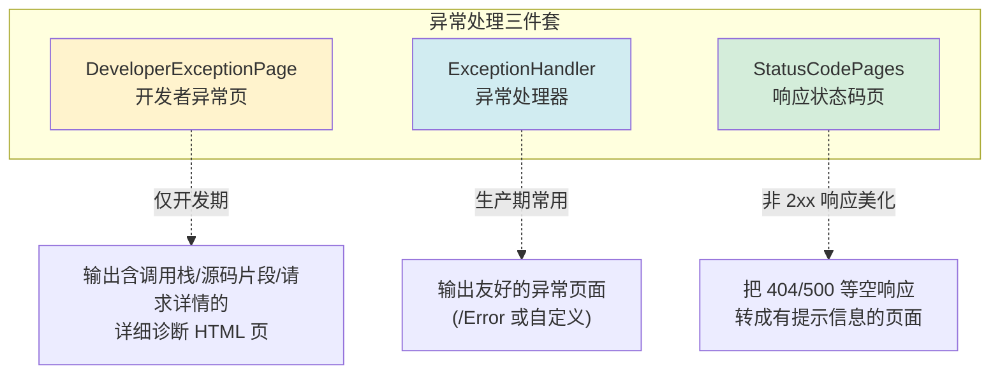

**关键区别**：

| 机制 | 触发条件 | 典型环境 | 目标 |
|------|---------|---------|------|
| `DeveloperExceptionPage` | 后续管道**抛异常** | 仅 Development | **暴露细节**，帮开发者调试 |
| `ExceptionHandler` | 后续管道**抛异常** | 生产 | **隐藏细节**，给用户友好提示 |
| `StatusCodePages` | 后续管道**返回 400-599 且无主体** | 任意 | **填充空响应主体**，添加错误说明 |

### 1.2 一次请求的异常处理时序

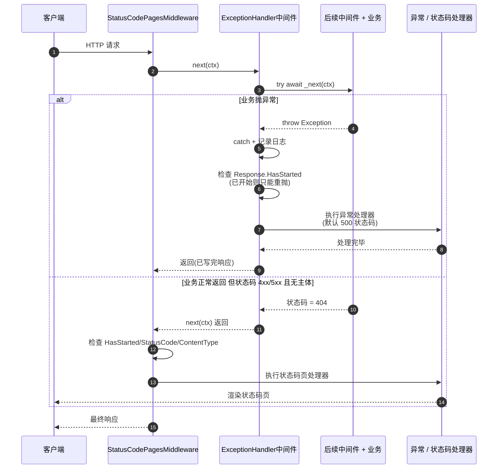

### 1.3 三种机制的选择决策树

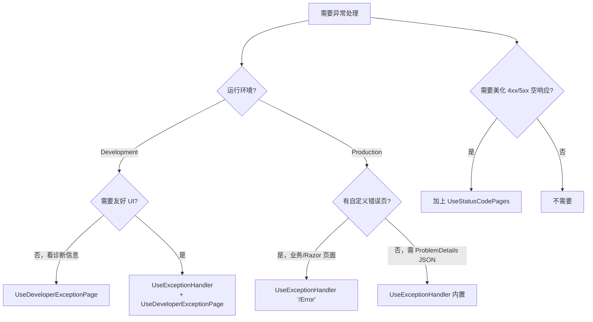

### 1.4 核心类型一览

| 分类 | 类型 | 角色 |
|------|------|------|
| 开发者异常页 | `ErrorContext` / `IDeveloperPageExceptionFilter` / `DeveloperExceptionPageOptions` / `DeveloperExceptionPageMiddlewareImpl` / `DeveloperExceptionPageExtensions` | 详细诊断输出 |
| 异常处理器 | `IExceptionHandler` / `ExceptionHandlerOptions` / `ExceptionHandlerMiddlewareImpl` / `ExceptionHandlerExtensions` | 生产期异常拦截与重定向 |
| 路由重建辅助 | `RerouteHelper` | `WebApplication` 下重建以 `EndpointRoutingMiddleware` 为头的管道 |
| 响应状态码页 | `StatusCodeContext` / `StatusCodePageOptions` / `StatusCodePagesMiddleware` / `StatusCodePagesExtensions` | 美化 4xx/5xx 空响应 |

---

## 2. 开发者异常页：DeveloperExceptionPage

### 2.1 ErrorContext 与 IDeveloperPageExceptionFilter

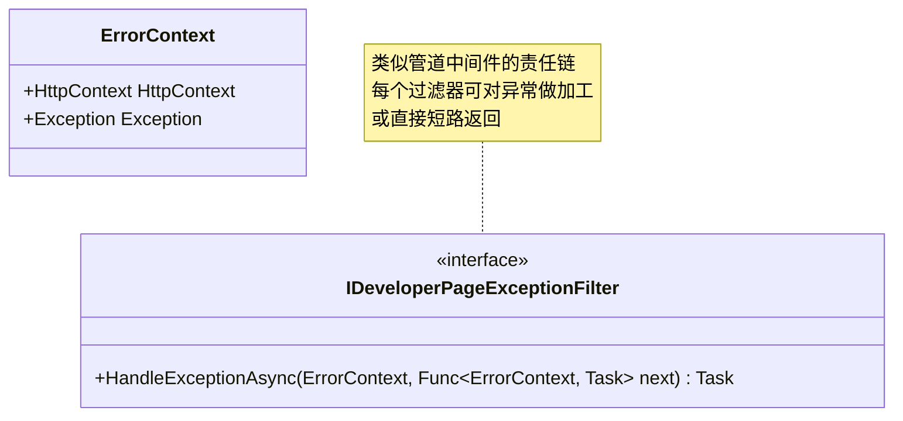

**`IDeveloperPageExceptionFilter` 的设计意图**：在「**渲染异常页之前**」插入预处理逻辑 —— 例如：

- 把领域异常翻译成更友好的提示；
- 把异常上下文加上业务信息再传给下一个过滤器；
- 或者直接处理掉某些已知异常（短路，不再走默认渲染）。

### 2.2 过滤器责任链构建

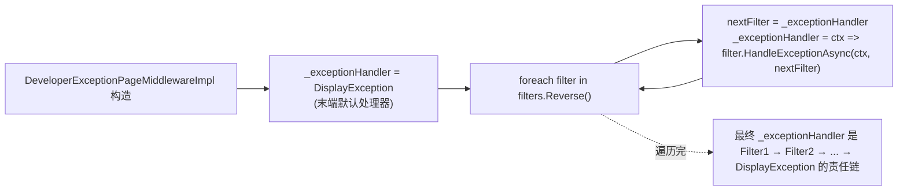

**关键代码**（精简）：

```C#
_exceptionHandler = DisplayException;                       // 末端
foreach (var filter in filters.Reverse())                   // 倒序遍历
{
    var nextFilter = _exceptionHandler;
    _exceptionHandler = errorContext => filter.HandleExceptionAsync(errorContext, nextFilter);
}
```

**「倒序构建 + 闭包包装」是中间件管道的同一模式**（参考 `Notes/管道中间件.md` §5.3）—— 让第一个注册的 filter 在管道最外层。

### 2.3 DeveloperExceptionPageMiddlewareImpl 完整流程

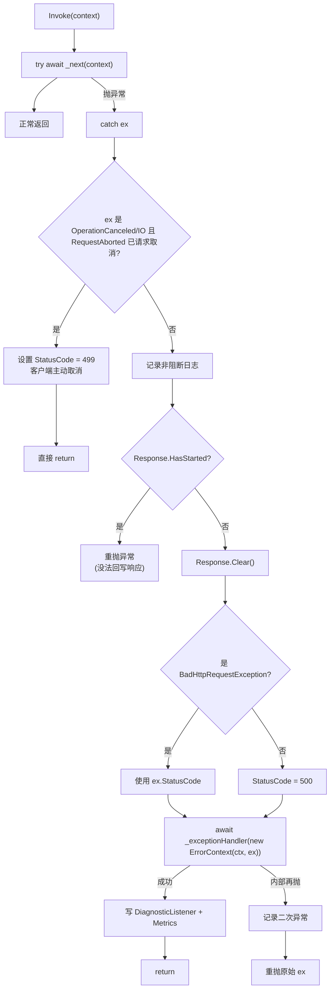

**两条短路路径**：

1. **客户端主动取消**：用 HTTP 499（业界惯例，非 RFC 标准）标记，避免被当成服务端错误；
2. **响应已开始**：HTTP 头已发出，无法回写错误页 → 重抛让上层处理。

### 2.4 内容协商：text/html vs text/plain

`DisplayException` 末端方法根据 `Accept` 请求头决定输出格式：

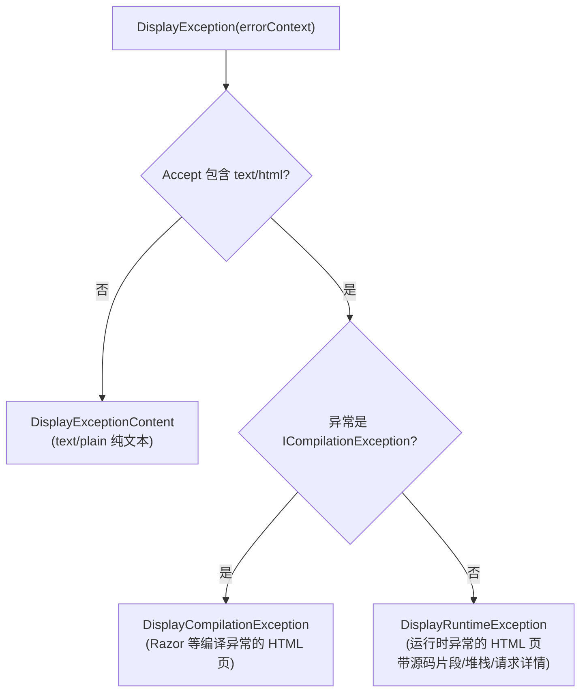

**`ICompilationException` 的特殊处理**：Razor 页面是「**运行时编译 .cshtml → C# → IL**」，编译期错误需要专门展示编译错误的位置和上下文。

**源码片段显示**：`DeveloperExceptionPageOptions.SourceCodeLineCount` 默认 6 行（异常位置前后各 6 行）—— 通过 `ExceptionDetailsProvider` 从 `IFileProvider` 读取源文件。

### 2.5 客户端取消请求的特殊处理

```C#
// DeveloperExceptionPageMiddlewareImpl.Invoke（精简）
if ((ex is OperationCanceledException || ex is IOException) && context.RequestAborted.IsCancellationRequested)
{
    if (!context.Response.HasStarted)
        context.Response.StatusCode = StatusCodes.Status499ClientClosedRequest;
    return;   // 不当作错误，直接返回
}
```

**为什么这样设计？**

- 客户端取消请求**不是服务端故障** —— 不应该记成 500，更不应触发完整的异常处理流程；
- HTTP 499 是 Nginx 引入的非标准状态码，已成业界惯例：「**客户端关闭连接**」；
- `ExceptionHandlerMiddlewareImpl` 中也有完全相同的逻辑（§3.3）。

---

## 3. 异常处理器中间件：ExceptionHandler

### 3.1 IExceptionHandler 与 ExceptionHandlerOptions

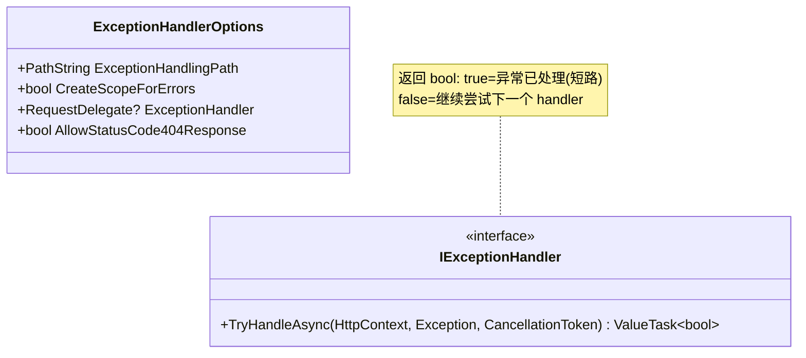

**`IExceptionHandler` 是 .NET 8 引入的轻量级扩展点** —— 可以通过 DI 注册多个 handler，框架按顺序尝试。返回 `true` 表示「**我已处理**」就停止；返回 `false` 让下一个 handler 接力。

### 3.2 三种异常处理路径

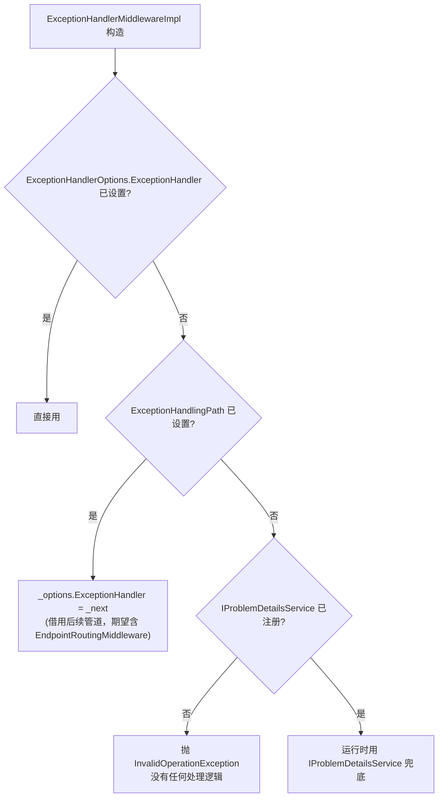

**三种处理方式按优先级**：

| 配置方式 | 何时使用 | 典型用户代码 |
|---------|---------|------------|
| `ExceptionHandler` 直接指定 `RequestDelegate` | 自定义异常处理逻辑 | `UseExceptionHandler(app => app.Run(...))` |
| `ExceptionHandlingPath` 重路由 | 自定义错误页面（如 Razor `/Error`） | `UseExceptionHandler("/Error")` |
| `IProblemDetailsService` 默认 | 返回 RFC 7807 JSON | 注册 `services.AddProblemDetails()` 后 `UseExceptionHandler()` |

### 3.3 ExceptionHandlerMiddlewareImpl 流程详解

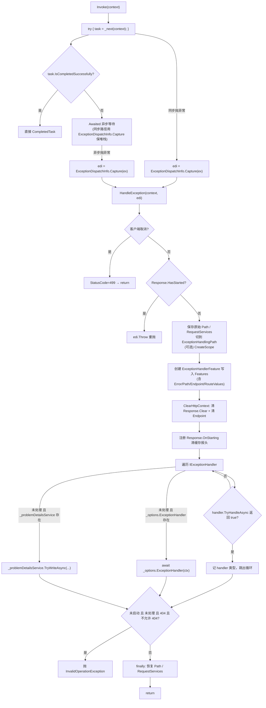

**关键设计点**：

- **`ExceptionDispatchInfo.Capture`** 保留原始堆栈，让最终 `Throw()` 时堆栈信息完整；
- **同步路径 + 异步路径**分别捕获异常，但都汇集到同一个 `HandleException` 方法；
- **`ClearHttpContext` 清 Endpoint**：因为路径已改为 `ExceptionHandlingPath`，原 Endpoint 不应保留；
- **`Response.OnStarting`** 注册回调，在响应即将发送时清掉缓存头（避免错误页被 CDN 缓存）。

### 3.4 ExceptionHandlerFeature 现场保留

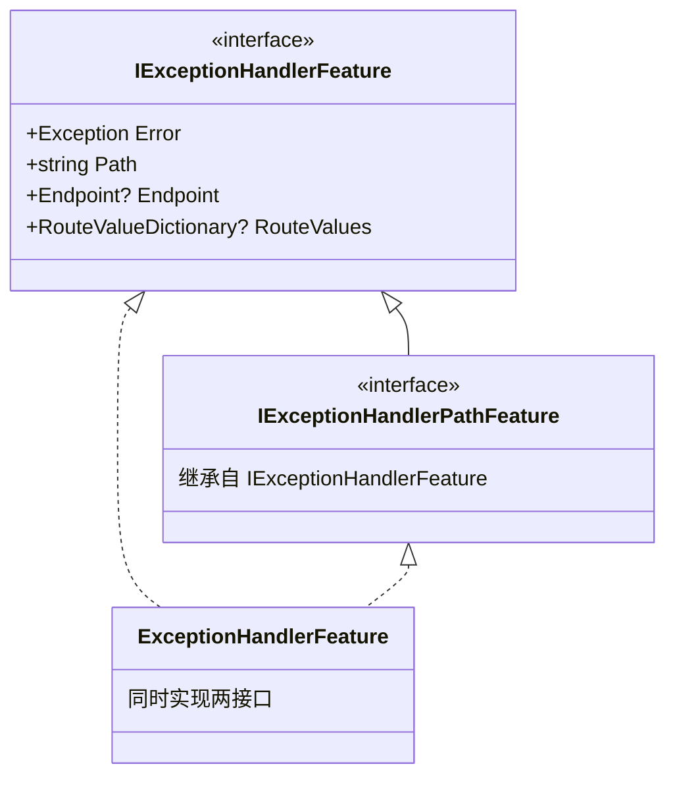

**「现场保留」的核心思想**：

- 中间件改了 `Request.Path`，原始路径丢了；
- 业务可能想知道**原始**请求路径、**原始**匹配到的 Endpoint、**原始**路由值；
- 全部塞进 `ExceptionHandlerFeature`，通过 `HttpContext.Features.Get<IExceptionHandlerFeature>()` 取回。

**典型用法**（在自定义错误页里）：

```C#
app.UseExceptionHandler("/Error");
app.Map("/Error", branch =>
{
    branch.Run(async ctx =>
    {
        var feat = ctx.Features.Get<IExceptionHandlerFeature>();
        await ctx.Response.WriteAsync($"原始路径: {feat?.Path}\n异常: {feat?.Error?.Message}");
    });
});
```

### 3.5 服务范围切换 CreateScopeForErrors

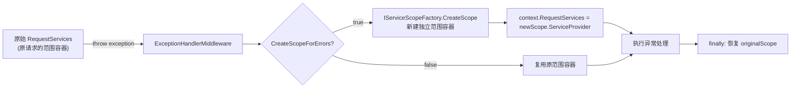

**为什么需要新作用域？**

- 原范围容器中可能含「**已损坏**」的服务实例（如 `DbContext` 因事务回滚处于不一致状态）；
- 异常处理逻辑想用「**干净的**」服务实例时，开启 `CreateScopeForErrors = true` 强制隔离；
- 默认 `false` 是为了性能 —— 大多数场景不需要。

### 3.6 404 响应的特殊处理

```C#
// 异常处理后检查（精简）
if (context.Response.HasStarted
    || handled
    || context.Response.StatusCode != StatusCodes.Status404NotFound
    || _options.AllowStatusCode404Response)
{
    return;  // 正常完成
}

// 否则抛异常 —— 表明配置错误
edi = ExceptionDispatchInfo.Capture(new InvalidOperationException(
    "The exception handler ... produced a 404 status response. " +
    "This is often due to a misconfigured ExceptionHandlingPath. " +
    "If 404 is expected, set AllowStatusCode404Response to true."));
```

**为什么 404 这么特殊？**

- `ExceptionHandlingPath = "/Error"` 但 `/Error` 没注册 → 重路由到 `/Error` 后路由匹配失败 → 末端 404；
- 此时用户看到 404，**完全不知道原始异常是什么** —— 静默吞错；
- 框架检测到「**异常处理路径返回 404**」 → 立即抛出 `InvalidOperationException` 包装原异常，强制让开发者意识到配置错误。

---

## 4. 路由重建：RerouteHelper

### 4.1 为什么需要重建路由管道

**`WebApplication` 编程模型**(`Notes/MinimalAPI.md` §5.3) 下，自动注入的中间件顺序大致是：

```
GenericWebHostService 实际管道（简化）：
ExceptionHandlerMiddleware  ← 用户调 UseExceptionHandler
     ↓
EndpointRoutingMiddleware   ← 自动注入
     ↓
中间件 N ...                 ← 用户自定义
     ↓
EndpointMiddleware           ← 自动注入
```

**问题**：用户配置 `UseExceptionHandler("/Error")` 想让异常重路由到 `/Error` —— 但 `ExceptionHandlerMiddleware` 在 `EndpointRoutingMiddleware` **之前**，重路由后没有路由中间件再处理 `/Error` 路径！

**`IHostBuilder` 编程模型**下不会出现这个问题：用户严格按 `UseRouting → UseEndpoints` 顺序调用，`UseExceptionHandler` 放在最前面是常态，重路由后管道本身就含 `EndpointRoutingMiddleware`。

### 4.2 Reroute 流程

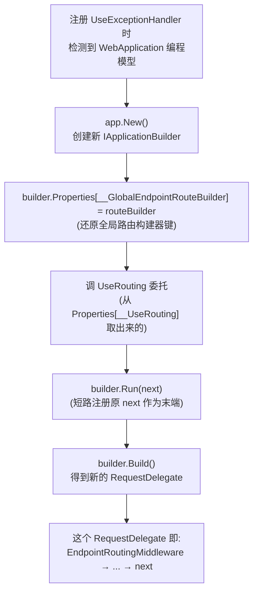

**关键代码**：

```C#
// RerouteHelper.Reroute（精简）
internal static RequestDelegate Reroute(IApplicationBuilder app, object routeBuilder, RequestDelegate next)
{
    if (app.Properties.TryGetValue(UseRoutingKey, out var useRouting)
        && useRouting is Func<IApplicationBuilder, IApplicationBuilder> useRoutingFunc)
    {
        var builder = app.New();
        builder.Properties[GlobalRouteBuilderKey] = routeBuilder;  // 还原全局路由
        useRoutingFunc(builder);                                    // 注入 EndpointRouting
        builder.Run(next);                                          // 把外部 next 当末端
        return builder.Build();
    }
    return next;  // 非 WebApplication 模型直接返回
}
```

**`Properties[__UseRouting]` 是哪里来的？** —— 在 `UseRouting` 扩展方法内部就把 **`UseRouting` 方法本身**写到 `Properties` 字典里（`Notes/路由.md` §9.5「Properties 共享字典」机制），让后续中间件能「**重新调用 UseRouting**」。

### 4.3 WebApplication vs IHostBuilder 编程模型差异

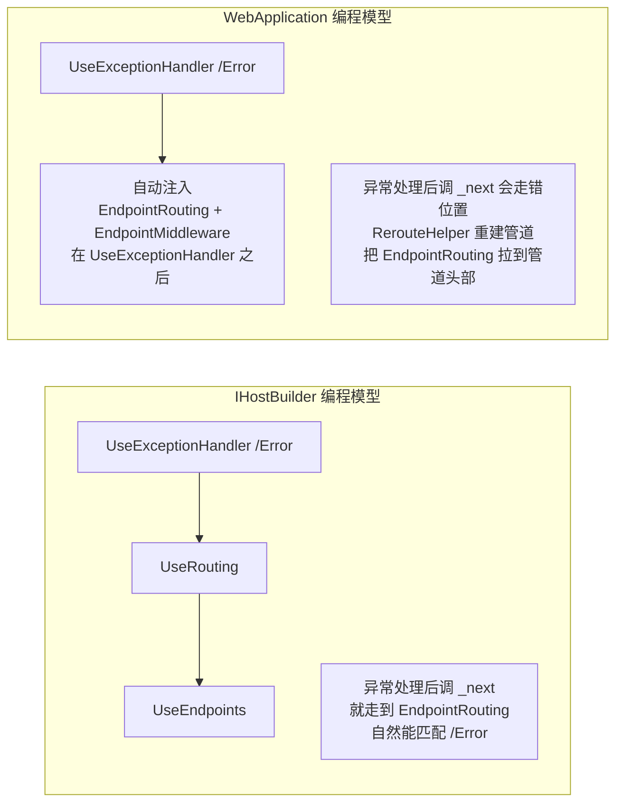

**`SetExceptionHandlerMiddleware` 的分支判断**：

```C#
// 简化
if (app.Properties.TryGetValue(RerouteHelper.GlobalRouteBuilderKey, out var routeBuilder)
    && routeBuilder is not null)
{
    // WebApplication 模型 - 用 Reroute
    return app.Use(next => {
        var newNext = RerouteHelper.Reroute(app, routeBuilder, next);
        options.Value.ExceptionHandler = newNext;
        return new ExceptionHandlerMiddlewareImpl(next, ..., options, ...).Invoke;
    });
}

// IHostBuilder 模型 - 直接注册
return app.UseMiddleware<ExceptionHandlerMiddlewareImpl>(options);
```

**`UseStatusCodePagesWithReExecute`** 也用同样的 Reroute 技巧（详见 §5.4）。

---

## 5. 响应状态码页：StatusCodePages

### 5.1 StatusCodeContext 与 StatusCodePagesOptions

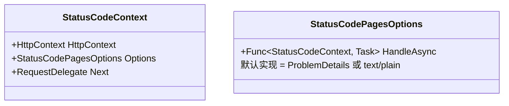

**`StatusCodeContext` 是 `HttpContext` 的轻包装** —— 让 `HandleAsync` 委托能拿到完整请求上下文 + 选项 + 后续中间件。

**默认 `HandleAsync` 的逻辑**：

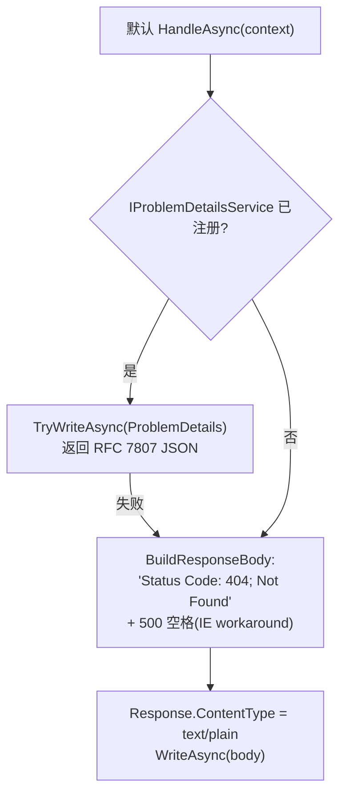

**500 空格 IE workaround**：早期 IE 在响应体小于 512 字节时会显示自己的「友好错误页」覆盖服务端响应。塞入 500 空格让响应体足够大，强制 IE 显示原始响应。

### 5.2 StatusCodePagesMiddleware 流程

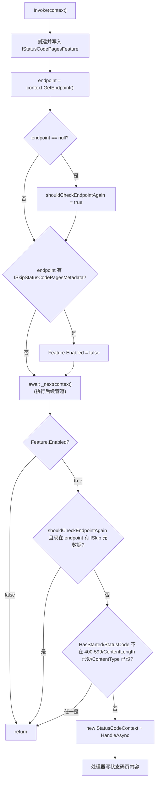

**5 个跳过条件**：

| 条件 | 原因 |
|------|------|
| `Feature.Enabled == false` | 用户/元数据明确不要状态码页 |
| `Response.HasStarted` | 响应已开始，无法回写内容 |
| `StatusCode < 400 || >= 600` | 不是错误状态码 |
| `ContentLength.HasValue` | 已经有内容长度，说明业务已经写过响应 |
| `!string.IsNullOrEmpty(ContentType)` | 已经设了 Content-Type，也说明业务写过响应 |

后两条防止「**业务已经返回了具体的 404 页**」时再覆盖 —— 状态码页是「**兜底**」机制。

### 5.3 IStatusCodePagesFeature 与 ISkipStatusCodePagesMetadata

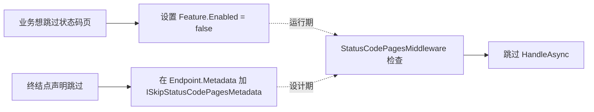

**两种跳过机制的差异**：

| 机制 | 决定时机 | 用法 |
|------|---------|------|
| `IStatusCodePagesFeature.Enabled = false` | **运行时**业务代码决定 | API 控制器明确返回 401，不要被覆盖 |
| `ISkipStatusCodePagesMetadata` | **注册时**通过元数据声明 | `app.MapGet(...).WithMetadata(new SkipStatusCodePagesAttribute())` |

### 5.4 三种处理方式：内联响应 / Redirect / ReExecute

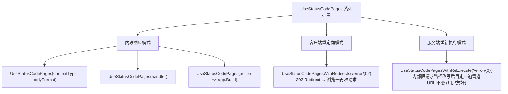

**`WithRedirects` vs `WithReExecute` 关键区别**：

| 维度 | `WithRedirects` | `WithReExecute` |
|------|----------------|-----------------|
| URL 变化 | ✅ 变 | ❌ 不变 |
| HTTP 状态码 | 先 4xx/5xx → 然后 302 → 然后 200 | 保持原始 4xx/5xx |
| 适用场景 | SSO 错误页跨域名跳转 | 友好错误页（URL 仍是 `/products/999`） |
| SEO | ❌ 302 不利于 SEO | ✅ 原始 URL 保留 |

### 5.5 IStatusCodeReExecuteFeature 现场保留

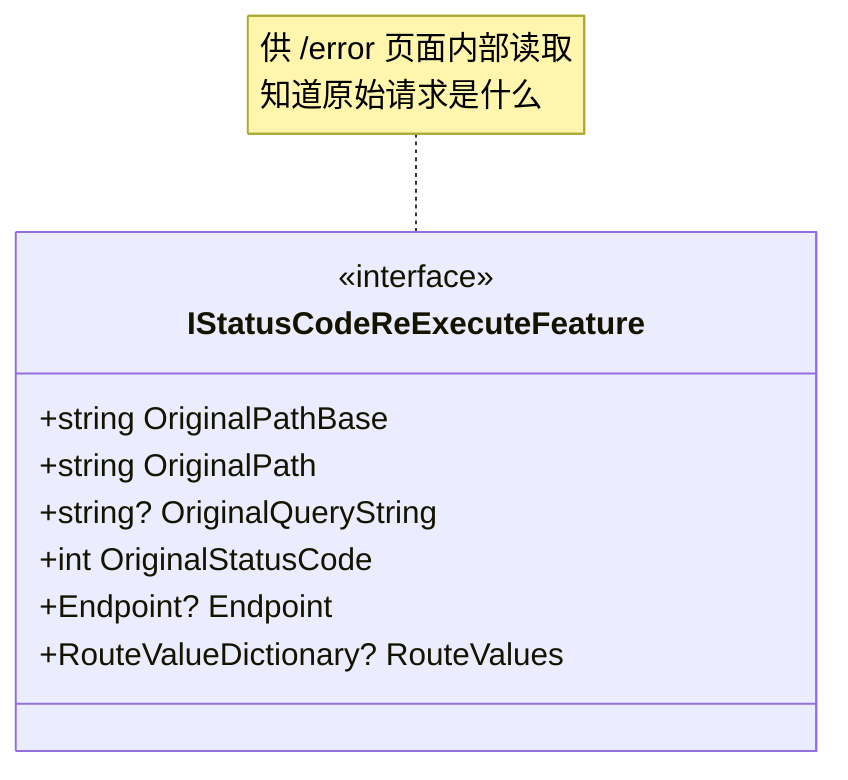

**Re-execute 流程**：

```mermaid
sequenceDiagram
    autonumber
    participant Mid as StatusCodePagesMiddleware
    participant Handler as ReExecute Handler
    participant Ctx as HttpContext
    participant Next as 后续管道(EndpointRouting...)

    Mid->>Handler: HandleAsync(statusCodeCtx)
    Handler->>Ctx: 保存 originalPath / originalQS / 原 Endpoint / 原 RouteValues
    Handler->>Ctx: 写入 IStatusCodeReExecuteFeature(全套原始信息)
    Handler->>Ctx: ClearEndpoint + 改 Request.Path = newPath
    Handler->>Next: await next(ctx) 重新走一遍管道
    Next->>Next: EndpointRouting 重新匹配 /error/[0]
    Next->>Next: EndpointMiddleware 执行 /error 终结点
    Next-->>Handler: 完成

    Handler->>Ctx: finally: 恢复 originalPath / QS<br/>移除 ReExecuteFeature
```

**关键点**：

- **必须保存全部原始状态**（路径、查询串、Endpoint、路由值），方便错误页通过 `Features.Get<IStatusCodeReExecuteFeature>()` 完整还原；
- **`ClearEndpoint`** 后才能让 `EndpointRoutingMiddleware` 重新匹配；
- **`finally` 恢复**让响应回到调用方时上下文不被「**污染**」。

---

## 6. 三种机制的协作与顺序

**典型的生产环境管道**：

```mermaid
flowchart LR
    A[UseHsts] --> B[UseHttpsRedirection]
    B --> C[UseExceptionHandler '/Error']
    C --> D[UseStatusCodePages]
    D --> E[UseStaticFiles]
    E --> F[UseRouting]
    F --> G[UseAuthentication]
    G --> H[UseAuthorization]
    H --> I[UseEndpoints]

    note["UseExceptionHandler 最靠外<br/>(后续任何中间件抛错都被它捕获)<br/>UseStatusCodePages 紧随其后<br/>(美化业务正常返回的 4xx/5xx)"]
    C -.- note
```

**典型的开发环境管道**：

```mermaid
flowchart LR
    A[UseDeveloperExceptionPage] --> B[UseStatusCodePages]
    B --> C[UseStaticFiles]
    C --> D[UseRouting]
    D --> E[...]

    note["UseDeveloperExceptionPage 替代 UseExceptionHandler<br/>暴露详细的诊断信息"]
    A -.- note
```

**为什么 `UseExceptionHandler` 在 `UseStatusCodePages` 之前？**

```
管道中间件顺序     →   实际执行顺序（请求方向）
UseExceptionHandler      EH 包装：try { ... } catch
UseStatusCodePages       SCP 包装：检查 4xx/5xx 状态码
其他中间件...
业务终结点
```

- **`EH` 在外层** → 业务抛异常时被 `EH` 捕获（写入 500 状态码 + 异常页）；
- **`SCP` 在内层** → 业务正常返回但状态码是 404 时被 `SCP` 美化；
- 若顺序反了：`SCP` 在外，`EH` 抛出的 500 也会被 `SCP` 捕获并尝试写状态码页 —— **状态码页可能覆盖异常页**。

---

## 7. 设计思想速览

### 7.1 try-catch 中间件模式

三个异常处理中间件都遵循同一模板：

```C#
public async Task Invoke(HttpContext context)
{
    try
    {
        await _next(context);
    }
    catch (Exception ex)
    {
        // 1. 检查特殊情况（客户端取消 / 响应已开始）
        // 2. 清理状态（Clear Response / Clear Endpoint）
        // 3. 委托给处理器
        // 4. 失败时重抛
    }
}
```

**关键约束**：`Response.HasStarted` 是中间件能否回写错误页的硬限制 —— 一旦响应头发出，TCP 已经把数据写出，框架无法撤回。

### 7.2 责任链 + 末端处理器

`DeveloperExceptionPageMiddlewareImpl` 与 `ExceptionHandlerMiddlewareImpl` 都用了**责任链 + 末端处理器**模式：

```mermaid
flowchart LR
    Filter1[Filter 1] --> Filter2[Filter 2] --> Filter3[Filter 3] --> Default[默认末端处理器]

    note["责任链可以:<br/>- 在异常处理前加工<br/>- 短路返回(不调 next)<br/>- 让默认处理器最终兜底"]
    Default -.- note
```

**两种实现的差异**：

| 中间件 | 责任链类型 | 链式 API |
|--------|----------|---------|
| `DeveloperExceptionPage` | `IDeveloperPageExceptionFilter` 责任链 | 必须调 `next` 才能继续 |
| `ExceptionHandler` | `IExceptionHandler` 列表 | 返回 `bool` 决定是否继续 |

### 7.3 现场保留：Feature + 路径还原

```mermaid
flowchart LR
    Modify["框架修改 HttpContext<br/>(Path / RequestServices / Features)"]
    Modify --> Save[保存原始值]
    Save --> Replace[写入 Feature 让业务能读]
    Replace --> Process[业务执行]
    Process --> Restore[finally 恢复原始值]
```

**三种保留方式**：

| 类型 | 实现 |
|------|------|
| `ExceptionHandlerFeature` | 保留原始 Path + Endpoint + RouteValues + Exception |
| `IStatusCodeReExecuteFeature` | 保留原始 Path / QueryString / StatusCode / Endpoint / RouteValues |
| `IStatusCodePagesFeature` | 仅一个 `Enabled` 标志 |

**为什么不直接读 `HttpContext`？** —— 框架已经修改了 `Path` 和 `Endpoint`，业务读到的是「**重路由后的状态**」。Feature 是唯一能拿到「**原始**」状态的接口。

### 7.4 路由重建：跨编程模型的桥接

`RerouteHelper.Reroute` 解决「**WebApplication 编程模型下中间件相对位置失控**」的问题：

```mermaid
flowchart TD
    Detect["检测 Properties[__GlobalEndpointRouteBuilder]"]
    Detect --> WA{"存在?"}

    WA -->|是 WebApplication| Build[临时构建一条 EndpointRouting → next 的管道]
    WA -->|否 IHostBuilder| Skip[直接复用 next，假设用户正确排序]
```

**这种「**框架自动桥接**」让用户不必关心两种编程模型的细节** —— 同一行 `UseExceptionHandler("/Error")` 在两种模型下都能工作。

### 7.5 短路标记：HasStarted 与 IStatusCodePagesFeature.Enabled

「**短路**」在异常处理中无处不在：

| 短路触发 | 短路点 |
|---------|--------|
| `Response.HasStarted` | 异常中间件直接重抛（无法回写） |
| 客户端取消 | 异常中间件返回 499 不处理 |
| `IStatusCodePagesFeature.Enabled = false` | StatusCodePages 跳过处理 |
| `ISkipStatusCodePagesMetadata` 元数据 | 同上 |
| `Response.ContentType` 已设 | StatusCodePages 跳过处理 |
| `IExceptionHandler.TryHandleAsync` 返回 true | ExceptionHandler 停止遍历后续 handler |

**统一原则**：「**业务代码或框架已经表达了明确意图时，异常中间件不应干预**」。

---

## 8. 速查卡 & 陷阱清单

### 8.1 三种中间件对照速查

| 维度 | DeveloperExceptionPage | ExceptionHandler | StatusCodePages |
|------|----------------------|------------------|-----------------|
| 触发条件 | 后续抛异常 | 后续抛异常 | 后续返回 4xx/5xx 且无主体 |
| 注册方法 | `UseDeveloperExceptionPage` | `UseExceptionHandler` | `UseStatusCodePages` 系列 |
| 生产推荐 | ❌ 仅 Development | ✅ | ✅ |
| 输出内容 | 详细诊断 HTML | 自定义 / ProblemDetails | 自定义 / `text/plain` 默认 |
| 默认状态码 | 500 (或 4xx) | 500 | 不改 |
| 扩展点 | `IDeveloperPageExceptionFilter` 责任链 | `IExceptionHandler` 列表 + `ExceptionHandler` 委托 | `HandleAsync` 委托 |
| 现场保留 | 无 | `IExceptionHandlerFeature` | `IStatusCodePagesFeature` + `IStatusCodeReExecuteFeature` |

### 8.2 ExceptionHandlerOptions 配置组合

| 配置 | 行为 |
|------|------|
| 仅 `ExceptionHandler` | 直接调指定的 `RequestDelegate` |
| 仅 `ExceptionHandlingPath` | 重路由到该路径让管道继续处理 |
| 仅注册 `IProblemDetailsService` | 默认返回 RFC 7807 JSON |
| `CreateScopeForErrors = true` | 用新作用域执行异常处理 |
| `AllowStatusCode404Response = true` | 允许异常处理返回 404（默认禁止） |

### 8.3 StatusCodePages 三种扩展速查

| 扩展 | 行为 | URL |
|------|------|-----|
| `UseStatusCodePages()` | 默认 ProblemDetails 或 `text/plain` 简短文本 | 不变 |
| `UseStatusCodePagesWithRedirects("/error/{0}")` | 302 重定向到指定路径 | **变化** |
| `UseStatusCodePagesWithReExecute("/error/{0}")` | 服务端重新执行管道处理状态码 | 不变 |

### 8.4 10 大常见陷阱

1. **生产环境用 `UseDeveloperExceptionPage`**：暴露堆栈、源码、环境信息 = 严重安全风险。**对策**：仅在 `env.IsDevelopment()` 时启用。
2. **`UseStatusCodePages` 在 `UseStaticFiles` 之前**：静态文件 404 也被状态码页处理 → 浏览器看到的「文件找不到」页面其实是状态码页内容。**对策**：放在 `UseStaticFiles` 之后。
3. **`UseExceptionHandler("/Error")` 但没注册 `/Error` 路由**：异常处理后又是 404 → 框架抛 `InvalidOperationException` 提示「**ExceptionHandlingPath 配置错误**」。**对策**：确保 `MapGet("/Error", ...)` 或控制器路由。
4. **响应已开始后才抛异常**：异常中间件无法回写错误页，只能重抛。**对策**：业务尽量避免在写部分响应后再抛错（用先校验后写的模式）。
5. **`ExceptionHandler` 内自身又抛异常**：框架记日志但不再处理，重抛原始异常。**对策**：错误页 handler 必须**永不抛错**（用 `try/catch` 包内部逻辑）。
6. **在 `UseExceptionHandler(...)` 配置异常路由后 `IExceptionHandler` 不再执行**：源码先尝试 `_exceptionHandlers`，再 fallback 到 `_options.ExceptionHandler` —— 但若 `_options.ExceptionHandler` 已配置，**`IExceptionHandler` 仍然会优先尝试**。**对策**：理清执行顺序：handler 列表 → ExceptionHandler 委托 → ProblemDetails。
7. **`UseStatusCodePagesWithRedirects` SEO 不友好**：302 重定向被搜索引擎认为「**临时移动**」，错误页会被索引。**对策**：用 `UseStatusCodePagesWithReExecute` 保持 4xx 状态码。
8. **客户端取消请求被当 500 处理**：未识别 `OperationCanceledException + RequestAborted.IsCancellationRequested` 的代码会误报。**对策**：复用框架的判断逻辑，或检查 `context.RequestAborted.IsCancellationRequested`。
9. **`IExceptionHandlerFeature` 在自定义错误页中读不到**：错误页若用 `/Error` 重定向（302）而非 ReExecute，新的请求不持有 Feature。**对策**：用 `UseExceptionHandler("/Error")`（服务端重路由），不要用 302 重定向。
10. **`WebApplication` 模型下手动顺序错乱**：用户在 `app.UseRouting()` 之后才调 `app.UseExceptionHandler(...)` → `RerouteHelper.Reroute` 失效。**对策**：`UseExceptionHandler` 应该在所有路由 / 终结点中间件之**前**注册。

### 8.5 原笔记类型 → 本笔记小节 映射表

| 原笔记类型 | 本笔记小节 |
|-----------|-----------|
| `ErrorContext` | §2.1 |
| `IDeveloperPageExceptionFilter` | §2.1 / §2.2 |
| `DeveloperExceptionPageOptions` | §2.4 |
| `DeveloperExceptionPageMiddlewareImpl` | §2.3 / §2.4 / §2.5 |
| `DeveloperExceptionPageExtensions` | §6 |
| `IExceptionHandler` | §3.1 |
| `ExceptionHandlerOptions` | §3.1 / §3.2 / §8.2 |
| `ExceptionHandlerMiddlewareImpl` | §3.3 / §3.4 / §3.5 / §3.6 |
| `ExceptionHandlerExtensions` | §4.3 / §6 |
| `RerouteHelper` | §4 |
| `StatusCodeContext` | §5.1 |
| `StatusCodePageOptions` | §5.1 |
| `StatusCodePagesMiddleware` | §5.2 / §5.3 |
| `StatusCodePagesExtensions` | §5.4 / §5.5 |
