# 日志

> 本笔记是 ASP.NET Core（.NET 6）`Microsoft.Extensions.Logging` 与 `Microsoft.Extensions.Logging.Console` 的学习整理，配套源码解读位于仓库根目录 `日志.md`。
>
> 风格延续 `Notes/依赖注入.md` / `Notes/配置.md` / `Notes/选项.md`：以 Mermaid UML 图、设计原理、示例为主；源码片段只保留「不看代码无法说清」的几行。

## 0. 阅读指南

### 0.1 本笔记的定位

| 文件 | 视角 | 主体内容 |
|------|------|---------|
| `日志.md`（源码笔记） | **源码视角** | 逐类型贴源码 + 在源码中注释解读 |
| `Notes/日志.md`（本笔记） | **学习视角** | UML 图、设计原理、扇出机制、范围/过滤/格式化分层讲解、陷阱清单 |

### 0.2 推荐阅读顺序

- **首次学习**：§1 → §2 → §3 → §4 → §5 → §6 → §7 → §8 → §9。
- **只想理清「ILogger / ILoggerProvider / ILoggerFactory」的关系**：直接看 §1.3 与 §2.5。
- **找某个具体类型**：用 §9.4 「**原笔记类型 → 本笔记小节**映射表」反查。

### 0.3 与配置 / 选项章节的关系

日志系统几乎全部依赖前两章的基础设施：

- `LoggerFilterOptions` / `LoggerFactoryOptions` 都是 `Options<T>` 模式承载；
- 配置文件 `Logging:LogLevel:...` 段通过 `LoggerFilterConfigureOptions` 桥接到选项；
- 配置变更通过 `IOptionsMonitor<LoggerFilterOptions>` 触发过滤规则重建（详见 §4.3）。

如果你对 `IOptionsMonitor` / `IChangeToken` 仍有疑问，请先回顾 `Notes/选项.md` §3.3 与 `Notes/配置.md` §4。

---

## 1. 全景：日志子系统的三层结构

### 1.1 三层结构

```mermaid
flowchart TB
    subgraph 应用层
        Code["业务代码<br/>logger.LogInformation(\"...\")"]
    end

    subgraph 编排层
        IL[ILogger&lt;T&gt; / ILogger]
        LF[ILoggerFactory<br/>编排所有 Provider<br/>统一过滤 + 范围]
        IL --> LF
    end

    subgraph 输出层
        P1[ConsoleLoggerProvider]
        P2[DebugLoggerProvider]
        P3[EventLogLoggerProvider]
        P4[自定义 Provider]
    end

    Code --> IL
    LF -.fan-out.-> P1 & P2 & P3 & P4

    P1 --> Out1[控制台]
    P2 --> Out2[VS 输出窗口]
    P3 --> Out3[Windows 事件日志]
    P4 --> Out4[自定义目的地]
```

**关键认知**：

- **应用层只与 `ILogger` 打交道**，不知道也不关心实际有几个 Provider；
- **编排层（LoggerFactory）负责扇出**：一条 `Log()` 调用被转发到所有注册的 Provider；
- **输出层（Provider）各自独立**：哪怕一个 Provider 崩了，其他照常工作（详见 §3.4）；
- **过滤、范围、格式化都在编排层完成**，Provider 只负责「**最终落地**」。

### 1.2 一条日志的旅程

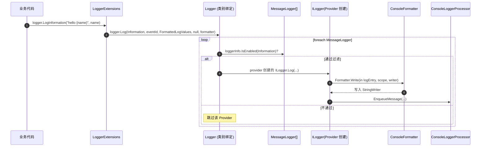

### 1.3 核心类型一览

| 分类 | 类型 | 角色 |
|------|------|------|
| 基础值 | `LogLevel` / `EventId` | 等级 + 事件标识 |
| 抽象 | `ILogger` / `ILogger<T>` / `ILoggerProvider` / `ILoggerFactory` | 四大门面 |
| 默认实现 | `Logger` / `Logger<T>` / `LoggerFactory` | 框架内部实现 |
| 编排辅助 | `LoggerInformation` / `MessageLogger` / `ScopeLogger` | Logger 内部的三件套 |
| 过滤 | `LoggerFilterOptions` / `LoggerFilterRule` / `LoggerRuleSelector` | 规则与匹配 |
| 范围 | `IExternalScopeProvider` / `LoggerFactoryScopeProvider` / `Scope` | 日志范围栈 |
| 活动跟踪 | `Activity` / `ActivitySource` / `ActivityListener` / `LoggerFactoryOptions` | 跨服务关联 |
| DI 集成 | `LoggingServiceCollectionExtensions` / `LoggingBuilder` / `LoggingBuilderExtensions` / `FilterLoggingBuilderExtensions` | 注册扩展 |
| 配置桥接 | `LoggerFilterConfigureOptions` / `LoggingConfiguration` / `ILoggerProviderConfigurationFactory` / `LoggerProviderConfiguration<>` / `LoggerProviderOptions` / `LoggerProviderConfigureOptions<,>` / `LoggerProviderOptionsChangeTokenSource<,>` | 配置 → 选项 → 过滤规则 |
| API 糖 | `LoggerExtensions` / `LoggerMessage` | `LogInformation` 等 + 高性能日志 |
| Console | `ConsoleLoggerProvider` / `ConsoleLogger` / `LogEntry<>` / `ConsoleFormatter` / `ConsoleFormatterOptions` / `SimpleConsoleFormatterOptions` / `ConsoleLoggerOptions` / `ConsoleLoggerExtensions` 等 | 具体 Provider 示例 |

---

## 2. 日志模型核心抽象

### 2.1 EventId 与 LogLevel

`LogLevel` 是按严重程度由低到高的 7 级枚举：

```
Trace(0) < Debug(1) < Information(2) < Warning(3) < Error(4) < Critical(5)    None(6) = 关闭
```

**`None` 不参与日志输出**，它的作用是「**关闭某类日志**」（如设置全局 `MinLevel = None`）。任何 `level >= MinLevel` 才通过过滤；而 `None` 是最大值，任何 `level` 都不满足 `>= None`，于是全部被丢弃。

`EventId` 是个 `readonly struct`，包含 `Id` 和 `Name`：

| 特性 | 实现细节 |
|------|---------|
| `int → EventId` 隐式转换 | 写日志时可以直接传 `42` 而非 `new EventId(42)` |
| `==` / `!=` 重载 | 比较以 `Id` 为准，`Name` 仅用于 `ToString` |
| 作为字典 Key 高效 | `GetHashCode()` 直接返回 `Id`，零反射 |

### 2.2 ILogger 三件套

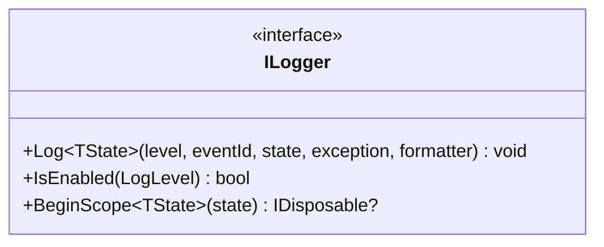

| 方法 | 用途 | 调用方式 |
|------|------|---------|
| `Log<TState>(...)` | 实际写日志 | 通常通过扩展方法 `LogInformation` 等间接调用 |
| `IsEnabled(level)` | 提前判断当前等级是否会输出 | 用于规避构造昂贵日志参数（如 JSON 序列化大对象） |
| `BeginScope<TState>(state)` | 开启日志范围 | `using (logger.BeginScope("op {id}", x)) { ... }` |

**`TState` 泛型设计**：让日志「**荷载**」可以是任意类型。常见用法：

- `string`：纯文本消息（`logger.Log(Info, "hello")`）；
- `FormattedLogValues`：`"hello {name}"` + 参数数组的封装（扩展方法默认产生）；
- 自定义结构体：高性能日志场景使用 `LoggerMessage.Define` 生成的强类型荷载。

### 2.3 ILogger<TCategoryName> 与日志类别

`ILogger<T>` 只是 `ILogger` 的标记泛型 + 自动类别命名：

```C#
// Logger<T> 的核心
public Logger(ILoggerFactory factory)
{
    _logger = factory.CreateLogger(
        TypeNameHelper.GetTypeDisplayName(typeof(T),
            includeGenericParameters: false,
            nestedTypeDelimiter: '.'));
}
```

**类别名约定**：

- `class OrderService` → 类别 `"MyApp.Services.OrderService"`；
- `class Container<T>` → **不含**泛型参数：`"MyApp.Container"`；
- 嵌套类 `Outer.Inner` → 使用 `.` 分隔：`"MyApp.Outer.Inner"`。

这个类别字符串就是后续过滤规则（§4）匹配的关键。

### 2.4 ILoggerFactory 与 ILoggerProvider

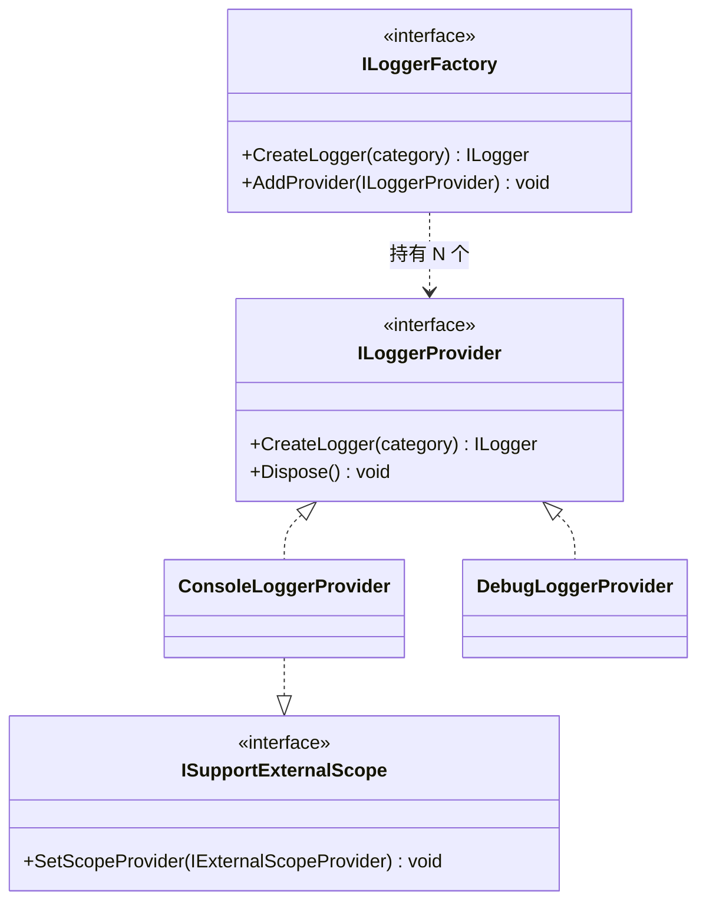

**容易混淆的两个 `CreateLogger`**：

| 方法 | 调用方 | 实际产出 |
|------|--------|---------|
| `ILoggerFactory.CreateLogger(category)` | 业务代码 | 一个 `Logger`（编排者） |
| `ILoggerProvider.CreateLogger(category)` | `LoggerFactory` 内部 | Provider 自家的 `ILogger`（如 `ConsoleLogger`） |

业务代码看到的 `ILogger` 是**编排者** —— 它在内部持有每个 Provider 创建的真实 `ILogger`（详见 §3.1）。

### 2.5 三角扇出关系

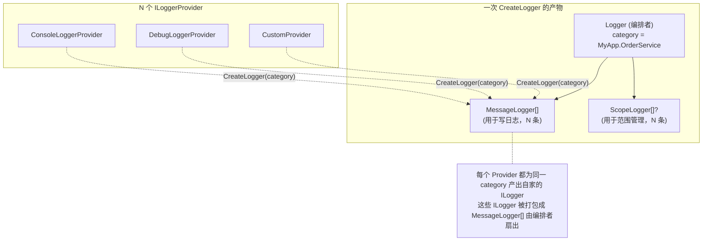

**关键认知**：编排者 `Logger` 持有 **`LoggerInformation[]`、`MessageLogger[]`、`ScopeLogger[]?`** 三个并行数组。一次 `Log` 调用会**遍历所有 `MessageLogger`，每个独立判断过滤，独立调用各自 Provider 的 `ILogger.Log`**。

---

## 3. LoggerFactory 与多 Provider 扇出

### 3.1 LoggerInformation / MessageLogger / ScopeLogger 三件套

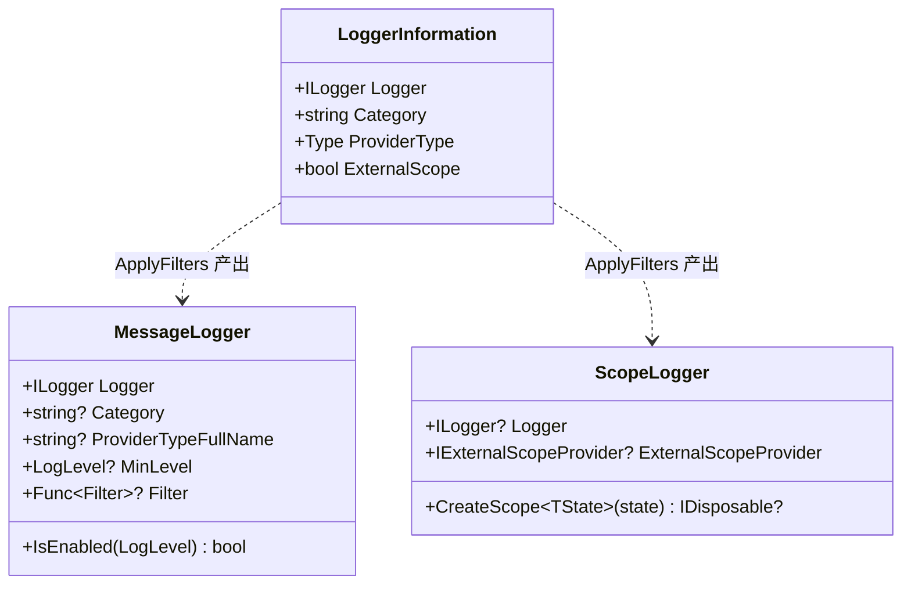

**职责切分**：

- **`LoggerInformation`**：「**原始信息**」—— 只记录 Provider 类型、Provider 创建的 `ILogger`、类别；
- **`MessageLogger`**：「**带过滤规则的 ILogger**」—— 在原始 `ILogger` 上额外缠了 `MinLevel` 和 `Filter`；
- **`ScopeLogger`**：「**范围管理委托**」—— 决定范围操作走 Provider 自家 `BeginScope` 还是走 `IExternalScopeProvider`。

**为什么把过滤信息预计算到 `MessageLogger`？** 高频路径上 `Logger.Log` 会被调到很多次，每次都重新匹配 `LoggerFilterRule` 太贵。规则被预先「**烧录**」到 `MessageLogger.MinLevel` 与 `Filter` 字段里，运行时 `IsEnabled` 就是一次字段读取 + 一次委托调用。

### 3.2 LoggerFactory.CreateLogger 时序

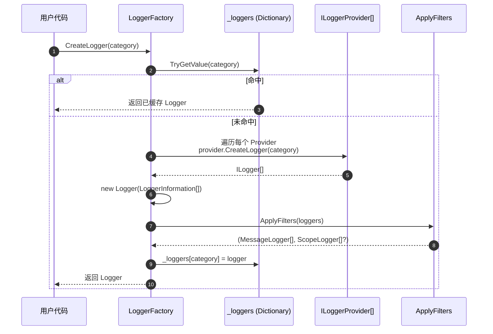

**线程安全**：`_loggers` 字典的所有操作都在 `lock (_sync)` 保护下进行 —— 注意它**不**用 `ConcurrentDictionary`，因为需要把「**查表**」「**新建 Logger**」「**应用过滤**」「**写入字典**」做成原子操作（否则可能写出未应用过滤的中间态）。

### 3.3 AddProvider 的动态扩容

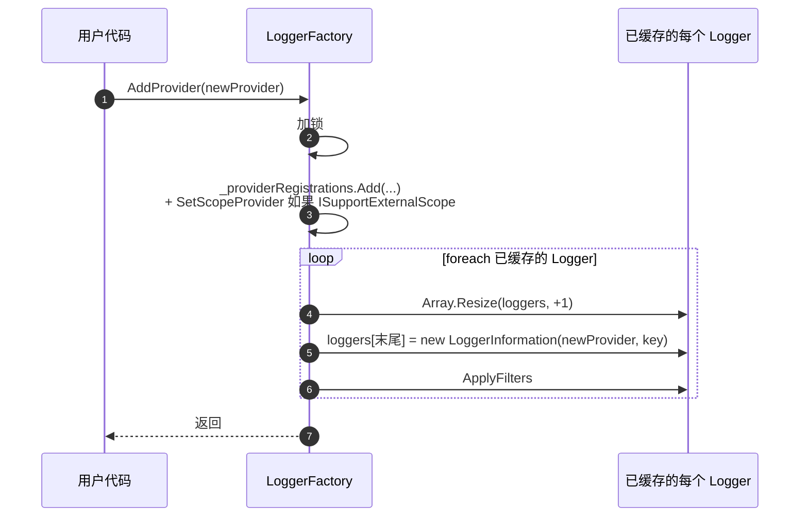

**关键认知**：

- `AddProvider` 不仅注册新 Provider，还要**回填**到所有已缓存的 `Logger` —— 否则旧 Logger 不知道新 Provider 存在；
- 数组扩容用 `Array.Resize`（原地拷贝到新数组），避免用 `List<>` 引入额外索引开销 —— 因为后续高频 `Log()` 调用要遍历这个数组。

### 3.4 异常隔离

`Logger.Log` 的关键代码片段：

```C#
static void LoggerLog(..., ref List<Exception>? exceptions, ...)
{
    try { logger.Log(logLevel, eventId, state, exception, formatter); }
    catch (Exception ex)
    {
        exceptions ??= new List<Exception>();
        exceptions.Add(ex);
    }
}
// 所有 Provider 调用完毕后
if (exceptions != null && exceptions.Count > 0)
    throw new AggregateException("An error occurred while writing to logger(s).", exceptions);
```

**设计意图**：

- 单个 Provider 抛错**不会**阻止其他 Provider 写日志（已经收集到的异常先存起来）；
- 所有 Provider 处理完后，如果收集到任何异常就一次性 `AggregateException` 抛出；
- 这种「**收集再抛**」模式适用于「**多个独立操作不应互相影响**」的场景，与 DI 的 `ValidateOnBuild` 一致。

### 3.5 LoggerFactory.Create 静态工厂

```C#
public static ILoggerFactory Create(Action<ILoggingBuilder> configure)
{
    var serviceCollection = new ServiceCollection();
    serviceCollection.AddLogging(configure);
    ServiceProvider serviceProvider = serviceCollection.BuildServiceProvider();
    ILoggerFactory loggerFactory = serviceProvider.GetRequiredService<ILoggerFactory>();
    return new DisposingLoggerFactory(loggerFactory, serviceProvider);
}
```

这个静态方法是**「不通过 DI 容器也能用日志」**的便捷入口。常用于：

- 控制台小工具；
- 测试代码；
- 库代码需要本地日志但不想强依赖 DI。

**`DisposingLoggerFactory` 包装**的意义：把 `ILoggerFactory` 与 `ServiceProvider` 绑定在一起 —— 释放 factory 时连同 `ServiceProvider` 一起释放。

---

## 4. 过滤系统：从配置到 MessageLogger

### 4.1 LoggerFilterOptions / LoggerFilterRule 类图

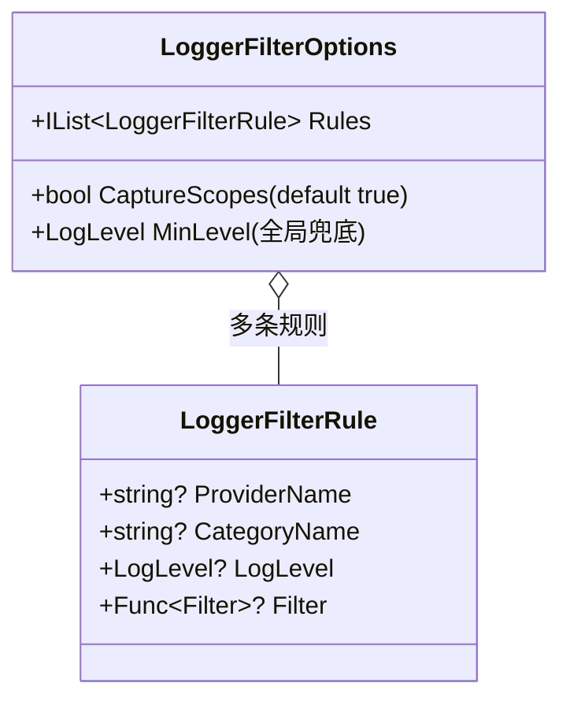

每条 `LoggerFilterRule` 描述一个「**`(ProviderName, CategoryName)` 匹配 → 输出某 `LogLevel` / 调用某 `Filter` 委托**」的规则：

| ProviderName | CategoryName | 语义 |
|--------------|--------------|------|
| `null` | `null` | 全局默认 |
| `null` | `"Microsoft"` | 类别前缀为 `Microsoft` 的所有 Provider |
| `"Console"` | `null` | 只针对控制台 Provider 的所有类别 |
| `"Console"` | `"Microsoft.Hosting"` | 控制台 + 特定类别 |

**`null` 视为通配** —— 与 `Notes/选项.md` §4.3 `ConfigureNamedOptions.Name == null` 是同一个模式。

### 4.2 规则匹配算法（LoggerRuleSelector）

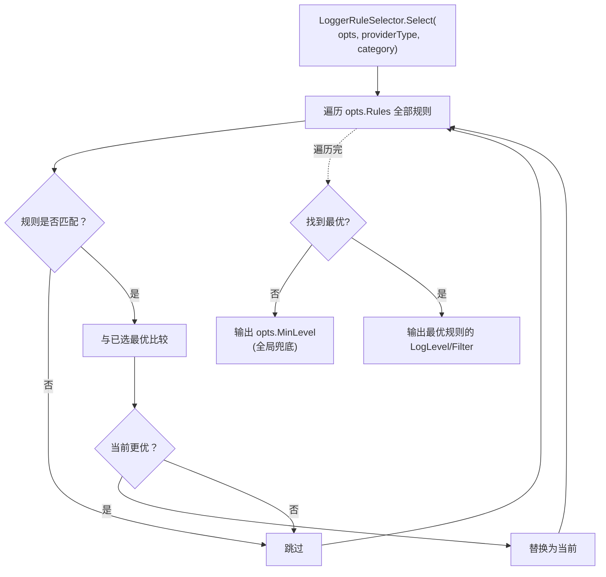

**「更优」的四条规则**（按优先级从高到低）：

1. **指定 ProviderName 的规则** > **没指定 ProviderName 的规则**（Provider 别名 / 类型全名都算指定）；
2. **CategoryName 前缀匹配最长的赢**：例如类别 `Foo.Bar.Baz`，规则 `Foo.Bar` 比 `Foo` 更具体；
3. **同样优先级时取最后注册的**；
4. **以上都没匹配**：使用 `LoggerFilterOptions.MinLevel` 全局兜底。

**「最长前缀」匹配是什么意思？** 类别 `Microsoft.Hosting.Lifetime` 会被以下任意一条规则匹配：

```
Microsoft       → 长度 9
Microsoft.Host  → 长度 14   ← 更优
Microsoft.Hosting → 长度 17 ← 最优
```

但要注意：**前缀匹配在「`.`」分段边界处生效** —— `"Mic"` 不会匹配 `"Microsoft"`。

### 4.3 RefreshFilters：配置变更触发过滤规则重建

```mermaid
sequenceDiagram
    autonumber
    participant Cfg as appsettings.json
    participant Mon as IOptionsMonitor&lt;LoggerFilterOptions&gt;
    participant LF as LoggerFactory.RefreshFilters
    participant Cache as _loggers
    participant L as 每个 Logger

    Cfg-->>Mon: 文件修改 → 触发 IChangeToken
    Mon-->>LF: 回调 RefreshFilters(newOptions)
    LF->>LF: lock(_sync) + _filterOptions = newOptions
    loop foreach logger in _loggers
        LF->>L: ApplyFilters(logger.Loggers)
        Note over L: 重新计算 MessageLogger.MinLevel / Filter
        L-->>LF: 更新 logger.MessageLoggers + ScopeLoggers
    end
```

**关键认知**：

- **`_loggers` 字典里的 `Logger` 实例是稳定的**（不会被替换）；
- 改变的只是 `Logger` 内部的 `MessageLoggers` / `ScopeLoggers` 数组；
- 业务代码持有的 `ILogger` 引用始终有效，但**下一次 `Log()` 调用就会用上新过滤规则**；
- `ApplyFilters` 在锁内同步执行 —— 哪怕是百万条 logger 也能保证一致性。

### 4.4 双层过滤：MessageLogger.IsEnabled vs ILogger.IsEnabled

`Logger.Log` 的过滤判断有**两层**：

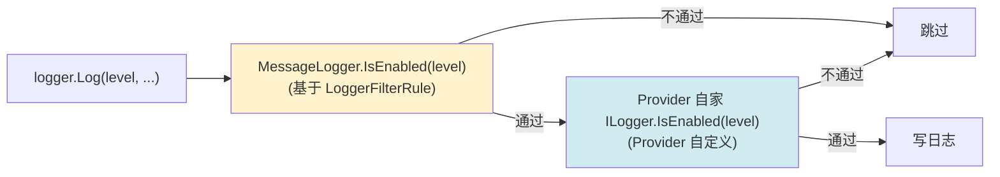

**两层目的不同**：

- **第一层 `MessageLogger.IsEnabled`** 应用框架级过滤规则（`LoggerFilterOptions`）；
- **第二层 `ILogger.IsEnabled`** 允许 Provider 实现自定义逻辑（如 `ConsoleLogger.IsEnabled` 只过滤 `LogLevel.None`）。

**`Logger.IsEnabled` 的「只要有一个 Provider 通过就 true」语义**：业务代码经常 `if (logger.IsEnabled(LogLevel.Debug))` 做昂贵参数构建。只要任何一个 Provider 会输出，就值得构建 —— 这是合理的「短路」逻辑。

### 4.5 IConfiguration → LoggerFilterOptions 桥接

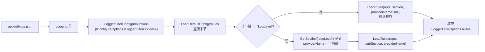

**典型 `appsettings.json` 结构**：

```json
{
  "Logging": {
    "LogLevel": {                                  // 默认规则（ProviderName = null）
      "Default": "Information",                    // → CategoryName=null
      "Microsoft.Hosting.Lifetime": "Warning"      // → CategoryName="Microsoft.Hosting.Lifetime"
    },
    "Console": {                                   // ConsoleLoggerProvider 别名
      "LogLevel": {                                // ProviderName="Console" 的规则
        "Default": "Debug"
      }
    }
  }
}
```

**解析后产生的 `LoggerFilterRule`**：

| ProviderName | CategoryName | LogLevel |
|--------------|--------------|----------|
| `null` | `null` | `Information` |
| `null` | `Microsoft.Hosting.Lifetime` | `Warning` |
| `Console` | `null` | `Debug` |

**特殊关键字 `"Default"`** 会被翻译为 `CategoryName = null`（通配全部类别）。

> 详见原笔记 第 1652–1752 行 `LoggerFilterConfigureOptions`。

---

## 5. 日志范围（Scope）与活动跟踪

### 5.1 三种范围实现

| 实现路径 | 范围栈位置 | 谁负责 |
|---------|----------|--------|
| `ILogger.BeginScope` | Provider 自己实现 | 每个 Provider（典型如旧版 `ConsoleLogger`） |
| `IExternalScopeProvider` | `LoggerFactory` 全局共享 | `LoggerFactoryScopeProvider` 默认实现 |
| `Activity` | `AsyncLocal<Activity?>` | `System.Diagnostics.Activity`（OpenTelemetry 体系） |

实际上**新版 Provider 几乎都用 `IExternalScopeProvider`**，因为：

- 一次 `BeginScope` 调用要让**所有 Provider** 知道；
- 让每个 Provider 自己实现范围管理会重复造轮子；
- 集中实现还能与 `Activity` 互操作（详见 §5.5）。

### 5.2 LoggerFactoryScopeProvider 的 AsyncLocal 栈

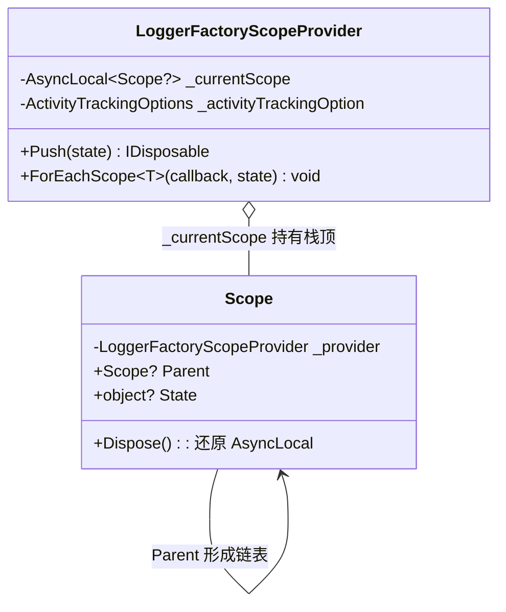

**`AsyncLocal<T>` 的语义**：值随当前异步上下文流动，跨 `await` 仍然可见。这让「**日志范围**」自然地跟随**逻辑控制流**走，而不必显式传递。

### 5.3 Push / Dispose 的链表式压栈

```mermaid
sequenceDiagram
    autonumber
    participant U as 业务代码
    participant SP as LoggerFactoryScopeProvider
    participant AL as AsyncLocal&lt;Scope?&gt;

    U->>SP: Push("op1")
    SP->>AL: 读取当前 = null
    SP->>SP: new Scope(state="op1", parent=null)
    SP->>AL: 写入 = newScope1
    SP-->>U: IDisposable(scope1)

    U->>SP: Push("op2")
    SP->>AL: 读取当前 = scope1
    SP->>SP: new Scope(state="op2", parent=scope1)
    SP->>AL: 写入 = newScope2
    SP-->>U: IDisposable(scope2)

    Note over U: ForEachScope 会从 scope2 沿 Parent 走到 scope1

    U->>SP: scope2.Dispose()
    SP->>AL: 写入 = scope2.Parent = scope1

    U->>SP: scope1.Dispose()
    SP->>AL: 写入 = scope1.Parent = null
```

**关键设计点**：

- **栈是隐式的** —— 没有实际的 `Stack<>`，靠 `Scope.Parent` 链表 + `AsyncLocal` 当前指针实现；
- **`Dispose` 必须按嵌套顺序** —— `scope2.Dispose()` 把当前指针还原为 `scope1`；如果错过了 `scope2.Dispose` 直接 dispose `scope1`，栈会乱掉；
- **`ForEachScope` 遍历方向**：递归调用 `Report(current.Parent)` 先走到根，再从根回调到当前 —— **保证回调顺序是「从根到当前」**。

### 5.4 ISupportExternalScope：把范围管理委托给 Factory

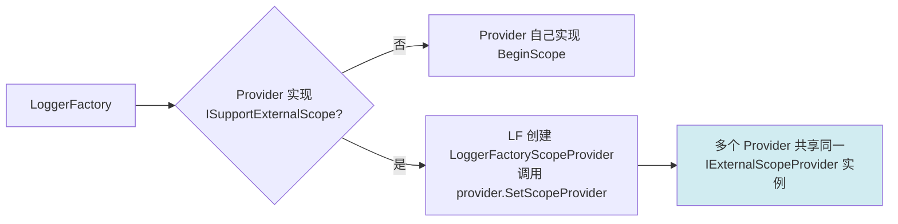

**`LoggerFactory.AddProviderRegistration` 的关键代码**：

```C#
if (provider is ISupportExternalScope supportsExternalScope)
{
    _scopeProvider ??= new LoggerFactoryScopeProvider(_factoryOptions.ActivityTrackingOptions);
    supportsExternalScope.SetScopeProvider(_scopeProvider);
}
```

**`??=` 的作用**：只创建**一个**全局 `LoggerFactoryScopeProvider`，所有支持外部范围的 Provider 共用 —— 这样 `BeginScope` 才能让所有 Provider 同时看到。

**`ApplyFilters` 中的对应处理**：

```C#
if (!loggerInformation.ExternalScope)            // Provider 自己实现 → 加入 ScopeLogger[]
    scopeLoggers?.Add(new ScopeLogger(logger: loggerInformation.Logger, externalScopeProvider: null));

if (_scopeProvider != null)                      // 全局外部 → 单独加一条
    scopeLoggers?.Add(new ScopeLogger(logger: null, externalScopeProvider: _scopeProvider));
```

意味着 `BeginScope` 调用时：

- 每个**自管范围**的 Provider 各调一次自家 `BeginScope`；
- 共享 `LoggerFactoryScopeProvider` 调一次 `Push`；
- 所有 `IDisposable` 被打包成 `Scope` 集合返回，统一 `Dispose`。

### 5.5 Activity 与 ActivityTrackingOptions

`Activity` 是 `System.Diagnostics` 的跨服务调用追踪机制（W3C Trace Context）。`LoggerFactoryOptions.ActivityTrackingOptions` 是位标志枚举：

| 标志 | 含义 |
|------|------|
| `SpanId` / `TraceId` / `ParentId` / `TraceFlags` / `TraceState` | W3C Trace Context 字段 |
| `Tags` / `Baggage` | OpenTelemetry 扩展 |
| `None` | 不开启 |

**启用时的效果**：`LoggerFactoryScopeProvider.ForEachScope` 在遍历范围栈之前，**先把当前 `Activity` 的字段作为一个虚拟范围**回调出去，再走 `_currentScope.Value` 链表：

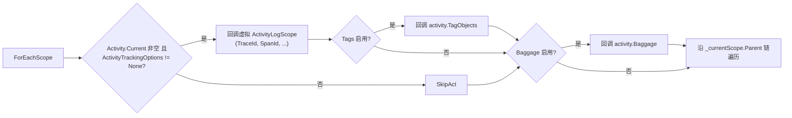

这就是为什么日志里能自动出现 `[TraceId: xxx SpanId: yyy] - your scope...` 这样的前缀。

### 5.6 LoggerMessage：高性能日志（简述）

`LoggerExtensions.LogInformation` 这类扩展方法每次都要分配 `FormattedLogValues`、装箱参数 —— 高频路径上不可忽视。`LoggerMessage.Define<T1, T2>(...)` 通过预编译消息模板和强类型委托规避这两个开销：

```C#
// 一次性定义
private static readonly Action<ILogger, int, string, Exception?> _orderProcessed =
    LoggerMessage.Define<int, string>(LogLevel.Information, new EventId(1, "OrderProcessed"),
        "Order {OrderId} processed for {Customer}");

// 业务代码调用
_orderProcessed(logger, 42, "Alice", null);
```

**收益**：

- 零字符串分配（模板已编译）；
- 强类型参数不装箱；
- `IsEnabled` 已在委托内部预检。

详细机制不展开，建议性能敏感场景使用。

---

## 6. 依赖注入与构建

### 6.1 AddLogging 注册的核心服务

```C#
// LoggingServiceCollectionExtensions.AddLogging（精简）
services.AddOptions();
services.TryAdd(ServiceDescriptor.Singleton<ILoggerFactory, LoggerFactory>());
services.TryAdd(ServiceDescriptor.Singleton(typeof(ILogger<>), typeof(Logger<>)));
services.TryAddEnumerable(ServiceDescriptor.Singleton<IConfigureOptions<LoggerFilterOptions>>(
    new DefaultLoggerLevelConfigureOptions(LogLevel.Information)));
configure(new LoggingBuilder(services));
```

| 服务 | 实现 | 生命周期 | 备注 |
|------|------|---------|------|
| `ILoggerFactory` | `LoggerFactory` | Singleton | 全局唯一编排者 |
| `ILogger<>` | `Logger<>` | Singleton | 泛型，按类别构造 |
| `IConfigureOptions<LoggerFilterOptions>` | `DefaultLoggerLevelConfigureOptions(Information)` | Singleton | 默认 MinLevel = Information |
| `ILoggerProvider`（多份） | 由 `AddConsole` 等扩展注册 | Singleton | **TryAddEnumerable** 注册多 Provider |

**`TryAddEnumerable` 的作用**：让多个 `AddConsole` / `AddDebug` / `AddEventLog` 调用各自注册自家 Provider 而不互相覆盖；同一 Provider 类型多次注册才会被去重。

### 6.2 ILoggingBuilder 链式 API

`LoggingBuilder` 本质上是「**带 `IServiceCollection` 引用的语法糖**」：

```C#
internal sealed class LoggingBuilder : ILoggingBuilder
{
    public LoggingBuilder(IServiceCollection services) { Services = services; }
    public IServiceCollection Services { get; }
}
```

所有 `ILoggingBuilder` 扩展方法都通过 `builder.Services.AddXxx` 实现。常用扩展：

| 扩展 | 作用 |
|------|------|
| `SetMinimumLevel(LogLevel)` | 注册 `DefaultLoggerLevelConfigureOptions` |
| `AddProvider(ILoggerProvider)` | 注册 Provider 实例（Singleton） |
| `ClearProviders()` | 移除所有已注册的 `ILoggerProvider` |
| `Configure(Action<LoggerFactoryOptions>)` | 配置活动跟踪选项 |
| `AddConfiguration(IConfiguration)` | 把 `Logging` 配置节桥接到选项 |
| `AddFilter(...)` | 添加 `LoggerFilterRule` |
| `AddConsole()` / `AddDebug()` / ... | 各 Provider 自带扩展 |

### 6.3 AddConfiguration 与 ILoggerProviderConfiguration<>

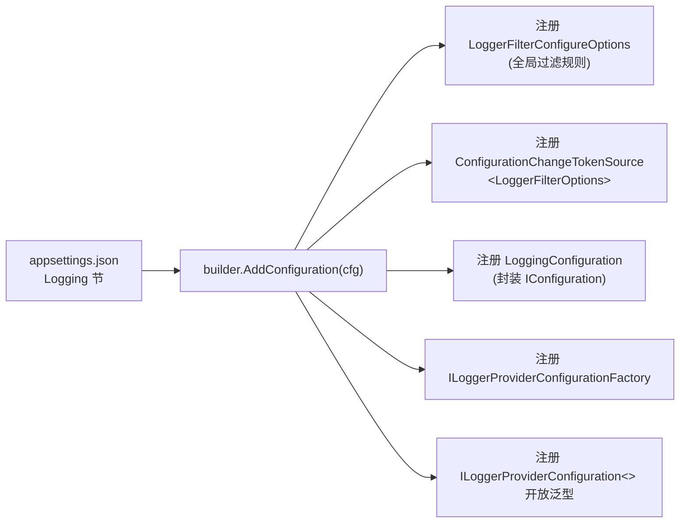

**`LoggingConfiguration` 仅是一个封装** —— 把 `IConfiguration` 包成可注入服务，便于工厂在 DI 解析时拿到。

### 6.4 LoggerProviderConfigurationFactory：为每个 Provider 切分配置树

`LoggerProviderConfigurationFactory.GetConfiguration(typeof(ConsoleLoggerProvider))` 返回的不是全局 `IConfiguration`，而是「**只属于这个 Provider 的子配置树**」：

```mermaid
sequenceDiagram
    autonumber
    participant DI as DI 解析
    participant LPC as LoggerProviderConfiguration&lt;ConsoleLoggerProvider&gt;
    participant Fac as LoggerProviderConfigurationFactory
    participant CB as ConfigurationBuilder
    participant Root as 全局 IConfigurationRoot

    DI->>LPC: 构造时注入 IFactory
    LPC->>Fac: GetConfiguration(typeof(ConsoleLoggerProvider))
    Fac->>CB: new ConfigurationBuilder()

    loop foreach LoggingConfiguration
        Fac->>Root: GetSection("Microsoft.Extensions.Logging.Console.ConsoleLoggerProvider")
        Fac->>CB: AddConfiguration(全名配置节)
        alt ProviderAlias 存在
            Fac->>Root: GetSection("Console")
            Fac->>CB: AddConfiguration(别名配置节)
            Note over CB: 别名后加，优先级更高
        end
    end

    Fac->>CB: Build()
    CB-->>LPC: 子配置树
    LPC-->>DI: 注入到 ConsoleLoggerProvider
```

**`ProviderAliasAttribute` 的作用**：让 `appsettings.json` 可以用短名 `"Console"` 而非全名 `"Microsoft.Extensions.Logging.Console.ConsoleLoggerProvider"`。后加的别名配置在 `ChainedConfigurationSource` 顺序中靠后，**优先级更高**（参考 `Notes/配置.md` §5.2「后注册者优先」）。

### 6.5 LoggerProviderOptions.RegisterProviderOptions：选项自动绑定

```C#
public static void RegisterProviderOptions<TOptions, TProvider>(IServiceCollection services) where TOptions : class
{
    services.TryAddEnumerable(
        ServiceDescriptor.Singleton<IConfigureOptions<TOptions>,
            LoggerProviderConfigureOptions<TOptions, TProvider>>());
    services.TryAddEnumerable(
        ServiceDescriptor.Singleton<IOptionsChangeTokenSource<TOptions>,
            LoggerProviderOptionsChangeTokenSource<TOptions, TProvider>>());
}
```

这一行调用做了**两件事**：

1. 用 `LoggerProviderConfigureOptions<TOptions, TProvider>` 把「**该 Provider 的子配置树**」绑定到 `TOptions`；
2. 用 `LoggerProviderOptionsChangeTokenSource<TOptions, TProvider>` 让 `TOptions` 在该子配置树变化时收到通知。

**关键认知**：`LoggerProviderConfigureOptions<TOptions, TProvider>` 继承 `ConfigureFromConfigurationOptions<TOptions>`（详见 `Notes/选项.md` §6.2），构造时通过 `ILoggerProviderConfiguration<TProvider>` 拿到子配置树。整个链路把「**配置子树 → 选项 → IOptionsMonitor → Provider 实时响应变更**」串了起来。

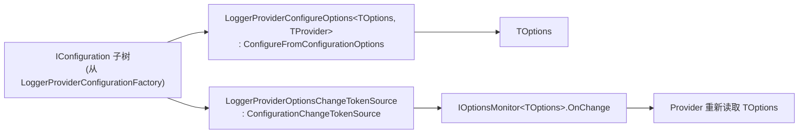

---

## 7. ConsoleLogger 案例剖析

ConsoleLogger 是官方提供的标杆 Provider 实现。理解它就理解了「**自定义 Provider 应该长什么样**」。

### 7.1 ConsoleLoggerProvider 类图

```mermaid
classDiagram
    class ConsoleLoggerProvider {
        -IOptionsMonitor&lt;ConsoleLoggerOptions&gt; _options
        -ConcurrentDictionary&lt;string, ConsoleLogger&gt; _loggers
        -ConcurrentDictionary&lt;string, ConsoleFormatter&gt; _formatters
        -ConsoleLoggerProcessor _messageQueue  (异步消息队列)
        -IDisposable? _optionsReloadToken
        -IExternalScopeProvider _scopeProvider
        +CreateLogger(name) ILogger
        +SetScopeProvider(IExternalScopeProvider) void
        +Dispose() void
    }
    class ConsoleLogger {
        -string _name
        -ConsoleLoggerProcessor _queueProcessor
        +ConsoleFormatter Formatter (可热更换)
        +IExternalScopeProvider? ScopeProvider
        +ConsoleLoggerOptions Options
        +Log&lt;T&gt;(...) void
    }
    class ConsoleFormatter {
        <<abstract>>
        +string Name
        +Write&lt;T&gt;(in logEntry, scope, writer) void
    }

    ConsoleLoggerProvider ..|> ILoggerProvider
    ConsoleLoggerProvider ..|> ISupportExternalScope
    ConsoleLoggerProvider o-- ConsoleLogger : N 个
    ConsoleLoggerProvider o-- ConsoleFormatter : 3+ 个
    ConsoleLogger --> ConsoleFormatter : 当前使用
```

**ProviderAlias 装饰**：`[ProviderAlias("Console")]` 让配置文件使用短名匹配（§6.4）。

### 7.2 三个内建格式化器

| 名称 | 类型 | 输出格式 |
|------|------|---------|
| `simple` | `SimpleConsoleFormatter` | 默认人类可读，支持颜色 |
| `systemd` | `SystemdConsoleFormatter` | systemd journal 兼容（无颜色 + 等级前缀） |
| `json` | `JsonConsoleFormatter` | 结构化日志（容器化 / 日志聚合系统友好） |

**默认选取规则**：`ConsoleLoggerOptions.FormatterName` 优先；为空则按已废弃的 `Format` 枚举走 `Systemd` 或 `Simple`。`ReloadLoggerOptions` 会在选项变更时**实时切换**所有 `ConsoleLogger` 的格式化器。

### 7.3 ConsoleLoggerProcessor 异步消息队列

```mermaid
flowchart LR
    Log["ConsoleLogger.Log(...)"]
    Log --> Fmt["Formatter.Write → StringWriter"]
    Fmt --> Enq["_queueProcessor.EnqueueMessage<br/>(已格式化字符串)"]

    Enq --> Q["内部 BlockingCollection / 队列<br/>QueueFullMode: Wait / DropWrite<br/>MaxQueueLength: 默认 2500"]
    Q --> Worker["后台线程<br/>消费队列"]
    Worker --> Console["写入 IConsole<br/>(AnsiLogConsole 或 AnsiParsingLogConsole)"]

    style Worker fill:#d1ecf1
```

**异步队列的设计意图**：

- **解耦业务线程与终端 IO**：写控制台是阻塞 IO，直接在业务线程写会拖慢请求处理；
- **保证顺序**：单消费者线程依次出队，避免多线程交叉写入终端导致输出错乱；
- **背压策略**：`QueueFullMode.Wait`（阻塞）或 `DropWrite`（丢弃新写入），由用户决定。

### 7.4 选项变更如何触发实时切换

```mermaid
sequenceDiagram
    autonumber
    participant Cfg as 配置文件
    participant Mon as IOptionsMonitor&lt;ConsoleLoggerOptions&gt;
    participant CLP as ConsoleLoggerProvider
    participant Reload as ReloadLoggerOptions
    participant Loggers as 所有 ConsoleLogger

    Note over CLP: 构造时:<br/>_optionsReloadToken = _options.OnChange(ReloadLoggerOptions)

    Cfg-->>Mon: 文件变更
    Mon-->>CLP: 调 ReloadLoggerOptions(newOpts)
    Reload->>Reload: 选取新 Formatter (按 FormatterName)
    Reload->>Reload: 更新 _messageQueue.FullMode/MaxQueueLength
    loop foreach ConsoleLogger
        Reload->>Loggers: logger.Options = newOpts
        Reload->>Loggers: logger.Formatter = newFormatter
    end
```

**关键认知**：

- `ConsoleLogger` 的 `Formatter` 和 `Options` 是**可写字段** —— 让 Provider 能在外部触发变更时直接替换；
- 业务代码持有的 `ILogger` 引用始终有效，下一次 `Log()` 会用新格式化器；
- `_optionsReloadToken.Dispose()` 在 Provider 释放时取消订阅，避免泄漏。

### 7.5 ConsoleLoggerOptions 的废弃字段与迁移

| 废弃字段 | 替代方案 |
|---------|---------|
| `ConsoleLoggerOptions.Format` (`Default` / `Systemd`) | `FormatterName` + 字符串名 |
| `ConsoleLoggerOptions.DisableColors` | `SimpleConsoleFormatterOptions.ColorBehavior` |
| `ConsoleLoggerOptions.IncludeScopes` | `ConsoleFormatterOptions.IncludeScopes` |
| `ConsoleLoggerOptions.TimestampFormat` | `ConsoleFormatterOptions.TimestampFormat` |
| `ConsoleLoggerOptions.UseUtcTimestamp` | `ConsoleFormatterOptions.UseUtcTimestamp` |

**迁移路径**：从「**Logger 选项里塞格式化细节**」转向「**Formatter 自带 Options**」—— 责任更清晰，也允许第三方 Formatter 定义自己的选项类型。

**`UpdateFormatterOptions` 的兼容逻辑**：如果用户仍在用旧字段，Provider 会把旧字段值「**复制**」到新 `FormatterOptions` 上，确保旧配置文件继续工作（详见 `ConsoleLoggerProvider.UpdateFormatterOptions`）。

---

## 8. 设计思想速览

### 8.1 工厂 + 扇出

`LoggerFactory.CreateLogger(category)` 是「**多源整合点**」：

- 业务代码只关心**一个** `ILogger`；
- 框架内部把它扇出到 N 个 Provider；
- Provider 增删时，所有已分发的 `ILogger` 实例**自动同步**（§3.3）。

这是「**门面模式 + 工厂模式 + 观察者模式**」的复合应用。

### 8.2 双层过滤

| 层级 | 实现 | 控制权 |
|------|------|--------|
| 框架级 | `MessageLogger.IsEnabled`（基于 `LoggerFilterRule`） | 用户在配置 / 注册时定义 |
| Provider 级 | `ILogger.IsEnabled` | Provider 自定义 |

**为什么需要两层？**

- 框架级让用户通过**配置文件**统一控制，无需修改代码；
- Provider 级允许 Provider 实现「**额外约束**」（如 `ConsoleLogger` 拒绝 `LogLevel.None`）。

两者**与逻辑**叠加 —— 任一层拒绝就放弃该 Provider 的输出。

### 8.3 选项 + IChangeToken 实现热重载

整个日志子系统的「**实时生效**」特性都建立在前两章的基础设施上：

```mermaid
flowchart LR
    File[appsettings.json] -.modify.-> Cfg[IConfigurationRoot]
    Cfg -.IChangeToken.-> Mon[IOptionsMonitor]
    Mon -.OnChange callback.-> Apply[业务逻辑响应]

    subgraph 日志系统的三处订阅
        Apply --> A1[LoggerFactory.RefreshFilters<br/>重建 MessageLogger.IsEnabled]
        Apply --> A2[ConsoleLoggerProvider.ReloadLoggerOptions<br/>替换 Formatter]
        Apply --> A3[各 Provider 自家选项的 OnChange]
    end
```

业务代码无需任何额外动作，配置变更自动逐级传导。

### 8.4 LoggerProviderConfiguration<>：按 Provider 切分配置树

```
全局配置:
{
  "Logging": {
    "LogLevel": { ... },          → 全局过滤（LoggerFilterOptions）
    "Console": {
      "FormatterName": "json",
      "FormatterOptions": { ... }, → ConsoleFormatter 子选项
      "LogLevel": { ... }          → 仅针对 Console 的过滤
    },
    "Debug": { ... }
  }
}
```

`LoggerProviderConfiguration<ConsoleLoggerProvider>` 让 `ConsoleLoggerProvider` **只看到 `Logging:Console` 子树** —— 这是「**配置作用域**」的优雅切分。

**这种「按消费者切配置」的模式可推广** —— 任何「**多个独立模块共用一个全局配置**」的场景都适用。

### 8.5 AsyncLocal 实现日志范围

`AsyncLocal<T>` 是 .NET 实现「**逻辑控制流上下文**」的标准工具。日志范围、活动跟踪、`HttpContext.Current` 都使用同一机制：

- **跨 `await` 流动**：异步代码里的范围不需要手动传递；
- **每个调用上下文独立**：并发请求不会互相干扰范围栈；
- **线程切换无感**：值随逻辑上下文走，不绑定到具体线程。

**陷阱提醒**：`AsyncLocal<T>` 的值在 `Task.Run` 启动的新任务里是**快照式拷贝** —— 父任务修改不会传递到子任务。日志范围一般不受影响（因为范围是只读的链表节点），但若使用可变 state 要小心。

---

## 9. 速查卡 & 陷阱清单

### 9.1 三种日志抽象对照

| 抽象 | 拿到方式 | 用途 |
|------|---------|------|
| `ILogger` | `factory.CreateLogger("category")` | 通用 |
| `ILogger<T>` | DI 注入 | 自动用类型全名作类别（最常用） |
| `ILoggerFactory` | DI 注入 | 显式控制类别名；或动态多类别场景 |

### 9.2 过滤规则匹配优先级

```
1. 指定 ProviderName 的规则  >  未指定的规则
2. CategoryName 前缀更长的规则胜出
3. 同等优先级取最后注册的
4. 全部未匹配 → LoggerFilterOptions.MinLevel 兜底
```

**例**：类别 `Microsoft.Hosting.Lifetime`、Provider `Console`，配置：

```json
{ "LogLevel": { "Microsoft": "Warning" },
  "Console": { "LogLevel": { "Microsoft.Hosting": "Information" } } }
```

匹配赢家：`Console` + `Microsoft.Hosting` → `Information`（既指定 Provider，前缀也更长）。

### 9.3 10 大常见陷阱

1. **类别字符串拼错** 导致过滤规则不生效：日志类别区分大小写但前缀匹配。建议直接用 `ILogger<T>` 而非手写字符串。
2. **`Logger<Container<Foo>>`** 的类别只是 `Container`（不含泛型参数）。如要区分不同泛型实参，请用 `ILoggerFactory.CreateLogger("custom")`。
3. **`logger.IsEnabled(Debug)` 提前判断**：高频路径写日志若涉及昂贵参数构建（如大对象 ToString），务必用 `IsEnabled` 短路；模板字符串 + 参数列表本身的开销由扩展方法自动短路，无需手动判断。
4. **多 Provider 输出错乱**：`ConsoleLogger` 用异步队列保证顺序；自定义 Provider 直接 `Console.WriteLine` 可能与其他 Provider 输出交叉。建议复用 `ConsoleLoggerProcessor` 或加锁。
5. **`BeginScope` 漏 Dispose**：忘了 `using` 会导致范围栈一直保留，影响后续日志输出。**注意：在异步方法里 `AsyncLocal` 跨 `await` 流动，漏 Dispose 不会立即出错但会越攒越多**。
6. **Singleton 服务里注入 `ILogger<T>`**：`ILogger<T>` 是 Singleton，**无 captive dependency 问题**（不像 `IOptionsSnapshot<T>`）。但要小心 logger 的过滤规则在变更时是「**全局生效**」的。
7. **配置变更后旧日志仍按旧规则**：`RefreshFilters` 是异步触发的（依赖 `IOptionsMonitor.OnChange`），变更不会立即生效。一般是几十毫秒延迟。
8. **`Logger.IsEnabled` 的「只要一个 Provider 通过就 true」语义可能误导**：若你想知道某具体 Provider 是否启用某 level，需要直接拿 Provider 的 ILogger 判断（一般不必要）。
9. **`AddProvider` 在已构建的 `ServiceProvider` 后运行时调用**：能工作，因为 `LoggerFactory.AddProvider` 会回填到所有已缓存 logger（§3.3），但**注意线程安全**（操作在锁内）。
10. **`LoggerMessage.Define` 与扩展方法混用**：两者性能差距大；性能敏感路径请用 `LoggerMessage.Define` 或 .NET 6+ 的 `[LoggerMessage]` 源生成器。

### 9.4 原笔记类型 → 本笔记小节 映射表

| 原笔记类型 | 本笔记小节 |
|-----------|-----------|
| `EventId` | §2.1 |
| `LogLevel` | §2.1 |
| `ILogger` / `Logger` | §2.2 / §3.1 / §3.2 / §3.4 |
| `ILogger<>` / `Logger<>` | §2.3 |
| `LoggerInformation` | §3.1 |
| `MessageLogger` | §3.1 / §4.4 |
| `ScopeLogger` | §3.1 / §5.4 |
| `LoggerFactoryOptions` | §5.5 |
| `LoggerFilterOptions` | §4.1 / §4.3 |
| `LoggerFilterRule` | §4.1 / §4.2 |
| `ILoggerFactory` / `LoggerFactory` | §2.4 / §3.2 / §3.3 / §3.5 |
| `ILoggerProvider` | §2.4 / §6.1 |
| `IExternalScopeProvider` | §5.1 / §5.4 |
| `LoggerFactoryScopeProvider` | §5.2 / §5.3 / §5.5 |
| `Scope` | §5.3 |
| `Activity` / `ActivitySource` / `ActivityListener` | §5.5（简述，OpenTelemetry 体系） |
| `LoggerMessage` | §5.6 |
| `LoggingServiceCollectionExtensions` | §6.1 |
| `DefaultLoggerLevelConfigureOptions` | §6.1 |
| `LoggerFilterConfigureOptions` | §4.5 |
| `LoggingBuilder` / `LoggingBuilderExtensions` | §6.2 |
| `LoggingBuilderConfigurationExtensions` | §6.3 |
| `LoggingConfiguration` | §6.3 |
| `ILoggerProviderConfigurationFactory` / `LoggerProviderConfigurationFactory` | §6.4 |
| `ILoggerProviderConfiguration<>` / `LoggerProviderConfiguration<>` | §6.4 / §8.4 |
| `LoggerProviderOptions` | §6.5 |
| `LoggerProviderConfigureOptions<,>` | §6.5 |
| `LoggerProviderOptionsChangeTokenSource<,>` | §6.5 |
| `FilterLoggingBuilderExtensions` | §6.2 (AddFilter) |
| `LoggerExtensions` | §1.2 / §5.6 |
| `ConsoleLoggerProvider` | §7.1 / §7.4 |
| `ConsoleLogger` | §7.1 / §7.3 |
| `LogEntry<>` | §1.2 |
| `ConsoleLoggerOptions` | §7.5 |
| `ConsoleFormatter` | §7.2 |
| `ConsoleFormatterOptions` / `SimpleConsoleFormatterOptions` | §7.5 |
| `ConsoleLoggerExtensions` | §7.2（AddConsole / AddSimpleConsole / AddJsonConsole） |
| `ConsoleLoggerFormatterConfigureOptions<,>` | §6.5（同模式） |
| `ConsoleLoggerFormatterOptionsChangeTokenSource<,>` | §6.5（同模式） |


