# 服务承载

> 本笔记是 ASP.NET Core（.NET 6）`Microsoft.Extensions.Hosting` 的学习整理，配套源码解读位于仓库根目录 `服务承载.md`。
>
> 风格延续前四章：以 Mermaid UML 图、设计原理、示例为主；源码片段只保留「不看代码无法说清」的几行。

## 0. 阅读指南

### 0.1 本笔记的定位

| 文件 | 视角 | 主体内容 |
|------|------|---------|
| `服务承载.md`(源码笔记) | **源码视角** | 逐类型贴源码 + 在源码中注释解读 |
| `Notes/服务承载.md`(本笔记) | **学习视角** | UML 图、构建流水线、生命周期协作时序、陷阱清单 |

### 0.2 推荐阅读顺序

- **首次学习**：§1 → §2 → §3 → §4 → §5 → §6 → §7 → §8 → §9 → §10。
- **只想理清「生命周期」**：直接看 §6 与 §7.1/§7.2。
- **想看「启动一个 ASP.NET Core 应用到底发生了什么」**：§1.2 + §4.3 + §7.1 三张图串起来。
- **找某个具体类型**：用 §10.4 「**原笔记类型 → 本笔记小节**映射表」反查。

### 0.3 与前四章的关系

「服务承载」是前四章的**集大成者** —— 它把 DI、配置、选项、日志在「**宿主**」概念下编排起来：

- §3 / §4 大量使用 `IServiceCollection`(DI)；
- §4.3 构建过程会创建两层 `IConfiguration`(配置)；
- `IOptions<HostOptions>` / `IOptionsMonitor<ConsoleLifetimeOptions>` 等是选项的应用；
- §5.3 默认日志服务由 `ConfigureLogging` 注册。

如果对任一前置子系统不熟，建议先回顾对应章节。

---

## 1. 全景：宿主 = IServiceProvider + 生命周期 + IHostedService

### 1.1 三大角色

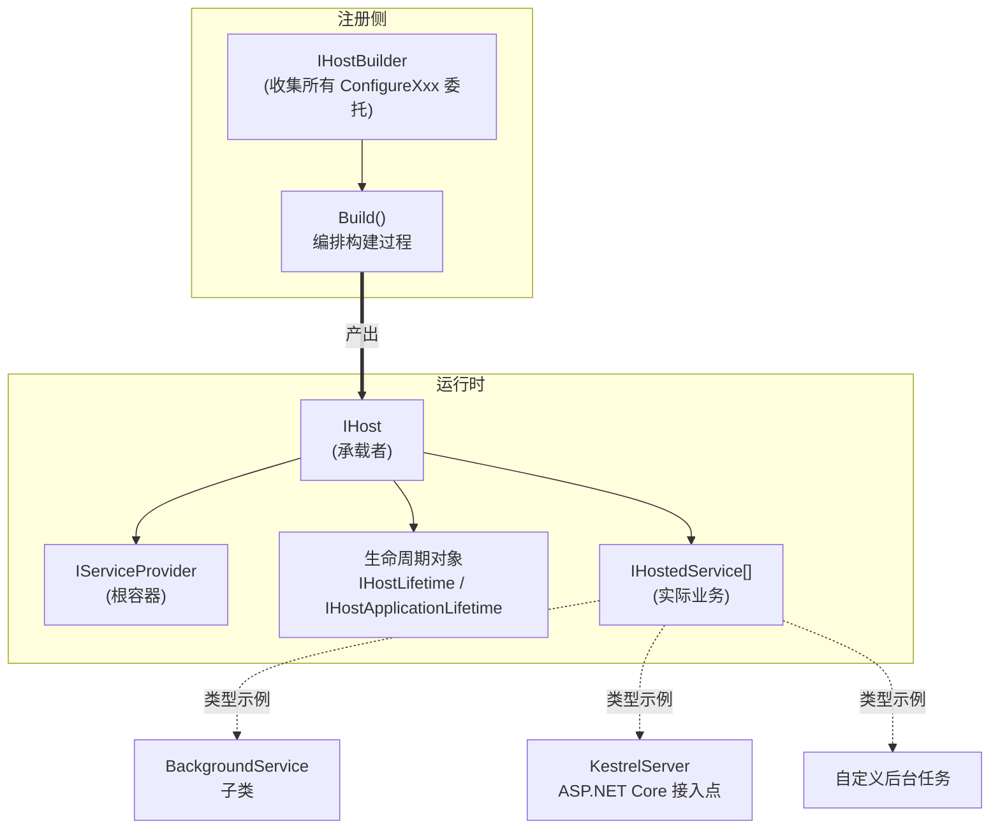

**关键认知**：

- **宿主自己不做业务** —— 它只是「**容器 + 生命周期 + 业务(IHostedService)的编排者**」；
- **`IHost` 的 `StartAsync` 会启动所有 `IHostedService`**，业务通过实现 `IHostedService` 接入；
- **ASP.NET Core 本身就是一个 `IHostedService`**(`GenericWebHostService`)—— 这就是为什么 Web 应用与 Worker Service 共用同一套宿主模型。

### 1.2 一次「启动 → 运行 → 停止」端到端时序

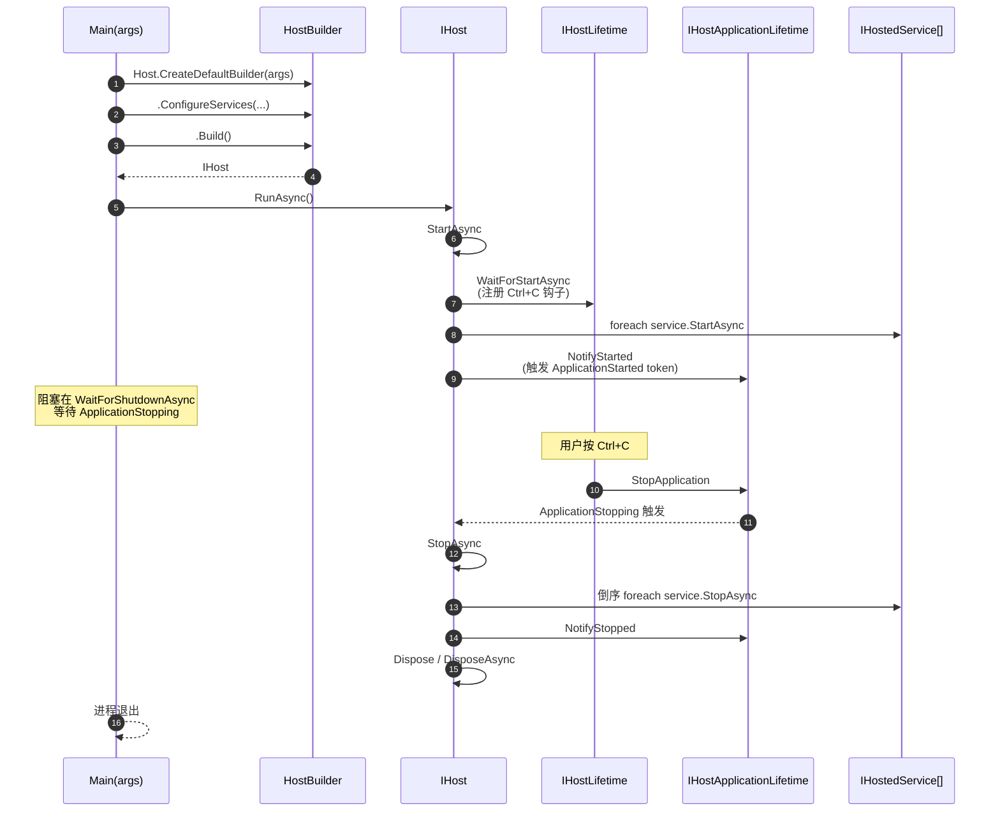

### 1.3 核心类型一览

| 分类 | 类型 | 角色 |
|------|------|------|
| 业务接口 | `IHostedService` / `BackgroundService` | 寄宿服务抽象与模板 |
| 业务注册 | `ServiceCollectionHostedServiceExtensions` | `AddHostedService<T>()` 扩展 |
| 环境 | `Environments` / `HostDefaults` / `IHostEnvironment` / `HostingEnvironment` | 环境名常量、配置键常量、环境元数据 |
| 构建上下文 | `HostBuilderContext` | 跨阶段共享的「**配置 + 环境 + Properties**」 |
| 构建器 | `IHostBuilder` / `HostBuilder` / `HostingHostBuilderExtensions` | 收集配置并构建宿主 |
| 应用生命周期 | `IHostApplicationLifetime` / `ApplicationLifetime` | 三个时机的 `CancellationToken` |
| 宿主生命周期 | `IHostLifetime` / `ConsoleLifetime` | 外部信号接入(如 Ctrl+C) |
| 静态入口 | `Microsoft.Extensions.Hosting.Host` | `CreateDefaultBuilder` 工厂 |
| 宿主 | `IHost` / `Internal.Host` | 启动停止承载者 |
| 启停 API | `HostingAbstractionsHostExtensions` | `Run` / `RunAsync` / `WaitForShutdownAsync` |

---

## 2. IHostedService：寄宿服务模型

### 2.1 IHostedService 抽象

```C#
public interface IHostedService
{
    Task StartAsync(CancellationToken cancellationToken);
    Task StopAsync(CancellationToken cancellationToken);
}
```

**仅两个方法的极简契约**：

- **`StartAsync`**：宿主启动时调用一次；
- **`StopAsync`**：宿主停止时调用一次；
- 两者都接收 `CancellationToken` —— 调用方(`Host`)会在超过 `HostOptions.StartupTimeout`/`ShutdownTimeout` 时取消。

**返回 `Task` 的语义**：

- `StartAsync` 完成不代表服务停止 —— 它只代表「**启动成功**」；
- 长时间运行的逻辑应该不阻塞 `StartAsync`，要么用 `Task.Run`，要么用 `BackgroundService`(§2.2)。

### 2.2 BackgroundService 模板

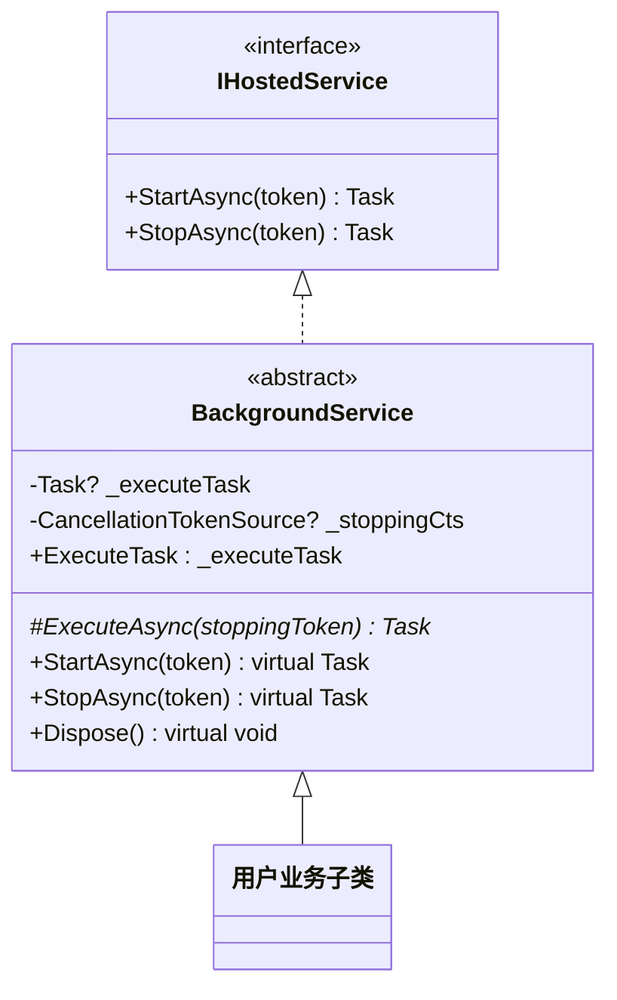

**核心契约**：用户只需重写 `ExecuteAsync(stoppingToken)`，返回一个**长时间运行的 Task**。

**关键设计点 —— `_stoppingCts` 链接源**：

```C#
// BackgroundService.StartAsync(精简)
_stoppingCts = CancellationTokenSource.CreateLinkedTokenSource(cancellationToken);
_executeTask = ExecuteAsync(_stoppingCts.Token);
```

`CreateLinkedTokenSource` 创建一个「**任一上游取消则本 token 也取消**」的链接源。这样：

- 宿主停止时(`StopAsync` 收到 cancellationToken)，通过 `_stoppingCts.Cancel()` 通知 `ExecuteAsync`；
- 内部业务想自己停止时，也能调 `_stoppingCts.Cancel()`；
- `Dispose` 时也调一次 `Cancel` 兜底，避免泄漏。

### 2.3 StartAsync 的「同步完成 vs 异步执行」分支

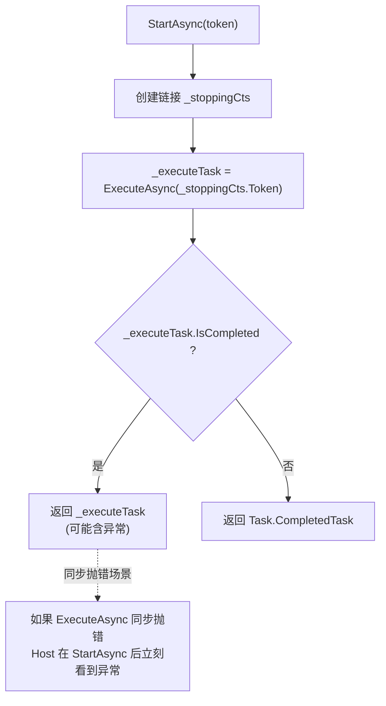

**关键设计**：`StartAsync` 完成**不等于 `ExecuteAsync` 完成**。否则一个永不退出的后台任务会让宿主永远启动不完。

- **同步完成路径**：通常意味着 `ExecuteAsync` 立刻返回(参数错误、立刻抛错等)，返回的 `Task` 含有错误信息让 `Host` 能感知；
- **异步路径**：`ExecuteAsync` 正常启动并进入循环 —— `StartAsync` 立即返回 `CompletedTask`，宿主继续启动其他服务。

### 2.4 StopAsync 的「等任务完成 vs 外部取消」赛跑

```C#
// BackgroundService.StopAsync(精简)
_stoppingCts!.Cancel();                                          // 1. 先发停止信号
var tcs = new TaskCompletionSource<object>();
using CancellationTokenRegistration registration
    = cancellationToken.Register(s => ((TaskCompletionSource<object>)s!).SetCanceled(), tcs);
await Task.WhenAny(_executeTask, tcs.Task).ConfigureAwait(false); // 2. 等 _executeTask 或外部超时
```

**两路赛跑**：

- **`_executeTask`**：业务的 `ExecuteAsync` 正常退出；
- **`tcs.Task`**：外部 `cancellationToken`(通常是 `HostOptions.ShutdownTimeout`)触发，提前结束等待。

**`Task.WhenAny`** 在任一完成时立即返回 —— 这意味着「**业务慢于超时**」时宿主不会卡住，但被「**遗弃的 `_executeTask`**」可能仍在后台跑(直到自然完成或进程退出)。这是合理的取舍：要么强行 `Thread.Abort`(已废弃且危险)，要么放手让它「**软停**」。

### 2.5 ServiceCollectionHostedServiceExtensions 注册扩展

```C#
public static IServiceCollection AddHostedService<THostedService>(this IServiceCollection services)
    where THostedService : class, IHostedService
{
    services.TryAddEnumerable(ServiceDescriptor.Singleton<IHostedService, THostedService>());
    return services;
}
```

**关键认知**：

- **`TryAddEnumerable`**(不是 `TryAdd`)：多次调用 `AddHostedService<X>` 不会互相覆盖；
- **`Singleton` 生命周期**：宿主只解析一次 `IEnumerable<IHostedService>`，所以本质上服务的生命周期与宿主等长；
- **同类型只注册一次**：`TryAddEnumerable` 按 `(ServiceType, ImplementationType)` 去重，重复注册同一 `THostedService` 会被忽略(参考 `Notes/依赖注入.md` §2.3)。

---

## 3. 宿主环境：IHostEnvironment / HostBuilderContext

### 3.1 Environments / HostDefaults 常量

```C#
public static class Environments
{
    public static readonly string Development = "Development";
    public static readonly string Staging = "Staging";
    public static readonly string Production = "Production";
}

public static class HostDefaults
{
    public static readonly string ApplicationKey = "applicationName";
    public static readonly string EnvironmentKey = "environment";
    public static readonly string ContentRootKey = "contentRoot";
}
```

**两个常量类的用途**：

| 类 | 作用 |
|------|------|
| `Environments` | 三个**标准**环境名(`Development` / `Staging` / `Production`) |
| `HostDefaults` | 三个**宿主配置键** —— 这就是为什么 `--environment Staging` 这种命令行能修改环境 |

**自定义环境名是合法的**：`UseEnvironment("Test")` 或 `--environment Test` 都能工作，只是这种环境不会通过 `env.IsDevelopment()` 之类的检测。

### 3.2 IHostEnvironment 类图

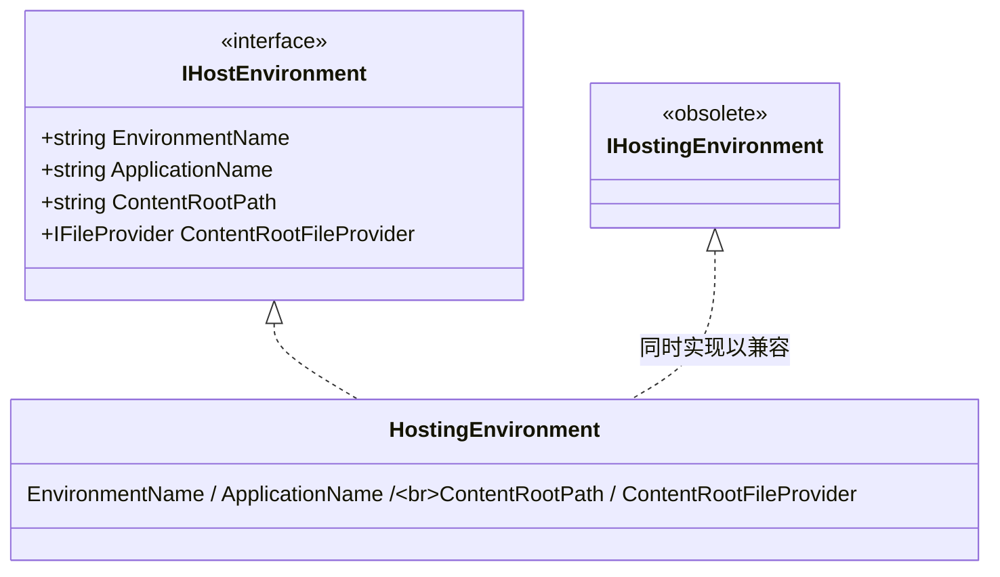

**为什么有两个接口？**：`IHostingEnvironment` 是 .NET Core 2.x 时代的旧接口(在 ASP.NET Core 命名空间下)，3.0 引入了**位于 `Microsoft.Extensions.Hosting` 的新接口 `IHostEnvironment`**，统一了 ASP.NET Core 和 Worker Service 的环境抽象。`HostingEnvironment` 同时实现两者保证兼容。

### 3.3 HostBuilderContext：构建期共享上下文

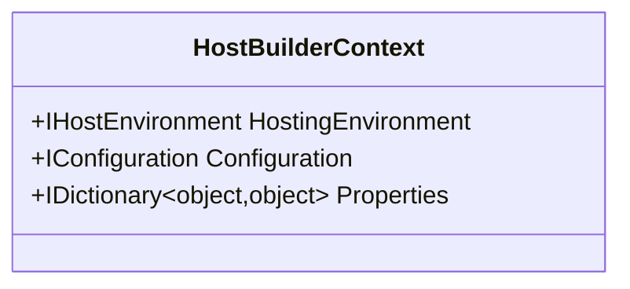

`HostBuilderContext` 在 `HostBuilder.Build` 流水线中**多个阶段**共享：

| 阶段 | `Configuration` 的内容 |
|------|----------------------|
| 创建后 / 应用配置阶段开始 | **宿主配置**(hostConfiguration) |
| 应用配置构建完成后 | 被替换为**应用配置**(appConfiguration) |

**`Properties` 是一个开放的字典** —— 让自定义扩展(如第三方 `IServiceProviderFactory`)在不修改 API 的情况下传递信息。

### 3.4 ContentRootPath 解析规则

`HostingEnvironment.ContentRootPath` 的解析涉及三种情况：

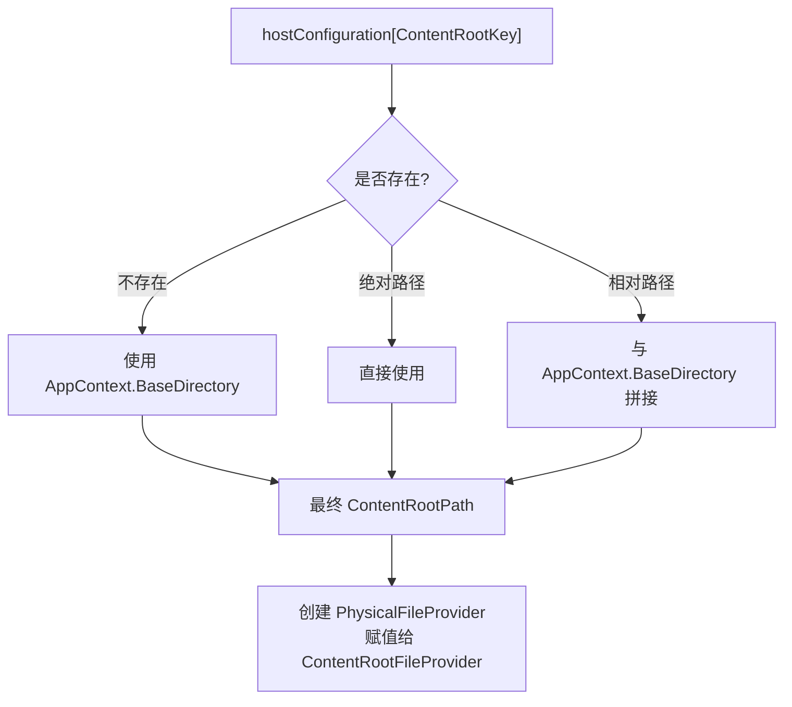

**`ApplicationName` 的兜底**：先看 `hostConfiguration[ApplicationKey]`；若为空，用 `Assembly.GetEntryAssembly()?.GetName().Name` —— 也就是入口程序集名(通常与项目名一致)。

---

## 4. 宿主构建：HostBuilder.Build 流水线

### 4.1 IHostBuilder 抽象

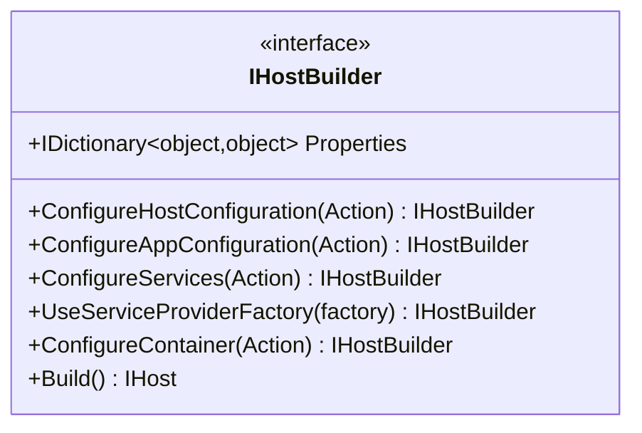

**五种 Configure**：

| 方法 | 配置目标 | 何时执行 |
|------|---------|---------|
| `ConfigureHostConfiguration` | 宿主自身的 `IConfiguration` | Build 早期(用于读取环境) |
| `ConfigureAppConfiguration` | 应用的 `IConfiguration`(业务用) | Build 中期 |
| `ConfigureServices` | `IServiceCollection` | Build 后期(DI 构建前) |
| `UseServiceProviderFactory` | 替换 DI 工厂(如 Autofac) | 立即 |
| `ConfigureContainer<TBuilder>` | 配置第三方容器建造者 | Build 末期 |

### 4.2 收集 → 应用 的双阶段模式

```mermaid
flowchart LR
    subgraph 阶段 1：收集(链式调用)
        C1["ConfigureHostConfiguration(...)"]
        C2["ConfigureServices(...)"]
        C3["UseServiceProviderFactory(...)"]
        C1 & C2 & C3 --> Lists["内部 List 收集所有委托"]
    end

    subgraph 阶段 2：应用(Build)
        Lists --> Apply["按顺序遍历执行<br/>(InitializeXxx 系列方法)"]
    end
```

**为什么不立即执行？**：构建宿主时各步骤有**严格顺序依赖**(环境 → 配置 → 服务)。如果立即执行：

- 在配置可用前用户已经调了 `ConfigureServices` 怎么办？
- 在环境确定前用户已经调了 `ConfigureHostOptions` 怎么办？

**「收集 → 应用」让用户可以随意调用顺序**，框架在 `Build()` 时按正确顺序执行 —— 这是「**声明式 API**」的常见做法。

### 4.3 Build 六步骤时序

```mermaid
sequenceDiagram
    autonumber
    participant U as 用户代码
    participant HB as HostBuilder
    participant CH as HostConfiguration
    participant Env as HostingEnvironment
    participant Ctx as HostBuilderContext
    participant CA as AppConfiguration
    participant SP as IServiceProvider

    U->>HB: Build()
    HB->>CH: 1. InitializeHostConfiguration<br/>(空内存源 + 用户委托)
    HB->>Env: 2. InitializeHostingEnvironment<br/>(解析 EnvironmentKey/ContentRootKey)
    HB->>Ctx: 3. InitializeHostBuilderContext<br/>(env + hostConfiguration)
    HB->>CA: 4. InitializeAppConfiguration<br/>(SetBasePath + AddConfiguration(host) + 用户委托)
    Note over Ctx: ctx.Configuration ← appConfiguration

    HB->>SP: 5. InitializeServiceProvider
    Note over SP: PopulateServiceCollection<br/>(注册 IHostEnvironment, IConfiguration,<br/>IHostApplicationLifetime, IHostLifetime,<br/>IHost, AddOptions, AddLogging, AddMetrics)
    Note over SP: + 用户 ConfigureServices 委托
    Note over SP: + UseServiceProviderFactory → CreateBuilder<br/>+ 用户 ConfigureContainer 委托
    Note over SP: → CreateServiceProvider

    HB->>U: 6. ResolveHost<br/>(GetRequiredService&lt;IHost&gt;)
```

### 4.4 宿主配置 vs 应用配置(双层配置树)

```mermaid
flowchart LR
    subgraph 宿主配置(hostConfiguration)
        H1["内存源(空)"]
        H2["DOTNET_ 环境变量"]
        H3["命令行参数"]
        H1 & H2 & H3 --> HostCfg["IConfiguration<br/>(hostConfiguration)"]
    end

    subgraph 应用配置(appConfiguration)
        A0["ChainedConfigurationSource<br/>(host)  ← 把宿主配置作为链路第一层"]
        A1["appsettings.json"]
        A2["appsettings.{env}.json"]
        A3["UserSecrets (Development)"]
        A4["所有环境变量"]
        A5["命令行参数"]
        A0 & A1 & A2 & A3 & A4 & A5 --> AppCfg["IConfiguration<br/>(appConfiguration)"]
    end

    HostCfg -. 链接 .-> A0

    HostCfg --> Env["IHostEnvironment<br/>(只读宿主配置)"]
    AppCfg --> DI["IConfiguration<br/>(注册到 DI)"]
```

**为什么要分两层？**：

- **宿主配置专注「环境识别 + 内核需要」**：只有少数键(`environment` / `contentRoot` / `applicationName`)，决定后续如何构建；
- **应用配置面向业务**：业务读到的 `IConfiguration` 才是这个 —— 它的源**包含**宿主配置(通过 `AddConfiguration(host, shouldDisposeConfiguration: true)`)，所以宿主配置的所有键在业务里也能读到，只是优先级最低。

**关键代码片段**(应用配置构建)：

```C#
IConfigurationBuilder configBuilder = new ConfigurationBuilder()
    .SetBasePath(_hostingEnvironment!.ContentRootPath)
    .AddConfiguration(_hostConfiguration!, shouldDisposeConfiguration: true);
```

**`shouldDisposeConfiguration: true`** 的意义：当应用配置释放时，宿主配置作为内部链接也一起释放 —— 资源所有权清晰传递。

### 4.5 服务工厂适配器：IServiceProviderFactory<TBuilder>

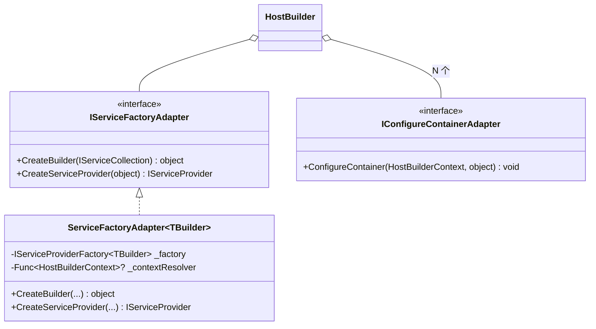

**两个适配器的作用**：

- **`IServiceFactoryAdapter`** 把强类型的 `IServiceProviderFactory<TBuilder>`「**擦除**」成 `object` —— 让 `HostBuilder` 不必持有泛型；
- **`IConfigureContainerAdapter`** 同理擦除 `Action<HostBuilderContext, TBuilder>` —— 让 `ConfigureContainer<TBuilder>` 多个不同 `TBuilder` 共存。

**典型用例**(Autofac 接入)：

```C#
hostBuilder.UseServiceProviderFactory(new AutofacServiceProviderFactory())
           .ConfigureContainer<ContainerBuilder>((ctx, b) => b.RegisterModule(new MyModule()));
```

参考 `Notes/依赖注入.md` §3.3「IServiceProviderFactory 扩展点」。

---

## 5. 默认配置：ConfigureDefaults

`Host.CreateDefaultBuilder(args)` 一行代码背后是 `ConfigureDefaults(args)` 扩展方法添加的一整套默认行为：

```mermaid
flowchart TB
    CreateDefault["Host.CreateDefaultBuilder(args)"] --> CD["builder.ConfigureDefaults(args)"]

    CD --> S1["ConfigureHostConfiguration<br/>ApplyDefaultHostConfiguration"]
    CD --> S2["ConfigureAppConfiguration<br/>ApplyDefaultAppConfiguration"]
    CD --> S3["ConfigureServices<br/>AddDefaultServices"]
    CD --> S4["UseServiceProviderFactory<br/>CreateDefaultServiceProviderOptions"]

    S1 --> H1[SetDefaultContentRoot]
    S1 --> H2[AddEnvironmentVariables prefix=DOTNET_]
    S1 --> H3[AddCommandLine args]

    S2 --> A1[AddJsonFile appsettings.json]
    S2 --> A2[AddJsonFile appsettings.{env}.json]
    S2 --> A3["AddUserSecrets (Development only)"]
    S2 --> A4[AddEnvironmentVariables 所有]
    S2 --> A5[AddCommandLine args]

    S3 --> L1["AddLogging:<br/>AddConsole/AddDebug/AddEventSourceLogger/AddEventLog (Windows)<br/>+ ActivityTrackingOptions = SpanId|TraceId|ParentId"]
    S3 --> L2["AddMetrics 配置节"]

    S4 --> SP1["ValidateScopes/ValidateOnBuild<br/>= isDevelopment"]
```

### 5.1 默认宿主配置

**三个数据源(按顺序，后注册优先)**：

1. **内存源**：默认放入 `contentRoot = Environment.CurrentDirectory`(非 Windows 系统目录时)；
2. **环境变量**：仅 `DOTNET_` 前缀；
3. **命令行参数**：通过 `--environment Production`、`--contentRoot /app` 等覆盖。

**`SetDefaultContentRoot` 的小细节**：仅当**不是**「Windows 系统目录」时才设置 —— 防止以 SYSTEM 服务身份在 `C:\Windows\System32` 启动时把工作目录当成内容根目录。

### 5.2 默认应用配置

**五条配置源链(后注册者优先)**：

1. **链接源(host)** —— 把宿主配置作为底层(§4.4)；
2. **`appsettings.json`** —— 共享配置；
3. **`appsettings.{env}.json`** —— 环境特定覆盖；
4. **`AddUserSecrets`** —— 仅 Development，从 `UserSecretsIdAttribute` 读取 secret ID；
5. **环境变量**(所有)；
6. **命令行参数**。

**`reloadOnChange` 默认开启** —— 通过 `hostBuilder:reloadConfigOnChange` 配置控制(默认 `true`)。可通过 `--hostBuilder:reloadConfigOnChange=false` 关闭。

**`AddUserSecrets` 实现细节**(简）：

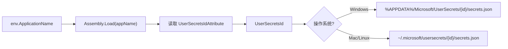

### 5.3 默认服务：日志 / Metrics / EventLog

**`AddDefaultServices` 默认注册的内容**：

| 类别 | 注册项 | 备注 |
|------|--------|------|
| 日志 Provider | `Console` | 所有平台 |
| 日志 Provider | `Debug` | 所有平台 |
| 日志 Provider | `EventSource` | 所有平台 |
| 日志 Provider | `EventLog` | **仅 Windows** |
| 日志过滤 | `EventLogLoggerProvider` 最低 Warning | 减少 EventLog 噪音 |
| 日志配置 | `Logging` 配置节绑定 | 参考 `Notes/日志.md` §6.3 |
| 活动跟踪 | `SpanId | TraceId | ParentId` | 启用 `Activity` 范围 |
| 指标 | `AddMetrics` 绑定 `Metrics` 配置节 | .NET 8+ 增强 |

### 5.4 默认 ServiceProviderOptions

```C#
internal static ServiceProviderOptions CreateDefaultServiceProviderOptions(HostBuilderContext context)
{
    bool isDevelopment = context.HostingEnvironment.IsDevelopment();
    return new ServiceProviderOptions
    {
        ValidateScopes = isDevelopment,
        ValidateOnBuild = isDevelopment,
    };
}
```

**意义**：**Development 环境自动开启 captive dependency 检测和构建期验证**(参考 `Notes/依赖注入.md` §8)。生产环境保持默认(关闭)避免启动开销。

这是「**开发期严格、生产期宽松**」的标准做法 —— 配合两层配置(`appsettings.json` 写宽松值、`appsettings.Development.json` 写严格值)是常见模式。

---

## 6. 生命周期：双重抽象

服务承载有**两个**「生命周期」接口，常被混淆：

| 接口 | 抽象层次 | 注入对象 | 典型实现 |
|------|---------|---------|---------|
| `IHostApplicationLifetime` | 应用层 | 业务代码 | `ApplicationLifetime` |
| `IHostLifetime` | 宿主层 | 框架内部 | `ConsoleLifetime` / `NullLifetime` / `SystemdLifetime` |

### 6.1 IHostApplicationLifetime：业务可订阅的三 token

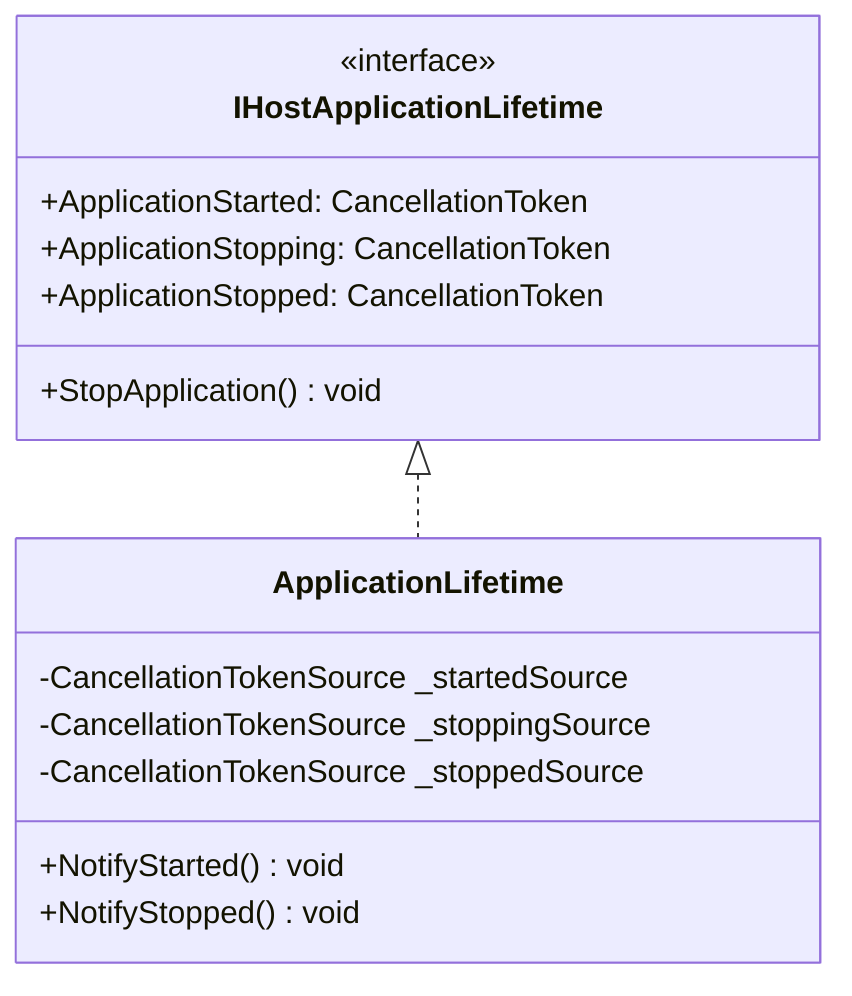

**三个 token 对应三个时刻**：

| Token | 触发时机 | 业务用途 |
|-------|---------|---------|
| `ApplicationStarted` | 全部 `IHostedService.StartAsync` 完成后 | 「**应用就绪**」信号(如健康检查置 healthy) |
| `ApplicationStopping` | `StopApplication` 被调用时 | 「**优雅停止开始**」(开始清理) |
| `ApplicationStopped` | 全部 `IHostedService.StopAsync` 完成后 | 「**已完全停止**」(用于触发后续清理) |

**`StopApplication` 是「**业务请求停止**」的入口** —— 内部触发 `_stoppingSource.Cancel()`，进而让宿主走完 `StopAsync` 流程。

**`Notify*` 方法只能由宿主内部调用**(`Internal.Host` 在合适时机触发)，业务代码不应直接调用。

### 6.2 IHostLifetime：外部信号接入

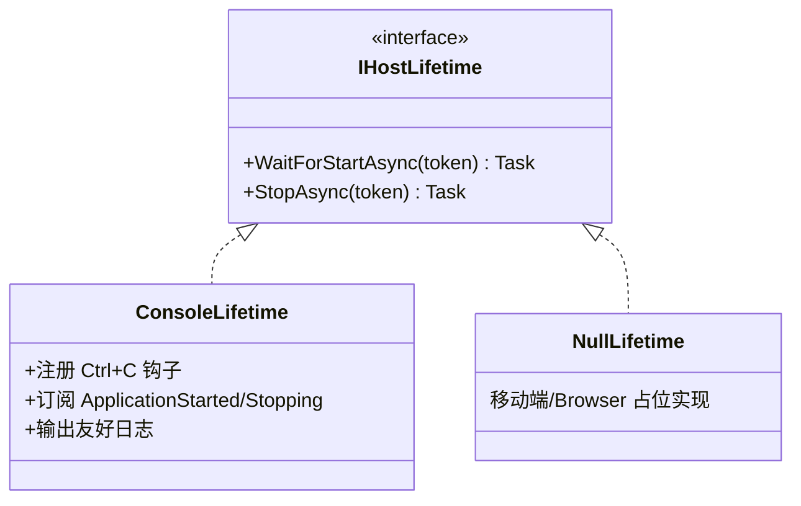

**`WaitForStartAsync` 的用途**：在所有 `IHostedService.StartAsync` 之前先调用，让宿主有机会**安装外部信号处理**(如 Ctrl+C、SIGTERM)。

**`StopAsync` 反过来**：在所有 `IHostedService.StopAsync` 之后调用，给宿主收尾的机会(`ConsoleLifetime` 这里只返回 `CompletedTask` —— 不支持框架主动停宿主)。

### 6.3 ConsoleLifetime：Ctrl+C 钩子

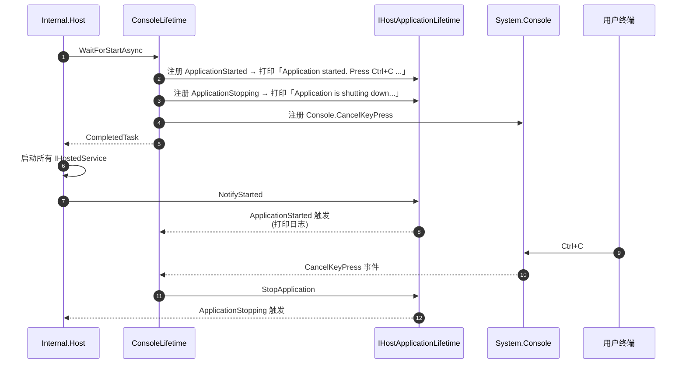

**`ConsoleLifetime` 的两个职责**：

1. **监听 Ctrl+C** —— 调用 `StopApplication` 启动停机流程；
2. **输出友好启动日志** —— 通过订阅 `ApplicationStarted/Stopping`(可通过 `ConsoleLifetimeOptions.SuppressStatusMessages = true` 关闭)。

**`Microsoft.Hosting.Lifetime` 类别**：`ConsoleLifetime` 的日志使用此类别，方便用户在 `appsettings.json` 单独配置(如 `"Microsoft.Hosting.Lifetime": "Warning"`)。

### 6.4 三个 CancellationTokenSource 的链条

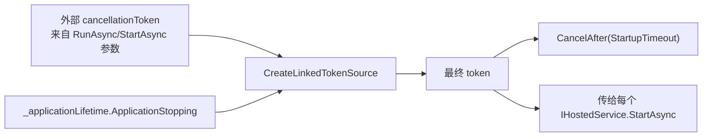

**三个上游信号**(任一触发即停)：

1. **外部参数** —— `RunAsync(token)` 传入；
2. **`ApplicationStopping`** —— 业务主动停止；
3. **`HostOptions.StartupTimeout`** —— 启动超时(默认 `Timeout.InfiniteTimeSpan` 即无超时)。

这种「**N 个上游 → 1 个下游**」的取消传播是 .NET 中的标准做法。

---

## 7. IHost 默认实现：Internal.Host

### 7.1 StartAsync 五阶段

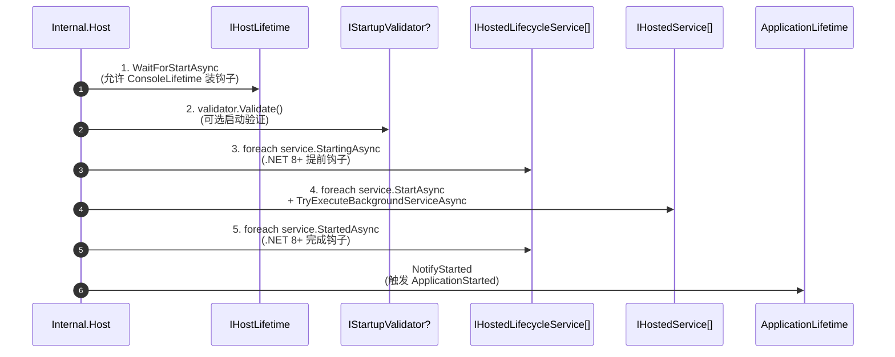

**五阶段的设计意图**：

| 阶段 | 作用 |
|------|------|
| 1. `WaitForStartAsync` | 给宿主层一次「**启动前**」机会(注册 Ctrl+C 等) |
| 2. `Validate` | 启动验证(类似 `IOptions` 的 `ValidateOnStart`) |
| 3. `StartingAsync` | .NET 8+ 引入：在 `StartAsync` **之前**回调，做预热 |
| 4. `StartAsync` | 实际启动 |
| 5. `StartedAsync` | .NET 8+ 引入：在 `StartAsync` **之后**回调，做就绪通知 |

**`TryExecuteBackgroundServiceAsync`** 在阶段 4 中**不被 await**：

```C#
if (service is BackgroundService backgroundService)
    _ = TryExecuteBackgroundServiceAsync(backgroundService);   // 注意：不 await
```

意义：`BackgroundService.StartAsync` 返回的是「**启动完成**」的 `CompletedTask`，但 `ExecuteAsync` 仍在跑。`TryExecuteBackgroundServiceAsync` 在另一个 Task 里 `await backgroundTask`，**让宿主能感知到长任务的异常**(详见 §7.4)。

### 7.2 StopAsync 倒序停止 + 不可阻断

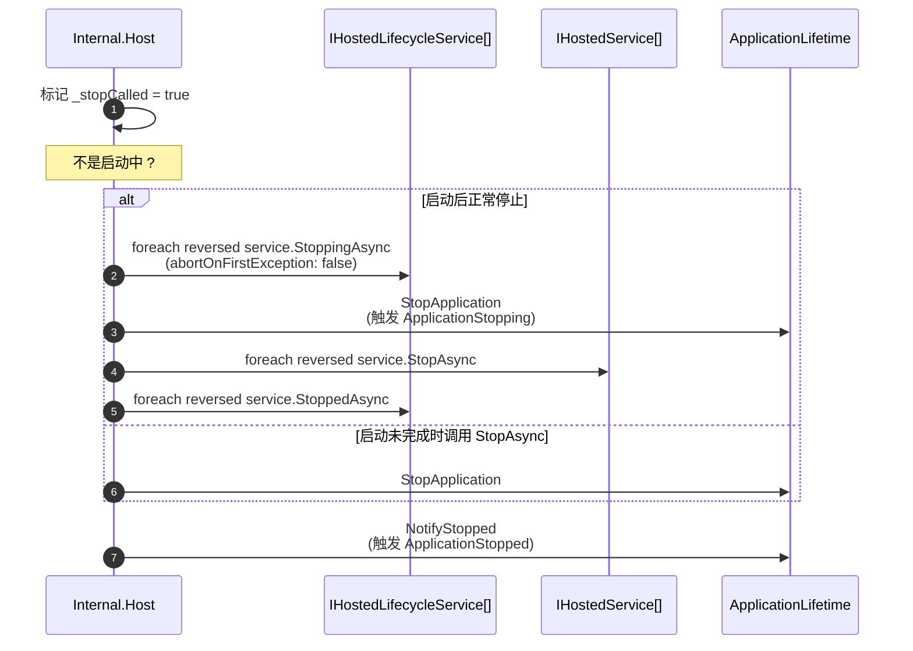

**关键设计点**：

- **倒序停止**：`_hostedServices.Reverse()` —— 最后启动的最先停止，避免依赖反转(如 `KestrelServer` 先停才能让其他依赖它的服务停得安全)；
- **不可阻断**：`abortOnFirstException: false` —— 即使某个服务停止抛错，其他服务**仍要继续停**(不能因为一个崩了就把还活着的留下来)；
- **超时仍生效**：`HostOptions.ShutdownTimeout`(默认 30 秒)兜底；
- **`StopApplication` 在 `StopAsync` 之前调用** —— 让业务先收到 `ApplicationStopping` 信号开始清理，再走 `StopAsync` 实际停服务。

### 7.3 ForeachService 并发 vs 串行

`Internal.Host.ForeachService` 是 `StartAsync` / `StopAsync` 共用的核心循环方法：

```mermaid
flowchart TD
    Start["ForeachService(services, concurrent, abortOnFirstException)"]
    Start --> Mode{concurrent?}

    Mode -->|否| Seq[串行 foreach]
    Seq --> SeqAct["await operation(service, token)"]
    SeqAct --> SeqErr{抛错?}
    SeqErr -->|否| SeqNext[下一个]
    SeqErr -->|是 且 abortOnFirstException| SeqRet[立即 return]
    SeqErr -->|是 但不 abort| SeqAdd[收集异常 + 下一个]

    Mode -->|是| Par[并行启动]
    Par --> ParCall["task = operation(service, token)<br/>(不 await，先全部启动)"]
    ParCall --> Collect[收集所有未完成 Task]
    Collect --> WhenAll["await Task.WhenAll(tasks)"]
    WhenAll --> ParErr[从 AggregateException 收集异常]
```

**两种模式的取舍**：

| 模式 | 优点 | 缺点 | 何时用 |
|------|------|------|--------|
| 串行 | 顺序可控、错误可短路 | 总时间 = 各服务之和 | 默认；服务有启动顺序依赖时 |
| 并发 | 总时间 ≈ 最慢服务 | 异常处理复杂；不能短路 | `HostOptions.ServicesStartConcurrently = true` |

**并发模式的异常收集**：从 `Task.Exception.InnerExceptions` 取所有异常 —— `async` 编译器只会从 `AggregateException` 取**第一个**抛出，要完整列表必须直接读 `InnerExceptions`。

### 7.4 BackgroundService 异常处理策略

```mermaid
flowchart TD
    Start["TryExecuteBackgroundServiceAsync"] --> Wait["await backgroundService.ExecuteTask"]
    Wait --> Result{结果?}

    Result -->|正常完成| End1[返回]
    Result -->|OperationCanceled<br/>且 _stopCalled| End2[返回(预期取消)]
    Result -->|其他异常| Log[BackgroundServiceFaulted 日志]

    Log --> Policy{HostOptions.BackgroundServiceExceptionBehavior?}
    Policy -->|StopHost| Stop["BackgroundServiceStoppingHost 日志<br/>+ StopApplication()"]
    Policy -->|Ignore| End3[仅记录日志，宿主继续]
```

**两种策略对比**：

| 策略 | 行为 | 适用场景 |
|------|------|---------|
| `StopHost`(默认 .NET 6+) | 后台服务异常 → 整个宿主停止 | 故障即停，让健康检查接管重启 |
| `Ignore` | 仅记录，宿主继续运行 | 多个独立后台任务，单个崩不该影响整体 |

**易混淆点**：`BackgroundService.StartAsync` 同步抛错由 `Host.StartAsync` 在阶段 4 直接 catch；只有「**ExecuteAsync 跑起来之后**」的异常才走这条路径。

### 7.5 启动超时 / 停止超时

```C#
// HostOptions(简)
public TimeSpan StartupTimeout { get; set; } = Timeout.InfiniteTimeSpan;
public TimeSpan ShutdownTimeout { get; set; } = TimeSpan.FromSeconds(30);
public bool ServicesStartConcurrently { get; set; }
public bool ServicesStopConcurrently { get; set; }
public BackgroundServiceExceptionBehavior BackgroundServiceExceptionBehavior { get; set; }
```

| 选项 | 默认 | 何时调整 |
|------|------|---------|
| `StartupTimeout` | 无限 | 想限制启动时间(如 K8s readiness probe) |
| `ShutdownTimeout` | 30 秒 | 后台任务复杂、需要更长清理时间 |
| `ServicesStartConcurrently` | false | 服务相互独立、想加速启动 |
| `ServicesStopConcurrently` | false | 同上 |
| `BackgroundServiceExceptionBehavior` | `StopHost` | 改为 `Ignore` 提升容错 |

可通过 `ConfigureHostOptions(opt => opt.ShutdownTimeout = TimeSpan.FromSeconds(60))` 修改。

---

## 8. 启动与停止 API

`HostingAbstractionsHostExtensions` 提供四组扩展方法，封装了不同语义的启停模式。

### 8.1 Start / Run / RunAsync / StartAsync 区别

| 方法 | 是否阻塞调用者 | 启动后行为 | 适用场景 |
|------|--------------|-----------|---------|
| `Start()` | 阻塞直到 `StartAsync` 完成 | 立即返回 | 测试代码、需要在启动后做其他事 |
| `StartAsync()` | 异步等待启动完成 | 立即返回 | 同上，异步版 |
| `Run()` | 阻塞**直到宿主停止** | 等待 `ApplicationStopping` | 普通主程序 |
| `RunAsync()` | 异步等待**直到宿主停止** | 等待 `ApplicationStopping` | 异步主程序 |

**`Start` 与 `Run` 的最大区别**：

- **`Start`** 让你「**启动完之后还能继续做事**」 —— 典型测试场景：`host.Start()` 然后断言某些状态；
- **`Run`** 让主线程「**阻塞到应用结束**」 —— 这是 Worker Service / ASP.NET Core 默认入口。

### 8.2 RunAsync 实现：StartAsync + WaitForShutdownAsync

```C#
public static async Task RunAsync(this IHost host, CancellationToken token = default)
{
    try
    {
        await host.StartAsync(token).ConfigureAwait(false);
        await host.WaitForShutdownAsync(token).ConfigureAwait(false);   // ← 这里阻塞
    }
    finally
    {
        if (host is IAsyncDisposable asyncDisposable)
            await asyncDisposable.DisposeAsync().ConfigureAwait(false);
        else
            host.Dispose();
    }
}
```

**三段式结构**：

1. **`StartAsync`**：启动所有服务；
2. **`WaitForShutdownAsync`**：阻塞，等待停止信号；
3. **`Dispose`**：清理资源(异步优先)。

`finally` 保证哪怕中间抛错也会清理 —— 这是「**`using` 异步版**」的常见手写法。

### 8.3 WaitForShutdownAsync 的两种结束方式

```mermaid
sequenceDiagram
    autonumber
    participant U as 用户代码
    participant W as WaitForShutdownAsync
    participant AL as IHostApplicationLifetime
    participant TCS as TaskCompletionSource

    U->>W: await WaitForShutdownAsync(token)
    W->>AL: 解析 IHostApplicationLifetime

    W->>W: token.Register(() => AL.StopApplication())
    Note over W: 路径 1：外部 cancellationToken 触发<br/>→ StopApplication

    W->>W: AL.ApplicationStopping.Register(<br/>  obj => tcs.TrySetResult(null))
    Note over W: 路径 2：业务自己调 StopApplication<br/>→ ApplicationStopping 触发

    W->>TCS: await tcs.Task   ← 真正阻塞点
    Note over W: 任一路径触发都会让 tcs 完成

    W->>W: await host.StopAsync(CancellationToken.None)
    W-->>U: 返回
```

**`tcs.Task` 是「**等待停止信号**」的核心** —— 让 `WaitForShutdownAsync` 在收到信号后才往下走 `StopAsync`。

**注意 `StopAsync(CancellationToken.None)`**：传入 `None` 意味着停止过程**不再被外部取消** —— 必须给宿主跑完 `StopAsync`(直到 `ShutdownTimeout` 兜底)，否则资源清理可能不完整。

### 8.4 优雅停止的标准写法

**Worker Service / 主程序**：

```C#
public static async Task Main(string[] args)
{
    using var host = Host.CreateDefaultBuilder(args)
        .ConfigureServices(s => s.AddHostedService<MyWorker>())
        .Build();
    await host.RunAsync();      // 阻塞到 ApplicationStopping
}
```

**业务代码主动停止**：

```C#
public class MyService(IHostApplicationLifetime lifetime)
{
    public void DoSomething()
    {
        if (criticalErrorOccurred)
            lifetime.StopApplication();   // 触发优雅停止
    }
}
```

**订阅生命周期事件**：

```C#
public class MyListener(IHostApplicationLifetime lifetime, ILogger<MyListener> logger)
{
    public void Subscribe()
    {
        lifetime.ApplicationStarted.Register(() => logger.LogInformation("Ready"));
        lifetime.ApplicationStopping.Register(() => logger.LogInformation("Stopping..."));
        lifetime.ApplicationStopped.Register(() => logger.LogInformation("Stopped"));
    }
}
```

---

## 9. 设计思想速览

### 9.1 收集 + 应用模式

`IHostBuilder` 的所有 `ConfigureXxx` 方法都**只记不做** —— 实际执行延迟到 `Build()`。

| 模式 | 好处 |
|------|------|
| **顺序无关** | 用户随意调用顺序，框架按正确顺序应用 |
| **可中途修改** | 同一阶段多次 Configure，所有委托都生效 |
| **支持嵌套扩展** | `ConfigureDefaults` 本身就是收集多个委托的扩展 |

这是 ASP.NET Core 全栈一致的设计：`IApplicationBuilder.Use`、`IRouteBuilder.MapGet`、`IServiceCollection.AddXxx` 都是这个思路。

### 9.2 双层配置树

「**宿主配置 + 应用配置**」是 ASP.NET Core 独有的设计：

```mermaid
flowchart LR
    HostCfg["宿主配置<br/>(决定环境/根目录/应用名)"]
    AppCfg["应用配置<br/>(业务可见)"]
    HostCfg -. 链接 .-> AppCfg

    HostCfg --> Env[IHostEnvironment]
    AppCfg --> Biz[业务读取]
```

**职责切分**：宿主配置「**决定如何构建**」，应用配置「**业务实际读取**」。两者通过 `ChainedConfigurationSource` 链接，宿主键在业务里也能读到(但优先级最低)。

### 9.3 CancellationToken 作为生命周期信号

整个宿主子系统大量使用 `CancellationToken` 作为**信号传递机制**：

| 用途 | 信号源 |
|------|--------|
| 应用就绪 | `ApplicationLifetime._startedSource` |
| 应用停止开始 | `ApplicationLifetime._stoppingSource` |
| 应用完全停止 | `ApplicationLifetime._stoppedSource` |
| 启动超时 | `CreateLinkedTokenSource` + `CancelAfter` |
| 后台任务停止 | `BackgroundService._stoppingCts` |

`CancellationToken` 一次性、可多订阅、内置线程安全 —— 对「**只触发一次的事件**」是比 `event` 更好的工具(参考 `Notes/配置.md` §4.2)。

### 9.4 适配器模式：IServiceFactoryAdapter / IConfigureContainerAdapter

`HostBuilder` 持有的是「**已擦除泛型的适配器**」，而非泛型对象本身。这样：

- `HostBuilder` 不必本身带泛型；
- 多个 `ConfigureContainer<TBuilder>` 调用(不同 `TBuilder`)可并存；
- 第三方容器(Autofac、Lamar、Castle)以**同一接口**接入。

适配器把「**编译时类型信息**」转成「**运行时 object**」 —— 是泛型擦除的经典手法。

### 9.5 IHostApplicationLifetime vs IHostLifetime 的职责切分

```
应用层 (Application)        框架层 (Host)            外部环境 (Environment)
─────────────────────       ─────────────────        ────────────────────
IHostApplicationLifetime    IHostLifetime            Ctrl+C / SIGTERM / Docker
        ↓                          ↓                          ↓
业务订阅启动/停止信号       宿主接入外部信号         发送停止指令
StopApplication()           WaitForStartAsync()      Console.CancelKeyPress
                            StopAsync()
```

**两层解耦**让宿主可以接入不同环境：

- 桌面/控制台 → `ConsoleLifetime`(Ctrl+C)；
- Systemd 服务 → `SystemdLifetime`(SIGTERM)；
- Windows Service → `WindowsServiceLifetime`(SCM 信号)；
- 移动端 / Browser → `NullLifetime`(占位)。

业务代码只与 `IHostApplicationLifetime` 打交道，**完全不知道宿主跑在什么环境** —— 这就是「**关注点分离**」的力量。

---

## 10. 速查卡 & 陷阱清单

### 10.1 IHostedService vs BackgroundService 对照

| 维度 | `IHostedService` 直接实现 | `BackgroundService` 继承 |
|------|--------------------------|-------------------------|
| 要重写的方法 | `StartAsync` + `StopAsync` | 只需 `ExecuteAsync` |
| 长任务托管 | 自己用 `Task.Run` | 框架自动 |
| Token 链接 | 手动 | 自动(`_stoppingCts`) |
| 停止超时 | 自己处理 | 内置 `Task.WhenAny` |
| 适用场景 | 启停瞬时(注册资源、监听端口) | 长循环(后台轮询、消息消费) |

### 10.2 IHostApplicationLifetime 三 token 速查

| Token | 触发时刻 | 业务订阅方式 |
|-------|---------|-------------|
| `ApplicationStarted` | 全部服务启动完成 | `lifetime.ApplicationStarted.Register(...)` |
| `ApplicationStopping` | `StopApplication()` 被调用 | `lifetime.ApplicationStopping.Register(...)` |
| `ApplicationStopped` | 全部服务停止完成 | `lifetime.ApplicationStopped.Register(...)` |

### 10.3 默认宿主行为速查

| 默认行为 | 来源 | 关闭方式 |
|---------|------|---------|
| 加载 `appsettings.{env}.json` | `ApplyDefaultAppConfiguration` | 不调用 `ConfigureDefaults` 而是手动配置 |
| 加载 UserSecrets(Dev) | 同上 | 同上 |
| 文件变更自动重载 | `reloadOnChange: true` | `--hostBuilder:reloadConfigOnChange=false` |
| 注册 Console/Debug/EventSource/EventLog 日志 | `AddDefaultServices` | 同上 |
| Development 开启 captive dependency 检测 | `CreateDefaultServiceProviderOptions` | 显式 `UseDefaultServiceProvider(opt => opt.ValidateScopes = false)` |
| Ctrl+C 触发优雅停止 | `ConsoleLifetime` | `Configure<ConsoleLifetimeOptions>(opt => opt.SuppressStatusMessages = true)` 仅隐藏日志，不取消钩子 |

### 10.4 10 大常见陷阱

1. **在 `IHostedService.StartAsync` 中执行长任务**：会阻塞宿主启动。**对策**：用 `BackgroundService` 或 `Task.Run`。
2. **`BackgroundService.ExecuteAsync` 漏 await `stoppingToken`**：导致 `ExecuteAsync` 在 `StopAsync` 后仍跑，阻塞宿主停止。**对策**：循环里勤检查 `stoppingToken.IsCancellationRequested` 或 `await Task.Delay(..., stoppingToken)`。
3. **Singleton 服务里注入 `IHostApplicationLifetime`**：完全合法 —— 它本身就是 Singleton。
4. **`StopApplication` 调用后立即想做事**：方法**不阻塞**！要等待停止完成需 `await host.WaitForShutdownAsync()` 或订阅 `ApplicationStopped`。
5. **`AddHostedService` 重复注册同一类型**：被 `TryAddEnumerable` 去重 —— 后续注册被静默忽略。要多实例必须新建子类。
6. **`ConfigureServices` 委托抛错**：直接挂掉 `Build()`，**未触发任何 Dispose**。注意 lambda 内的资源管理。
7. **`Run()` 卡死无法响应 Ctrl+C**：通常是某个 `IHostedService.StopAsync` 在等待死锁。检查 `ShutdownTimeout` 是否被设为 `InfiniteTimeSpan`。
8. **多个 `Host` 实例**：理论上可行，但默认 `ConsoleLifetime` 会重复注册 Ctrl+C 钩子。多实例场景下应用 `NullLifetime`。
9. **`appsettings.json` 修改不生效**：检查是否禁用了 `reloadOnChange`(通过 `hostBuilder:reloadConfigOnChange`)。还要看 `IOptions<T>` vs `IOptionsMonitor<T>` 的选择(参考 `Notes/选项.md` §2)。
10. **`HostBuilderContext.Configuration` 在 `ConfigureAppConfiguration` 中是宿主配置，但在 `ConfigureServices` 中已是应用配置** —— 不同阶段语义不同！见 §3.3。

### 10.5 原笔记类型 → 本笔记小节 映射表

| 原笔记类型 | 本笔记小节 |
|-----------|-----------|
| `IHostedService` | §2.1 |
| `BackgroundService` | §2.2 / §2.3 / §2.4 / §7.4 / §10.1 |
| `ServiceCollectionHostedServiceExtensions` | §2.5 |
| `Environments` | §3.1 |
| `HostDefaults` | §3.1 |
| `IHostEnvironment` | §3.2 |
| `HostingEnvironment` | §3.2 / §3.4 |
| `HostBuilderContext` | §3.3 |
| `IHostBuilder` | §4.1 |
| `HostBuilder` | §4.2 / §4.3 |
| `HostingHostBuilderExtensions` | §4 / §5 |
| `IHostApplicationLifetime` | §6.1 / §10.2 |
| `ApplicationLifetime` | §6.1 |
| `IHostLifetime` | §6.2 |
| `ConsoleLifetime` | §6.3 |
| `Microsoft.Extensions.Hosting.Host` | §5(`CreateDefaultBuilder`) |
| `IHost` | §1.1 / §7 |
| `Microsoft.Extensions.Hosting.Internal.Host` | §7.1 / §7.2 / §7.3 / §7.4 / §7.5 |
| `HostingAbstractionsHostExtensions` | §8 |


