# 管道中间件

> 本笔记是 ASP.NET Core（.NET 6）`Microsoft.AspNetCore.Hosting` / `Microsoft.AspNetCore.Http` / `Microsoft.AspNetCore.Builder` 等核心程序集的学习整理，配套源码解读位于仓库根目录 `管道中间件.md`。
>
> 风格延续前五章：以 Mermaid UML 图、设计原理、示例为主；源码片段只保留「不看代码无法说清」的几行。

## 0. 阅读指南

### 0.1 本笔记的定位

| 文件 | 视角 | 主体内容 |
|------|------|---------|
| `管道中间件.md`(源码笔记) | **源码视角** | 逐类型贴源码 + 在源码中注释解读 |
| `Notes/管道中间件.md`(本笔记) | **学习视角** | UML 图、构建流水线、请求处理时序、陷阱清单 |

### 0.2 推荐阅读顺序

- **首次学习**：§1 → §2 → §3 → §5 → §6 → §7 → §8 → §9 → §10。
- **跳过历史扩展点**：§4(IHostingStartup) 是动态扩展机制，初学可跳过；
- **想理清「Web 请求是怎么进来又出去的」**：§1.2 + §8.4 是核心；
- **想理清「中间件如何注册」**：§5 + §6 一气呵成；
- **找某个具体类型**：用 §10.4 「**原笔记类型 → 本笔记小节**映射表」反查。

### 0.3 与前五章的关系

「管道中间件」是 ASP.NET Core 真正的入口 —— 它把前五章的基础设施全部用了起来：

- §2 / §3 通过 `IWebHostBuilder` 接入「**服务承载**」(`Notes/服务承载.md`)；
- §5 / §6 大量使用 `IServiceCollection` 与服务作用域(`Notes/依赖注入.md`)；
- 配置、选项、日志在各阶段共同发挥作用。

---

## 1. 全景：Web 应用的两大要素

### 1.1 IServer + 中间件管道

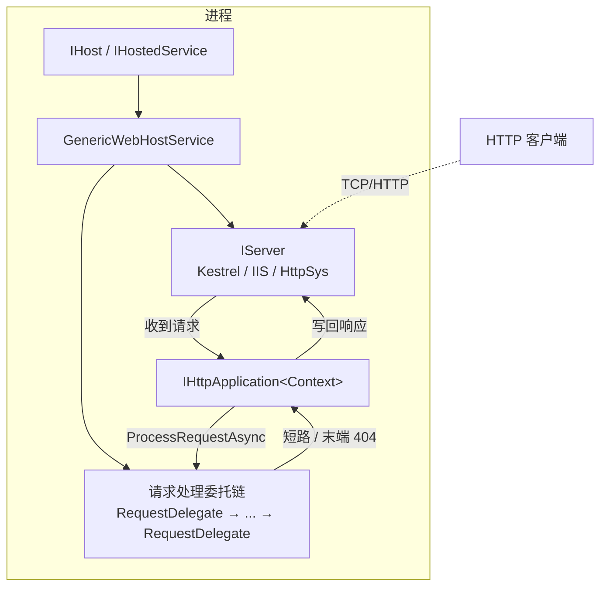

**关键认知**：

- **`IServer` 与中间件管道彼此正交**：`IServer` 负责「**接 socket、解析 HTTP**」；中间件管道负责「**业务处理逻辑**」；
- **`IHttpApplication<TContext>` 是两者的胶水**：服务器把请求转交给它，由它驱动整个中间件管道；
- **整个 Web 应用本身就是一个 `IHostedService`**：通用宿主把它和其他后台服务一视同仁。

### 1.2 一次 HTTP 请求的旅程

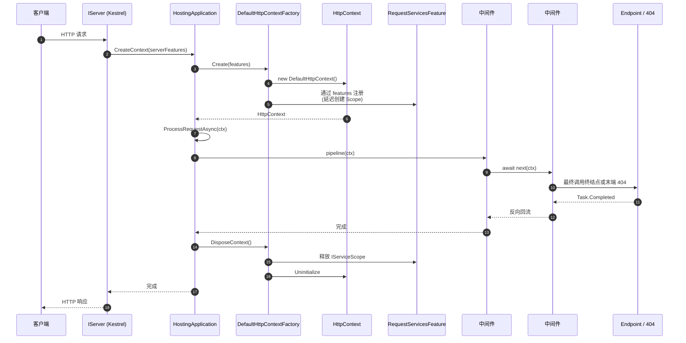

**关键点**：

- **HttpContext 是「**特性集合 + 几个便捷属性**」的薄包装** —— 真正的能力都在 `IFeatureCollection` 里(详见 §7.2)；
- **每请求一个 IServiceProvider 作用域** —— `RequestServicesFeature` 延迟到首次访问 `HttpContext.RequestServices` 时创建；
- **响应完成才释放 Scope** —— 通过 `Response.RegisterForDisposeAsync` 注册自身。

### 1.3 核心类型一览

| 分类 | 类型 | 角色 |
|------|------|------|
| 宿主桥接 | `GenericHostWebHostBuilderExtensions` / `GenericHostBuilderExtensions` / `WebHost` / `WebHostDefaults` / `WebHostOptions` | 把 `IHostBuilder` 与 Web 世界打通 |
| Web 构建器 | `IWebHostBuilder` / `WebHostBuilderBase` / `GenericWebHostBuilder` / `HostingStartupWebHostBuilder` / `WebHostBuilderExtensions` | 收集 Web 专属配置 |
| Web 环境 | `IWebHostEnvironment` / `HostingEnvironment` | 包含 wwwroot 的环境信息 |
| 启动扩展 | `IHostingStartup` / `ISupportsStartup` / `ISupportsUseDefaultServiceProvider` | 第三方动态扩展点 |
| 中间件抽象 | `IApplicationBuilder` / `ApplicationBuilder` / `IApplicationBuilderFactory` / `ApplicationBuilderFactory` / `RunExtensions` / `IStartupFilter` | 注册 + 构建管道 |
| 中间件实现 | `IMiddleware` / `IMiddlewareFactory` / `MiddlewareFactory` / `UseMiddlewareExtensions` | 强类型/约定两种实现 |
| HTTP 抽象 | `HttpContext` / `HttpRequest` / `HttpResponse` | 业务可见的请求模型 |
| 特性集合 | `IFeatureCollection` / `FeatureCollection` / `IServiceProvidersFeature` / `RequestServicesFeature` | 服务器 → 应用的扩展协议 |
| HttpContext 周边 | `IHttpContextAccessor` / `HttpContextAccessor` / `HttpServiceCollectionExtensions` / `IHttpContextFactory` / `DefaultHttpContextFactory` | 创建 / 访问 / 释放 |
| 服务器对接 | `IServer` / `IHttpApplication<>` / `HostingApplication` / `GenericWebHostServiceOptions` / `GenericWebHostService` | 把管道与服务器粘起来 |

---

## 2. ASP.NET Core 接入通用宿主

### 2.1 GenericHostWebHostBuilderExtensions：桥接两个建造者

```mermaid
flowchart LR
    Main["IHostBuilder<br/>(通用宿主)"]
    Main -. ConfigureWebHostDefaults .-> Step1["GenericHostBuilderExtensions"]
    Step1 -. 内部调用 ConfigureWebHost .-> Step2["GenericHostWebHostBuilderExtensions"]
    Step2 --> Bridge["new GenericWebHostBuilder(hostBuilder, options)"]
    Bridge --> Step3["调用 WebHost.ConfigureWebDefaults<br/>(Kestrel / 静态资源 / IIS / 路由)"]
    Step3 --> Step4["调用用户的 configure(webHostBuilder)<br/>(UseStartup / Configure / ...)"]
    Step4 --> Reg["services.AddHostedService&lt;GenericWebHostService&gt;()"]
```

**关键认知**：`IWebHostBuilder` 在新版承载系统中**不再有自己的 `Build`** —— 它只是个「**临时配置收集器**」，最终所有配置都通过 `WebHostBuilderBase` **转移到 `IHostBuilder`**(详见 §2.3)。`IWebHostBuilder.Build()` 被显式标记为 `throw new NotSupportedException(...)`。

### 2.2 GenericWebHostService：作为 IHostedService 启动 Web

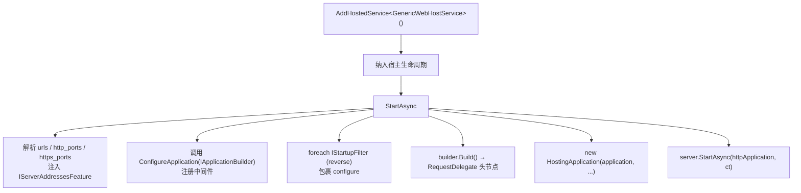

**为什么 Web 应用是「**IHostedService**」？** —— 因为它要随宿主一起启动、停止；`Internal.Host.StartAsync` 遍历调用 `IHostedService.StartAsync`(参考 `Notes/服务承载.md` §7.1)，这一步触发服务器监听端口。

### 2.3 WebHostBuilderBase：把配置转移到 IHostBuilder

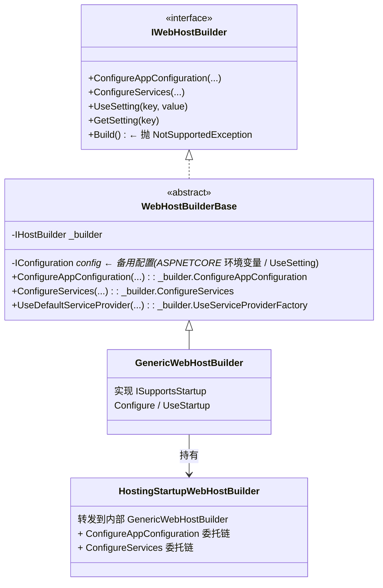

**「转移」的工作机制**：

```C#
// WebHostBuilderBase.ConfigureServices（精简）
public IWebHostBuilder ConfigureServices(Action<WebHostBuilderContext, IServiceCollection> configureServices)
{
    _builder.ConfigureServices((context, builder) =>          // ← 直接转给 IHostBuilder
    {
        var webhostBuilderContext = GetWebHostBuilderContext(context);
        configureServices(webhostBuilderContext, builder);
    });
    return this;
}
```

**`WebHostBuilderContext` 通过 `HostBuilderContext.Properties` 字典缓存** —— 多次 `ConfigureXxx` 不会重复创建上下文，且 `Configuration` 属性会在「应用配置就绪」后自动更新。

### 2.4 ConfigureWebDefaults：默认 Web 配置

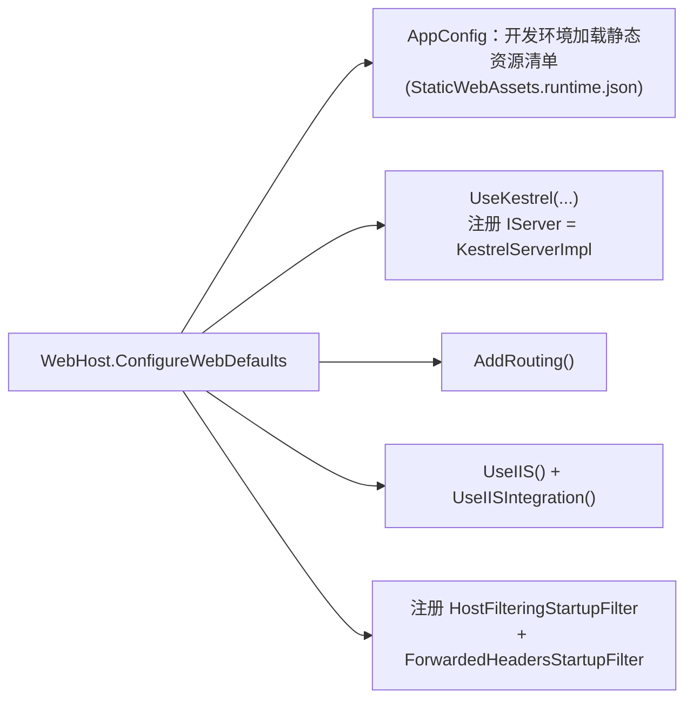

**典型 Filter 注册**：

- **`HostFilteringStartupFilter`** 注入 `HostFilteringMiddleware` —— 校验 `Host` 头是否在允许列表；
- **`ForwardedHeadersStartupFilter`** 注入 `ForwardedHeadersMiddleware` —— 处理反向代理传来的 `X-Forwarded-For` / `X-Forwarded-Proto`；
- **`IISSetupFilter`**(由 `UseIIS()` 注册) —— 注入 `PathBaseMiddleware` + `ForwardedHeadersMiddleware` + `IISMiddleware`。

> 详见原笔记 第 141–243 行 `WebHost`。

---

## 3. WebHost 配置体系

### 3.1 IWebHostEnvironment 与 wwwroot

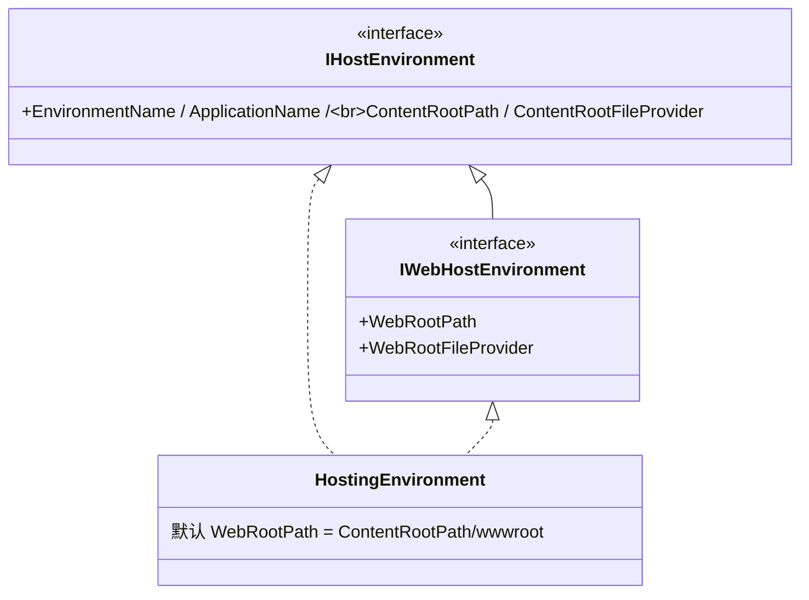

**`WebRootPath` 解析规则**：

- 若配置 `webroot` 指定路径 → 使用之；
- 否则使用 `{ContentRootPath}/wwwroot`；
- 目录不存在会被自动创建。

**`WebRootFileProvider` 在开发环境会被替换为 `CompositeFileProvider`** —— 把多个静态资源根目录(从 `*.staticwebassets.runtime.json` 读取)叠加在一起，支持 Razor Class Library 等多源静态资源。

### 3.2 WebHostOptions：主备配置读取

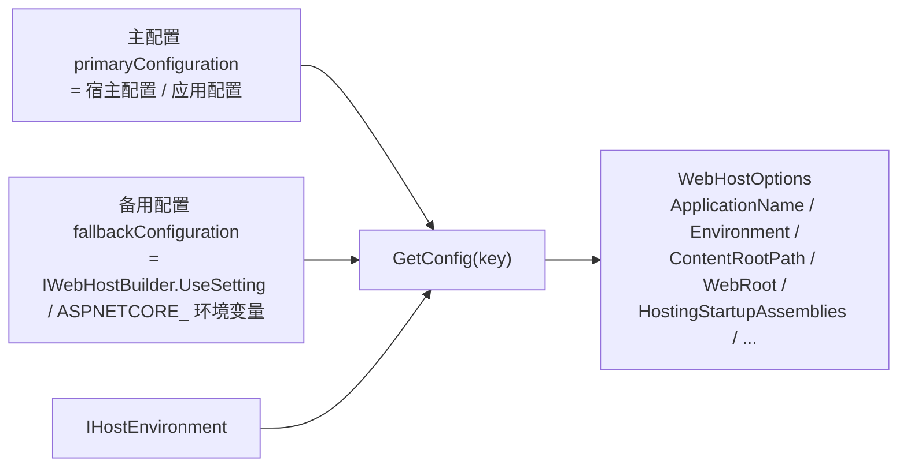

**`GetConfig` 的优先级**：`primary[key] ?? fallback[key]`。

**部分字段会从 `IHostEnvironment` 直接读取**(如 `ApplicationName` / `EnvironmentName` / `ContentRootPath`) —— 因为这些字段在「宿主环境初始化」时已经定型，比 `IConfiguration` 更可信。

### 3.3 IWebHostBuilder 三种 Configure

| 方法 | 配置目标 | 何时执行 |
|------|---------|---------|
| `ConfigureAppConfiguration` | 应用配置 `IConfiguration` | 转发到 `IHostBuilder.ConfigureAppConfiguration` |
| `ConfigureServices` | `IServiceCollection` | 转发到 `IHostBuilder.ConfigureServices` |
| `UseDefaultServiceProvider` | DI 工厂选项 | 转发到 `IHostBuilder.UseServiceProviderFactory` |
| **`Configure(Action<IApplicationBuilder>)`** | 中间件管道 | 通过 `GenericWebHostServiceOptions.ConfigureApplication` 传递给 `GenericWebHostService` |
| **`UseStartup(Type)`** | 反射方式收集 ConfigureServices + ConfigureContainer + Configure | 同上 |

**前三个走 `WebHostBuilderBase`，后两个走 `GenericWebHostBuilder`(实现 `ISupportsStartup`)** —— 这就是为什么 `ISupportsStartup` 接口必须独立：让 `WebHostBuilderBase` 不强制依赖 `IApplicationBuilder`(便于将来扩展)。

### 3.4 IWebHostBuilder.UseSetting：备用配置

`UseSetting(key, value)` 写入 `WebHostBuilderBase._config`(一个内存 + ASPNETCORE_ 环境变量的备用 `IConfiguration`)。

**典型使用场景**：

```C#
hostBuilder.ConfigureWebHostDefaults(web =>
{
    web.UseSetting(WebHostDefaults.PreventHostingStartupKey, "true");  // 禁用 IHostingStartup
    web.UseSetting(WebHostDefaults.ServerUrlsKey, "http://+:5000");    // 设置监听 URL
});
```

**与应用 `IConfiguration` 的区别**：

- `UseSetting` 在**构建阶段**就生效，决定 `WebHostOptions` 的值；
- 应用 `IConfiguration` 在**服务注册之后**才完整可用；
- 同一键的最终值由 `GetConfig` 的优先级链决定(应用配置 > 备用配置 / 环境变量)。

### 3.5 Startup 类型加载约定

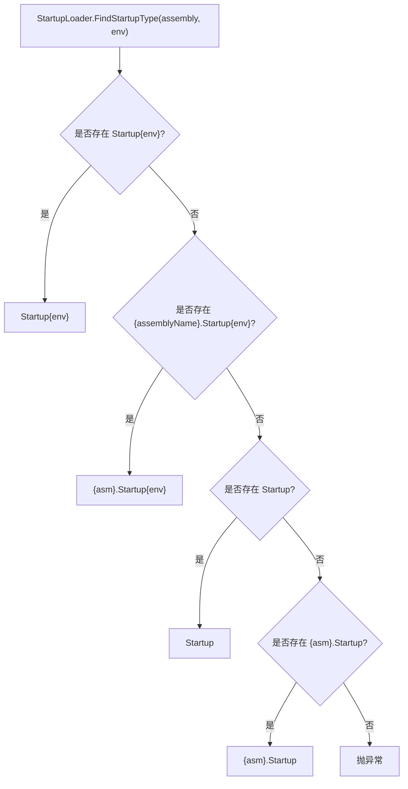

**示例**：开发环境 `Environment=Development`，会优先查找 `StartupDevelopment` —— 这是 ASP.NET Core 早期的「**按环境切换 Startup**」机制(现已较少使用)。

**约定 Startup 类必须满足**：

- 公共构造函数(可注入 `IConfiguration` / `IHostEnvironment` / 自身的 Options)；
- `public void ConfigureServices(IServiceCollection)` 方法(可选)；
- `public void Configure(IApplicationBuilder, ...)` 方法(必选)；
- 可选的 `public void ConfigureContainer<TBuilder>(TBuilder)` 方法。

> 详见原笔记 第 614–1091 行 `GenericWebHostBuilder`。

---

## 4. IHostingStartup：第三方动态扩展

### 4.1 HostingStartupAttribute + IHostingStartup

`IHostingStartup` 是一种「**程序集级别**」的动态扩展机制 —— 第三方包不需要修改主程序代码就能注册服务、配置应用：

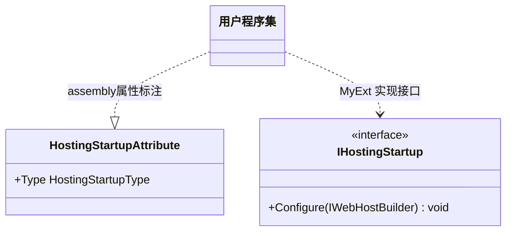

**典型应用**：Application Insights、ASP.NET Core Module、第三方诊断工具会通过 `IHostingStartup` 自动接入。

### 4.2 加载流程

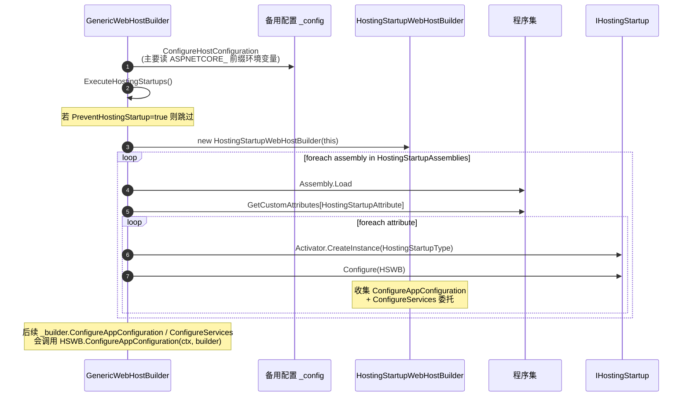

**`HostingStartupWebHostBuilder` 的特殊行为**：

- `ConfigureAppConfiguration` 和 `ConfigureServices` **不立即转给 `IHostBuilder`**，而是存到自己的委托链；
- 其它方法(`UseSetting` / `ConfigureLogging` / ...)直接转发给内部的 `GenericWebHostBuilder`；
- 这样可以让动态扩展先于用户代码注册的 Configure 生效。

**禁用机制**：

- 配置 `preventHostingStartup=true`(通过 `UseSetting` 或 `ASPNETCORE_PREVENTHOSTINGSTARTUP=true`)；
- 把不想加载的程序集名加入 `hostingStartupExcludeAssemblies`。

> 详见原笔记 第 1092–1199 行 `HostingStartupWebHostBuilder` 与 第 1374–1383 行 `IHostingStartup`。

---

## 5. 中间件模型：IApplicationBuilder

### 5.1 中间件的三种形态

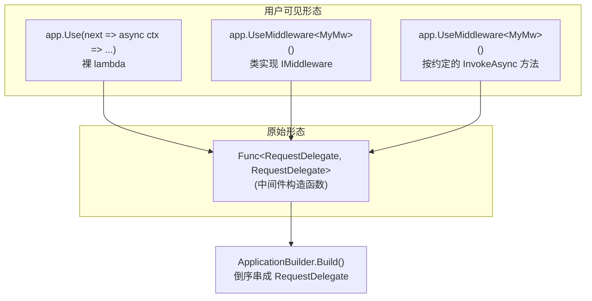

**三种形态最终都被「编译」成同一种原始形态 `Func<RequestDelegate, RequestDelegate>`** —— 这是中间件模型最重要的统一抽象。

### 5.2 IApplicationBuilder 类图

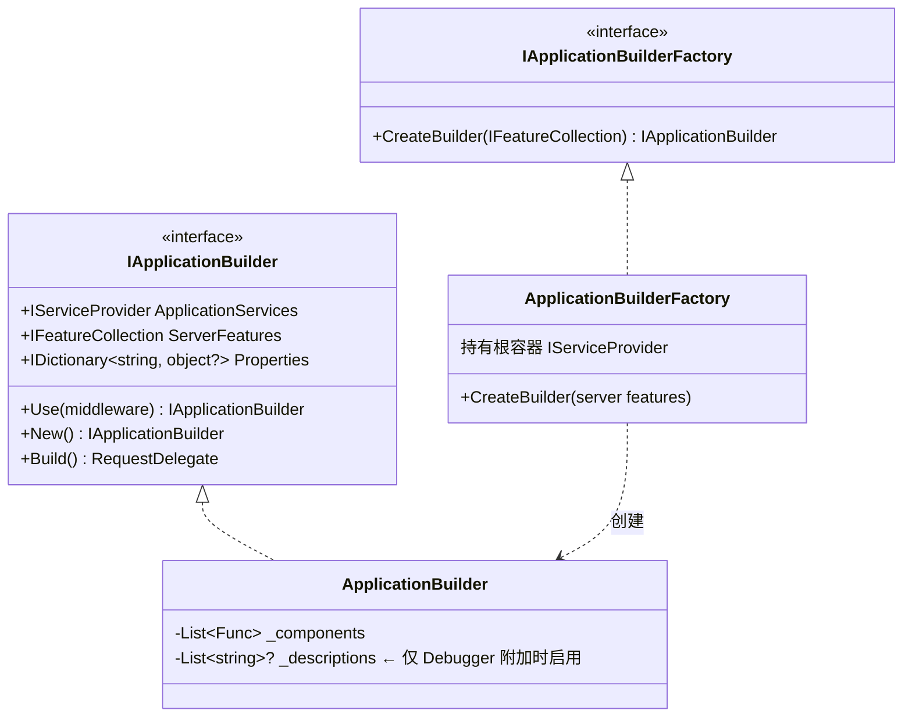

**`Properties` 共享字典存了什么？**

| Key | 值 |
|-----|-----|
| `"server.Features"` | 服务器提供的 `IFeatureCollection`(`ServerFeatures` 属性映射到此) |
| `"application.Services"` | 根容器 `IServiceProvider`(`ApplicationServices` 属性映射到此) |
| `"__MiddlewareDescriptions"` | 中间件名称列表(仅 Debugger 启用) |
| `"__RequestUnhandled"` | 末端 404 标记 |

**`New()` 的用途**：创建一个**新的** `ApplicationBuilder` 但**共享 `Properties` 字典**(通过 `CopyOnWriteDictionary`) —— 用于分支管道(如 `app.Map(...)` 内部)。

### 5.3 ApplicationBuilder.Build：倒序构建委托链

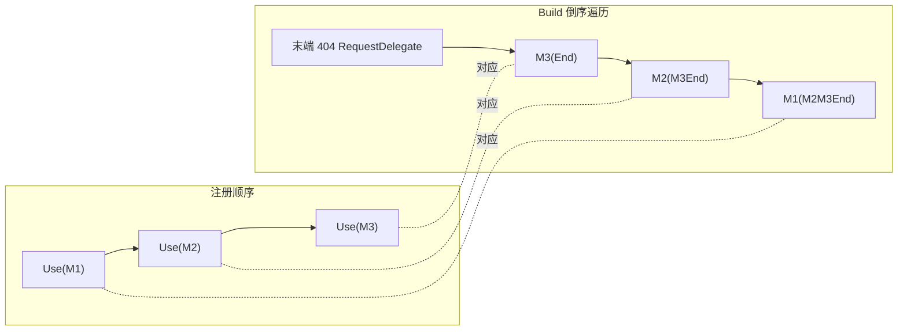

**关键代码**(精简的核心 5 行)：

```C#
RequestDelegate app = context => /* 末端 404 处理器 */;
for (var c = _components.Count - 1; c >= 0; c--)
{
    app = _components[c](app);    // 每个中间件以「后续」作为参数包装出新的处理器
}
return app;
```

**为什么倒序？** 因为每个中间件需要持有「**它之后的处理器**」(`next`)。从末端起算，向前层层包装：

- `M3` 拿到末端 404 → 得到 `M3End`；
- `M2` 拿到 `M3End` → 得到 `M2M3End`；
- `M1` 拿到 `M2M3End` → 得到 `M1M2M3End`(最终返回)。

### 5.4 末端 404 处理器

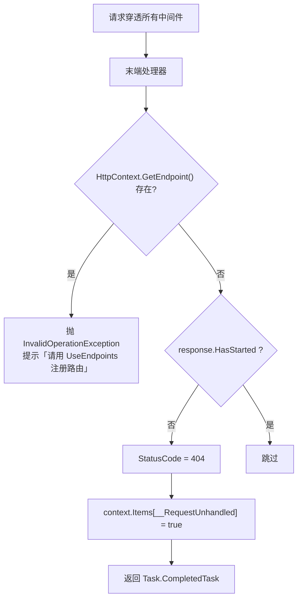

**两个细节**：

- **若 `HttpContext.GetEndpoint()` 不为 null**(说明路由匹配到了但 `EndpointMiddleware` 没注册) → 抛清晰的错误信息；
- **`__RequestUnhandled` 标记**：让前序中间件知道「请求没被业务处理」，用于诊断 / 日志。

### 5.5 IApplicationBuilderFactory

`ApplicationBuilderFactory` 由 DI 提供，构造时注入**根容器** `IServiceProvider`。`GenericWebHostService.StartAsync` 用它创建 `IApplicationBuilder`：

```C#
var builder = ApplicationBuilderFactory.CreateBuilder(Server.Features);
```

`Server.Features` 此时包含 `IServerAddressesFeature` 等服务器级特性 —— 通过 `IApplicationBuilder.ServerFeatures` 可以让中间件感知到。

### 5.6 IStartupFilter：在中间件之间插入逻辑

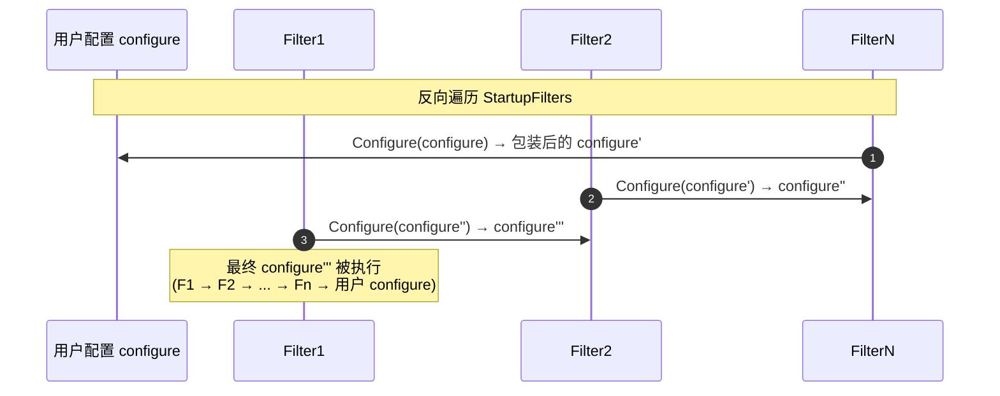

**关键代码**：

```C#
foreach (var filter in StartupFilters.Reverse())   // 反向遍历
    configure = filter.Configure(configure);       // 链式包装
configure(builder);                                 // 执行
```

**用途**：让框架级中间件能够**包裹用户中间件**而不需要用户手动 `Use(...)`。例如：

- `HostFilteringStartupFilter` 把 `UseHostFiltering()` 注入到用户管道最前面；
- 反向遍历保证「**最先注册的 Filter 在最外层**」，第一个收到请求 / 最后处理响应。

> 详见原笔记 第 1387–1397 行 `IStartupFilter`，第 2933–2942 行 `GenericWebHostService` 中的反转应用。

---

## 6. 三种中间件注册模式

### 6.1 Use / Run / UseMiddleware 区别

| API | 是否短路 | 中间件形态 | 使用场景 |
|-----|---------|----------|---------|
| `app.Use(Func<RequestDelegate, RequestDelegate>)` | 不短路(调用方决定) | 原始形态 | 内部 API |
| `app.Use(async (ctx, next) => { ... await next(); ... })` | 不短路 | Lambda 糖 | 临时小逻辑 |
| `app.Run(RequestDelegate)` | **总是短路** | 末端处理器 | 终结点处理 |
| `app.UseMiddleware<T>()` | T 决定 | 强类型或约定 | 业务中间件 |

**`Run` 的实现**：

```C#
public static void Run(this IApplicationBuilder app, RequestDelegate handler)
{
    app.Use(_ => handler);                      // 注意：丢弃 next 参数
}
```

`_ => handler` 意味着「**不论后续中间件是什么，都返回固定 handler**」 —— 自然就短路了。

### 6.2 强类型中间件：IMiddleware + IMiddlewareFactory

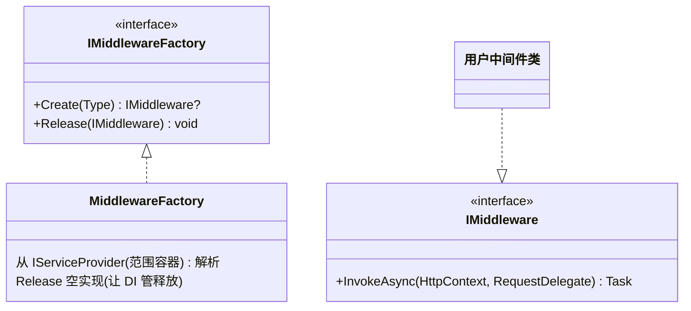

**关键认知**：

- **`IMiddlewareFactory` 注册为 Scoped 生命周期** —— 每请求一个工厂实例；
- **强类型中间件可以是 Scoped 生命周期** —— 因为是按请求创建；
- **每次请求都重新 `Create`** —— 中间件实例不缓存。

**运行时分支**(在 `UseMiddlewareExtensions.InterfaceMiddlewareBinder`)：

```C#
return async context =>
{
    var middlewareFactory = context.RequestServices.GetService<IMiddlewareFactory>();
    var middleware = middlewareFactory.Create(_middlewareType);
    try { await middleware.InvokeAsync(context, next); }
    finally { middlewareFactory.Release(middleware); }
};
```

### 6.3 约定中间件：反射 + 表达式树编译

约定中间件**没有接口约束**，只需要满足以下规则：

| 要求 | 校验 |
|------|------|
| 公共构造函数 | `GetConstructors()` |
| 公共实例 `Invoke` 或 `InvokeAsync` 方法 | 严格区分大小写，不可重载，不可两者并存 |
| 方法返回 `Task` | `typeof(Task).IsAssignableFrom(...)` |
| 第一个参数是 `HttpContext` | `parameters[0].ParameterType` |

**生命周期约束**：

- **整个应用程序只创建一个实例**(在 `Build` 时反射构造)；
- 构造函数参数从「`UseMiddleware` 显式实参列表」+「根容器 DI」混合解析；
- `Invoke`/`InvokeAsync` 方法的额外参数(第一个 `HttpContext` 之外)从**当前请求的范围容器**解析(每次调用都解析)。

**性能优化 —— 表达式树编译**：

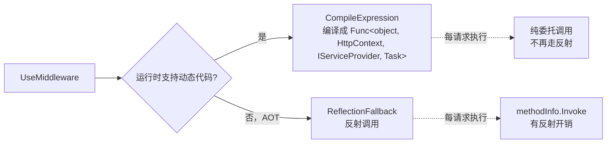

**关键代码**(精简的核心 5 行)：

```C#
var middleware = typeof(T);
var instanceArg = Expression.Parameter(middleware, "middleware");
var httpContextArg = Expression.Parameter(typeof(HttpContext), "httpContext");
var providerArg = Expression.Parameter(typeof(IServiceProvider), "serviceProvider");
// ... 为每个额外参数构造 GetService 调用 ...
var lambda = Expression.Lambda<Func<T, HttpContext, IServiceProvider, Task>>(body, instanceArg, httpContextArg, providerArg);
return lambda.Compile();
```

### 6.4 注册模式对比表

| 模式 | 实例生命周期 | 构造函数参数来源 | InvokeAsync 额外参数来源 | 适用场景 |
|------|------------|----------------|------------------------|---------|
| 强类型 `IMiddleware` | Scoped(每请求) | DI 范围容器 | 仅 `HttpContext` + `RequestDelegate` | 需 Scoped 依赖、清晰契约 |
| 约定中间件 | Singleton(全应用) | DI 根容器 + 显式实参 | DI 范围容器(每次调用解析) | 不希望被范围容器约束、性能敏感 |

**默认选择**：业务中间件优先用**强类型** —— 契约清晰、DI 友好；只有需要持有大量 Singleton 资源的中间件才用**约定**。

> 详见原笔记 第 1702–2005 行 `UseMiddlewareExtensions`。

---

## 7. HttpContext 与特性集合

### 7.1 HttpContext / Request / Response 类图

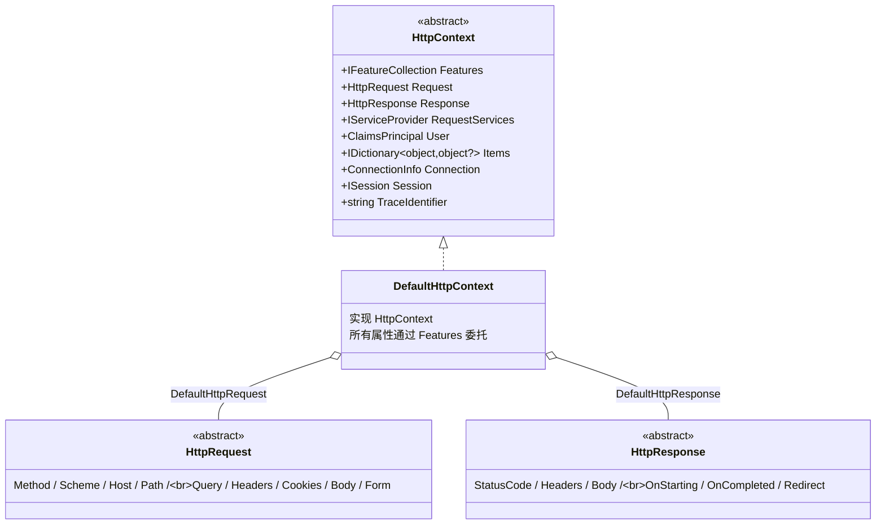

**关键设计**：`DefaultHttpContext` 与 `DefaultHttpRequest` / `DefaultHttpResponse` **不存数据** —— 它们只是「**特性集合的代理**」。所有属性通过查询 `Features` 集合获取(详见 §7.2)。

### 7.2 IFeatureCollection：服务器 → 应用的扩展协议

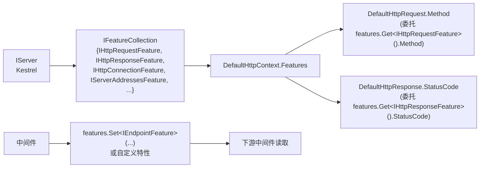

**`IFeatureCollection` 的本质**：`Dictionary<Type, object>` 的薄包装 —— `Key` 是特性接口类型，`Value` 是实现该接口的对象。

**两种典型流向**：

- **服务器写入** → **应用读取**：`IHttpRequestFeature.Method` 由 Kestrel 设置，Request.Method 读取；
- **中间件写入** → **后续中间件读取**：`IEndpointFeature` 由路由中间件设置，`EndpointMiddleware` 读取。

**`FeatureCollection` 的版本字段**：每次添加/删除特性 `_containerRevision++`。`DefaultHttpContext` 缓存常用特性的引用，检测到版本变化才重新查询 —— 减少字典访问开销。

### 7.3 IHttpContextAccessor 与 AsyncLocal

```mermaid
classDiagram
    class IHttpContextAccessor {
        <<interface>>
        +HttpContext? HttpContext
    }
    class HttpContextAccessor {
        -static AsyncLocal&lt;HttpContextHolder&gt; _httpContextCurrent
        +HttpContext : Get / Set 都走 AsyncLocal
    }
    class HttpContextHolder {
        +HttpContext? Context
    }

    IHttpContextAccessor <|.. HttpContextAccessor
    HttpContextAccessor o-- HttpContextHolder
```

**为什么用 `HttpContextHolder` 包装？** 直接 `AsyncLocal<HttpContext>` 在线程切换 / 异步流动时会**「按值拷贝」** —— 多个 Task 的 `_httpContextCurrent.Value` 可能互不可见。用一个引用类型 `Holder` 包装，所有 Task 共享同一个 `Holder`，对 `Holder.Context` 的修改互相可见(但又能通过设 null 实现「清除」)。

**注册方式**：

```C#
services.AddHttpContextAccessor();   // 内部 TryAddSingleton
```

**慎用场景**：

- **后台任务**(`BackgroundService`)中不要持有 `IHttpContextAccessor` —— 后台没有请求上下文；
- **跨请求引用 `HttpContext`** 是**错误的** —— 响应完成后 `HttpContext` 已经被回收。

### 7.4 IHttpContextFactory：每请求创建/释放 HttpContext

```mermaid
sequenceDiagram
    autonumber
    participant S as IServer
    participant HA as HostingApplication
    participant F as DefaultHttpContextFactory
    participant CTX as DefaultHttpContext
    participant ACC as IHttpContextAccessor

    S->>HA: CreateContext(serverFeatures)
    HA->>F: Create(features)
    F->>CTX: new DefaultHttpContext(features)
    F->>CTX: Initialize(features)<br/>(更新 Features 引用 + 重置缓存版本)
    F->>ACC: HttpContext = ctx  ← 写入 AsyncLocal
    F->>CTX: ServiceScopeFactory = _scopeFactory

    Note over S,CTX: 中间件管道执行

    HA->>F: DisposeContext(ctx)
    F->>ACC: HttpContext = null  ← 清空 AsyncLocal
    F->>CTX: Uninitialize()  ← 释放范围容器、清空内部字段
```

**关键设计**：

- **`HttpContext` 不一定每请求都 `new`** —— `HostingApplication.CreateContext` 通过 `IHostContextContainer<Context>` 在请求间复用 `Context` 与底层 `HttpContext`，调 `Initialize` 重置；
- **释放只清状态、不释放对象本身** —— 这是「**对象池**」模式的体现，减少 GC 压力。

### 7.5 RequestServicesFeature：每请求作用域

```mermaid
flowchart TD
    First["首次访问 HttpContext.RequestServices"]
    First --> Feat["特性集合 Get&lt;IServiceProvidersFeature&gt;()"]
    Feat --> Lazy{"已创建?"}
    Lazy -->|否| Reg["context.Response.RegisterForDisposeAsync(this)<br/>注册响应完成后释放"]
    Reg --> Scope["_scope = _scopeFactory.CreateScope()"]
    Scope --> Set["_requestServices = _scope.ServiceProvider"]
    Lazy -->|是| Cached[返回缓存的 _requestServices]
    Set --> Return[返回 IServiceProvider]
    Cached --> Return

    Return -. 响应完成 .-> DisposeAsync["DisposeAsync<br/>scope.Dispose()"]
```

**关键设计**：

- **延迟创建**：很多请求(如静态文件)根本不需要范围容器；
- **响应完成才释放**：保证中间件管道全程范围内能访问；
- **自我注册**：`RequestServicesFeature` 实现 `IAsyncDisposable`，通过 `RegisterForDisposeAsync(this)` 把自己挂到响应回调上。

> 详见原笔记 第 2508–2589 行 `RequestServicesFeature`。

---

## 8. 服务器对接：IServer + IHttpApplication

### 8.1 IServer 抽象

```mermaid
classDiagram
    class IServer {
        <<interface>>
        +IFeatureCollection Features
        +StartAsync&lt;TContext&gt;(IHttpApplication, ct) Task
        +StopAsync(ct) Task
    }

    class KestrelServerImpl
    class IISHttpServer
    class HttpSysServer

    IServer <|.. KestrelServerImpl
    IServer <|.. IISHttpServer
    IServer <|.. HttpSysServer
```

**关键设计**：

- **`Features` 包含服务器级别的特性** —— 最重要的是 `IServerAddressesFeature`(监听地址)；
- **`StartAsync<TContext>` 是泛型方法** —— 让服务器与 `IHttpApplication<TContext>` 的 `TContext` 类型解耦；
- **服务器自己不构造 `HttpContext`** —— 而是把服务器特性集合 `IFeatureCollection` 传给 `IHttpApplication.CreateContext`，由后者负责构造。

### 8.2 IHttpApplication<TContext> 三段式

```mermaid
flowchart LR
    Server[IServer 收到请求] --> Create["application.CreateContext(features)"]
    Create --> Process["application.ProcessRequestAsync(context)"]
    Process --> Dispose["application.DisposeContext(context, exception)"]

    Create -. 返回 .- TC1["TContext<br/>(包含 HttpContext + 诊断信息)"]
    Process -. 执行 .- TC2["驱动中间件管道"]
    Dispose -. 清理 .- TC3["释放范围容器 + 重置上下文"]
```

**为什么要用泛型 `TContext` 而不是直接 `HttpContext`？**

- 让 `IServer` 不直接依赖 `HttpContext`(便于将来扩展非 HTTP 协议)；
- 允许 `HostingApplication.Context` 在 `HttpContext` 之外附加诊断信息(Activity / StartLog / 性能计数等)；
- 允许服务器使用 **`IHostContextContainer<TContext>` 复用 Context 对象**，减少分配。

### 8.3 HostingApplication.Context 与诊断

```mermaid
classDiagram
    class HostingApplication {
        -RequestDelegate _application
        -DefaultHttpContextFactory _defaultHttpContextFactory
        -HostingApplicationDiagnostics _diagnostics
        +CreateContext(features) Context
        +ProcessRequestAsync(ctx) Task
        +DisposeContext(ctx, ex) void
    }
    class Context {
        +HttpContext? HttpContext
        +IDisposable? Scope
        +Activity? Activity (via HttpActivityFeature)
        +HostingRequestStartingLog? StartLog
        +long StartTimestamp
        +bool HasDiagnosticListener
        +bool MetricsEnabled / EventLogEnabled
        +Reset() void
    }

    HostingApplication o-- Context : 创建 / 复用
    Context o-- HttpContext
```

**`Context.Reset()` 的作用**：当 `IHostContextContainer<Context>` 在请求间复用 Context 时，把所有诊断字段清空 —— 避免脏数据带到下一个请求。

**诊断在哪里触发？**

| 时机 | 调用 |
|------|------|
| `CreateContext` 末尾 | `_diagnostics.BeginRequest(httpContext, hostContext)` |
| `DisposeContext` 开头 | `_diagnostics.RequestEnd(httpContext, ex, hostContext)` |
| `DisposeContext` 末尾 | `_diagnostics.ContextDisposed(hostContext)` |

诊断写入到 `DiagnosticListener` / `EventSource` / `ActivitySource` 等多个通道 —— 便于 OpenTelemetry、Application Insights、自定义 APM 接入。

### 8.4 GenericWebHostService.StartAsync：管道构建与服务器启动

```mermaid
sequenceDiagram
    autonumber
    participant Host as Internal.Host
    participant GWHS as GenericWebHostService
    participant Cfg as IConfiguration
    participant Srv as IServer
    participant ABF as IApplicationBuilderFactory
    participant SF as IStartupFilter[]
    participant HA as HostingApplication

    Host->>GWHS: StartAsync(ct)

    GWHS->>Srv: server.Features.Get[IServerAddressesFeature]
    GWHS->>Cfg: 读 urls / http_ports / https_ports
    GWHS->>Srv: 写入 addresses

    GWHS->>ABF: CreateBuilder(server.Features)
    Note over GWHS: 取出 Options.ConfigureApplication<br/>(由 UseStartup / Configure 设置)

    loop foreach IStartupFilter (reverse)
        GWHS->>SF: configure = filter.Configure(configure)
    end

    GWHS->>GWHS: configure(applicationBuilder)<br/>注册所有中间件
    GWHS->>GWHS: application = builder.Build()<br/>RequestDelegate 头节点

    GWHS->>HA: new HostingApplication(application, ...)
    GWHS->>Srv: server.StartAsync(httpApplication, ct)
```

**两类异常处理**：

- **构建管道时抛错**：若 `CaptureStartupErrors = true`，会构造**错误页面 Application** 代替正常管道(开发环境默认显示详细错误)；
- **服务器启动抛错**：直接向上传播，让 `Internal.Host` 处理(参考 `Notes/服务承载.md` §7.1)。

### 8.5 IServerAddressesFeature + Urls / Ports

```mermaid
flowchart TD
    Start["GenericWebHostService.StartAsync"]
    Start --> Get[server.Features.Get&lt;IServerAddressesFeature&gt;]
    Get --> Empty{"Addresses 为空且非只读?"}
    Empty -->|否| Skip[跳过地址注入]
    Empty -->|是| Cfg["读 urls (配置 / WebHostOptions)"]

    Cfg --> HasUrls{"urls 非空?"}
    HasUrls -->|否| Ports["读 http_ports + https_ports<br/>展开为 http://*:port"]
    HasUrls -->|是| AddDir[直接添加]
    Ports --> AddDir

    AddDir --> Pref["读 preferHostingUrls<br/>(默认 false)"]
    Pref --> Done[完成]
```

**`PreferHostingUrls` 的语义**：

- `false`(默认)：如果服务器(如 `KestrelServerOptions.Listen`)已配置监听地址，**优先使用服务器配置**，应用配置的 `urls` 作为兜底；
- `true`：**应用配置的 `urls` 优先**，服务器配置可能被覆盖。

**`http_ports` / `https_ports`** 是 ASP.NET Core 6+ 引入的简化方式：

```json
// appsettings.json
{ "Http_Ports": "5000;5001", "Https_Ports": "5002" }
```

会被展开为 `http://*:5000;http://*:5001;https://*:5002`。

> 详见原笔记 第 2853–2992 行 `GenericWebHostService.StartAsync`。

---

## 9. 设计思想速览

### 9.1 配置转移：IWebHostBuilder 没有自己的 Build

`IWebHostBuilder` 是 ASP.NET Core 2.x 的遗产 —— 它原本能自己 `Build` 出 `IWebHost`。3.x 后引入通用宿主，`IWebHostBuilder` 退化为「**临时收集器**」：

| 阶段 | 行为 |
|------|------|
| 用户调用 `ConfigureAppConfiguration` 等 | `WebHostBuilderBase` 直接转给 `_builder.ConfigureAppConfiguration` |
| 用户调用 `Configure(IApplicationBuilder)` | `GenericWebHostBuilder` 存到 `GenericWebHostServiceOptions.ConfigureApplication` |
| `IHostBuilder.Build()` 时 | 所有委托被正确顺序执行 |

**为什么不直接废弃 `IWebHostBuilder`？** —— 大量历史代码依赖 `IWebHostBuilder` API。保留接口并「转移到 `IHostBuilder`」是兼容性最优解。

### 9.2 中间件 = 高阶函数组合

```mermaid
flowchart LR
    Type["RequestDelegate = Func&lt;HttpContext, Task&gt;"]
    Type --> Mw["中间件 = Func&lt;RequestDelegate, RequestDelegate&gt;<br/>「拿一个处理器，返回一个处理器」"]
    Mw --> Compose["管道 = M1 ∘ M2 ∘ ... ∘ Mn ∘ End<br/>(组合即调用)"]
```

整个中间件系统就是**函数组合**的应用 —— 每个中间件是「**装饰器**」，包装下一个处理器；所有装饰器嵌套形成完整管道。

这种设计的好处：

- **零虚函数 / 无反射**(强类型路径)；
- **完全可控的执行顺序**(注册顺序即执行顺序)；
- **天然支持短路**(中间件不调 `next` 即可)。

### 9.3 IFeatureCollection：服务器与应用之间的扩展协议

```mermaid
flowchart LR
    Server[IServer 实现] --> Set["Set&lt;IXxxFeature&gt;(impl)"]
    Set --> Coll[IFeatureCollection]
    Coll --> Get1["Get&lt;IXxxFeature&gt;()"]
    Get1 --> App[HttpContext 应用代码]

    App --> Set2["Set&lt;IEndpointFeature&gt;(...)"]
    Set2 --> Coll
    Coll --> Get2["Get&lt;IEndpointFeature&gt;()"]
    Get2 --> Down[下游中间件]
```

**`IFeatureCollection` 是 ASP.NET Core 最优雅的设计之一**：

- **类型安全**(`Get<TFeature>()` 返回强类型)；
- **可扩展**(任何接口都能塞入)；
- **服务器与应用解耦**(协议在中间)；
- **可叠加**(`FeatureCollection` 支持 `defaults` 备用集合)。

它本质上把 OO 的「**接口**」用作运行时插件协议 —— 而不是编译期契约。

### 9.4 对象池思维：HttpContext 复用

为了应对每秒上万次请求，ASP.NET Core 在多个层面采用「**复用而非新建**」：

| 对象 | 复用机制 |
|------|---------|
| `HostingApplication.Context` | 通过 `IHostContextContainer<Context>` 缓存，每请求 `Reset()` |
| `DefaultHttpContext` | 通过 `Initialize` / `Uninitialize` 重置内部状态 |
| `FeatureCollection` | 缓存常用特性引用，版本号变化才重新查询 |

这种模式的代价：**对象「**释放**」不是真正的 GC** —— 用户不能假设状态在请求结束后立即消失。

### 9.5 表达式树编译：约定中间件的性能优化

约定中间件的「`InvokeAsync` 方法可能有任意数量的额外参数」这一灵活性，本可以用反射实现，但反射开销在请求路径上不可接受。框架的方案：

```mermaid
flowchart LR
    Once["UseMiddleware (构建期)"]
    Once --> Build["CompileExpression<br/>构造表达式树 → IL → 委托"]
    Build --> Cache[缓存委托]

    Every["每次请求"]
    Every --> Call[调用缓存的委托]
    Call --> NoReflect["零反射开销"]
```

**关键观察**：**构建期付出一次性的反射 + 编译成本，运行期获得纯委托调用的性能**。这是 .NET 高性能代码生成的标准技巧(同样的思路也用在 EF Core 表达式编译、`System.Text.Json` 源生成器等)。

---

## 10. 速查卡 & 陷阱清单

### 10.1 三种中间件注册模式对照

| 维度 | Lambda(Use 糖) | 强类型 `IMiddleware` | 约定中间件 |
|------|---------------|---------------------|-----------|
| 注册写法 | `app.Use(async (ctx, next) => ...)` | `app.UseMiddleware<MyMw>()` | `app.UseMiddleware<MyMw>()` |
| 类约束 | 无类 | 实现 `IMiddleware` | 无接口约束(按方法名约定) |
| 实例生命周期 | 闭包(全应用) | Scoped(每请求) | Singleton(全应用) |
| InvokeAsync 额外参数 | N/A | 不支持 | 支持(每次调用范围容器解析) |
| 性能 | 最优(无反射) | 较优(DI 创建) | 较优(表达式树编译) |
| 适用 | 临时小逻辑 | 标准业务中间件 | 需要 InvokeAsync 注入 Scoped 服务 |

### 10.2 IFeatureCollection 常见特性

| 特性接口 | 来源 | 内容 |
|---------|------|------|
| `IHttpRequestFeature` | Kestrel | Method / Path / Headers / Body |
| `IHttpResponseFeature` | Kestrel | StatusCode / Headers / OnStarting |
| `IHttpConnectionFeature` | Kestrel | LocalIp / RemoteIp / Port |
| `IServerAddressesFeature` | 服务器 | 监听地址列表 |
| `IServiceProvidersFeature` | 框架 | RequestServices |
| `IEndpointFeature` | 路由中间件 | 匹配的 `Endpoint` |
| `IItemsFeature` | 框架 | `HttpContext.Items` 的底层 |
| `ISessionFeature` | Session 中间件 | `HttpContext.Session` |
| `IHttpAuthenticationFeature` | 鉴权中间件 | User |

### 10.3 中间件管道执行顺序速记

```
注册顺序 = 执行顺序(请求方向)
↓
  M1 调 next 之前的代码  ┐
    M2 调 next 之前的代码 ┐
      ...
        End 处理器
      ...
    M2 调 next 之后的代码 ┘
  M1 调 next 之后的代码  ┘
↑
执行顺序(响应方向) = 注册顺序的反向
```

「**短路**」=「**某个中间件不调 `next`**」 —— 后续中间件全部跳过，响应直接从短路点回流。

### 10.4 10 大常见陷阱

1. **中间件顺序错误**：例如把 `UseAuthentication()` 放在 `UseAuthorization()` 之后 —— 鉴权信息还没建立就授权检查。**对策**：按 .NET 官方推荐的标准顺序注册。
2. **在 `Configure` 里访问 Scoped 服务**：`Configure` 在**应用启动阶段**执行，没有请求范围。**对策**：把依赖移到中间件内部解析(`InvokeAsync` 参数或 `RequestServices.GetService<T>()`)。
3. **强类型中间件忘记注册到 DI**：`UseMiddleware<MyMw>()` 期望 `MyMw` 已经 `services.AddScoped<MyMw>()`。**对策**：注册时同时 `AddScoped`；或改用约定写法。
4. **约定中间件构造函数注入了 Scoped 服务**：构造函数在「**Build 期**」用根容器解析 —— Scoped 服务会被「**Captive Dependency**」陷阱。**对策**：把 Scoped 注入到 `InvokeAsync` 而非构造函数；或用强类型 `IMiddleware`。
5. **`app.Run(handler)` 后还注册了中间件**：`Run` 总是短路 —— 后续 `Use` 永远不会执行。**对策**：把 `Run` 放在最末尾，或改用 `Use`。
6. **`Map` / `MapWhen` 创建的分支管道不共享中间件**：分支由 `app.New()` 创建，与主管道独立。**对策**：在分支内部重新注册需要的中间件。
7. **从 `HttpContext.Items` 持久化引用**：响应完成后 `HttpContext` 会被 `Uninitialize`，`Items` 可能被清空或重置。**对策**：响应内的临时存储 OK，跨请求需用其他存储。
8. **`IHttpContextAccessor` 在后台线程访问**：`AsyncLocal` 上下文不会自动流入非 ASP.NET 线程池任务。**对策**：在请求线程内先把数据捕获出来再传给后台。
9. **`UseStartup<T>` 与 `Configure(app => ...)` 同时使用**：两者会冲突 —— `Configure` 设置的 `ConfigureApplication` 会被 `UseStartup` 覆盖(取决于注册顺序)。**对策**：二选一。
10. **`IStartupFilter` 包装顺序记反**：第一个注册的 Filter 在最外层 —— 它最早收到请求、最晚处理响应。**对策**：把「越靠近真实业务」的 Filter 越后注册。

### 10.5 原笔记类型 → 本笔记小节 映射表

| 原笔记类型 | 本笔记小节 |
|-----------|-----------|
| `GenericHostWebHostBuilderExtensions` | §2.1 |
| `GenericHostBuilderExtensions` | §2.1 |
| `WebHost` | §2.4 |
| `WebHostDefaults` | §3.1 / §3.4 |
| `WebHostOptions` | §3.2 |
| `IWebHostEnvironment` | §3.1 |
| `HostingEnvironment` | §3.1 |
| `IWebHostBuilder` | §2.3 / §3.3 |
| `ISupportsUseDefaultServiceProvider` | §2.3 |
| `ISupportsStartup` | §2.3 / §3.3 |
| `WebHostBuilderBase` | §2.3 |
| `GenericWebHostBuilder` | §2.3 / §3.5 |
| `HostingStartupWebHostBuilder` | §4.2 |
| `WebHostBuilderExtensions` | §3.3 / §3.4 |
| `IHostingStartup` | §4.1 / §4.2 |
| `IStartupFilter` | §5.6 / §8.4 |
| `IApplicationBuilder` | §5.2 |
| `ApplicationBuilder` | §5.2 / §5.3 / §5.4 |
| `IApplicationBuilderFactory` | §5.5 |
| `ApplicationBuilderFactory` | §5.5 |
| `RunExtensions` | §6.1 |
| `IMiddleware` | §6.2 |
| `IMiddlewareFactory` | §6.2 |
| `MiddlewareFactory` | §6.2 |
| `UseMiddlewareExtensions` | §6.2 / §6.3 |
| `HttpContext` | §7.1 |
| `HttpRequest` | §7.1 |
| `HttpResponse` | §7.1 |
| `IFeatureCollection` | §7.2 / §10.2 |
| `FeatureCollection` | §7.2 |
| `IHttpContextAccessor` | §7.3 |
| `HttpContextAccessor` | §7.3 |
| `HttpServiceCollectionExtensions` | §7.3 |
| `IHttpContextFactory` | §7.4 |
| `DefaultHttpContextFactory` | §7.4 |
| `IServiceProvidersFeature` | §7.5 |
| `RequestServicesFeature` | §7.5 |
| `IServer` | §8.1 |
| `IHttpApplication<>` | §8.2 |
| `HostingApplication` | §8.3 |
| `GenericWebHostServiceOptions` | §8.4 |
| `GenericWebHostService` | §2.2 / §8.4 / §8.5 |
