# 路由

> 本笔记是 ASP.NET Core（.NET 6+）`Microsoft.AspNetCore.Routing` 与 `Microsoft.AspNetCore.Http.Endpoints` 的学习整理，配套源码解读位于仓库根目录 `路由.md`。
>
> 风格延续前七章：以 Mermaid UML 图、设计原理、示例为主；源码片段只保留「不看代码无法说清」的几行。

## 0. 阅读指南

### 0.1 本笔记的定位

| 文件 | 视角 | 主体内容 |
|------|------|---------|
| `路由.md`(源码笔记) | **源码视角** | 逐类型贴源码 + 在源码中注释解读 |
| `Notes/路由.md`(本笔记) | **学习视角** | UML 图、匹配流程、终结点构建链、陷阱清单 |

### 0.2 推荐阅读顺序

- **首次学习**：§1 → §2 → §3 → §4 → §5 → §6 → §7 → §8 → §9 → §10。
- **想理清「`MapGet` / `MapControllers` 背后到底注册了什么」**：§3 + §4.5 + §5 串读。
- **想理清「`UseRouting` 和 `UseEndpoints` 为什么必须配对」**：§7 完整一节。
- **找某个具体类型**：用 §10.5 「**原笔记类型 → 本笔记小节**映射表」反查。

### 0.3 与前七章的关系

- **管道中间件**(`Notes/管道中间件.md`)：路由本质上是两个中间件 + 一组终结点数据源，必须先理解 `IApplicationBuilder` 与 `IFeatureCollection`；
- **Minimal API**(`Notes/MinimalAPI.md`)：`WebApplication` 直接实现 `IEndpointRouteBuilder`，是路由系统的全局注册入口；
- **依赖注入 / 配置 / 选项**：路由通过 `IOptions<RouteOptions>` 配置全局选项；通过 DI 解析 `MatcherFactory` / `RouteHandlerInvocationFilter` 等服务。

---

## 1. 全景：路由子系统三大角色

### 1.1 三大角色

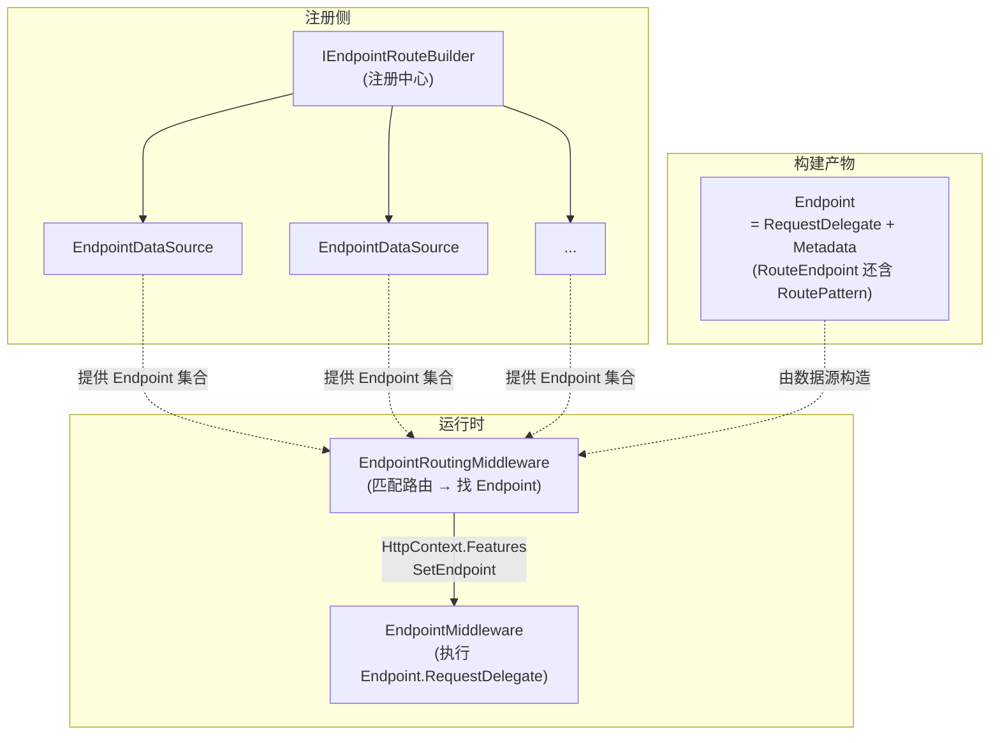

**关键认知**：

- **路由系统由「注册」「数据源」「中间件」三部分组成**，三者通过 `IEndpointRouteBuilder` + `Endpoint` 解耦；
- **匹配与执行被刻意拆成两个中间件**：让用户在它们之间插入 `UseAuthorization` / `UseCors` 等安全中间件；
- **`IFeatureCollection` 是中间件之间通信的桥梁** —— 匹配结果通过 `IEndpointFeature` 传递。

### 1.2 一次请求的路由旅程

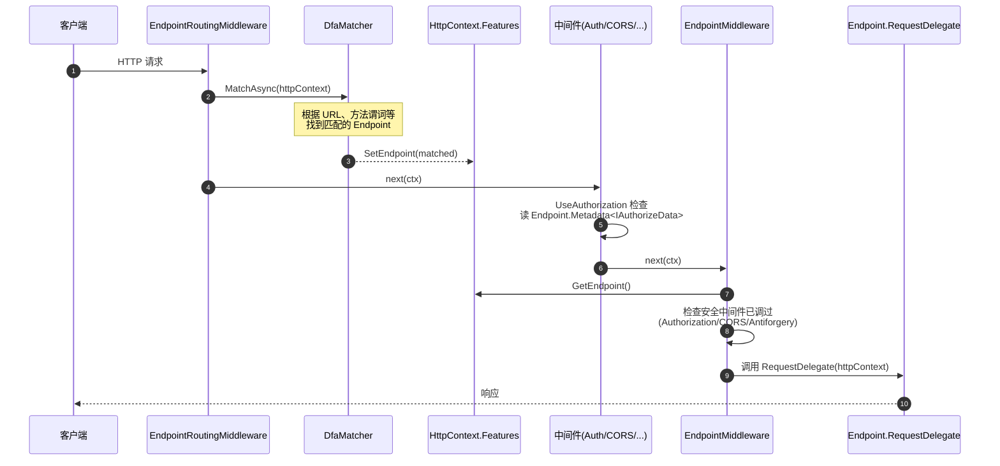

### 1.3 核心类型一览

| 分类 | 类型 | 角色 |
|------|------|------|
| 路由模式 | `RoutePatternPartKind` / `RoutePatternPart` / `RoutePatternLiteralPart` / `RoutePatternSeparatorPart` / `RoutePatternParameterKind` / `RoutePatternParameterPart` / `RoutePatternParameterPolicyReference` / `RoutePatternPathSegment` / `RoutePattern` | 路由模板的结构化表示 |
| 终结点 | `Endpoint` / `EndpointBuilder` / `RouteEndpoint` / `RouteEndpointBuilder` / `EndpointMetadataCollection` | 业务可见的最终产物 |
| 数据源 | `EndpointDataSource` / `DefaultEndpointDataSource` / `ModelEndpointDataSource` / `CompositeEndpointDataSource` / `RouteEndpointDataSource` | 终结点的「容器」 |
| 约定构建 | `IEndpointConventionBuilder` / `DefaultEndpointConventionBuilder` / `RouteHandlerBuilder` / `RoutingEndpointConventionBuilderExtensions` | 链式 API + 延迟构建 |
| 注册中心 | `IEndpointRouteBuilder` / `DefaultEndpointRouteBuilder` | 注册侧入口 |
| 中间件 | `IEndpointFeature` / `EndpointHttpContextExtensions` / `EndpointRoutingApplicationBuilderExtensions` / `EndpointRoutingMiddleware` / `EndpointMiddleware` | 匹配 + 执行 |
| 注册扩展 | `EndpointRouteBuilderExtensions` | `MapGet` / `MapPost` 等 |

---

## 2. 路由模式：路由模板的结构化表示

### 2.1 路由模板 → RoutePattern 转换

字符串形式的「**路由模板**」(如 `"products/{id:int}/{action=List}"`) 通过 `RoutePatternFactory.Parse` 解析为结构化的 `RoutePattern`：

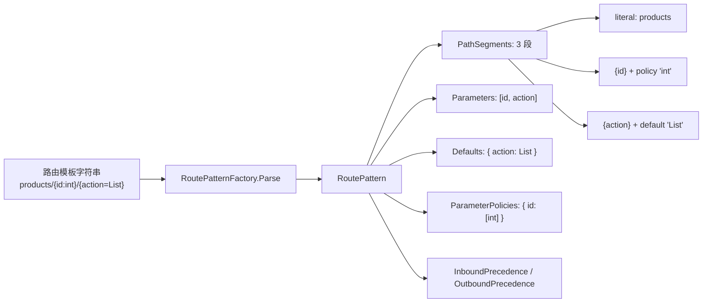

### 2.2 RoutePatternPart 及其子类

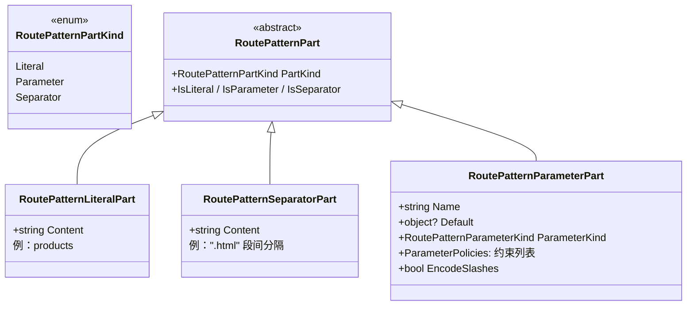

**`RoutePatternPathSegment`** 是一组 `RoutePatternPart` 的容器，表示一个 URL「段」(被 `/` 分隔的部分)。一个段可能是「单一」(`IsSimple = true`，只含一个 part)或「复合」(如 `{name}.{ext}` 是 3 个 part)。

### 2.3 参数部分的三种形态

| `RoutePatternParameterKind` | 语法 | 语义 |
|----------------------------|------|------|
| `Standard` | `{id}` | 必选参数 |
| `Optional` | `{id?}` | 可选参数 |
| `CatchAll` | `{*rest}` 或 `{**rest}` | 捕获剩余路径；只能放最后；`*` 编码 `/`(`%2F`)，`**` 不编码 |

**`{*rest}` vs `{**rest}` 的区别**：

```
模板: api/files/{*path}
URL:  api/files/folder/file.txt
绑定: path = "folder%2Ffile.txt"      ← * 把 / 编码

模板: api/files/{**path}
URL:  api/files/folder/file.txt
绑定: path = "folder/file.txt"        ← ** 保留原斜杠
```

### 2.4 参数策略 RoutePatternParameterPolicyReference

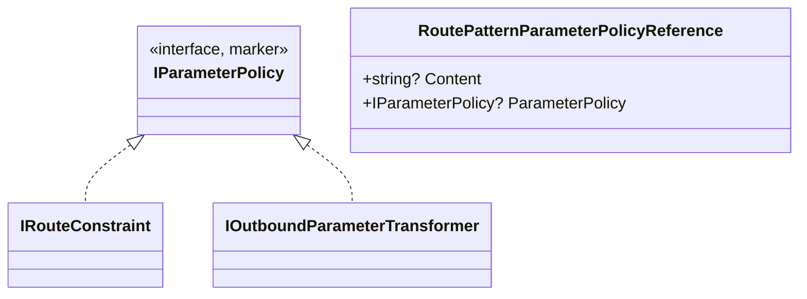

**典型策略**：

| 策略 | 模板写法 | 类型 | 作用 |
|------|---------|------|------|
| `int` | `{id:int}` | 约束 | 参数必须是整数 |
| `min(1)` | `{count:min(1)}` | 约束 | 参数值 ≥ 1 |
| `regex(...)` | `{slug:regex(^[a-z]+$)}` | 约束 | 正则匹配 |
| `slugify` | 注册参数转换器 | 出站转换 | 出站生成 URL 时把 `MyAction` 转成 `my-action` |

`RoutePatternParameterPolicyReference` 可以仅存「**原始字符串**」(`Content`，等到运行时再解析)，或直接存「**已解析的策略对象**」(`ParameterPolicy`)。这种「**字符串 + 对象**」双重表示是路由模式延迟解析的关键。

### 2.5 入站 / 出站权重计算

`RoutePattern` 在构造时计算两个方向的「**优先级**」：

| 权重 | 用途 | 计算规则 | 优先级取向 |
|------|------|---------|----------|
| `InboundPrecedence` | **URL → Endpoint** 匹配 | 静态文本=1，参数=3，带约束的参数=2 | **越小优先级越高** |
| `OutboundPrecedence` | **Endpoint → URL** 生成 | 静态文本=5，参数=3，带约束的参数=4 | **越大优先级越高** |

**举例**：

```
模板: literal/{p1}/{p2:int}
段1 = "literal"        权重 1
段2 = "{p1}"           权重 3
段3 = "{p2:int}"       权重 2

InboundPrecedence = 1.32 (拼接各段权重作为小数)
```

**为什么入站和出站规则相反？**

- **入站**：静态文本是「**强约束**」(必须精确匹配)，所以优先级最高 → 权重小；
- **出站**：静态文本是「**已知内容**」(生成 URL 时直接写)，最容易构造完整 URL，所以优先级最高 → 权重大。

---

## 3. 终结点模型

### 3.1 Endpoint = RequestDelegate + Metadata

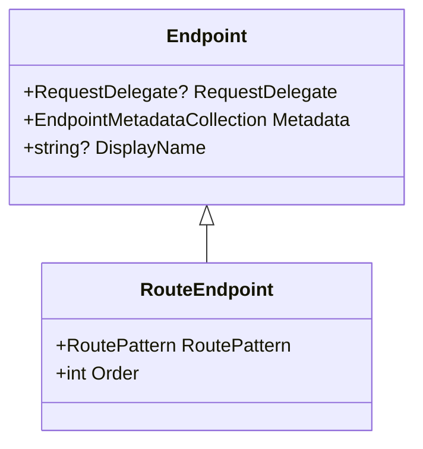

**`Endpoint` 是路由系统的「核心产物」**：

- **`RequestDelegate`** 是实际的请求处理逻辑；
- **`Metadata`** 是元数据(`[Authorize]` / `[HttpGet]` / `IRouteDiagnosticsMetadata` 等)；
- **`DisplayName`** 仅供日志/诊断显示；

**`RouteEndpoint`** 增加了路由专有的两个字段：

- **`RoutePattern`** —— 用于 `EndpointRoutingMiddleware` 中的匹配；
- **`Order`** —— 当多个终结点同时匹配时的优先级。

### 3.2 EndpointMetadataCollection 的设计巧思

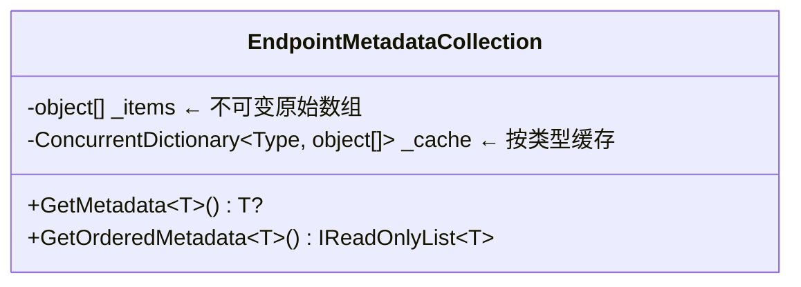

**核心设计**：

- **`_items`** 是只读的原始数组，所有元数据按添加顺序存入；
- **按类型分组**到 `_cache` 字典(首次访问 `GetMetadata<T>()` 时按类型筛选并缓存)；
- **`GetMetadata<T>()` 返回最后一个**(惯例：相同类型多次添加，后者覆盖前者)；
- **`GetOrderedMetadata<T>()` 返回所有**(按添加顺序)。

```C#
// 内部按类型筛选（精简）
private T[] GetOrderedMetadataSlow<T>() where T : class
{
    T[]? results = null;
    for (var i = 0; i < _items.Length; i++)
    {
        if (_items[i] is T item)
        {
            results ??= new T[CountMatches<T>()];
            results[currentIndex++] = item;
        }
    }
    return _cache[typeof(T)] = results ?? Array.Empty<T>();
}
```

**为什么用 `Type` 而不是单一对象类型存？** 因为同一个元数据对象可能实现**多个标记接口**(如同时是 `IAuthorizeData` 又是 `IRouteDiagnosticsMetadata`)；按接口分组才能让 `GetMetadata<IAuthorizeData>()` 正确取出。

### 3.3 RouteEndpoint：路由系统专用终结点

`RouteEndpoint` 是 `EndpointRoutingMiddleware` 唯一能匹配的终结点类型(因为它有 `RoutePattern`)。框架内置的所有 `MapXxx` 扩展方法最终都产生 `RouteEndpoint`。

**`Order` 的作用**：当 URL 同时匹配多个 `RouteEndpoint`(模板冲突时)：

1. 优先按 **`Order` 升序**(`Order` 小的胜出)；
2. 同 `Order` 按 **`InboundPrecedence` 升序**(权重小的胜出)。

这就是为什么 fallback 终结点的 `Order = int.MaxValue` —— 保证只在所有其他终结点都不匹配时才被选中。

### 3.4 RouteEndpointBuilder 的元数据加工

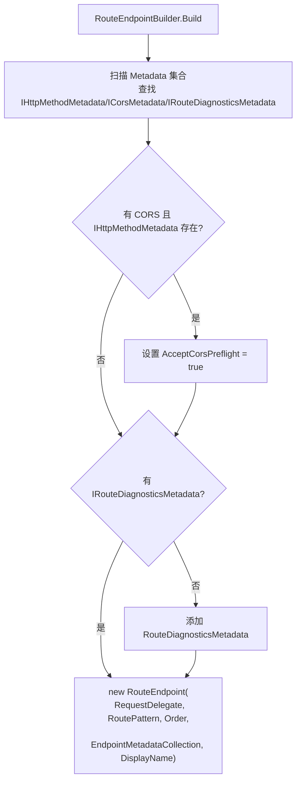

**两条自动处理**：

1. **CORS 预检自动启用**：如果元数据同时含 `ICorsMetadata` 和 `IHttpMethodMetadata`，则把 `IHttpMethodMetadata.AcceptCorsPreflight` 改为 `true` —— 用户用 `[EnableCors]` 后无需手动启用预检；
2. **诊断元数据兜底**：如果没有 `IRouteDiagnosticsMetadata`，自动添加一个 —— 日志里能看到「**路由模板原始字符串**」便于调试。

---

## 4. 终结点数据源

### 4.1 EndpointDataSource 抽象

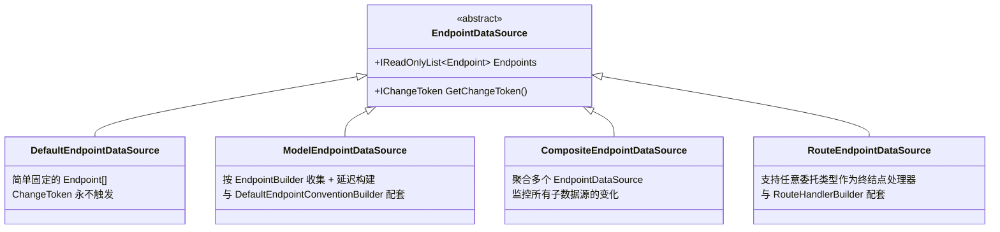

**两个核心成员**：

- **`Endpoints`** —— 终结点集合；
- **`GetChangeToken()`** —— 变更令牌(参考 `Notes/配置.md` §4)，让消费者知道数据源是否变了。

### 4.2 DefaultEndpointDataSource：直接持有列表

最简单的实现 —— 构造时传入 `Endpoint[]` 直接保存。`GetChangeToken()` 返回 `NullChangeToken.Singleton`(永不触发) —— 表示**该数据源是不变的**。

**典型用途**：测试代码、自定义直接 new 出 `Endpoint` 实例的场景。

### 4.3 ModelEndpointDataSource：约定 + 延迟构建

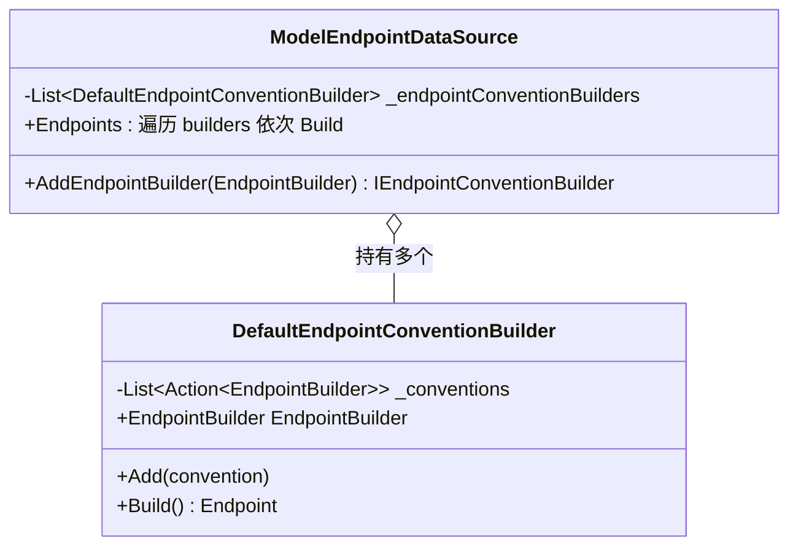

**核心特征**：

- **延迟构建**：每次访问 `Endpoints` 都会**重新**调用 `builder.Build()` —— 这意味着多次访问可能构造不同的 `Endpoint` 实例(如果中间有约定被添加)；
- **约定收集**：用户通过 `IEndpointConventionBuilder.Add(...)` 把配置委托收集起来，`Build()` 时才依次应用到 `EndpointBuilder` 上。

### 4.4 CompositeEndpointDataSource：多数据源聚合

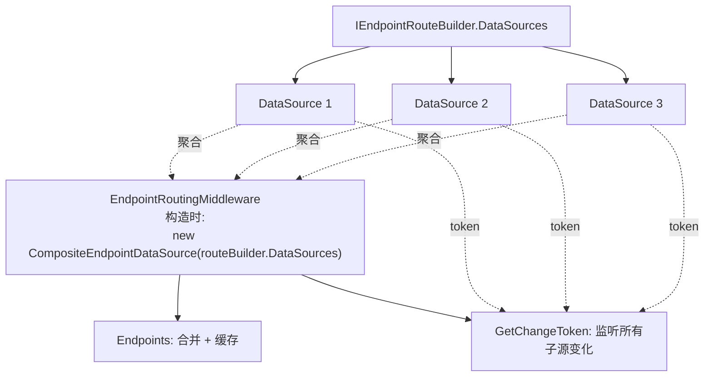

**两大职责**：

1. **聚合**：把多个 `EndpointDataSource.Endpoints` 平铺合并；
2. **变更级联**：订阅所有子数据源的 `IChangeToken`，任一变更触发 `CompositeEndpointDataSource` 自己的 `IChangeToken`。

**双重检查锁初始化**：`Endpoints` 属性首次访问时才合并，并在锁内做 double-check。

### 4.5 RouteEndpointDataSource：支持任意委托

这是 Minimal API 时代最复杂的 `EndpointDataSource`：支持把**任意签名的委托**(`Action` / `Func<T>` / `async Func<T1, T2, Task<R>>` 等)注册为终结点处理器。

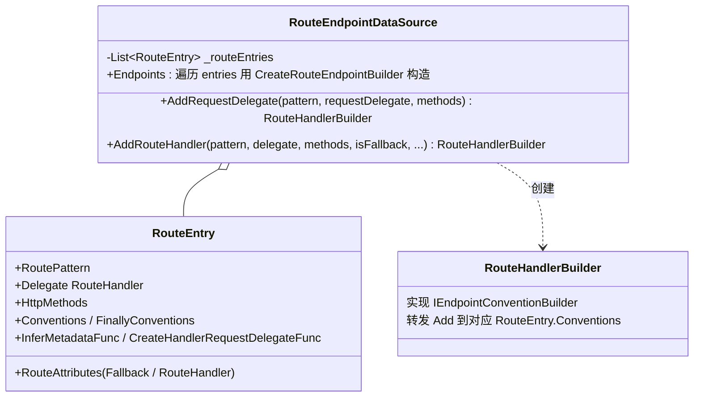

**`AddRequestDelegate` vs `AddRouteHandler`** 的区别：

| 方法 | 接受的处理器 | 适用场景 |
|------|------------|---------|
| `AddRequestDelegate` | `RequestDelegate`(标准签名) | `MapGet(path, async ctx => {...})` 显式签名 |
| `AddRouteHandler` | `Delegate`(任意签名) | `MapGet(path, (int id) => ...)` Minimal API 简化语法 |

后者通过 **`RequestDelegateFactory`** 把任意委托编译成标准的 `RequestDelegate`，期间完成参数绑定与返回值转换(详见 §8)。

### 4.6 三种主要 EndpointDataSource 对照

| 数据源 | 配套 Builder | 变更通知 | 典型用法 |
|--------|------------|---------|---------|
| `DefaultEndpointDataSource` | 无(直接构造) | ❌ | 测试 / 静态终结点 |
| `ModelEndpointDataSource` | `DefaultEndpointConventionBuilder` | ❌ | MVC 控制器路由 |
| `RouteEndpointDataSource` | `RouteHandlerBuilder` | ❌ | Minimal API `MapGet` / `MapPost` 等 |
| `CompositeEndpointDataSource` | —(框架内部用) | ✅ 聚合所有子源 | `EndpointRoutingMiddleware` 内部 |

---

## 5. 约定构建器：链式 API 背后的机制

### 5.1 IEndpointConventionBuilder 接口

```C#
public interface IEndpointConventionBuilder
{
    void Add(Action<EndpointBuilder> convention);
    void Finally(Action<EndpointBuilder> finallyConvention) => throw new NotImplementedException();
}
```

**两个方法的差异**：

| 方法 | 执行时机 |
|------|---------|
| `Add` | 默认顺序应用 |
| `Finally` | **在 Add 之后** —— 适合「**清理 / 最终配置**」(如 `WithDescription` 必须在所有 OpenAPI 元数据填充后再写描述) |

**`Finally` 接口默认抛 `NotImplementedException`** —— 是 .NET 8 才加入的能力，旧实现允许不实现。

### 5.2 DefaultEndpointConventionBuilder vs RouteHandlerBuilder

| 实现 | 配套数据源 | 内部结构 |
|------|-----------|---------|
| `DefaultEndpointConventionBuilder` | `ModelEndpointDataSource` | 持有**一个** `EndpointBuilder` + 一个 `_conventions` 列表 |
| `RouteHandlerBuilder` | `RouteEndpointDataSource` | 持有**对应 `RouteEntry` 的 `Conventions` 列表的引用** |

**为什么 `RouteHandlerBuilder` 不持有 `EndpointBuilder`？**

- `RouteEndpointDataSource` 的终结点是「**首次访问 `Endpoints` 时才构造**」的；
- 在「**构造前**」就需要让用户调 `MapGet(...).WithName("xxx")` 收集约定 —— 此时还没 `EndpointBuilder`；
- 解决方案：让 `RouteHandlerBuilder.Add(convention)` 直接把 convention 加到 `RouteEntry.Conventions` 列表(后续构造 `EndpointBuilder` 时再依次应用)。

### 5.3 约定收集与延迟应用

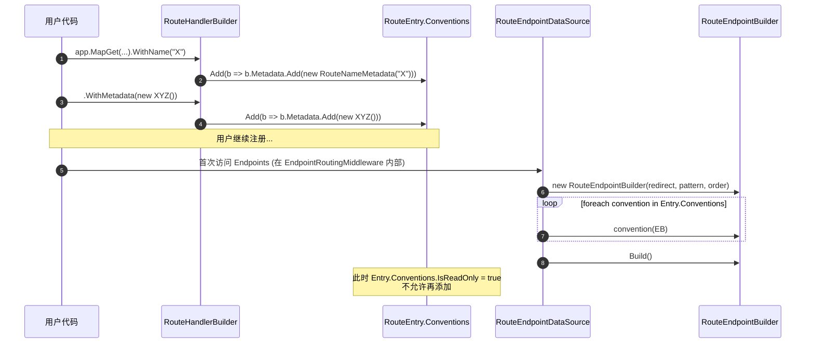

**关键时序**：约定**只能在 `Endpoints` 首次访问之前**添加，之后再调 `RouteHandlerBuilder.Add` 会抛异常。

### 5.4 ThrowOnAddAfterEndpointBuilt 防御

```C#
private sealed class ThrowOnAddAfterEndpointBuiltConventionCollection
    : List<Action<EndpointBuilder>>, ICollection<Action<EndpointBuilder>>
{
    public bool IsReadOnly { get; set; }

    void ICollection<Action<EndpointBuilder>>.Add(Action<EndpointBuilder> convention)
    {
        if (IsReadOnly)
            throw new InvalidOperationException(Resources.RouteEndpointDataSource_ConventionsCannotBeModifiedAfterBuild);
        Add(convention);
    }
}
```

**关键设计**：通过**自定义集合类型**在「**已经构建终结点之后**」拒绝新的 convention —— 把「**静默失败**」(添加但不生效)变成「**显式错误**」(立刻抛异常)。

---

## 6. IEndpointRouteBuilder：注册中心

### 6.1 接口与两种实现

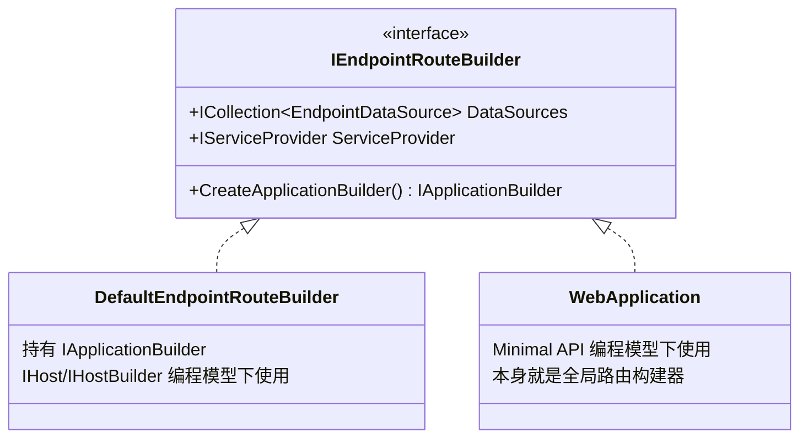

**`IEndpointRouteBuilder` 的核心是 `DataSources` 集合** —— 所有 `MapXxx` 扩展方法本质上都是「向这个集合添加一个 `EndpointDataSource`」。

### 6.2 与 WebApplication 的关系

**Minimal API 编程模型**(`Notes/MinimalAPI.md` §2.3)中，`WebApplication` 自身实现 `IEndpointRouteBuilder` —— 它是「**全局路由构建器**」。

`MapGet(...)` 等扩展方法的查找路径：

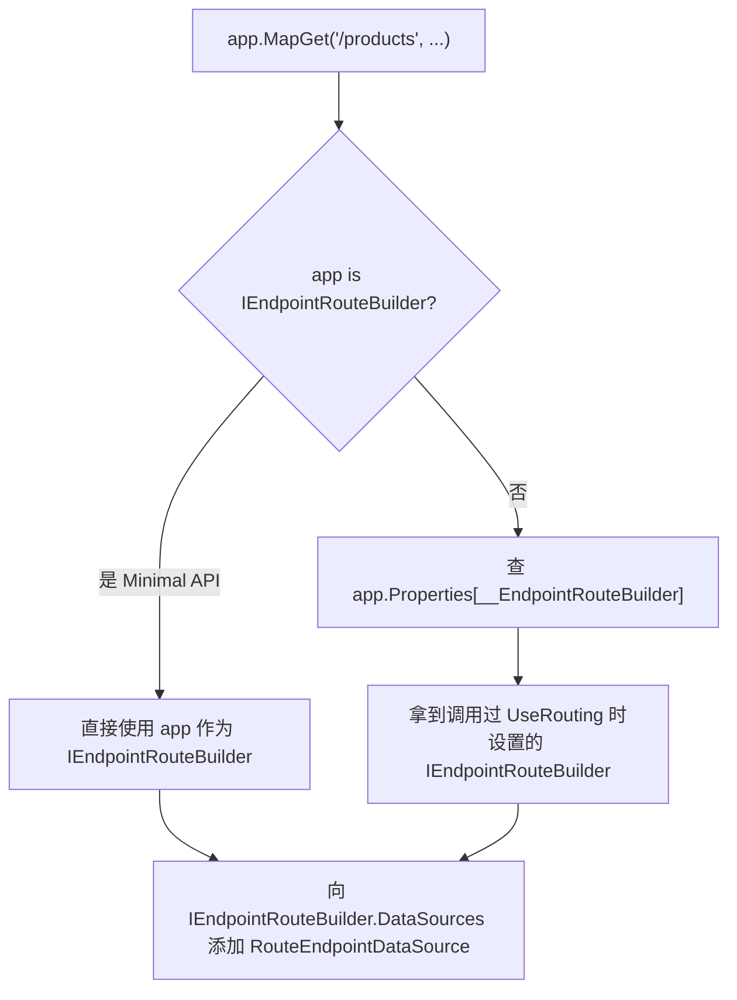

### 6.3 GlobalEndpointRouteBuilderKey 桥接

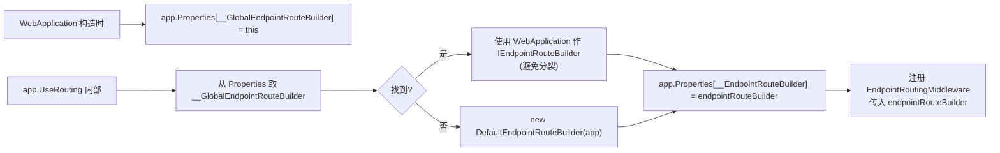

**关键设计**：通过 `Properties` 的两个 Key 让「**Minimal API 的 `WebApplication`**」和「**经典 `UseRouting` / `UseEndpoints`**」共享同一个 `IEndpointRouteBuilder` —— 用户即使混用两种 API，注册的终结点也都汇聚到一处。

---

## 7. 中间件：EndpointRouting 与 Endpoint

### 7.1 IEndpointFeature 与 GetEndpoint/SetEndpoint

```C#
public interface IEndpointFeature
{
    Endpoint? Endpoint { get; set; }
}

public static class EndpointHttpContextExtensions
{
    public static Endpoint? GetEndpoint(this HttpContext context)
        => context.Features.Get<IEndpointFeature>()?.Endpoint;

    public static void SetEndpoint(this HttpContext context, Endpoint? endpoint)
    {
        var feature = context.Features.Get<IEndpointFeature>();
        if (endpoint != null)
        {
            if (feature == null)
            {
                feature = new EndpointFeature();
                context.Features.Set(feature);
            }
            feature.Endpoint = endpoint;
        }
        else if (feature != null)
        {
            feature.Endpoint = null;
        }
    }
}
```

**`IEndpointFeature` 是匹配中间件与执行中间件之间的「**信号**」** —— 通过 `HttpContext.Features` 传递 `Endpoint`。

### 7.2 EndpointRoutingMiddleware 匹配流程

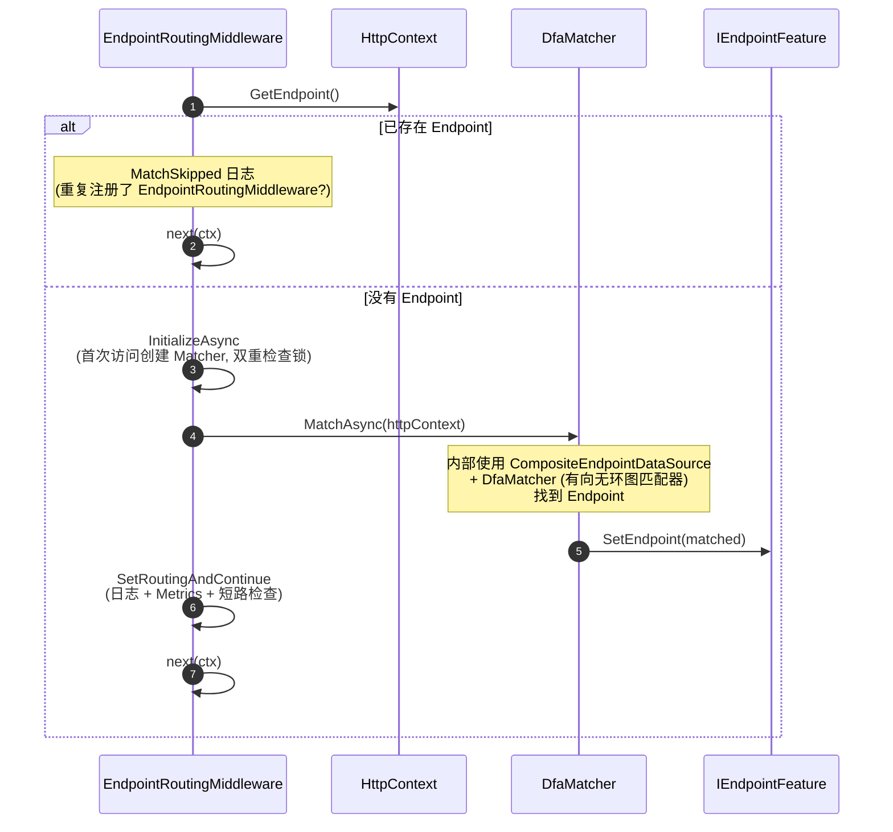

**关键设计点**：

- **`Matcher` 延迟创建 + 缓存**：通过 `Interlocked.CompareExchange` 保证只创建一次；
- **`CompositeEndpointDataSource` 包装**：让 `Matcher` 在 `EndpointDataSource` 变化时能自动重建终结点集合；
- **跳过已匹配**：`HttpContext` 已经有 `Endpoint` 时直接跳过，避免重复匹配。

### 7.3 EndpointMiddleware 执行流程

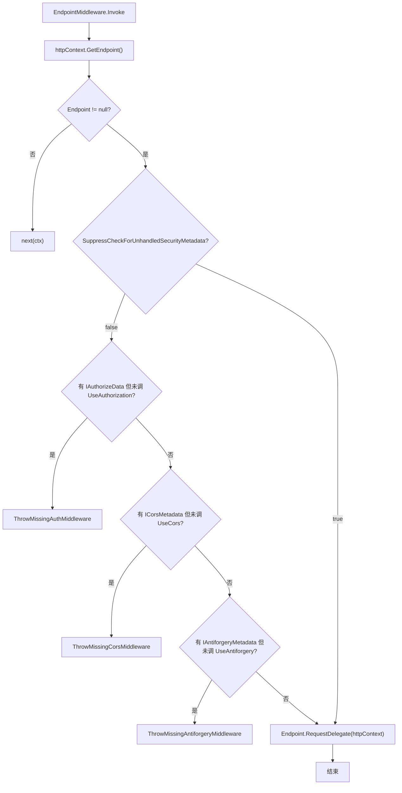

**核心职责**：

1. 拿到 `Endpoint`(由 `EndpointRoutingMiddleware` 设置)；
2. **强制安全检查**(可由 `SuppressCheckForUnhandledSecurityMetadata` 关闭)；
3. 调用 `Endpoint.RequestDelegate`；
4. 没有 `Endpoint` 时**不抛错**，继续 `next(ctx)` —— 让后续中间件(如静态文件)有机会处理。

### 7.4 UseRouting / UseEndpoints 的协作约束

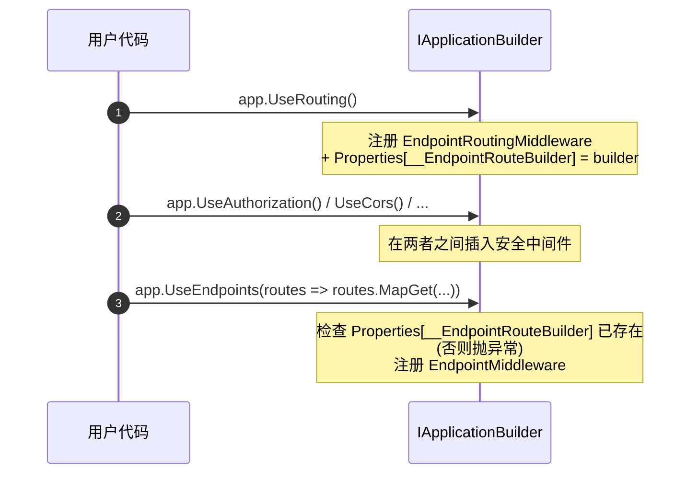

**两条强制约束**：

1. **必须先 `UseRouting`** —— `UseEndpoints` 内部会检查 `Properties[__EndpointRouteBuilder]`，没有就抛清晰错误；
2. **必须在同一个 `IApplicationBuilder` 上** —— `Map(...)` 分支创建新 `IApplicationBuilder`，必须在每个分支里重新调一对 `UseRouting` + `UseEndpoints`。

```C#
// EndpointRoutingApplicationBuilderExtensions（精简）
if (endpointRouteBuilder is DefaultEndpointRouteBuilder defaultRouteBuilder
    && !object.ReferenceEquals(app, defaultRouteBuilder.ApplicationBuilder))
{
    throw new InvalidOperationException(
        $"The {nameof(EndpointRoutingMiddleware)} and {nameof(EndpointMiddleware)} must be added to the same {nameof(IApplicationBuilder)} instance. ...");
}
```

### 7.5 安全中间件强制检查

| 安全元数据 | 必需中间件 | 标记 Key |
|----------|----------|---------|
| `IAuthorizeData`(由 `[Authorize]` 产生) | `UseAuthorization` | `__AuthorizationMiddlewareWithEndpointInvoked` |
| `ICorsMetadata`(由 `[EnableCors]` 产生) | `UseCors` | `__CorsMiddlewareWithEndpointInvoked` |
| `IAntiforgeryMetadata`(`RequiresValidation = true`) | `UseAntiforgery` | `__AntiforgeryMiddlewareWithEndpointInvoked` |

**工作原理**：

- 中间件被调用时，把对应 Key 写入 `HttpContext.Items`；
- `EndpointMiddleware` 检查 `Items` 中是否有对应 Key；
- **若 Endpoint 元数据要求该中间件 + 但 Items 中没标记 = 抛异常并给出明确修复建议**。

这把「**忘记注册中间件**」从「**静默不生效**」升级为「**显式错误**」 —— 错误信息直接告诉用户「**在 `UseRouting` 和 `UseEndpoints` 之间调用 `UseXxx`**」。

---

## 8. 任意委托作为终结点处理器：参数绑定与返回值转换

`MapGet(path, (int id) => $"hello {id}")` —— 用户能传**任意签名的委托**，框架内部如何处理？

### 8.1 参数绑定规则（11 条）

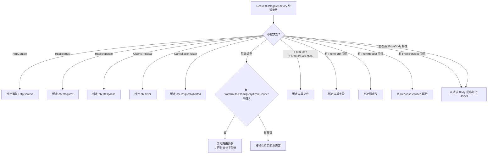

**关键认知**：

- **默认绑定策略**：基元类型 → 路由 → 查询字符串 → 表单；复杂类型 → JSON 反序列化；
- **显式特性强制覆盖**：用 `[FromHeader]` / `[FromServices]` 等可强制指定绑定源；
- **路由参数与查询字符串同名**时，**优先路由参数** —— 想强制查询字符串必须显式 `[FromQuery]`。

### 8.2 返回值转换为 IResult

```mermaid
flowchart TD
    Start["处理委托返回值 result"]
    Start --> N{"result == null?"}
    N -->|是| Empty[EmptyHttpResult.Instance]
    N -->|否| T1{"是 Task&lt;IResult&gt;?"}

    T1 -->|是| New["new ValueTask&lt;IResult&gt;(taskOfResult)"]
    T1 -->|否| T2{"是 ValueTask&lt;IResult&gt;?"}

    T2 -->|是| Direct[直接返回]
    T2 -->|否| I{"是 IResult?"}

    I -->|是| FromR[ValueTask.FromResult]
    I -->|否| Task{"是 Task?"}

    Task -->|是| ConvertTask["await 后返回 EmptyHttpResult"]
    Task -->|否| GenericT{"是 Task&lt;T&gt;?"}

    GenericT -->|是| TT["ConvertFromTask&lt;T&gt;<br/>(表达式树编译)"]
    GenericT -->|否| GenericV{"是 ValueTask&lt;T&gt;?"}

    GenericV -->|是| VT["ConvertFromValueTask&lt;T&gt;<br/>(表达式树编译)"]
    GenericV -->|否| Plain["new ObjectResult(result)"]
```

**`ObjectResult.ExecuteAsync` 的内容协商**：

- **`string`** → 直接作为响应主体 + `Content-Type: text/plain`；
- **其他类型** → JSON 序列化 + `Content-Type: application/json`。

### 8.3 RequestDelegateFactory 编译

```mermaid
sequenceDiagram
    autonumber
    participant Map as MapGet 注册
    participant RDS as RouteEndpointDataSource
    participant RDF as RequestDelegateFactory
    participant CRD as CompiledRequestDelegate

    Map->>RDS: AddRouteHandler(pattern, delegate, methods)
    Note over RDS: 仅创建 RouteEntry，<br/>实际编译延迟到首次构造 Endpoint

    Note over RDS: EndpointRoutingMiddleware 首次访问 Endpoints
    RDS->>RDF: CreateRequestDelegate(handler, options, metadataResult)
    Note over RDF: 用表达式树生成参数绑定 + 调用 + 返回值转换的完整 IL
    RDF->>CRD: 编译为强类型 RequestDelegate
    CRD-->>RDS: 标准 RequestDelegate

    RDS-->>Map: 后续每次请求直接调用编译产物
```

**性能收益**：与中间件章节(`Notes/管道中间件.md` §6.3)的「约定中间件表达式树编译」是同一思路——**构建期反射 + 编译 → 运行期零反射**。

---

## 9. 设计思想速览

### 9.1 路由模式权重：双向匹配的优先级

```
                        权重越小→优先级越高
入站(URL → Endpoint):   静态(1) < 带约束参数(2) < 普通参数(3)

                        权重越大→优先级越高
出站(Endpoint → URL):   静态(5) > 带约束参数(4) > 普通参数(3)
```

**两个方向规则相反** —— 因为：

- 入站要找「**最具体匹配**」(静态最具体)；
- 出站要找「**信息最完整的模板**」(静态文本是已知量)。

### 9.2 元数据集合的「按类型缓存」

```mermaid
flowchart LR
    Init["new EndpointMetadataCollection(items)"]
    Init --> Store["_items[] (只读)"]

    Get["GetMetadata&lt;IAuthorizeData&gt;()"]
    Get --> CacheHit{"_cache 命中?"}
    CacheHit -->|是| Return[直接返回]
    CacheHit -->|否| Scan[扫描 _items 找匹配类型]
    Scan --> Save[写入 _cache]
    Save --> Return
```

**核心洞察**：元数据集合**只读但按类型查询多次** —— 用 `ConcurrentDictionary<Type, object[]>` 缓存类型化结果，避免每次都扫描 `_items`。

### 9.3 约定收集 + 延迟构建模式

```mermaid
flowchart LR
    Reg["app.MapGet(...)"]
    Reg --> Builder[RouteHandlerBuilder]
    Builder --> Chain["WithName(...).RequireAuthorization()..."]
    Chain --> Stored["RouteEntry.Conventions 列表"]

    Note["注意：此时没有 EndpointBuilder！"]
    Stored -.- Note

    Trigger["EndpointRoutingMiddleware 首次访问 Endpoints"]
    Trigger --> Build["new RouteEndpointBuilder"]
    Build --> Apply[依次应用 Conventions]
    Apply --> Final[最终 Endpoint]
```

**关键设计**：

- 用户写代码时**只在收集约定**，没有 `EndpointBuilder` 实例；
- 真正的「**应用约定到 `EndpointBuilder`**」发生在中间件首次访问 `Endpoints` 时；
- 这种延迟让用户可以**先链式收集**，再统一构建。

### 9.4 双层中间件协作（路由 + 执行）

```mermaid
flowchart LR
    URL[HTTP 请求 URL] --> ERM[EndpointRoutingMiddleware<br/>仅做匹配]
    ERM --> Set["SetEndpoint(matched)"]
    Set --> Auth[UseAuthorization]
    Auth --> Cors[UseCors]
    Cors --> EM[EndpointMiddleware<br/>仅做执行]
    EM --> Exec[Endpoint.RequestDelegate]
```

**为什么不合并成一个中间件？** 因为 `UseAuthorization` / `UseCors` 等中间件需要**读取 `Endpoint.Metadata`** 来决定如何处理 —— 这要求「**已经匹配到 Endpoint**」(`UseRouting` 之后) 但**尚未执行**(`UseEndpoints` 之前)。拆分两层让用户在中间插入任意安全/日志/追踪中间件。

### 9.5 共享字典桥接：Properties 通信

`IApplicationBuilder.Properties` 是个**字典**，承担着多个中间件之间「**约定通信**」的角色：

| Key | 写入方 | 读取方 | 用途 |
|-----|-------|-------|------|
| `__GlobalEndpointRouteBuilder` | `WebApplication` 构造时 | `UseRouting` | 让 Minimal API 共享 `WebApplication` 作为 `IEndpointRouteBuilder` |
| `__EndpointRouteBuilder` | `UseRouting` | `UseEndpoints` 检查 | 确保 `UseRouting` 在 `UseEndpoints` 之前 |
| `__UseRouting` | `UseRouting` | (诊断) | 记录是否已调用 |
| `HttpContext.Items[__AuthorizationMiddlewareInvoked]` | `UseAuthorization` | `EndpointMiddleware` | 检查安全中间件已运行 |

这种「**约定 Key + 共享字典**」让框架内部的多个组件**不需要直接相互引用**就能通信 —— 是「**松耦合扩展机制**」的典型实现。

---

## 10. 速查卡 & 陷阱清单

### 10.1 终结点构建链速查

```
[用户调用]                    [产生物]                       [实际构建时刻]
MapGet(path, handler)    →   RouteEntry           →   首次访问 Endpoints
.WithName("X")           →   add convention
.RequireAuthorization()  →   add convention
                                                  ↓
                                          new RouteEndpointBuilder
                                          → apply conventions
                                          → Build() → RouteEndpoint
```

### 10.2 路由模式约束速查

| 约束写法 | 含义 |
|---------|------|
| `{id:int}` | 必须是整数 |
| `{id:int:min(1)}` | 多约束链 |
| `{slug:regex(^[a-z-]+$)}` | 正则匹配 |
| `{id?}` | 可选参数 |
| `{action=List}` | 默认值 |
| `{*rest}` | 捕获剩余路径(/ 被编码) |
| `{**rest}` | 捕获剩余路径(/ 不编码) |
| `{id:int=0}` | 约束 + 默认值 |

### 10.3 中间件协作约束

| 操作 | 在哪个位置 |
|------|----------|
| `UseRouting` | 任意位置(早期) |
| `UseCors` / `UseAuthentication` / `UseAuthorization` | **`UseRouting` 之后**，`UseEndpoints` 之前 |
| `UseAntiforgery` | **`UseAuthentication` / `UseAuthorization` 之后** |
| `UseEndpoints` | 最后 |
| `MapXxx`(Minimal API 直接调) | 可放任意位置(内部自动处理) |

### 10.4 10 大常见陷阱

1. **`UseEndpoints` 在 `UseRouting` 之前**：抛 `InvalidOperationException`，错误信息明确告诉「**先调 `UseRouting`**」。
2. **`UseRouting` 和 `UseEndpoints` 在不同的 `IApplicationBuilder` 实例上**(如 `Map` 分支)：抛异常。**对策**：每个分支单独调一对。
3. **`UseEndpoints` 完全可省**(Minimal API)：`WebApplication.Build()` 后框架会自动注入(参考 `Notes/MinimalAPI.md` §5.3)，但 `IHost/IHostBuilder` 编程模型下必须手动调。
4. **`[Authorize]` 但忘记 `UseAuthorization`**：`EndpointMiddleware` 检测到元数据但未调中间件 → 抛异常 + 修复建议。**对策**：按错误信息添加。
5. **`MapGet` 重复路径**：同 URL 的多个 `MapGet` 会让匹配器报「**模糊匹配**」异常。**对策**：合并 / 用 `RequireHost` 等区分。
6. **CatchAll 参数不在最后**：`/{*rest}/end` 模板非法。**对策**：CatchAll 必须放最后。
7. **`MapGet` 处理器的复杂类型参数**：默认从 Body JSON 反序列化 —— GET 请求通常没 Body，会失败。**对策**：用 `[FromQuery]` 或拆成多个基元参数。
8. **路由参数与查询字符串同名**：路由优先。要强制查询字符串用 `[FromQuery]`。
9. **`Map("/branch", ...)` 内的 `MapGet`**：分支内的 `app.Properties[__GlobalEndpointRouteBuilder]` 被清掉了(参考 `Notes/MinimalAPI.md` §2.5)，需要分支内重新 `UseRouting`+`UseEndpoints`。
10. **修改 `RouteOptions.EndpointDataSources` 后没生效**：`CompositeEndpointDataSource` 只在首次访问时构建并缓存 —— 后续修改要触发 `IChangeToken` 才能让 `Matcher` 重建。

### 10.5 原笔记类型 → 本笔记小节 映射表

| 原笔记类型 | 本笔记小节 |
|-----------|-----------|
| `RoutePatternPartKind` | §2.2 |
| `RoutePatternPart` | §2.2 |
| `RoutePatternLiteralPart` | §2.2 |
| `RoutePatternSeparatorPart` | §2.2 |
| `RoutePatternParameterKind` | §2.3 |
| `RoutePatternParameterPart` | §2.2 / §2.3 |
| `RoutePatternParameterPolicyReference` | §2.4 |
| `RoutePatternPathSegment` | §2.2 |
| `RoutePattern` | §2.1 / §2.5 |
| `EndpointMetadataCollection` | §3.2 / §9.2 |
| `Endpoint` | §3.1 |
| `EndpointBuilder` | §3.4 |
| `RouteEndpoint` | §3.3 |
| `RouteEndpointBuilder` | §3.4 |
| `EndpointDataSource` | §4.1 |
| `DefaultEndpointDataSource` | §4.2 |
| `IEndpointConventionBuilder` | §5.1 |
| `RoutingEndpointConventionBuilderExtensions` | §5.1（扩展用法） |
| `DefaultEndpointConventionBuilder` | §5.2 |
| `ModelEndpointDataSource` | §4.3 |
| `CompositeEndpointDataSource` | §4.4 |
| `RouteHandlerBuilder` | §5.2 / §5.3 |
| `RouteEndpointDataSource` | §4.5 / §8 |
| `IEndpointRouteBuilder` | §6.1 |
| `DefaultEndpointRouteBuilder` | §6.1 |
| `IEndpointFeature` | §7.1 |
| `EndpointHttpContextExtensions` | §7.1 |
| `EndpointRoutingApplicationBuilderExtensions` | §7.4 / §6.3 |
| `EndpointRoutingMiddleware` | §7.2 |
| `EndpointMiddleware` | §7.3 / §7.5 |
| `EndpointRouteBuilderExtensions` | §10.1（速查）+ 散见各处 |
