# 选项

> 本笔记是 ASP.NET Core（.NET 6）`Microsoft.Extensions.Options` 与 `Microsoft.Extensions.Options.ConfigurationExtensions` 的学习整理，配套源码解读位于仓库根目录 `选项.md`。
>
> 风格延续 `Notes/依赖注入.md` 与 `Notes/配置.md`：以 Mermaid UML 图、设计原理、示例为主；源码片段只保留「不看代码无法说清」的几行。

## 0. 阅读指南

### 0.1 本笔记的定位

| 文件 | 视角 | 主体内容 |
|------|------|---------|
| `选项.md`（源码笔记） | **源码视角** | 逐类型贴源码 + 在源码中注释解读 |
| `Notes/选项.md`（本笔记） | **学习视角** | UML 图、设计原理、阶段化流程、示例、陷阱清单 |

### 0.2 推荐阅读顺序

- **首次学习**：§1 → §2 → §3 → §4 → §5 → §6 → §7 → §8。
- **只想理清「三种 IOptions 区别」**：直接看 §2 与 §7.4。
- **找某个具体类型**：用 §8.4 「**原笔记类型 → 本笔记小节**映射表」反查。

### 0.3 与「配置」章节的关系

「选项」直接构建在「配置」之上 —— `IOptions<T>` 的典型数据源就是 `IConfiguration`。但**选项不强依赖配置**：你可以仅用内存配置（`Configure<T>(opt => ...)`）使用选项。请先理解 `Notes/配置.md` 中的 `IChangeToken` 与 `ConfigurationBinder`，本章会大量复用这两个概念。

---

## 1. 全景：Options 模式的设计目标

### 1.1 选项模式解决什么问题？

「选项」（Options pattern）要解决四个长期困扰 ASP.NET 配置的痛点：

| 痛点 | Options 的解决方式 |
|------|-------------------|
| **类型不安全** | 用强类型 POCO 承载配置（`MyOptions` 而非 `string` / `IConfiguration`） |
| **同一对象多套配置** | 「**命名选项**」（Named Options），同 `TOptions` 可有多个不同名的实例 |
| **变更无感知** | `IOptionsMonitor<T>` 提供 `OnChange` 回调 + `CurrentValue` 实时取值 |
| **缺乏验证** | `IValidateOptions<T>` 在创建实例后立即校验 |

### 1.2 三种消费者抽象

业务代码通过以下三种之一获取强类型选项：

| 接口 | 生命周期 | 是否支持命名 | 是否响应变更 | 适用场景 |
|------|---------|-------------|------------|---------|
| `IOptions<T>` | **Singleton** | 否（始终默认名） | **否** —— 启动后永不更新 | 一次性读取的配置（连接字符串、固定阈值） |
| `IOptionsSnapshot<T>` | **Scoped** | 是（`Get(name)`） | **每个 scope 一次**（如每个 HTTP 请求） | 请求级配置（多租户每请求重读） |
| `IOptionsMonitor<T>` | **Singleton** | 是（`Get(name)`） | **实时** + `OnChange` 回调 | 长寿命服务（日志、Kestrel）的热重载 |

### 1.3 端到端流水线

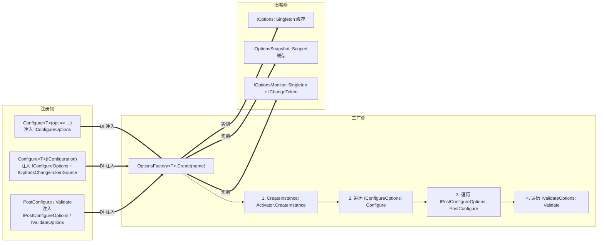

**关键设计点**：

- **工厂 + 阶段化**：所有 `TOptions` 实例都经过「Create → Configure → PostConfigure → Validate」四阶段流水线；
- **三种消费者共享同一工厂**：差异只在「**缓存策略**」与「**变更响应**」；
- **变更通知复用配置的 `IChangeToken`**：见 §6.1。

---

## 2. 三种消费者抽象

### 2.1 类图

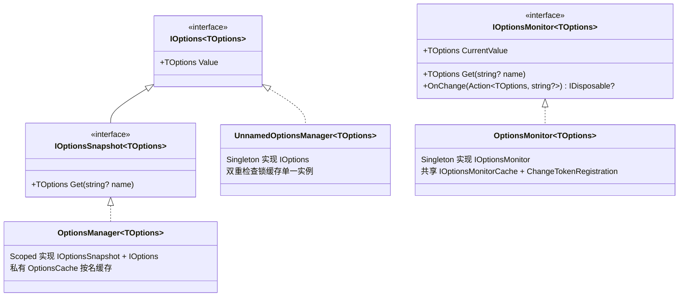

**注意 `IOptionsMonitor` 不继承 `IOptions`** —— 它独立于 `IOptions` 体系，因为生命周期与缓存策略完全不同。这导致很多代码会同时注入 `IOptions<T>` 和 `IOptionsMonitor<T>`，它们各拿一份缓存，互不相干。

### 2.2 生命周期与适用场景

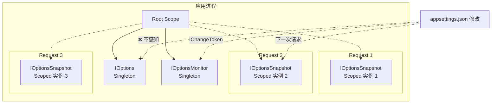

**关键决策原则**：

| 你需要的特性 | 选择 |
|------------|------|
| 只在启动时读一次，不需要重载 | `IOptions<T>` |
| 每个请求拿到最新值，不需要 `OnChange` 通知 | `IOptionsSnapshot<T>` |
| 长寿命服务里订阅变更回调 | `IOptionsMonitor<T>` |

### 2.3 IOptionsSnapshot vs IOptionsMonitor 的本质差异

虽然两者都能感知配置变更，但**实现机制完全不同**：

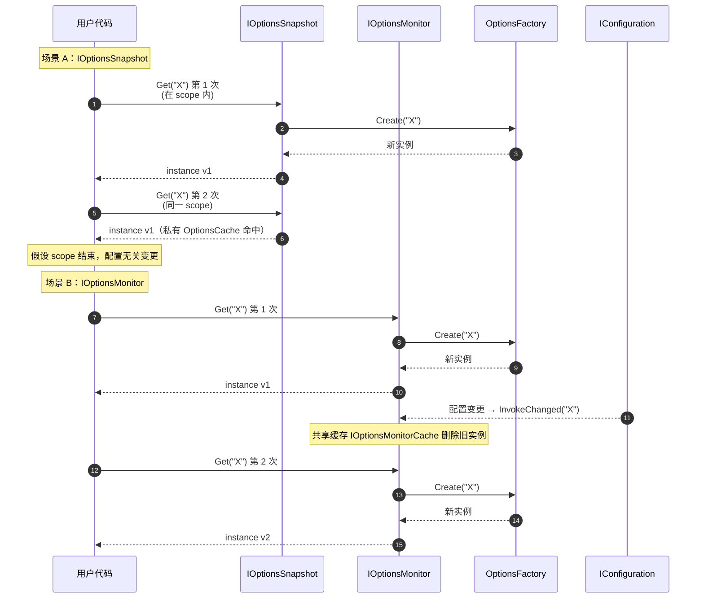

**`IOptionsSnapshot` 通过「Scoped 生命周期 + 私有缓存」实现「每 scope 一份」**；`IOptionsMonitor` 通过「Singleton + 共享缓存 + ChangeToken 失效」实现「实时更新 + 全局共享」。

> 详见原笔记 第 129–305 行（`OptionsManager` 与 `OptionsMonitor`）。

---

## 3. 默认实现解析

### 3.1 UnnamedOptionsManager：双重检查锁的教科书写法

`IOptions<T>` 的实现非常简单 —— 只需缓存一个实例。但要保证「**并发首次访问时只创建一次**」需要双重检查锁：

```C#
// UnnamedOptionsManager<TOptions>.Value（精简）
get
{
    if (_value is TOptions value) return value;     // 第一道检查（无锁，快路径）

    lock (_syncObj ?? Interlocked.CompareExchange(    // CAS 原子初始化锁对象
              ref _syncObj, new object(), null) ?? _syncObj)
    {
        return _value ??= _factory.Create(Options.DefaultName);   // 第二道检查
    }
}
```

**值得关注的两处细节**：

1. **`_syncObj` 的延迟初始化**：`Interlocked.CompareExchange` 保证多线程同时初始化时只有一个赢家，三段表达式 `_syncObj ?? CAS ?? _syncObj` 让赢家和输家都能拿到同一把锁；
2. **`_syncObj` 和 `_value` 都是 `volatile`**：防止 JIT 重排序 —— 必须保证「先写完 `_value` 再让其他线程看到非 null」。

**对比 `Lazy<T>`**：标准库的 `Lazy<T>` 也能做同样的事，但要多分配一个 `Lazy<T>` 对象。`IOptions<T>` 是 Singleton，全应用就一个实例，手写双重检查锁省一次分配，对启动期延迟敏感的框架代码值得这样写。

> 详见原笔记 第 91–126 行。

### 3.2 OptionsManager：私有 OptionsCache 按名缓存

`OptionsManager<T>` 同时实现 `IOptions<T>` 和 `IOptionsSnapshot<T>`，每个实例自带一个**私有** `OptionsCache<T>`：

```mermaid
flowchart LR
    Scope1[Scope 1] --> O1["OptionsManager 实例 1<br/>_cache: OptionsCache (私有)"]
    Scope2[Scope 2] --> O2["OptionsManager 实例 2<br/>_cache: OptionsCache (私有)"]

    O1 -. Get("X") .-> X1["实例 X@1"]
    O1 -. Get("Y") .-> Y1["实例 Y@1"]
    O2 -. Get("X") .-> X2["实例 X@2"]
    Note["每个 scope 独立缓存<br/>scope 释放即整体丢弃"]
    O2 -.- Note
```

**关键点**：`OptionsManager` 的 `OptionsCache` 是 `new` 出来的（不是从 DI 拿的）—— 与 `OptionsMonitor` 使用的 `IOptionsMonitorCache<T>` 不是同一个实例。这就是为什么「**同一 scope 内 `IOptionsSnapshot` 和 `IOptionsMonitor` 取到的实例可能不同**」（哪怕配置完全没变）。

> 详见原笔记 第 132–174 行。

### 3.3 OptionsMonitor：变更通知的级联

`OptionsMonitor<T>` 是三种消费者中最复杂的一个：

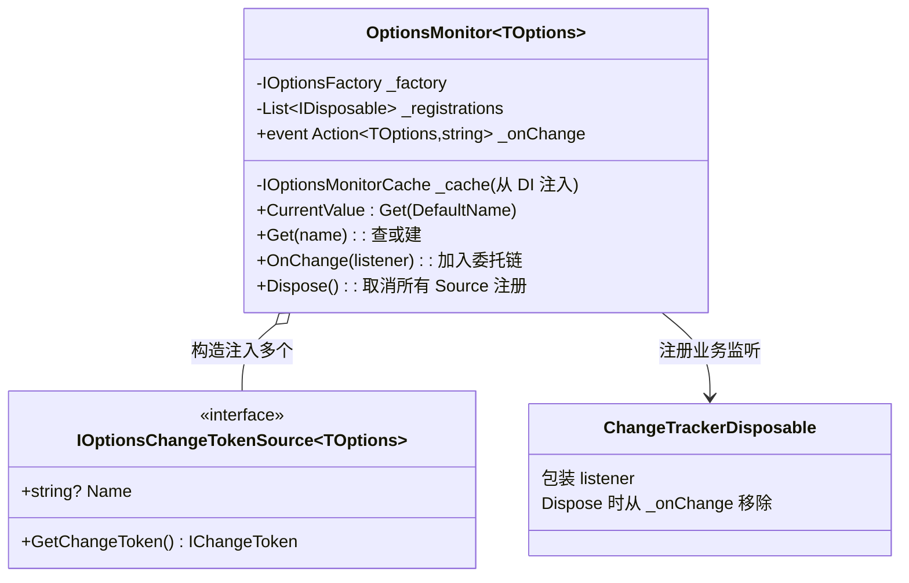

**构造时把 `IOptionsChangeTokenSource` 转成 `ChangeToken.OnChange` 注册**：

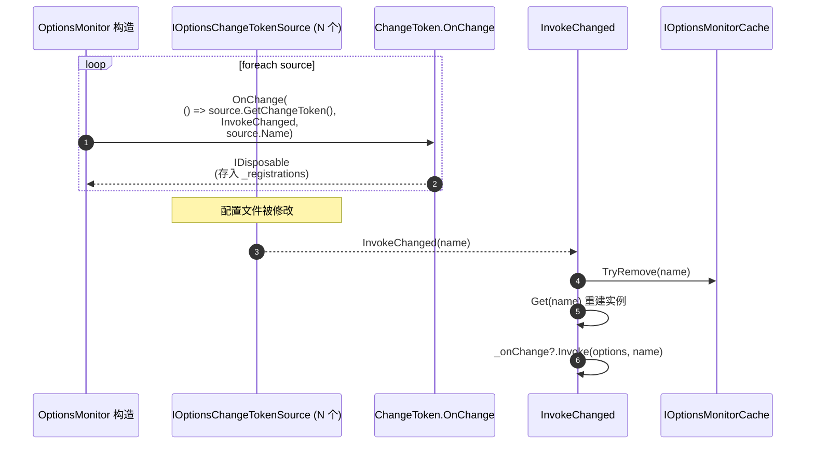

**`InvokeChanged` 的两步**：

1. **从 `IOptionsMonitorCache` 移除旧实例**；
2. **调用 `Get(name)` 立即重建**（顺便把新实例放回缓存）；
3. **触发 `_onChange` 委托链**通知业务订阅者。

**为什么是「先 remove 再 Get」而不是「Get 后比较新旧」？**

- 实例本身就是 Plain Old Object，没有「比较是否变化」的通用方法；
- 由于 `IConfiguration.GetReloadToken` 触发即意味着「文件确实变了」，无脑重建是合理选择；
- 重建后写回缓存，让后续 `Get(name)` 直接命中。

> 详见原笔记 第 199–242 行 `OptionsMonitor` 构造 + `InvokeChanged`。

**`ChangeTrackerDisposable` 的小设计**：`OnChange(listener)` 不直接 `_onChange += listener`，而是用包装类承载 —— 这样 `Dispose()` 时能精确移除「**对应这次注册**」的回调，避免重复回调时混淆。

### 3.4 OptionsCache：基于 Lazy<T> 的并发缓存

`OptionsCache<T>` 用 `ConcurrentDictionary<string, Lazy<TOptions>>` 实现「按名缓存 + 创建只发生一次」：

```C#
// OptionsCache.GetOrAdd（精简）
value = _cache.GetOrAdd(name, new Lazy<TOptions>(createOptions));
return value.Value;   // ← Lazy.Value 保证 createOptions 只被调一次
```

**关键技巧**：`ConcurrentDictionary.GetOrAdd` 在并发时可能多次构造 `Lazy<TOptions>`（多线程同时尝试 Add），但只有一个胜者会被存入字典；`Lazy<TOptions>.Value` 内部保证 `createOptions` 真正只执行一次。**两层并发保护**叠加是 .NET 高并发缓存的常用模式。

> 详见原笔记 第 343–423 行。

---

## 4. 工厂与配置阶段

`OptionsFactory<T>` 是所有 `TOptions` 实例的**唯一来源**。三种消费者最终都会调到它的 `Create(name)`。

### 4.1 OptionsFactory.Create 的四阶段流水线

```mermaid
flowchart TD
    Start["Create(name)"]
    Start --> S1["1. CreateInstance(name)<br/>protected virtual<br/>默认: Activator.CreateInstance&lt;TOptions&gt;()"]

    S1 --> S2{2. foreach _setups: IConfigureOptions}
    S2 --> S2a{是 IConfigureNamedOptions ?}
    S2a -->|是| S2b["namedSetup.Configure(name, options)"]
    S2a -->|否| S2c{name == DefaultName ?}
    S2c -->|是| S2d["setup.Configure(options)"]
    S2c -->|否| S2skip[跳过]
    S2b --> S3
    S2d --> S3
    S2skip --> S3

    S3{3. foreach _postConfigures<br/>IPostConfigureOptions}
    S3 --> S3a["post.PostConfigure(name, options)"]
    S3a --> S4

    S4{4. _validations.Length > 0 ?}
    S4 -->|否| Ret[返回 options]
    S4 -->|是| S4a[foreach _validations]
    S4a --> S4b["result = validate.Validate(name, options)"]
    S4b --> S4c{result.Failed?}
    S4c -->|是| Collect[加入 failures]
    S4c -->|否| Next[下一个]
    Collect --> Next
    Next --> S4a
    S4a -.|完成| S4d{failures.Count > 0 ?}
    S4d -->|是| Throw[throw OptionsValidationException]
    S4d -->|否| Ret
```

**关键设计点**：

1. **未具名 vs 具名的二分**：阶段 2 中，**只有 `IConfigureNamedOptions`** 可以拿到 `name` 参数；普通的 `IConfigureOptions` 只在 `name == ""` 时才生效。这就是为什么 `Configure<T>(opt => ...)` 不会污染 `Get("X")`：你注册的是「**仅默认名生效**」的配置；
2. **PostConfigure 永远拿到 name**：无论你注册的是否「按名匹配」，`PostConfigureOptions` 都接收 `name` 参数 —— 实现类内部决定是否按 `Name` 字段过滤（详见 §4.3）；
3. **验证延后到最后**：`Configure` 和 `PostConfigure` 都执行完毕后才 validate，这样 validator 看到的是「最终的完整对象」；
4. **多 validator 累积失败信息**：所有失败信息会被收集到一个列表，再一次性抛出 `OptionsValidationException`，方便用户一次看到所有问题。

> 详见原笔记 第 471–516 行 `OptionsFactory.Create`。

### 4.2 四个配置接口的类图

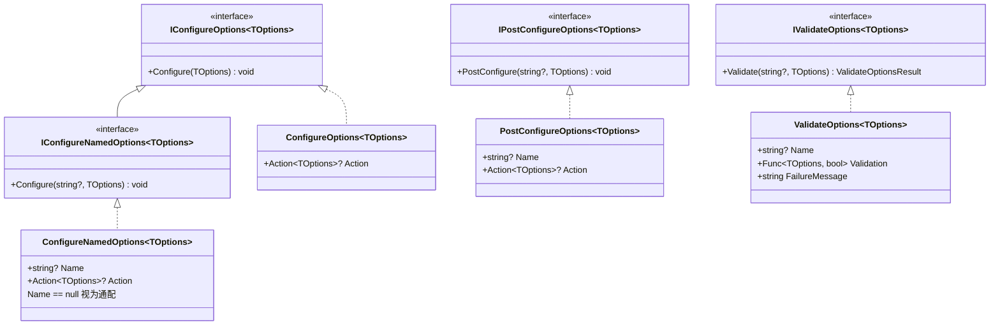

**`IConfigureOptions` vs `IConfigureNamedOptions`**：后者继承前者，是「按名配置」的扩展。`OptionsFactory.Create` 通过 `setup is IConfigureNamedOptions namedSetup` 判断走哪条路径。

### 4.3 ConfigureNamedOptions 的 Name 匹配规则

`ConfigureNamedOptions<T>.Configure(string? name, TOptions options)` 的核心判断：

```C#
public virtual void Configure(string? name, TOptions options)
{
    ThrowHelper.ThrowIfNull(options);
    if (Name == null || name == Name)        // ← 关键：Name == null 视为通配符
        Action?.Invoke(options);
}
```

| `Name` 字段 | `name` 实参 | 是否生效 |
|------------|------------|---------|
| `""`（默认名） | `""` | ✅ |
| `""` | `"X"` | ❌ |
| `"X"` | `"X"` | ✅ |
| `"X"` | `"Y"` | ❌ |
| `null` | 任意 | ✅（**通配，全局默认**） |

`ConfigureAll<T>(...)` 扩展方法就是注册 `Name = null` 的 `ConfigureNamedOptions` —— 一份配置应用于所有命名实例。

### 4.4 多依赖泛型变体：ConfigureNamedOptions<TOptions, TDep1, ..., TDep5>

为什么需要这种 5 个依赖参数的「巨型泛型」？因为 `IConfigureOptions` 的 `Configure(TOptions)` 没法直接拿到其他 DI 服务，必须在**注册时**把依赖通过构造函数预先注入：

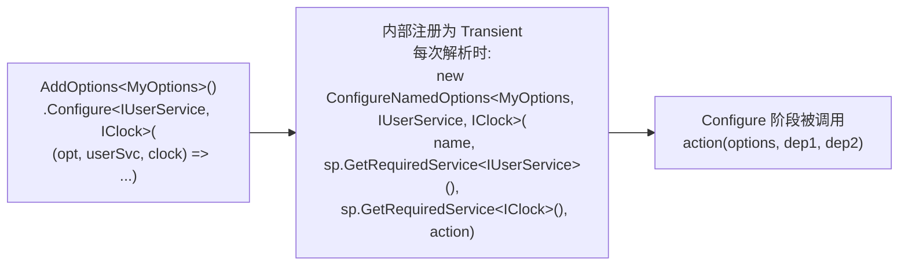

**关键约束**：

- 依赖参数被**捕获在 `ConfigureNamedOptions<,,...>` 实例字段**上，意味着这些依赖的生命周期被「**捕获**」到该 `ConfigureNamedOptions` 实例的生命周期；
- 因为 `OptionsBuilder.Configure<TDep1>` 把它注册为 `Transient`，依赖按当前 scope 解析。这避免了 captive dependency 陷阱（详见 `Notes/依赖注入.md` §6.3）；
- 5 个泛型参数是硬上限 —— 超过 5 个依赖请通过工厂 lambda 自行 `sp.GetRequiredService<...>()`。

> 详见原笔记 第 637–695 行 `ConfigureNamedOptions<,,,,,>`。

### 4.5 实例创建的反射约束

```C#
// OptionsFactory.CreateInstance（精简）
protected virtual TOptions CreateInstance(string name)
{
    return Activator.CreateInstance<TOptions>();
}
```

`Activator.CreateInstance<T>` 要求 `T` **有无参构造函数**。这是 Options 模式的硬约束：

- ✅ `public class MyOptions { public string? Url { get; set; } }` — 合法（编译器自动生成无参构造）；
- ❌ `public class MyOptions(IClock clock) { ... }` — 抛 `MissingMethodException`；
- 想注入依赖：用 `Configure<TDep>(...)` 在配置阶段注入，而不是构造阶段。

**`CreateInstance` 是 `virtual`**：自定义工厂可以重写它来支持复杂构造（如调用 `IServiceProvider.GetRequiredService<TOptions>()`），但这不是常见做法。

### 4.6 验证：ValidateOptions 的三态返回

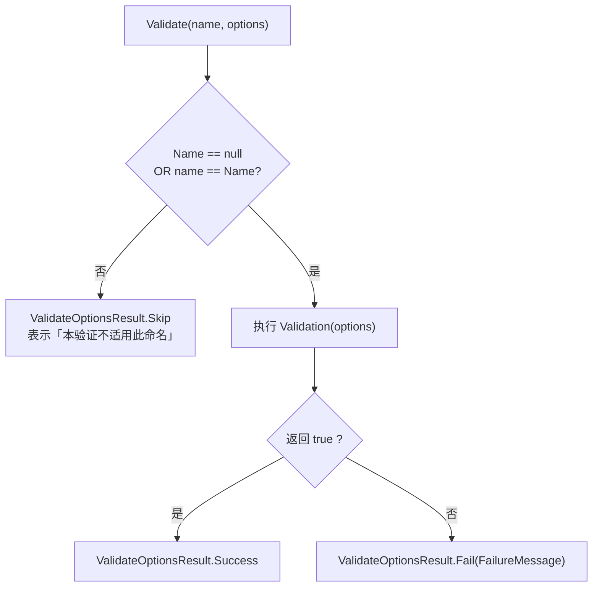

**`Skip` 的设计意图**：同一个 `TOptions` 可能有多个 `IValidateOptions` 注册，每个只针对特定 `Name`。`Skip` 表示「**这个 validator 不管这个 name**」，与 `Success` 不同 —— 后者表示「**确实通过了**」。`OptionsFactory.Create` 只会把 `Failed` 结果收集进失败列表，`Skip` 和 `Success` 都视为「**这一个 validator 没意见**」。

---

## 5. 注册与构建：OptionsBuilder & 扩展方法

### 5.1 AddOptions 注册的核心服务

```C#
// OptionsServiceCollectionExtensions.AddOptions（精简）
services.TryAdd(ServiceDescriptor.Singleton(typeof(IOptions<>),         typeof(UnnamedOptionsManager<>)));
services.TryAdd(ServiceDescriptor.Scoped   (typeof(IOptionsSnapshot<>), typeof(OptionsManager<>)));
services.TryAdd(ServiceDescriptor.Singleton(typeof(IOptionsMonitor<>),  typeof(OptionsMonitor<>)));
services.TryAdd(ServiceDescriptor.Transient(typeof(IOptionsFactory<>),  typeof(OptionsFactory<>)));
services.TryAdd(ServiceDescriptor.Singleton(typeof(IOptionsMonitorCache<>), typeof(OptionsCache<>)));
```

| 服务 | 实现 | 生命周期 | 设计原因 |
|------|------|---------|---------|
| `IOptions<>` | `UnnamedOptionsManager<>` | Singleton | 全应用单例 |
| `IOptionsSnapshot<>` | `OptionsManager<>` | **Scoped** | 每 scope 一份 |
| `IOptionsMonitor<>` | `OptionsMonitor<>` | Singleton | 全局共享 + 跨 scope 通知 |
| `IOptionsFactory<>` | `OptionsFactory<>` | **Transient** | 「**跟随消费者**」—— 让 Scoped 消费者拿到 Scoped 依赖，Singleton 消费者拿到 Singleton 依赖 |
| `IOptionsMonitorCache<>` | `OptionsCache<>` | Singleton | 供 `IOptionsMonitor` 跨 scope 共享 |

**注意 `IOptionsFactory<>` 为何是 Transient**：它内部要解析 `IEnumerable<IConfigureOptions<T>>`、`IEnumerable<IPostConfigureOptions<T>>`、`IEnumerable<IValidateOptions<T>>`。这些可能是 Scoped（如 `OptionsBuilder.Configure<TDep>` 注册的 Transient 多依赖变体），如果工厂自己是 Singleton 会触发 captive dependency。Transient 让工厂跟随消费者的 scope 解析依赖。

**全部用 `TryAdd`**：意味着 `AddOptions()` 可以被任意次调用，重复注册是无害的（被忽略）。

> 详见原笔记 第 912–922 行。

### 5.2 Configure 系列扩展方法语义对照

| 扩展 | 内部注册 | 等价的 `ConfigureNamedOptions.Name` | 适用范围 |
|------|---------|-----------------------------------|---------|
| `Configure<T>(opt => ...)` | `IConfigureOptions<T>` Singleton | `""`（默认名） | 仅默认名 |
| `Configure<T>("X", opt => ...)` | `IConfigureOptions<T>` Singleton | `"X"` | 仅命名 X |
| `ConfigureAll<T>(opt => ...)` | `IConfigureOptions<T>` Singleton | `null`（通配） | 所有命名 |
| `PostConfigure<T>(...)` / `PostConfigureAll<T>(...)` | `IPostConfigureOptions<T>` | 同上 | 同上 |
| `ConfigureOptions(typeof(X))` | 探测 X 实现的接口，注册为 Transient | — | 自定义实现类 |

**`ConfigureOptions(typeof(X))` 接口探测**：

```C#
// 检查 X 是否实现 IConfigureOptions<>、IPostConfigureOptions<>、IValidateOptions<>
foreach (Type serviceType in FindConfigurationServices(configureType))
    services.AddTransient(serviceType, configureType);
```

一个类型可以同时实现多个接口 —— 例如同时是 `IConfigureOptions<MyOptions>` 和 `IValidateOptions<MyOptions>` —— 会被同时注册到对应的两个服务上。

**贴心的错误提示**：如果传入的类型完全不实现任何配置接口，框架会判断是否是 `Action<T>` 类型 —— 这通常是用户混淆了 `Configure` 和 `ConfigureOptions` 两个扩展方法，给出更有针对性的错误信息（详见 `OptionsServiceCollectionExtensions.ThrowNoConfigServices`）。

### 5.3 OptionsBuilder<TOptions> 的链式 API

```C#
services.AddOptions<MyOptions>("Tenant1")
    .Configure(opt => opt.Url = "https://...")
    .PostConfigure(opt => opt.Url = opt.Url.TrimEnd('/'))
    .Validate(opt => !string.IsNullOrEmpty(opt.Url), "Url is required");
```

`OptionsBuilder` 的本质是「**带名 + 带 `IServiceCollection` 引用的语法糖**」：

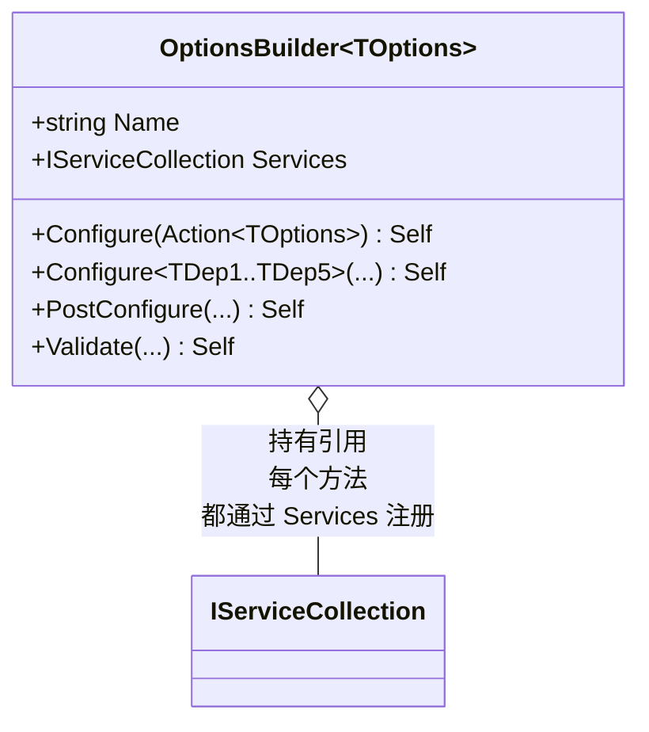

每次 `Configure` / `PostConfigure` / `Validate` 都做两件事：

1. 用 `OptionsBuilder.Name` 作为 `Name` 字段创建 `ConfigureNamedOptions<TOptions>(Name, action)`；
2. 注册到 `Services` 上（多依赖变体注册为 Transient，零依赖变体注册为 Singleton）。

**链式返回 `this`** 实现 fluent API，所有方法都返回 `OptionsBuilder<TOptions>` 自身。

> 详见原笔记 第 1073–1210 行 `OptionsBuilder<>`。

### 5.4 自定义 ConfigureOptions 类型的探测机制

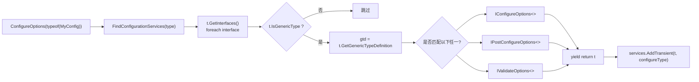

实现要点：

- 只遍历**第一层接口**（`type.GetInterfaces()` 默认返回所有继承的接口），不递归；
- 用 `gtd == typeof(IConfigureOptions<>)` 比较**泛型定义**，不需要关心具体的 `TOptions`；
- `yield return t` 返回的是**已构造的泛型类型**（如 `IConfigureOptions<MyOptions>`），用于服务注册。

---

## 6. 与 Configuration 集成

「选项 + 配置」是 ASP.NET Core 最常见的组合。本节讲清 `Configure<T>(IConfiguration)` 这一行代码背后发生了什么。

### 6.1 ConfigurationChangeTokenSource：桥接配置变更到选项

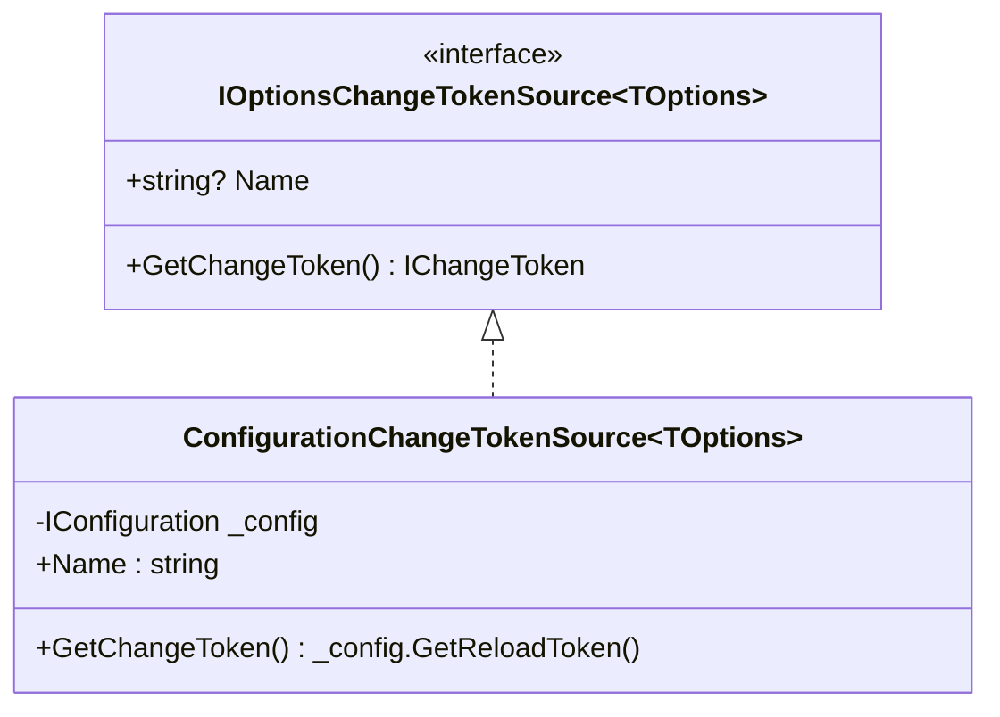

它是「**最简单的转发器**」—— 把 `IConfiguration.GetReloadToken()` 直接当成选项的变更令牌源。这样配置文件被修改时，`OptionsMonitor.InvokeChanged` 就会被触发（详见 §3.3）。

### 6.2 NamedConfigureFromConfigurationOptions：把配置绑定包装成 IConfigureNamedOptions

```C#
// NamedConfigureFromConfigurationOptions（精简）
public NamedConfigureFromConfigurationOptions(string? name, IConfiguration config, Action<BinderOptions>? configureBinder)
    : base(name, options => config.Bind(options, configureBinder))   // ← 把 Bind 包装成 Action<TOptions>
{ ... }
```

类继承 `ConfigureNamedOptions<TOptions>`，等价于：「**当 name 匹配时，把 config 绑定到 options 上**」。注意「**绑定动作只在 Configure 阶段执行**」 —— 这意味着选项实例每次重建（如 `IOptionsMonitor` 收到变更通知）都会重新读取配置。

### 6.3 Configure<T>(IConfiguration) 背后的两次注册

```C#
// OptionsConfigurationServiceCollectionExtensions.Configure（精简）
services.AddOptions();
services.AddSingleton<IOptionsChangeTokenSource<TOptions>>(
    new ConfigurationChangeTokenSource<TOptions>(name, config));
return services.AddSingleton<IConfigureOptions<TOptions>>(
    new NamedConfigureFromConfigurationOptions<TOptions>(name, config, configureBinder));
```

一行 `services.Configure<MyOptions>(configuration)` 背后做了三件事：

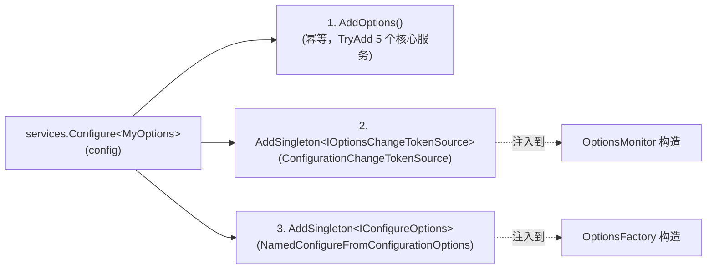

**关键认知**：

- **`IOptionsChangeTokenSource` 是 Singleton**：因为 `OptionsMonitor` 在构造时就一次性遍历所有 source 并注册 `ChangeToken.OnChange`，之后不需要再次解析；
- **`IConfigureOptions` 也是 Singleton**：因为 `Configure` lambda 是无状态的（只引用 `config` 实例），可以安全共享；
- **`OptionsFactory` 是 Transient**：所以即使 `IConfigureOptions` 是 Singleton，每次 factory 解析时会按当前 scope 拿到这同一份实例 —— 没有 captive dependency 问题。

### 6.4 数据流：从文件改动到 OnChange 回调

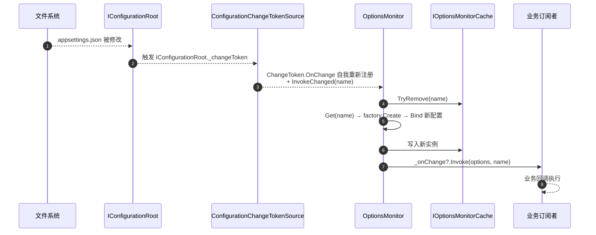

这条链路的每个环节都对应一个抽象，**每层都可单独替换**：

- `IConfigurationRoot` 可以是非文件来源；
- `IOptionsChangeTokenSource` 可以自定义（不基于 `IConfiguration`）；
- `IOptionsMonitorCache` 可以替换为分布式缓存；
- `IConfigureOptions` 可以执行任意配置逻辑（不一定是 `Bind`）。

---

## 7. 设计思想速览

### 7.1 命名选项：把「同类配置多套」做成一等公民

很多框架（包括早期的 ASP.NET）把「**多套同类配置**」处理成多个静态字段或 `Dictionary<string, T>`。Options 把它**抽象为「Name」字段**贯穿整个体系：

| 层级 | 表现 |
|------|------|
| 注册侧 | `Configure<T>("X", ...)` 或 `AddOptions<T>("X")` |
| 配置侧 | `ConfigureNamedOptions.Name` 决定生效与否 |
| 工厂侧 | `OptionsFactory.Create(name)` 透传 name |
| 消费侧 | `IOptionsSnapshot/Monitor.Get(name)` |

**典型用例**：

```C#
// 多个鉴权方案
services.Configure<JwtBearerOptions>("Scheme1", opt => opt.Authority = "...");
services.Configure<JwtBearerOptions>("Scheme2", opt => opt.Authority = "...");
// 业务里
public class MyService(IOptionsSnapshot<JwtBearerOptions> opt) {
    var s1 = opt.Get("Scheme1");
    var s2 = opt.Get("Scheme2");
}
```

「**默认名（空字符串）**」也是一个特殊命名 —— 这是 `IOptions<T>.Value` 总能拿到东西的根本原因。

### 7.2 工厂 + 阶段化：可扩展的对象构建管线

`OptionsFactory.Create` 是一个「**对象构建管线**」：

| 阶段 | 接口 | 谁注册 |
|------|------|--------|
| 创建 | `protected CreateInstance` | 工厂自己（默认 `Activator`） |
| 配置 | `IConfigureOptions` / `IConfigureNamedOptions` | `Configure` / `Configure<T>(IConfiguration)` |
| 后配置 | `IPostConfigureOptions` | `PostConfigure` —— 在所有配置之后做修正 |
| 验证 | `IValidateOptions` | `Validate` |

**「后配置」的用途**：典型场景是「**默认值兜底**」。多个 source 都执行完 `Configure` 后，`PostConfigure` 可以填补留空字段（如 `opt.Url ??= "http://localhost"`）。

**这种「按阶段挂载扩展点」的设计与 ASP.NET Core 的 Middleware Pipeline、`IHostedService` 启动 / 停止顺序异曲同工** —— 都是「**框架定义阶段，用户通过 DI 注入扩展**」的模式。

### 7.3 双重检查锁与 Lazy<T> 的组合

`UnnamedOptionsManager` 用手写双重检查锁；`OptionsCache` 用 `ConcurrentDictionary<string, Lazy<T>>`。两种写法面对的问题相同（「**懒初始化 + 线程安全**」），选择标准却不同：

| 场景 | 选择 | 理由 |
|------|------|------|
| 单一实例的 Singleton | 双重检查锁 | 省一个 `Lazy<T>` 分配；启动期延迟敏感 |
| 按名缓存的多实例 | `ConcurrentDictionary + Lazy<T>` | 已有字典分配；`Lazy<T>` 内置 race 处理 |

**通用原则**：「**单一实例**」用手写双重检查锁，「**集合中多实例**」用 `Lazy<T>` 配合并发集合 —— 后者把单点的 race condition 处理交给框架。

### 7.4 IOptionsSnapshot vs IOptionsMonitor 的本质：缓存所有权

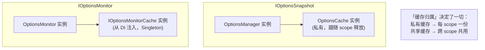

- **私有缓存**：`OptionsManager` 的 `_cache` 是 `new` 出来的，绑定到 manager 实例；manager 是 Scoped 的，scope 一释放整个缓存丢弃 → **「每 scope 一份」语义**；
- **共享缓存**：`OptionsMonitor` 的 `_cache` 是从 DI 拿的 `IOptionsMonitorCache` Singleton；monitor 自己也是 Singleton；变更通知通过 `TryRemove` 让缓存失效 → **「全局共享 + 主动失效」语义**。

「**生命周期 + 缓存归属**」的两种组合刚好对应两种「响应变更」的策略。理解了这个，三种 IOptions 的差异就一目了然。

### 7.5 接口拆分：IConfigureOptions vs IConfigureNamedOptions vs IPostConfigureOptions

为什么不把这三件事都塞进一个接口？

- **`IConfigureOptions` 没有 `name`**：方便老代码注册不关心名字的配置；
- **`IConfigureNamedOptions` 有 `name`**：新代码（含框架自己用的）按名字识别；
- **`IPostConfigureOptions` 单独一份**：保证 PostConfigure 阶段在所有 Configure 之后，不会因为「混进 Configure 列表」而被某些 setup 覆盖。

**Liskov 替换原则的严格执行**：`IConfigureNamedOptions : IConfigureOptions`，所以注册一个 named 实例也能满足 `IConfigureOptions` 服务请求。`OptionsFactory.Create` 通过 `is IConfigureNamedOptions namedSetup` 来动态分发。

---

## 8. 速查卡 & 陷阱清单

### 8.1 三种消费者对照速查

| 维度 | `IOptions<T>` | `IOptionsSnapshot<T>` | `IOptionsMonitor<T>` |
|------|--------------|----------------------|---------------------|
| 服务生命周期 | Singleton | **Scoped** | Singleton |
| 命名支持 | ❌ 仅默认名 | ✅ `Get(name)` | ✅ `Get(name)` |
| 配置变更感知 | ❌ 启动后定死 | ✅ 每 scope 重读一次 | ✅ 实时 + `OnChange` 回调 |
| 取值 API | `Value` | `Value` + `Get(name)` | `CurrentValue` + `Get(name)` + `OnChange` |
| 缓存归属 | 自身（双重检查锁） | 私有 `OptionsCache` | 注入的 `IOptionsMonitorCache`（Singleton） |
| 可在 Singleton 服务中注入？ | ✅ | ❌（captive dependency） | ✅ |

### 8.2 六大核心接口速查

| 接口 | 阶段 | 何时调用 | 注册方式 |
|------|------|---------|---------|
| `IConfigureOptions<T>` | Configure | 仅默认名 | `services.AddSingleton<IConfigureOptions<T>>(...)` 或 `Configure<T>(...)` |
| `IConfigureNamedOptions<T>` | Configure | 按 `Name` 匹配（null = 通配） | 同上，但实例是 `ConfigureNamedOptions<T>` |
| `IPostConfigureOptions<T>` | PostConfigure | 在所有 Configure 之后 | `services.PostConfigure<T>(...)` |
| `IValidateOptions<T>` | Validate | 在所有 PostConfigure 之后 | `services.AddSingleton<IValidateOptions<T>>(...)` 或 `OptionsBuilder.Validate` |
| `IOptionsChangeTokenSource<T>` | 变更通知 | `OptionsMonitor` 构造时注册 | `Configure<T>(IConfiguration)` 自动注册 |
| `IOptionsFactory<T>` | 工厂 | 三种消费者内部都调用 | 默认 `OptionsFactory<>` 已经注册 |

### 8.3 10 大常见陷阱

1. **在 Singleton 服务中注入 `IOptionsSnapshot<T>`**：触发 captive dependency。后者是 Scoped，会被锁死在 Singleton 生命周期里。**对策**：换 `IOptionsMonitor<T>` 或 `IOptions<T>`。
2. **混淆 `Configure` vs `ConfigureOptions`**：`Configure<T>(Action<T>)` 是注册配置 lambda；`ConfigureOptions(typeof(X))` 是注册一个**实现了** `IConfigureOptions<T>` 的类型。两者用错时框架会给出特化错误信息（见 §5.2 末段）。
3. **`Configure<T>(name, opt => ...)` 注册的 lambda 在默认名下不生效**：因为 `Name = "Tenant1" != ""`。要在所有名字下都生效请用 `ConfigureAll<T>(...)`。
4. **`IOptions<T>` 拿不到 `Get(name)`**：`IOptions<T>` 不支持命名，只能取默认名。要拿命名实例必须注入 `IOptionsSnapshot<T>` 或 `IOptionsMonitor<T>`。
5. **`TOptions` 缺少无参构造函数**：`Activator.CreateInstance<T>` 直接抛 `MissingMethodException`。要么加无参构造函数，要么自定义 `OptionsFactory<T>` 重写 `CreateInstance`。
6. **`OnChange` 回调被多次触发**：文件保存时编辑器可能多次 flush；`OptionsMonitor` 不去重，每次 token 触发都重建实例。可以在业务回调内做去重（如对比新旧实例的字段）。
7. **`OptionsMonitor.OnChange` 返回的 `IDisposable` 必须 Dispose**：否则即使业务订阅者已销毁，回调还在委托链里 —— 导致内存泄漏 + 调用已 disposed 对象的方法。**对策**：把返回的 `IDisposable` 与订阅者生命周期绑定。
8. **`Validate` 失败时机**：验证发生在 `OptionsFactory.Create` 末尾，即「**第一次取选项实例时**」才抛错。`ValidateOnStart` 扩展（.NET 6+）可以把验证提到启动期。
9. **`PostConfigure<T>(name, ...)` 容易被忽视**：用户经常多次 `Configure` 后想做最终调整，正确做法是 `PostConfigure`。`PostConfigure` 在所有 `Configure` 之后执行，能保证「**最后一改**」语义。
10. **配置文件改后 `IOptions.Value` 不更新**：`IOptions<T>` 启动后实例化一次就缓存，配置变更对它没影响。这是设计选择，不是 bug。

### 8.4 原笔记类型 → 本笔记小节 映射表

| 原笔记类型 | 本笔记小节 |
|-----------|-----------|
| `IOptions<>` | §1.2 / §2.1 / §2.2 |
| `IOptionsSnapshot<>` | §1.2 / §2.1 / §2.2 / §2.3 |
| `IOptionsMonitor<>` | §1.2 / §2.1 / §2.2 / §2.3 / §3.3 |
| `UnnamedOptionsManager<>` | §3.1 |
| `OptionsManager<>` | §3.2 |
| `OptionsMonitor<>` | §3.3 |
| `OptionsMonitorExtensions` | §3.3（提及） |
| `IOptionsMonitorCache<>` | §3.3 / §3.4 / §7.4 |
| `OptionsCache<>` | §3.4 / §7.3 |
| `IOptionsFactory<>` | §4 引言 / §5.1 |
| `OptionsFactory<>` | §4.1 / §4.5 |
| `IConfigureOptions<>` | §4.2 / §6.2 / §7.5 |
| `IConfigureNamedOptions<>` | §4.2 / §4.3 / §7.5 |
| `IPostConfigureOptions<>` | §4.2 / §7.2 / §7.5 |
| `IValidateOptions<>` | §4.2 / §4.6 |
| `ConfigureOptions<>` | §4.2 |
| `ConfigureNamedOptions<>` | §4.2 / §4.3 |
| `ConfigureNamedOptions<,,,,,>` | §4.4 |
| `PostConfigureOptions<>` | §4.2 |
| `PostConfigureOptions<,,,,,>` | §4.4（同模式） |
| `ValidateOptions<>` | §4.6 |
| `ValidateOptions<,,,,,>` | §4.4（同模式） |
| `OptionsServiceCollectionExtensions` | §5.1 / §5.2 / §5.4 |
| `OptionsBuilder<>` | §5.3 |
| `IOptionsChangeTokenSource<>` | §6.1 |
| `ConfigurationChangeTokenSource<>` | §6.1 |
| `ConfigureFromConfigurationOptions<>` | §6.2（与 Named 变体并提） |
| `NamedConfigureFromConfigurationOptions<>` | §6.2 / §6.3 |
| `OptionsConfigurationServiceCollectionExtensions` | §6.3 |


