# 配置

> 本笔记是 ASP.NET Core（.NET 6）`Microsoft.Extensions.Configuration` 与 `Microsoft.Extensions.Configuration.Binder` 的学习整理，配套源码解读位于仓库根目录 `配置.md`。
>
> 风格延续 `Notes/依赖注入.md`：以 Mermaid UML 图、设计原理、示例为主，源码片段只保留「不看代码无法说清」的几行。

## 0. 阅读指南

### 0.1 本笔记的定位

| 文件 | 视角 | 主体内容 |
|------|------|---------|
| `配置.md`（源码笔记） | **源码视角** | 逐类型贴源码 + 在源码中注释解读 |
| `Notes/配置.md`（本笔记） | **学习视角** | UML 图、设计原理、关键算法讲解、示例、陷阱清单 |

当本笔记说「**详见原笔记 第 N–M 行**」时，请回到源码笔记对应位置查阅完整源码。

### 0.2 推荐阅读顺序

- **首次学习**：§1 → §2 → §3 → §4 → §5 → §6 → §7 → §8。
- **只想知道「配置从哪儿来又到哪儿去」**：先看 §1.1 流水线图与 §1.2 全景时序，再按需翻具体章节。
- **找某个具体类型**：用 §8.4 「**原笔记类型 → 本笔记小节**映射表」反查。

### 0.3 Mermaid 渲染

同 `Notes/依赖注入.md` §0.3，本笔记同样依赖 Mermaid 渲染器。VS Code 装 `Markdown Preview Mermaid Support` 即可；GitHub / Gitea / Obsidian 原生支持。

---

## 1. 全景：从配置源到强类型对象

### 1.1 三阶段流水线

配置子系统的本质是一条「**字符串到对象**」的流水线，把异构的配置源（文件、命令行、环境变量、内存）统一成一棵树，再把树绑定到强类型 POCO：

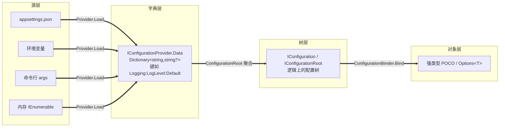

**关键认知**：

- **字典层是统一表示**：所有配置源都被翻译成 `Dictionary<string, string?>`，key 是用 `:` 分隔的扁平路径；
- **树层是逻辑视图**：树结构其实是「虚拟」的，由 `ConfigurationRoot.GetSection` 按需构造，不在内存中物化；
- **对象层是消费形态**：业务代码通常通过 `IOptions<T>` 间接使用绑定后的对象（详见后续「选项」章节）。

### 1.2 一次「读 + 绑定」端到端时序

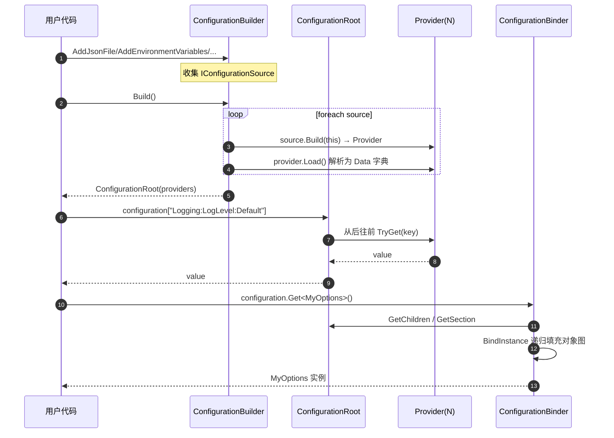

### 1.3 配置键路径约定

| 规则 | 说明 | 示例 |
|------|------|------|
| 分隔符 | `ConfigurationPath.KeyDelimiter == ":"` | `Logging:LogLevel:Default` |
| 大小写 | **忽略大小写**（`OrdinalIgnoreCase`） | `LOGGING:LogLevel:Default` 等价 |
| 数组索引 | 用纯数字段作为索引 | `Servers:0:Host`、`Servers:1:Host` |
| 段排序优先级 | 数字段 < 字符串段 | `0 < 1 < 10 < 100 < "abc"` |
| 段内比较 | 数字按数值；字符串忽略大小写字典序 | — |

> 详见原笔记 第 204–210 行 `ConfigurationKeyComparer` 排序策略。

---

## 2. 配置模型：Source / Provider / Builder

### 2.1 三大抽象的类图

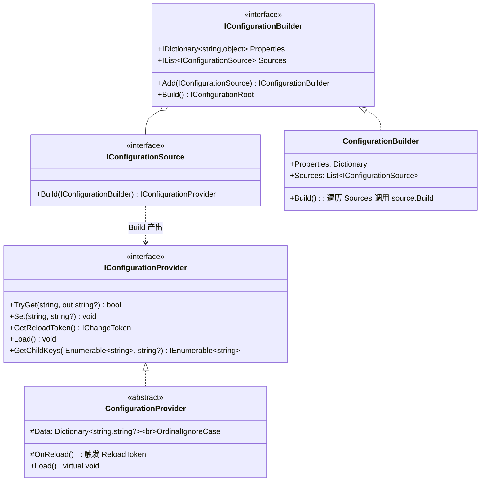

**职责一句话**：

- **Source**：「**怎么定位配置数据**」（文件路径、环境变量前缀、命令行参数…）；
- **Provider**：「**怎么把数据加载成字典**」（解析 JSON、扫描环境变量…）；
- **Builder**：「**收集 Source、产生 Root**」。

### 2.2 ConfigurationBuilder.Build 时序

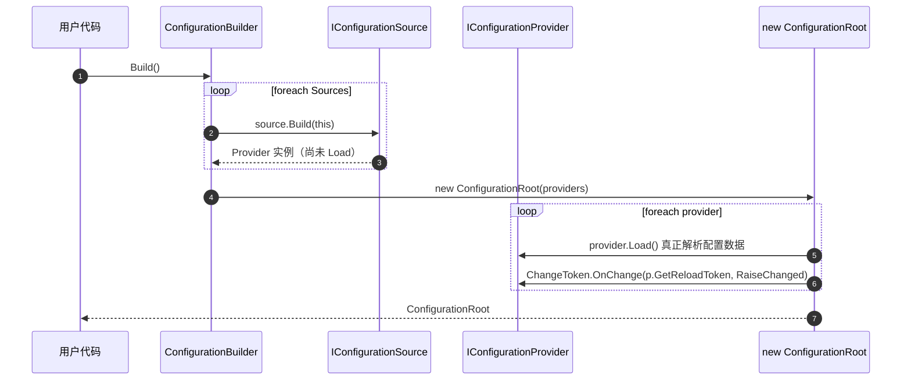

**注意 Load 的触发时机**：

- `Source.Build` **不**触发 `Load`；
- 真正的 `Load` 在 `ConfigurationRoot` 构造函数中执行（详见原笔记 第 1200–1214 行 `ConfigurationRoot` 构造函数）；
- 同时把每个 provider 的 reload token 注册到 root 的 `RaiseChanged` 上，实现变更级联。

> 详见原笔记 第 99–131 行 `ConfigurationBuilder` 与 第 1186–1214 行 `ConfigurationRoot` 构造函数。

### 2.3 配置字典格式约定与 GetChildKeys

`ConfigurationProvider.Data` 字典的**唯一**格式约定：

- key 是 `"X:Y:Z"` 这样的扁平路径字符串；
- key 比较忽略大小写（`StringComparer.OrdinalIgnoreCase`）；
- 叶节点 value 是字符串或 `null`，非叶节点不在字典里出现（因为字典本身就是扁平的）。

`GetChildKeys(earlierKeys, parentPath)` 负责从扁平字典中**提取某一层的子键**。核心是「**找到所有以 parentPath 开头的 key，截取其下一段**」。截取的关键代码：

```C#
// 返回前缀长度之后到下一个 ":" 之间的内容
private static string Segment(string key, int prefixLength)
{
    int indexOf = key.IndexOf(ConfigurationPath.KeyDelimiter, prefixLength, StringComparison.OrdinalIgnoreCase);
    return indexOf < 0 ? key.Substring(prefixLength) : key.Substring(prefixLength, indexOf - prefixLength);
}
```

举例：`parentPath = "Logging:LogLevel"`，字典里有 key `"Logging:LogLevel:Default"`、`"Logging:LogLevel:Microsoft"`：

```
key = "Logging:LogLevel:Default"
prefixLength = "Logging:LogLevel".Length + 1 = 17
indexOf(":", 17) = -1                          → 直接返回 "Default"

key = "Logging:LogLevel:Microsoft:Hosting"
prefixLength = 17
indexOf(":", 17) = 26                          → 返回 "Microsoft"
```

> 详见原笔记 第 167–223 行 `ConfigurationProvider.GetChildKeys` 与 `Segment`。

**`ConfigurationKeyComparer` 分段比较规则**：

| 规则 | 说明 |
|------|------|
| 数字段排在字符串段前面 | 「数组索引段」永远在「命名段」前 |
| 数字段内部按数值大小 | `0 < 1 < 2 < 10`（不是字典序的 `0 < 1 < 10 < 2`） |
| 字符串段内部忽略大小写字典序 | `"Apple" < "BANANA" < "cherry"` |
| 层级优先 | 第一级相同才比较第二级 |

### 2.4 IConfigurationBuilder.Properties 共享数据

`Properties` 是一个 `Dictionary<string, object>`，用于**在多个 Source 之间共享数据**，避免重复创建昂贵的资源（最典型的就是 `IFileProvider`）：

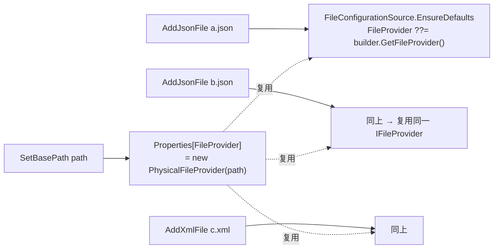

**键的预定义**：

| Key | 用途 | 设置方法 |
|-----|------|---------|
| `"FileProvider"` | 文件配置源共享的根 `IFileProvider` | `SetFileProvider` / `SetBasePath` |
| `"FileLoadExceptionHandler"` | 文件加载失败的回调 | `SetFileLoadExceptionHandler` |

> 详见原笔记 第 462–527 行 `FileConfigurationExtensions`。

---

## 3. 配置源生态

### 3.1 配置源谱系

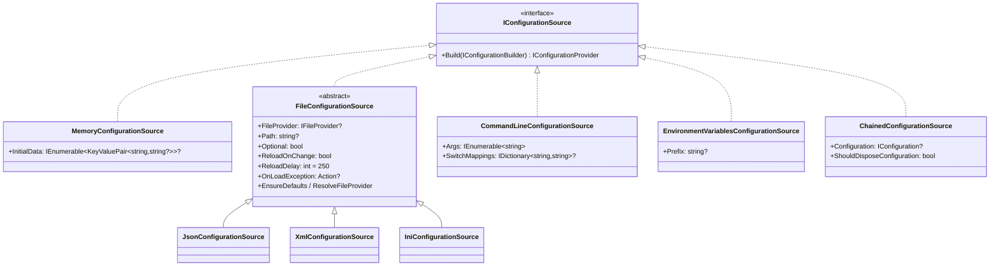

### 3.2 内存配置源

最简单的一种，`MemoryConfigurationProvider` 在**构造函数中**就把 `InitialData` 转移到 `Data` 字典，所以**不需要重写 `Load`**（基类的空实现就够用）。

```C#
// 使用示例
services.AddInMemoryCollection(new Dictionary<string, string?>
{
    ["Logging:LogLevel:Default"] = "Information",
    ["Servers:0:Host"] = "localhost",
});
```

> 详见原笔记 第 286–376 行。

### 3.3 文件配置源

文件配置源是最常用的，三个具体实现共享 `FileConfigurationSource` 抽象基类：

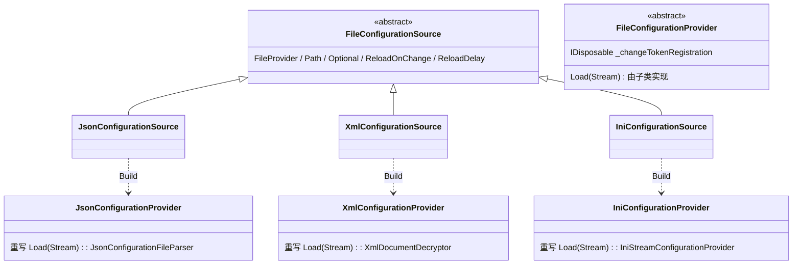

#### 3.3.1 `ResolveFileProvider` 的路径回退逻辑

`AddJsonFile("path/to/file.json")` 时若没显式 `SetBasePath`，框架要决定 `IFileProvider` 的根目录在哪儿。`ResolveFileProvider` 走的是「**逐级回退**」：

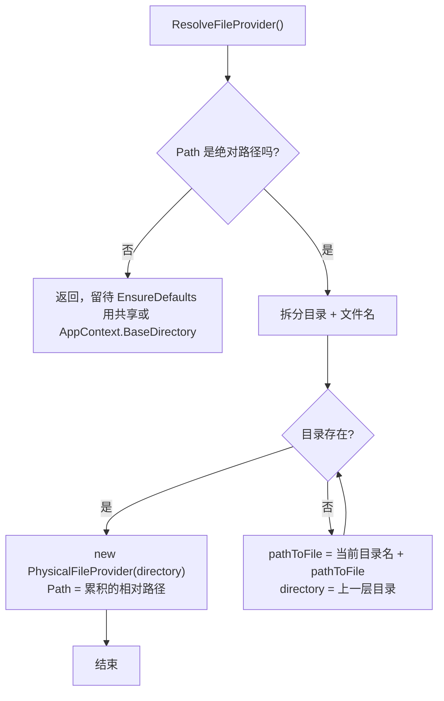

**为什么要回退？**：用户可能指定一个还未创建的多层目录，但配置文件存在；框架尝试找到「**最近的真实存在的祖先目录**」并把后续路径拼到 `subPath` 上。

> 详见原笔记 第 427–454 行。

#### 3.3.2 `EnsureDefaults` 与共享数据

```C#
public void EnsureDefaults(IConfigurationBuilder builder)
{
    FileProvider ??= builder.GetFileProvider();                // 复用 Properties 里的
    OnLoadException ??= builder.GetFileLoadExceptionHandler();
}
```

如果用户没设 `FileProvider`，`GetFileProvider` 会回退到 `AppContext.BaseDirectory`，但**不会**写回 `Properties`（这点要小心：每次都新建 `PhysicalFileProvider`）。

#### 3.3.3 `FileConfigurationProvider.Load` 中的 OpenRead

加载文件时有一处小但有意思的优化：

```C#
static Stream OpenRead(IFileInfo fileInfo)
{
    if (fileInfo.PhysicalPath != null)
    {
        // 直接构建 FileStream（同步 IO）
        return new FileStream(fileInfo.PhysicalPath, FileMode.Open, FileAccess.Read,
            FileShare.ReadWrite, bufferSize: 1, FileOptions.SequentialScan);
    }
    return fileInfo.CreateReadStream();   // 兜底：可能是异步 FileStream
}
```

**设计意图**：`Load` 本身是同步方法，但 `IFileInfo.CreateReadStream` 默认返回**启用了异步 IO** 的 `FileStream`。在同步代码里使用异步 IO 流会导致不必要的异步状态机分配与上下文切换。**优先走 `PhysicalPath` + 显式 `FileStream`** 能省掉这部分开销。

> 详见原笔记 第 742–763 行。

#### 3.3.4 异常处理钩子

`OnLoadException` 是一个 `Action<FileLoadExceptionContext>`。Load 时若文件不存在（且非 Optional）或解析失败，框架会调用 `HandleException` 把异常包成 `FileLoadExceptionContext` 交给钩子，钩子可决定是否「**吞掉**」（`Ignore = true`）异常。

### 3.4 命令行配置源

支持三种前缀（`--`、`-`、`/`）和两种参数形式：

| 形式 | 示例 | 解析为 |
|------|------|--------|
| 单参数（一段） | `Name=Value` | key=`Name`, value=`Value` |
| 单参数 + 前缀 | `--Name=Value` | key=`Name`, value=`Value` |
| 双参数（两段） | `--Name Value` | key=`Name`, value=`Value` |
| 带映射的缩写 | `-n Value`（需要 SwitchMappings：`-n → Name`） | key=`Name`, value=`Value` |

**`SwitchMappings`** 是「缩写 → 全名」字典：

```C#
var mappings = new Dictionary<string, string>
{
    ["-n"] = "Name",
    ["--name"] = "Name",
};
services.AddCommandLine(args, mappings);
```

**关键约束**：

- 缩写只能使用 `-` 或 `--` 前缀；
- **`-` 前缀的缩写必须存在映射**，否则抛 `FormatException`（避免与「双参数 `-flag value`」冲突）；
- `--` 前缀的全名可以不在映射里（直接当成 key 使用）。

> 详见原笔记 第 909–963 行。

### 3.5 环境变量配置源

```C#
services.AddEnvironmentVariables(prefix: "ASPNETCORE_");
```

`Prefix` 用于过滤 + 剥离：只有以 prefix 开头的变量会被纳入，且剥离 prefix 后剩余部分作为配置键。常见的来源（按优先级）：

1. **当前进程**：`launchSettings.json` 启动时注入；
2. **当前用户**：`HKEY_CURRENT_USER\Environment`；
3. **当前系统**：`HKEY_LOCAL_MACHINE\SYSTEM\ControlSet001\Control\Session Manager\Environment`。

环境变量内**双下划线 `__`** 会被转换为配置键的分隔符 `:`（因为某些操作系统不允许变量名含 `:`），这是惯例而非源码内置 —— 实际由 `EnvironmentVariablesConfigurationProvider` 的解析逻辑实现。

### 3.6 链接配置源

`ChainedConfigurationSource` 是「**把另一个 `IConfiguration` 作为配置源**」的桥接器。它的 `Provider` 不维护自己的字典，所有读写都**转发**给底层 `IConfiguration`：

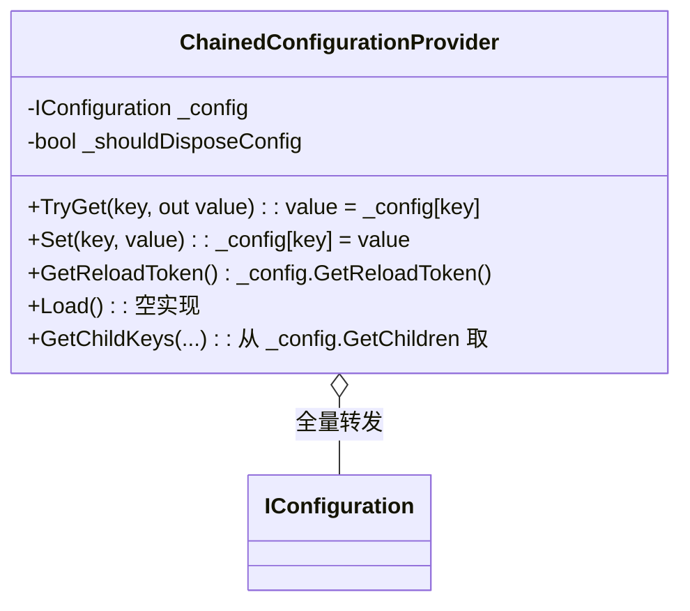

**典型场景**：宿主的 `IHostBuilder` 已经构建了一份配置，应用层想在此基础上继续添加配置源 —— 通过 `AddConfiguration(hostConfig)` 把宿主配置「链接」进来作为一个 provider。

**`ShouldDisposeConfiguration`** 决定外部 `IConfiguration` 是否随 `ChainedConfigurationProvider` 一同释放 —— 默认为 `false`，避免把不属于自己的资源释放掉。

> 详见原笔记 第 1010–1125 行。

---

## 4. 配置变更通知：ChangeToken 模式

配置子系统并不仅仅是「读一次」—— `appsettings.json` 修改后能否被应用感知，依赖一整套 `IChangeToken` 通知机制。这套机制远不止用在配置上：日志、文件系统监控、缓存失效都共用同一抽象。

### 4.1 IChangeToken 抽象

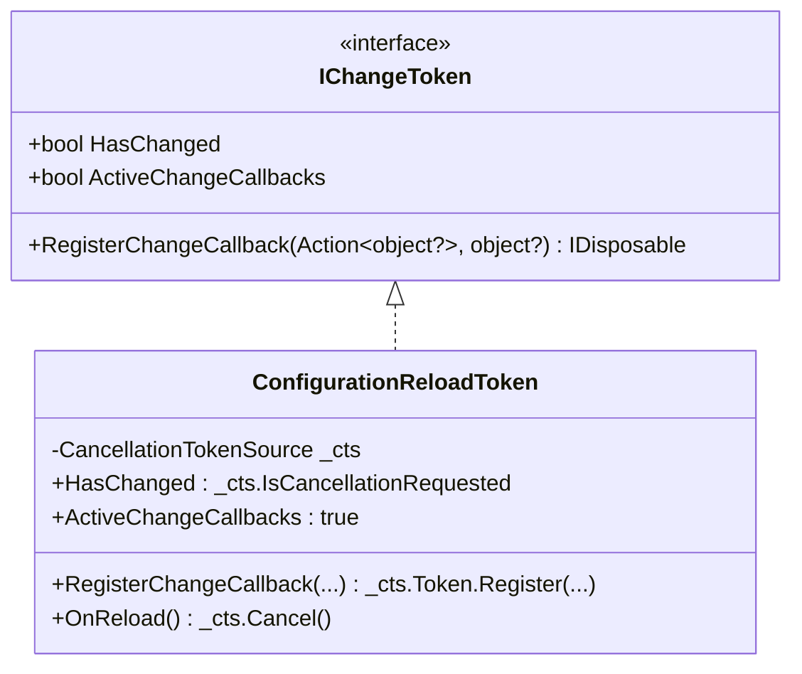

**三个成员的语义**：

| 成员 | 含义 |
|------|------|
| `HasChanged` | 「**是否已经发生过变更**」（一次性，触发后永远为 `true`） |
| `ActiveChangeCallbacks` | 「**是否支持主动回调通知**」；为 `false` 时调用方只能轮询 `HasChanged` |
| `RegisterChangeCallback(...)` | 注册一次性回调；返回 `IDisposable` 可取消注册 |

**关键性质**：`IChangeToken` 是「**一次性令牌**」 —— 一旦触发，整个对象就「**报废**」了，不能复用。要继续监听新的变更必须**重新获取一个新令牌**（这一点导致了 §4.4 的「自我重新注册」模式）。

### 4.2 ConfigurationReloadToken 的实现细节

`ConfigurationReloadToken` 直接复用 `CancellationToken` 来实现「一次性 + 多订阅」语义：

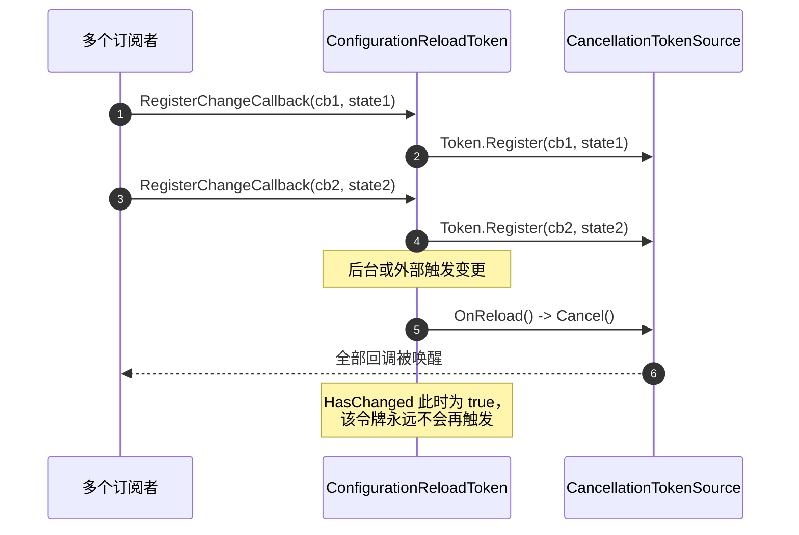

**为何用 `CancellationToken` 而不是 `event`？**

- `event` 需要框架自己管理订阅列表与并发；
- `CancellationToken.Register` 内置多订阅、线程安全、`Dispose` 取消注册；
- 一次性触发语义天然契合「**配置变更**」场景；
- `CancellationTokenRegistration` 直接就是 `IDisposable`，可作为返回值。

> 详见原笔记 第 264–283 行。

### 4.3 ChangeToken.OnChange —— 生产者/消费者模型

直接用 `IChangeToken.RegisterChangeCallback` 有个麻烦：**令牌触发后就报废了**，要继续监听必须重新拿一个新令牌再注册。`ChangeToken.OnChange` 就是这个模式的封装：

```C#
// 使用示例：监听文件变化并重新加载
_changeTokenRegistration = ChangeToken.OnChange(
    () => Source.FileProvider.Watch(Source.Path!),   // 生产者：每次取新令牌
    () => Load(reload: true));                       // 消费者：实际业务回调
```

| 角色 | 类型 | 职责 |
|------|------|------|
| 生产者 | `Func<IChangeToken?>` | 每次调用返回一个**新的、未触发**的 `IChangeToken` |
| 消费者 | `Action` / `Action<TState>` | 实际的业务回调（如「重新加载文件」） |

### 4.4 ChangeTokenRegistration 的自我重新注册

`ChangeToken.OnChange` 内部用 `ChangeTokenRegistration<TState>` 实现「**回调触发后用新令牌再注册**」的闭环：

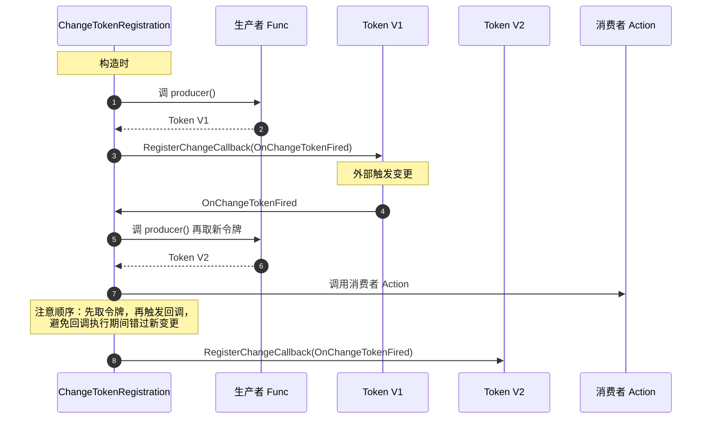

**关键代码 —— 回调触发后的自我重新注册**：

```C#
private void OnChangeTokenFired()
{
    IChangeToken? token = _changeTokenProducer();        // 先取新令牌
    try { _changeTokenConsumer(_state); }                // 再执行业务
    finally { RegisterChangeTokenCallback(token); }      // 最后重新注册
}
```

**顺序的设计意图**：先拿新令牌，再执行消费者。如果反过来（先消费者再取令牌），消费者期间发生的变更可能错过 —— 「**取新令牌**」必须在「**消费者尚未开始**」时完成，从而保证「**所有在消费者执行后产生的变更**」都会落在新令牌上。

**`try...finally`** 保证即使消费者抛异常，重新注册也照常进行 —— 否则一次异常就会让监听永久断链。

> 详见原笔记 第 851–905 行 `ChangeTokenRegistration<TState>`。

### 4.5 文件配置的 ReloadDelay

`FileConfigurationSource.ReloadDelay = 250`（毫秒），作用在 `FileConfigurationProvider` 注册的回调里：

```C#
ChangeToken.OnChange(
    () => Source.FileProvider.Watch(Source.Path!),
    () =>
    {
        Thread.Sleep(Source.ReloadDelay);       // ← 等 250ms
        Load(reload: true);
    });
```

**为什么要等？** 文件系统的「**变更通知**」常常在文件**写入完成之前**就触发（编辑器先写文件头、再写内容、最后 flush）。如果立刻 `Load`，可能读到只写了一半的文件，导致 JSON / XML 解析失败。等 250ms 给文件 flush 时间，是经验值。

> 详见原笔记 第 696–711 行。

### 4.6 ConfigurationRoot 的「比较并交换」模式

`ConfigurationRoot.RaiseChanged` 需要把「**当前令牌触发**」与「**为下次变更准备新令牌**」做成原子操作，用了 `Interlocked.Exchange`：

```C#
private void RaiseChanged()
{
    ConfigurationReloadToken previousToken =
        Interlocked.Exchange(ref _changeToken, new ConfigurationReloadToken());
    previousToken.OnReload();
}
```

**两步原子化的好处**：

- 任何在 `RaiseChanged` 进行期间调用 `GetReloadToken` 的线程，要么拿到**旧令牌**（即将被触发）要么拿到**新令牌**（未触发，等下一次），都是合法状态；
- 不需要 lock，避免锁竞争。

> 详见原笔记 第 1289–1295 行。

---

## 5. 配置应用：IConfiguration 三件套

### 5.1 类图

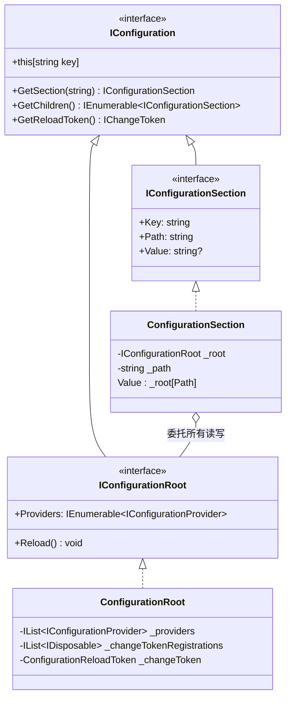

**三者职责**：

- **`IConfiguration`**：通用接口，能读 key、取子节点、拿 reload token；
- **`IConfigurationRoot`**：根节点专属能力 —— `Reload()` 强制重新加载、`Providers` 访问全部 provider；
- **`IConfigurationSection`**：非根节点专属能力 —— 知道自己的 `Key`（最后一段）、`Path`（完整路径）、`Value`（若是叶节点）。

### 5.2 ConfigurationRoot 的「后注册者优先」

`ConfigurationRoot[key]` 走的是「**从后往前**」遍历 providers：

```mermaid
flowchart LR
    Get["this[key]<br/>(读)"] --> Reverse[从后往前遍历 providers]
    Reverse --> Try{TryGet(key) ?}
    Try -->|命中| Ret[立即返回 value]
    Try -->|未命中| Cont[继续上一个 provider]
    Cont --> Try
    Try -->|全都未命中| Null[返回 null]

    style Reverse fill:#fff3cd
```

**关键代码**（保留这 3 行才能讲清反向遍历）：

```C#
for (int i = providers.Count - 1; i >= 0; i--)
{
    if (providers[i].TryGet(key, out string? value))
        return value;
}
```

**「后注册者优先」的意义**：

```C#
builder.AddJsonFile("appsettings.json");              // provider[0]
builder.AddJsonFile("appsettings.Production.json");   // provider[1]
builder.AddEnvironmentVariables();                    // provider[2]
builder.AddCommandLine(args);                         // provider[3]
// 读取顺序：args → 环境变量 → Production.json → 默认 appsettings.json
```

**注意与 DI 的对照**：

| 子系统 | 多次注册的「单实例查找」 |
|--------|------------------------|
| DI（`GetService<T>`） | 取最后注册的（slot=0） |
| 配置（`config[key]`） | **从后往前找到第一个命中的** |
| DI（`GetServices<T>`） | 按注册顺序（早注册者在前） |
| 配置（`GetChildren`） | 跨 provider 累加 + 去重 + 排序（见 §5.4） |

**`Set(key, value)` 的语义不同**：

```C#
// SetConfiguration 是「广播」：所有 provider 都被更新
foreach (var provider in providers) provider.Set(key, value);
```

写入比读取「更扩散」 —— 这样下次 reload 后还能保留写入值（多数 provider 的 `Set` 只改内存字典）。

> 详见原笔记 第 1228–1261 行。

### 5.3 ConfigurationSection 是「视图」而非「数据」

`ConfigurationSection` 自己**不存任何配置数据**，只持有「根引用 + 路径」两个字段：

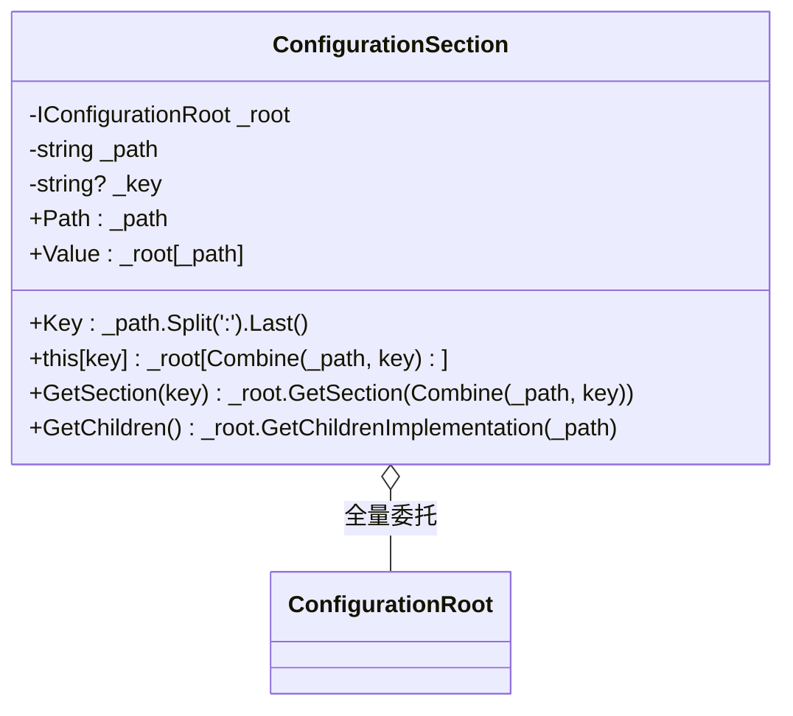

**两个反直觉点**：

- **`GetSection(key)` 永不返回 `null`**：哪怕 key 完全不存在，也会返回一个 `ConfigurationSection`，其 `Value` 为 `null`。用 `Exists()` 扩展方法判断是否真存在；
- **section 是「即时计算」的视图**：每次 `GetSection` 都 new 一个新的 `ConfigurationSection` —— 它的状态完全由 `_root` 决定，多次 `GetSection` 拿到的不是同一对象，但读出的值是一致的。

```C#
// ConfigurationExtensions.Exists 的判断
public static bool Exists(this IConfigurationSection? section)
{
    if (section == null) return false;
    return section.Value != null || section.GetChildren().Any();   // 叶节点有值 或 有子节点
}
```

> 详见原笔记 第 1315–1385 行 与 第 642–651 行 `Exists`。

### 5.4 GetChildren 跨提供者聚合

`section.GetChildren()` 不是简单地从某一个 provider 取子节点 —— 它要把**所有 provider** 的子节点合并去重再排序：

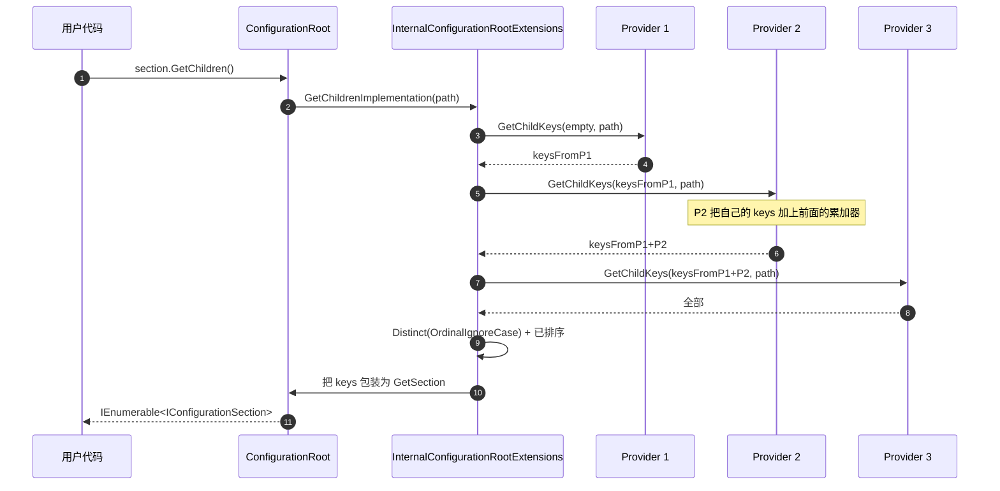

**关键设计：用累加器避免每个 provider 都 Sort**

每个 `Provider.GetChildKeys(earlierKeys, parentPath)` 都：

1. 从自己的 `Data` 中收集子键；
2. 把传入的 `earlierKeys` 拼到末尾；
3. **整体重新排序**返回。

最终 `InternalConfigurationRootExtensions.GetChildrenImplementation` 只需做一次 `Distinct(OrdinalIgnoreCase)`，再把每个 key 包装成 `IConfigurationSection`。

**反直觉点**：`GetChildren` **不会递归合并子节点的子节点**。即 `provider1` 有 `A:B`，`provider2` 有 `A:C`，`GetChildren("A")` 返回 `[B, C]`，但 `B` 节点和 `C` 节点本身仍各自只来自原 provider。

> 详见原笔记 第 1389–1417 行 `InternalConfigurationRootExtensions.GetChildrenImplementation`。

### 5.5 GetReloadToken 与 RaiseChanged 的级联

```mermaid
flowchart LR
    P1[Provider 1] -->|reload token| P1T
    P2[Provider 2] -->|reload token| P2T
    P3[Provider 3] -->|reload token| P3T

    P1T -. ChangeToken.OnChange .-> R1[RaiseChanged]
    P2T -. ChangeToken.OnChange .-> R1
    P3T -. ChangeToken.OnChange .-> R1

    R1 --> Swap[Interlocked.Exchange _changeToken<br/>previous.OnReload]
    Swap --> RootToken[Root 自己的 ConfigurationReloadToken]
    RootToken --> User[业务订阅者]
```

**链路**：任何一个 provider 的变更 → 触发 root 的 `RaiseChanged` → 切换 root 自己的 token → 业务订阅者（如 `Options` 监听器）被通知。

这条链路把 N 个 provider 的变更**复用同一个 root token** 暴露给业务，业务代码无需关心是哪个 provider 变了。

> 详见原笔记 第 1212 行（构造函数）+ 1289–1295 行（`RaiseChanged`）。

---

## 6. 配置绑定：ConfigurationBinder

`ConfigurationBinder` 是配置子系统的「**最后一公里**」：把 `IConfiguration` 的字符串值映射到强类型对象图上。它是 `IOptions<T>` 的内部基础设施。

### 6.1 绑定能力一览

| 目标类型 | 处理方式 | 路径 |
|---------|---------|------|
| `IConfigurationSection` | 直接返回 config 自身 | 提前返回 |
| 可从字符串解析的值类型（int / Guid / Enum / TimeSpan…） | `TypeDescriptor` / `TypeConverter` 转换 | `TryConvertValue` |
| 数组 / `IEnumerable<T>` / `IReadOnlyCollection<T>` / `IReadOnlyList<T>` | 创建数组 | `BindArray` |
| `ISet<T>` / `IReadOnlySet<T>`（key 限定 string 或 enum） | 创建 `HashSet<T>` | `BindSet` |
| `IDictionary<K,V>` / `IReadOnlyDictionary<K,V>`（K 限定 string 或 enum） | 创建 `Dictionary<K,V>` | `BindDictionaryInterface` |
| 实现 `ICollection<T>` 的具体集合 | 反射 `Add` | `BindCollection` |
| 实现 `IDictionary<K,V>` 的具体字典 | 反射索引器 | `BindConcreteDictionary` |
| 普通 POCO | 反射设属性 | `BindProperties` / `BindProperty` |

### 6.2 BindInstance 的分发流程

`BindInstance` 是绑定的总调度，按以下顺序决定走哪一条路径：

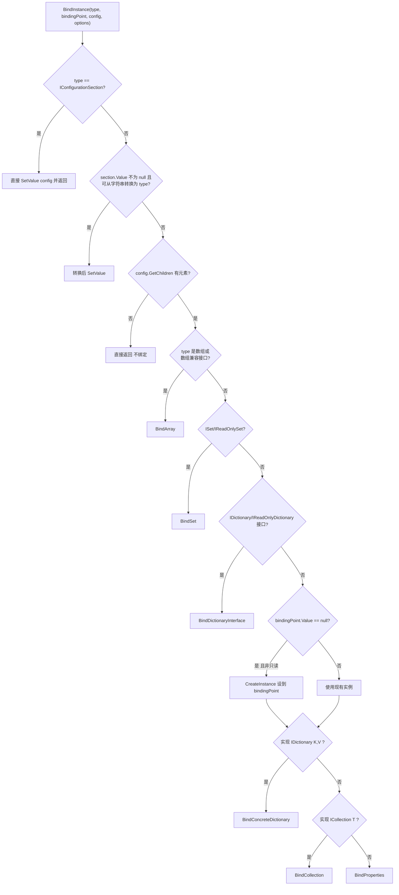

**为什么分两次检查 Dictionary？**

- 第一次：`TypeIsADictionaryInterface` 检查的是**接口本身**（`IDictionary<,>` / `IReadOnlyDictionary<,>`） —— 走 `BindDictionaryInterface`（**创建新 Dictionary**）；
- 第二次：`FindOpenGenericInterface(IDictionary<,>, type)` 找的是**具体类型实现了哪个泛型接口** —— 走 `BindConcreteDictionary`（**填充已有实例**）。

集合检查同理（`ISet`/`ICollection` 接口 vs 实现 `ICollection<>` 的具体类型）。

> 详见原笔记 第 1502–1618 行 `BindInstance`。

### 6.3 BindingPoint：绑定上下文

`BindingPoint` 是绑定过程中的「**值容器**」。它有三个值来源：

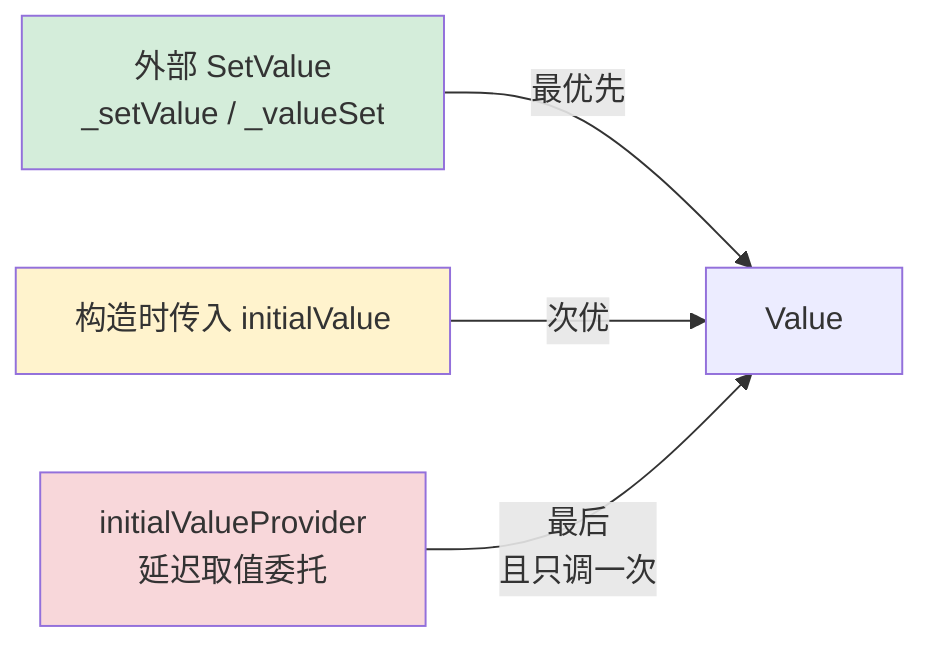

**关键代码 —— Value 的优先级判定**：

```C#
public object? Value =>
    _valueSet ? _setValue : _initialValue ??= _initialValueProvider?.Invoke();
```

**关键代码 —— `HasNewValue` 对可变值类型的特殊处理**：

```C#
public bool HasNewValue
{
    get
    {
        if (IsReadOnly) return false;
        if (_valueSet) return true;
        // 自定义结构（可变值类型）也算「有新值」，
        // 因为绑定过程可能在 initialValue 上原地修改了字段
        return _initialValue?.GetType() is { } t && t.IsValueType && !t.IsPrimitive;
    }
}
```

**为什么自定义结构要特殊处理？** 引用类型的修改是「**就地的**」 —— 在 `_initialValue` 上改完字段，外部仍然能看到。但值类型按值传递，绑定时拿到的是副本，修改副本不会影响外部 —— **除非**框架显式 `SetValue` 把副本写回。可变结构（如用户自定义的 `struct`）有这个需求，所以「**只要 initialValue 是非原生值类型**」就把 `HasNewValue` 视为 `true`，强制框架把副本写回。

> 详见原笔记 第 1969–2043 行 `BindingPoint`。

### 6.4 五条绑定路径对照

| 方法 | 输入实例的处理 | 子配置节迭代 | 反射机制 | 限制 |
|------|---------------|--------------|---------|------|
| `BindArray` | 把源元素转入临时 `List` | 用 BindingPoint 对每个 section 递归绑定 | `Array.CreateInstance(elemType, n)` | 不支持多维数组 |
| `BindSet` | 同上转入 `HashSet<T>` | 同上 | `MakeGenericType(HashSet<>).GetMethod("Add")` | key 限定 `string` 或 `enum` |
| `BindDictionaryInterface` | 源转入新 `Dictionary<K,V>` | 同上 | 索引器 `setter.SetValue` | key 限定 `string` 或 `enum` |
| `BindCollection` | 直接对已有 collection.Add | 同上 | `collectionType.GetMethod("Add")` | 需 `ICollection<T>` |
| `BindProperties` | 直接对已有对象设属性 | 用属性名作为子 section key | `PropertyInfo.SetValue` | 见 §6.5 |

**所有路径共有的两个特征**：

1. **每个元素的绑定都包在 `try { ... } catch { }` 里**——单元素失败不影响其他元素，但**会被静默吞掉**（注意陷阱清单）；
2. **都通过 `BindingPoint.HasNewValue` 判断是否要加入结果**——避免把「未绑定」的占位值塞进集合。

> 详见原笔记 第 1620–1885 行。

### 6.5 BinderOptions

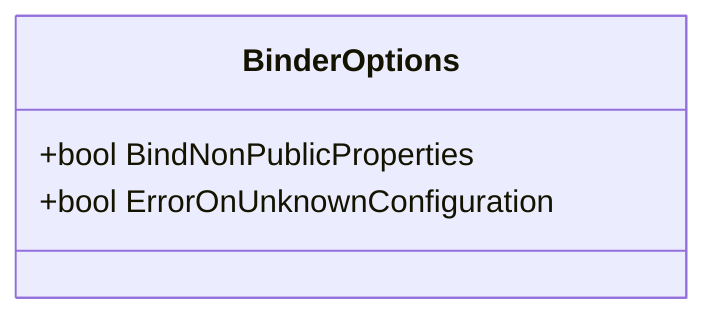

| 选项 | 默认 | 含义 |
|------|------|------|
| `BindNonPublicProperties` | `false` | 是否绑定 `private` / `internal` 属性 |
| `ErrorOnUnknownConfiguration` | `false` | 子配置节有名但 POCO 没有对应属性时是否抛异常 |

**`ErrorOnUnknownConfiguration` 的实现**：

```C#
HashSet<string> propertyNames = new(modelProperties.Select(p => p.Name), OrdinalIgnoreCase);
var missing = configuration.GetChildren()
    .Where(cs => !propertyNames.Contains(cs.Key))
    .Select(cs => $"'{cs.Key}'").ToList();
if (missing.Count > 0) throw new InvalidOperationException(...);
```

**用途**：防止用户拼错配置键。例如 `appsettings.json` 写了 `"Conection"` 但 POCO 字段是 `Connection`，没有这个选项时**会静默忽略**，启用后会立即报错。

> 详见原笔记 第 1955–1966 行 + 第 1887–1918 行。

### 6.6 反射性能与 AOT 兼容性

`ConfigurationBinder` 全程基于反射：

- `Activator.CreateInstance` 创建实例；
- `PropertyInfo.GetMethod / SetValue` 读写属性；
- `MethodInfo.Invoke` 调用 `Add` / `TryGetValue`。

**性能代价**：反射比直接方法调用慢 10–100 倍；首次访问还要付出 Type 元数据加载开销。**对于大量绑定的应用（如启动时绑定几十个 Options）**，可能占用启动时间的 5–10%。

**AOT 兼容性**：反射在 Native AOT 下需要 `DynamicallyAccessedMembers` 注解或源生成器。.NET 8 引入了 **`Microsoft.Extensions.Configuration.Binder` 源生成器**（编译时生成绑定代码，零反射），但本笔记基于 .NET 6，仅简短提及。

---

## 7. 设计思想速览

### 7.1 三层模型分离：字典 / 树 / 对象

```mermaid
flowchart LR
    L1[字典层<br/>Provider.Data<br/>统一表示] --> L2[树层<br/>IConfiguration<br/>逻辑视图]
    L2 --> L3[对象层<br/>Binder + POCO<br/>类型化消费]

    L1 -. 关心 .-> X1[「数据从哪儿来」<br/>怎么解析]
    L2 -. 关心 .-> X2[「数据如何被消费」<br/>遍历 / 取值]
    L3 -. 关心 .-> X3[「数据如何强类型化」<br/>对象图绑定]
```

每一层都有自己**职责清晰**的抽象，互不污染：

- 字典层不知道树长什么样；
- 树层不需要懂任何配置源；
- 对象层只需要 `IConfiguration`，可以对接任何实现。

这种分层是「**关注点分离**」的教科书示例 —— 想自定义某一层（如实现一个 etcd / Consul 的 provider）只需关心该层接口。

### 7.2 观察者模式：IChangeToken 的产消分离

传统的 `event` 是「**永久订阅**」 —— 订阅一次后所有事件都收。`IChangeToken` 反过来：「**一次性令牌**」——触发即报废，要持续监听必须**主动**重新获取新令牌。

**为什么这么设计？**

- **简化语义**：「**一次性**」消除了「事件去重」「重入冲突」「订阅生命周期管理」等复杂问题；
- **天然适配 CancellationToken**：`CancellationToken` 本身就是一次性的，直接复用其多订阅 + 线程安全机制；
- **明确所有权**：消费者每次要新令牌，迫使他们想清楚「**下一个监听周期**何时开始」。

代价是**调用方稍麻烦** —— 通常用 `ChangeToken.OnChange` 把「重新注册」的样板代码封装掉。

### 7.3 后注册者优先：与 DI 的对照

| 子系统 | 多次注册的「**主**取值」 | 多次注册的「**集合**取值」 |
|--------|------------------------|-------------------------|
| **配置** | 后注册者优先（`provider[N-1].TryGet → provider[0].TryGet`） | 全部累加去重排序 |
| **DI** | 后注册者优先（slot=0 命中最后注册） | 全部按注册顺序返回 |

设计哲学一致：「**后注册者覆盖前者**」是用户最直觉的预期 —— 用户后写的代码意图通常更明确（如「**用环境变量覆盖文件**」）。

### 7.4 视图模式：ConfigurationSection 零数据持有

`ConfigurationSection` 不持有任何配置数据，只有 `_root` 引用和 `_path` 字符串。这是「**视图**」模式 —— 节点不是数据，**节点是对数据的查询**。

**好处**：

- **永远是最新的**：底层 `_root` 变了，所有 section 自动看到新值，不需要「失效」机制；
- **零内存开销**：哪怕一颗包含 1000 个节点的「树」，也只是 1000 个 `(_root, _path)` 对，没有真实树形数据结构；
- **可丢弃**：section 用完即弃，GC 不留痕迹。

代价是每次 `Value` / `GetChildren` 都要重新查 root —— 但 root 的 `TryGet` 是 `Dictionary` 查找，O(1)。

### 7.5 一次性令牌 vs 持续订阅：基于 CancellationToken 的选择

`CancellationToken` 本来是为「**任务取消**」设计的，但 `ConfigurationReloadToken` 把它扩展到「**配置重载**」领域。两者本质相同：「**一次发生，所有等待方被唤醒**」。

| 特性 | 传统 `event` | `IChangeToken` |
|------|-------------|---------------|
| 订阅时机 | 任意 | 任意 |
| 触发后状态 | 可重复触发 | 报废，必须重新获取 |
| 多订阅 | 框架管理 | `CancellationToken` 内置 |
| 取消订阅 | `-=` 操作符 | `IDisposable.Dispose` |
| 线程安全 | 需自己保证 | `CancellationTokenSource` 自带 |

`IChangeToken` 是「**重视语义清晰胜过 API 便利**」的典型选择。

---

## 8. 速查卡 & 陷阱清单

### 8.1 配置源 / 配置提供者 / 配置根 三者职责对照

| 概念 | 抽象 | 默认实现 | 核心方法 |
|------|------|---------|---------|
| **配置源** | `IConfigurationSource` | `JsonConfigurationSource` 等 | `Build(builder) → Provider` |
| **配置提供者** | `IConfigurationProvider` | `JsonConfigurationProvider` 等 | `Load()`、`TryGet`、`Set`、`GetChildKeys`、`GetReloadToken` |
| **配置根** | `IConfigurationRoot` | `ConfigurationRoot` | 聚合多个 provider，提供 `this[key]`、`GetSection`、`Reload` |
| **配置节** | `IConfigurationSection` | `ConfigurationSection` | 持有 `_root` + `_path` 的视图 |

### 8.2 配置键路径速查

| 场景 | 写法 |
|------|------|
| 嵌套对象 | `Outer:Inner:Field` |
| 数组元素 | `Arr:0`、`Arr:1` |
| 数组中对象的字段 | `Arr:0:Field` |
| 字典项 | `Dict:Key1`、`Dict:Key2` |
| 大小写 | 任意（OrdinalIgnoreCase） |
| 环境变量约定 | `Outer__Inner__Field`（双下划线代替 `:`） |

### 8.3 9 大常见陷阱

1. **`reloadOnChange = true` 但 `IFileProvider` 是 `NullFileProvider`**：监听不到任何变化。原因是 `EnsureDefaults` 兜底创建的 `PhysicalFileProvider` 不一定指向期望目录 —— **务必显式 `SetBasePath`**。
2. **`GetSection(key)` 永不返回 null**：要判断真存在用 `section.Exists()`，而非 `section != null` 或 `section.Value != null`（非叶节点 `Value` 本就是 null）。
3. **`Bind` 集合元素时单个失败被静默吞掉**：`BindArray` / `BindSet` / `BindDictionary` 内每个元素都包在 `try {} catch {}` 里。生产环境难以定位绑定失败，建议在开发期开 `ErrorOnUnknownConfiguration` 至少检查未知键。
4. **`HashSet<T>` / `Dictionary<K,V>` 的 key 限定**：`K` 只能是 `string` 或 `enum`。其他类型直接返回 `null`，无任何错误提示。
5. **`GetChildren` 跨 provider 去重，但不递归合并**：`provider1:A:B + provider2:A:C` → 父 `A` 看到子 `[B, C]`，但 `B` 子树只来自 provider1，`C` 子树只来自 provider2。
6. **命令行 `-` 前缀必须有 SwitchMappings**：`-x` 没映射会抛 `FormatException`。`--xxx` 没映射会被直接当成 key。
7. **双参数命令行 `--name value` 解析**：name 和 value 用空格分隔，**不能**写成 `--name=value`（后者也合法，但是单参数形式）。
8. **`ChangeToken` 回调注册后必须再次取新令牌**：一次性令牌触发后报废。直接用 `ChangeToken.OnChange` 帮你处理，但若自己手写 `RegisterChangeCallback` 一定要在回调里重新注册。
9. **`AddSingleton<IFoo>(new Foo())` 之类的实例注册会被容器释放**：配置的 `ChainedConfigurationSource` 类似，`ShouldDisposeConfiguration = true` 时外部 `IConfiguration` 也会被 dispose —— 默认 `false` 是为了避免误伤。

### 8.4 原笔记类型 → 本笔记小节 映射表

| 原笔记类型 | 本笔记小节 |
|-----------|-----------|
| `IConfigurationBuilder` | §2.1 / §2.4 |
| `IConfigurationSource` | §2.1 / §3.1 |
| `IConfigurationProvider` | §2.1 |
| `ConfigurationBuilder` | §2.1 / §2.2 |
| `ConfigurationProvider` | §2.1 / §2.3 |
| `IChangeToken` | §4.1 |
| `ConfigurationReloadToken` | §4.1 / §4.2 / §4.6 |
| `MemoryConfigurationSource` / `MemoryConfigurationProvider` / `MemoryConfigurationBuilderExtensions` | §3.2 |
| `FileConfigurationSource` | §3.1 / §3.3 / §3.3.1 / §3.3.2 |
| `XmlConfigurationSource` / `JsonConfigurationSource` / `IniConfigurationSource` | §3.1 / §3.3 |
| `FileConfigurationExtensions` | §2.4 / §3.3.2 |
| `IFileProvider` | §3.3 |
| `JsonConfigurationExtensions` / `XmlConfigurationExtensions` / `IniConfigurationExtensions` | §3.3（提及） |
| `ConfigurationExtensions` | §5.3（`Exists` / `GetRequiredSection`） |
| `FileConfigurationProvider` | §3.3.3 / §3.3.4 / §4.5 |
| `ChangeToken` | §4.3 / §4.4 |
| `ChangeTokenRegistration<>` | §4.4 |
| `CommandLineConfigurationSource` / `CommandLineConfigurationExtensions` | §3.4 |
| `EnvironmentVariablesConfigurationSource` / `EnvironmentVariablesExtensions` | §3.5 |
| `ChainedConfigurationSource` / `ChainedConfigurationProvider` / `ChainedBuilderExtensions` | §3.6 |
| `IConfiguration` | §5.1 |
| `IConfigurationRoot` | §5.1 / §5.2 / §5.5 |
| `IConfigurationSection` | §5.1 / §5.3 |
| `ConfigurationRoot` | §5.2 / §5.5 / §4.6 |
| `ConfigurationSection` | §5.3 |
| `InternalConfigurationRootExtensions` | §5.4 |
| `ConfigurationBinder` | §6.1 / §6.2 |
| `BinderOptions` | §6.5 |
| `BindingPoint` | §6.3 |


